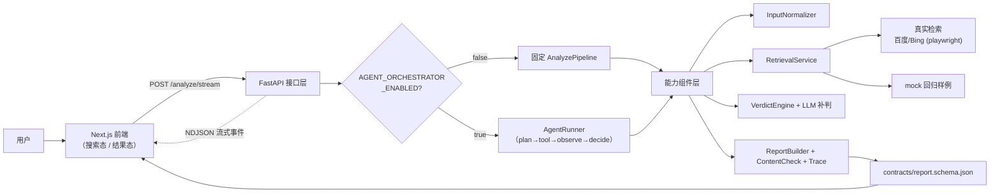

# rumor-checking · 「较真」的新闻观察员

一个面向真实用户的新闻/传闻核查产品：接收一条消息，把它拆成可判定的原子事实，联网找证据，逐条判定真假，并把「结论是怎么来的」完整展示出来。

<p align="center">
  
</p>

更新时间：2026-07-26（Asia/Shanghai）

---

## 这是什么

> 一句话：**带执行过程可视化的谣言核查系统**。前端把一次分析全程直播出来，后端把输入加工成标准化事件，再做检索、消歧、逐条 claim 判定、时间线还原和报告组装，最终统一收敛到一份带 provenance（来源标注）的结构化 `Report`。

它刻意不是「前端调一个黑盒模型然后等答案」：

- **前端**负责输入、实时过程展示、结构化结果展示。
- **后端**负责把输入拆成标准化事件 → 检索 → 消歧 → 判定 → 时间线 → 最终报告，每一步都以流式事件推给前端。
- **`contracts/`** 把前后端都要认的字段结构固定下来，避免各说各话。
- **`evals/` + mock 检索**给整条链路提供稳定、可回归的样例。

对应的题目（「较真的新闻观察员」）要求两条主流程：**传播链还原** 与 **内容核查**，见 [target/tar.md](./target/tar.md)。

---

## 核心能力

### 1. 把一条消息拆成多条 claim，逐条判定

<p align="center">
  
</p>

一条消息往往「核心属实、细节存疑」。系统把它拆成原子 claim，每条独立给 `verdict`：

| 状态 | 含义 | 图中标记 |
| --- | --- | --- |
| `supported` 基本属实 | 有权威/独立证据支撑 | 绿色 ✓ |
| `refuted` 不实信息 | 有证据直接反驳 | 红色 ✗ |
| `insufficient` 证据不足 | 公开证据不足以定论 | 灰色 ? |
| `conflicting` 各方矛盾 | 不同来源相互冲突（含数量冲突） | 琥珀色 ! |

整体判定诚实反映混合情况：当一条消息**既有属实成分又有被反驳成分**时，标「各方矛盾」而不是干净的「属实」。

### 2. 多可能性 + 为真概率（概率与 verdict 解耦）

- 每条 claim 除 `verdict`/`confidence` 外，带 `truth_probability`（0–100）与 `probability_basis`（`evidence` / `prior`）。
- **核心原则：概率独立于 verdict。** 无证据的决定性 verdict 仍降级为 `insufficient`（grounded 兜底不变），但概率是另一维度——一条 `insufficient` 的 claim 仍可带 `truth_probability=15, basis=prior`，`basis` 诚实区分「有检索证据」还是「仅凭常识先验」。

### 3. Agent 循环：搜 → 判 → 再搜的多轮自主编排

<p align="center">
  
</p>

深度档走一层可插拔的 agent 编排（`plan → tool → observe → decide → finalize`）：

- **序列规划器**：LLM 一次规划一串动作，而不是每步单独问。
- **多轮迭代**：证据弱的 claim 会触发「定向补搜 → 重判」循环（`per_claim_search` → `re_judge_claims`，最多 3 轮）。
- **合成 critic**：synthesis 结果经一道校验 critic，只能**下调**未被证据支撑的判定、永不上调（单调安全）。
- **自主取证**：planner 可选择抓取当前证据里最权威来源的正文，按同一 `result_id` 挂靠喂给 synthesis（grounding 安全，不新增证据源）。

`RulePlanner`（默认）复刻固定 pipeline 顺序，在 `off + mock` 上产出与旧链路**逐字节一致**的 `Report`；`LlmPlanner`（配置 LLM 时）在真实岔路口调用 LLM 决策，失败即回退规则。

### 4. 全程可观测

结果态把流式事件按步骤聚合成执行时间线，每步展示「干了什么/输入/输出/结论」；每次 LLM 调用的提问与回答有「人类可读 / 原始 JSON」两个 tab。

---

## 两档分析（按请求 `mode` 选择）

同一后端进程同时提供两档，不靠全局环境变量切换：

| 档位 | 触发 | 路径 | 时延 | 适用 |
| --- | --- | --- | --- | --- |
| **`fast`**（默认） | `request_context.mode=fast` 或缺省 | 零 LLM 规则路径 + 真实检索 + 规则 verdict（含 LLM 补判可选） | 约 0.2–0.3s | 给真实用户当下就能用的秒级核查 |
| **`deep`** | `request_context.mode=deep` | LLM/agent 全链路（序列规划器、investigation、synthesis、critic、结构化补全） | 几分钟级 | 需要更强判定时的异步深度核查 |

前端主按钮走 fast，出结果后再给「深度核查」二次入口；deep 档可从白名单里选判定模型。`mode` 只切换分析深度，检索 provider 始终由 `RETRIEVAL_PROVIDER` 决定，两档共用同一套真实检索。

---

## 系统架构



要点：**主链路不在路由层，而在 `AnalyzePipeline` / `AgentRunner`；检索和判定解耦；前端同时消费实时事件流和最终 `Report`。**

更细的分层、时序图和贯穿示例见 [docs/current-code-architecture-guide.md](./docs/current-code-architecture-guide.md)。

---

## 快速开始

### 环境要求

- Python：`>= 3.8`
- Node.js：`>= 18.18.0`，建议 `>= 20.9.0`

### 1. 配置环境变量

```bash
cp backend/.env.example backend/.env
```

默认基线（零 key、可复现）：

```dotenv
ANALYSIS_PROVIDER=off
RETRIEVAL_PROVIDER=mock
RETRIEVAL_FALLBACK_TO_MOCK=true
```

启用真实联网检索（纯 httpx 抓取百度/Bing，无需额外依赖）：

```dotenv
RETRIEVAL_PROVIDER=playwright
RETRIEVAL_FALLBACK_TO_MOCK=true
```

启用 LLM 分析增强（模型/端点/密钥全部放 git 忽略的 `backend/.env`，不写入版本库）：

```dotenv
ANALYSIS_PROVIDER=kimi
LLM_API_KEY=你的真实 key
LLM_BASE_URL=你的 OpenAI 兼容网关端点
LLM_MODEL=你的模型名
```

> `ANALYSIS_PROVIDER=kimi` 只是历史遗留的开关字面量，不代表具体供应商；LLM 调用层已供应商中立，走标准 OpenAI 兼容 `chat/completions`。

### 2. 启动后端

```bash
python -m pip install -r backend/requirements-dev.txt
uvicorn backend.app.main:app --reload
```

默认地址：`http://127.0.0.1:8000`（健康检查 `GET /api/v1/health`）

### 3. 启动前端

```bash
cd frontend
npm install
npm run dev
```

默认地址：`http://127.0.0.1:3000`

> Windows 下通过 `\\wsl.localhost\...` 访问仓库时，优先用：
> ```powershell
> powershell -ExecutionPolicy Bypass -File .\frontend\start-local-windows.ps1 -BackendUrl http://127.0.0.1:8000 -Port 3020
> ```

### 4. 运行测试

```bash
pytest backend/tests -q          # 后端回归
cd frontend && npm run typecheck && npm test   # 前端类型检查 + 单测
```

---

## 后端接口

- `GET /api/v1/health`
- `GET /api/v1/models`（可选分析模型白名单 + 默认，只返回模型名，不含网关地址/密钥）
- `POST /api/v1/analyze`
- `POST /api/v1/analyze/stream`

最小联调：

```bash
curl -X POST http://127.0.0.1:8000/api/v1/analyze \
  -H "Content-Type: application/json" \
  -d '{"raw_input": "网传某地出台新规，要求周末全面停工整顿。", "input_type": "text"}'
```

---

## 运行路径对照

| 路径 | 关键环境变量 | 适合做什么 | 边界口径 |
| --- | --- | --- | --- |
| `default dev / demo` | `off + mock + fallback=true` | 默认开发、联调、回归、演示 | 零 key、可复现；结果标 `backend_mock`，不讲成真实检索 |
| `real live（推荐 playwright）` | `RETRIEVAL_PROVIDER=playwright` + `ANALYSIS_PROVIDER=kimi` + `AGENT_ORCHESTRATOR_ENABLED=true` | 真实联网调查 → grounded 判定，标 `backend_live + retrieval_live` | 中文覆盖较好、无需模型内建搜索；检索多条 query 已并发；延迟高于 mock，非默认 |
| `fast 实时档` | `RETRIEVAL_PROVIDER=playwright`，请求带 `mode=fast`（默认） | 给真实用户的秒级核查：真实检索 + 规则 verdict | 零 LLM，约 0.2–0.3s，真实 URL；判定用规则，深度不如 deep |
| `deep 深度档` | 同 `real live`，请求带 `mode=deep` | 需要更强判定时的异步深度核查 | LLM/agent 全链路，几分钟级，前端从 fast 结果页二次触发 |

### 检索 provider

- `mock`：稳定回归（默认）
- `playwright`：纯 httpx 抓取百度（主）+ Bing（兜底）搜索结果页，中文覆盖较好，无需浏览器二进制（**当前推荐的真实联网路径**）
- `gdelt`：公开 GDELT 新闻 API，英文偏向、中文覆盖弱
- `kimi`：LLM 内建 `$web_search`（仅对支持该工具的供应商有效；当前网关无此能力）
- `off`：关闭检索

---

## 文档入口

- 当前已核验状态（约束所有文档口径）：[docs/status/current-verified-state.md](./docs/status/current-verified-state.md)
- 代码结构与架构说明：[docs/current-code-architecture-guide.md](./docs/current-code-architecture-guide.md)
- 提问分析全链路：[docs/question-analysis-end-to-end-flow.md](./docs/question-analysis-end-to-end-flow.md)
- 联网检索方案调查：[docs/status/web-search-options.md](./docs/status/web-search-options.md)
- 演示脚本 / 演示前检查：[DEMO_SCRIPT.md](./DEMO_SCRIPT.md) · [SMOKE_CHECKLIST.md](./SMOKE_CHECKLIST.md)
- 后端 / 前端说明：[backend/README.md](./backend/README.md) · [frontend/README.md](./frontend/README.md)
- 协议 / 数据 / 评测：[contracts/README.md](./contracts/README.md) · [data/README.md](./data/README.md) · [evals/README.md](./evals/README.md)
- 总导航：[docs/README.md](./docs/README.md)

---

## 当前边界（如实口径）

- 前端只消费后端返回的真实 `Report`，不请求 `replay`，也不读本地 demo payload；请求失败时展示错误态与重试入口。
- `report.provenance.source_type` 当前只会是 `backend_live` 或 `backend_mock`；前端缺失 provenance 时保守落到 `unknown`。
- URL 输入只支持公开 HTML 页面，不支持登录页、强反爬、浏览器渲染页、PDF 和图片正文。
- 演示口径：`mock demo` 稳、可复现、零 key；`real live` 已联调通过，但要如实说明「延迟高、非默认、需按配方配置」，别讲成随手就能实时跑。
- 内网网关地址是硬密码，绝不写入代码或文档；模型名运行时可露，但不硬编码进版本库。
