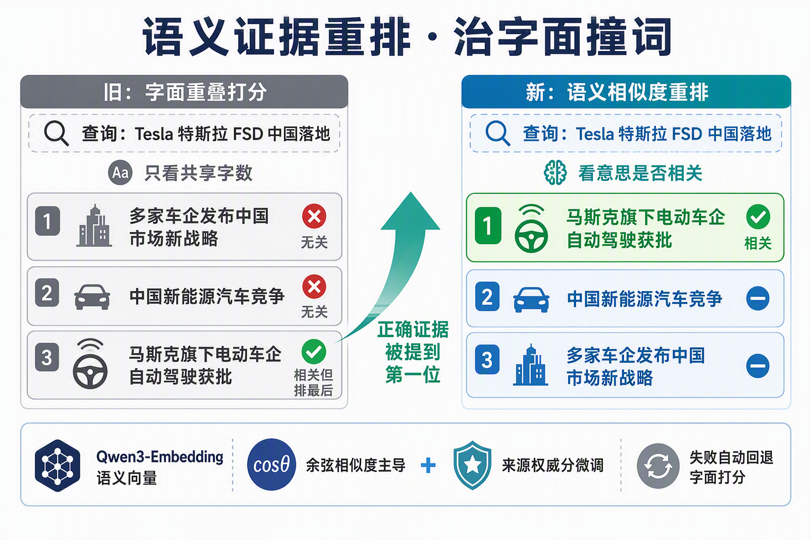
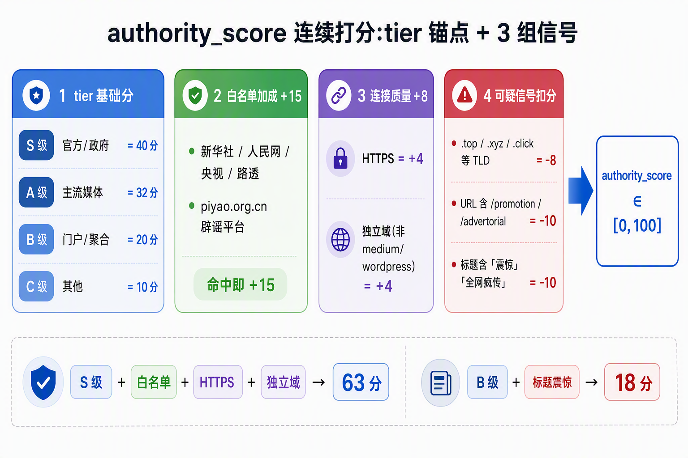
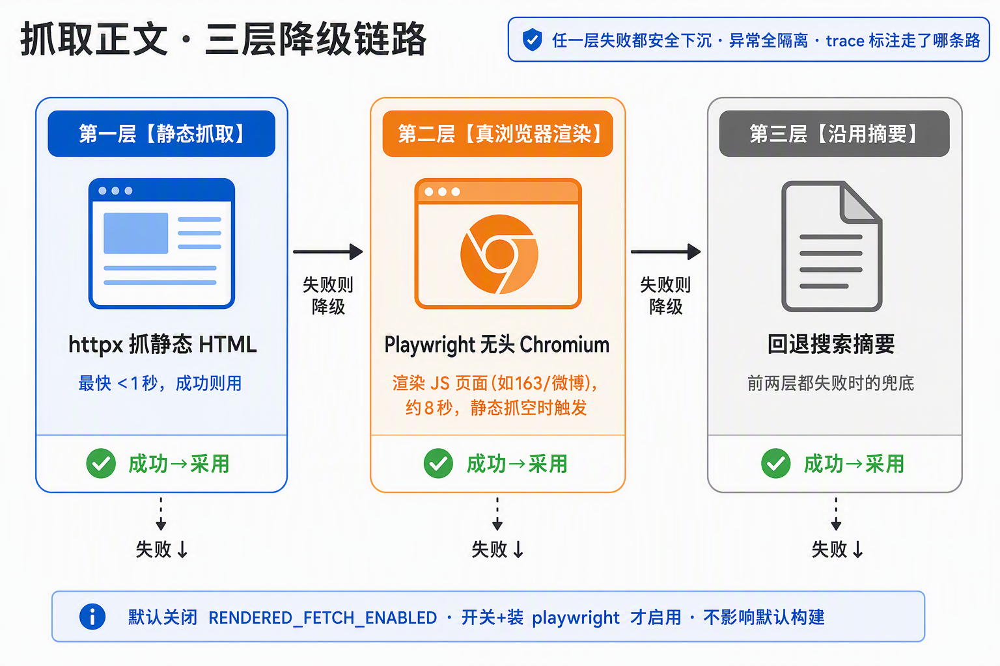
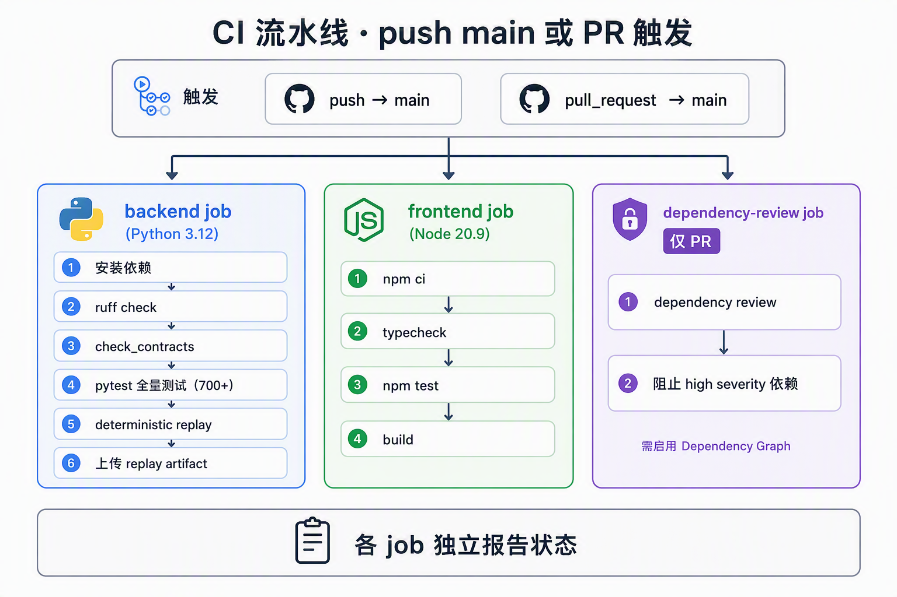

# 较真 · 让每一条传闻都能被查证

**一个带执行过程可视化的谣言核查产品**：接收一条消息，把它拆成可判定的原子事实，联网找证据，逐条判定真假，并把「结论是怎么来的」完整展示出来。

<p align="center">
  
</p>

<p align="center">
  <sub>Next.js 前端 · FastAPI 后端 · 多 Agent 并行检索 · 全程流式可观测</sub>
</p>

---

## 目录

- [产品能力速览](#产品能力速览)
- [核查全流程 · 一张图看懂](#核查全流程--一张图看懂)
- [多 Agent 并行架构](#多-agent-并行架构)
- [两档核查 · 秒级 vs 分钟级](#两档核查--秒级-vs-分钟级)
- [四种命运 · 每条事实独立判定](#四种命运--每条事实独立判定)
- [语义证据重排 · 治「字面撞词」](#语义证据重排--治字面撞词)
- [来源可信度打分](#来源可信度打分)
- [抓取正文 · 三层降级链路](#抓取正文--三层降级链路)
- [快速开始](#快速开始)
- [持续集成](#持续集成)
- [接口与运行路径](#接口与运行路径)
- [文档入口](#文档入口)
- [当前边界与如实口径](#当前边界与如实口径)

---

## 产品能力速览

|  | 能力 | 关键特征 |
|---|---|---|
| 🎯 | **拆 claim 逐条判**  | 一条消息拆成原子事实，每条独立判 `属实 / 不实 / 证据不足 / 各方矛盾`，混合情况不粉饰 |
| 🌐 | **4 路并行真检索**  | 百度 + 小红书 + 今日头条 + 搜狗微信，同一时刻并发拉取，SERP 日期真实抓取而非伪造 |
| 🔎 | **语义证据重排**  | 证据按「意思相关度」重排(embedding 余弦),治字面撞词;可选、失败自动回退字面打分 |
| 🧠 | **Agent 多轮迭代**  | 深度档跑「搜 → 判 → 再搜」循环，配合 LLM Critic 单调下调（永不加强判定） |
| 📊 | **真伪概率**  | 除 verdict 外每条还有 0–100 概率，明确标注是「基于证据」还是「基于常识先验」 |
| 👁️ | **全程可观测**  | 流式事件直播每一步，用户能看到「哪一步、找到了什么、为什么这么判」 |
| 📜 | **可复核证据链**  | 每条判定都能展开 `<details>判定依据`：来源分级 · 相关性说明 · 原始 URL |

---

## 核查全流程 · 一张图看懂

<p align="center">
  
</p>

**六步流水线**，每一步都以流式事件推给前端，用户实时看到「后端现在在干什么」：

1. **输入** — 支持文本、URL、问句三种输入类型
2. **标准化** — 识别输入类型，抽取标题/摘要/关键词/来源
3. **并行检索** — 4 路证据源同时拉取，去重、时间戳规范化
4. **拆 Claim** — 把核心事实和存疑细节各自独立，一条消息可能拆成 3–5 条
5. **逐条判定** — 每条 claim 独立走 verdict + 真伪概率
6. **报告** — 组装成带来源标注、时间线、可信度打分的结构化 `Report`

---

## 多 Agent 并行架构

深度档 (`mode=deep`) 开启多 Agent 编排后，检索层从**串行 4 源** 升级为**并行 DAG**：

<p align="center">
  
</p>

**为什么这么设计**：

- 4 个源之间没有数据依赖，串行是浪费；ThreadPool 并发拉取，端到端延迟 ≈ 最慢那一源
- `NORMALIZE` / `RETRIEVAL_MERGE` 是关键路径节点，任何源失败降级为 `SKIPPED` 空 bundle，`MERGE` 继续跑
- `CRITIC` 可选多视角并行（`MULTI_AGENT_CRITIC_PERSPECTIVES>1`，N 个独立视角各判一次，取"提示downgrade"的交集）
- `Supervisor.execute_batch` 用 `copy_context().run()` 绑 `ContextVars`，否则 ThreadPool 的 worker 拿不到 `progress` 回调，观测会静默失效

**在代码里**：入口 `backend/app/services/analyze_pipeline.py::_run_multi_agent` · Supervisor `backend/app/agent/multi/supervisor.py` · 6 个 sub-agent 各一个文件在 `backend/app/agent/multi/`

**触发条件**：`MULTI_AGENT_ENABLED=true` + `AGENT_ORCHESTRATOR_ENABLED=true` + 请求带 `mode=deep`。三个都开才走这条路，任一关闭回退到固定 pipeline，行为不变。

---

## 两档核查 · 秒级 vs 分钟级

同一后端进程**同时提供两档**，不靠环境变量切换。前端主按钮走 fast，出结果后再给「深度核查」二次入口。

<p align="center">
  
</p>

| 档位 | 触发 | 时延 | 判定路径 | 适用 |
|---|---|---|---|---|
| **fast** ⚡ | 默认 / 请求带 `mode=fast` | ~0.2–0.3s | 4 路并行检索 → 规则引擎 verdict | 秒级实时查证 |
| **deep** 🔬 | 请求带 `mode=deep` | 分钟级 | Agent 循环 → LLM synthesis → Critic 校验 → 结构化补全 | 需要更强证据时的深度核查 |

`mode` 只切换分析深度，检索 provider 始终由 `RETRIEVAL_PROVIDER` 决定，两档共用同一套真实检索层。

---

## 四种命运 · 每条事实独立判定

一条传闻往往「核心属实、细节存疑」。把它拆成原子 claim 独立判定，能诚实反映混合情况——**当既有属实成分又有被反驳成分时，标「各方矛盾」而不是干净的「属实」**。

<p align="center">
  
</p>

**真伪概率与 verdict 解耦**（核心设计原则）：

- 每条 claim 除 `verdict` / `confidence` 外，带 `truth_probability`（0–100）和 `probability_basis`（`evidence` / `prior`）
- 无证据时决定性 verdict 仍降级为 `insufficient`（grounded 安全兜底不变），但概率是另一维度
- 一条 `insufficient` 的 claim 仍可带 `truth_probability=15, basis=prior`——`basis` 诚实区分「有检索证据」还是「仅凭常识先验」

---

## 语义证据重排 · 治「字面撞词」

检索回来的证据在喂给判定前先重排一次,让最相关的排在最前(判定模型自上而下读,靠前的更受重视)。排序**以语义相似度为主**:把「传闻」和每条证据都过一遍 embedding,算向量余弦——比的是**意思**,不是共享了几个字。

<p align="center">
  
</p>

**为什么要它**:纯字面打分会被「共享通用词但主题无关」的结果骗到。实测查询「Tesla 特斯拉 FSD 中国落地」,字面打分把只共享「发布/中国/市场」的无关新闻排在最前、把真正相关的「马斯克旗下电动车企自动驾驶获批」(几乎零字面重叠)埋到最后;语义重排把正确证据提到第一。别名、改写、中英混检这类场景收益最明显。

- **语义主导 + 权威微调**:余弦相似度为主,叠加一个上限约 +0.1 的 `authority_score` 微调——权威分只在语义近似平票时才决定顺序,不会把高权威但离题的来源顶上来
- **自愈式可选**:开关 `EVIDENCE_RERANK_ENABLED`,配 embedding 模型 + key 即生效;未配置、超时、或任何调用失败都**静默回退**到原来的字面打分,输出永不劣于基线
- **走网关、不出域**:embedding 复用现有 LLM 网关(`Qwen3-Embedding`,独立 key),数据不出域

**在代码里**:语义打分 `backend/app/services/embedding_ranker.py` · 回退封装 `backend/app/services/evidence_ranker.py::rank_results`

---

## 来源可信度打分

语义重排之外,每个 SERP hit 除 `source_tier`(S/A/B/C 四档硬分类)外还带一个 `authority_score`(0–100 连续分),既作上面的微调项,也用于同 tier 内区分。由 4 组信号叠加:

<p align="center">
  
</p>

| 信号 | 分值 | 何时触发 |
|---|---|---|
| **tier 基础分** | S=40 · A=32 · B=20 · C=10 | 保留原四级分类作为主锚 |
| **白名单加成** | +15 | 命中 `TOP_TIER_DOMAINS`（新华社/人民网/央视/路透/AP…）或 `piyao.org.cn` |
| **HTTPS + 独立域** | +4 / +4 | HTTPS 得 +4；域名非 `medium/wordpress/wixsite/blogspot` 等托管平台再 +4 |
| **可疑信号扣分** | -8 / -10 / -10 | `.top/.xyz/.click/.buzz` 等 TLD → -8；URL 含 `/promotion` `/advertorial` → -10；标题含「震惊」「全网疯传」「删前速看」等 clickbait 词 → -10 |

**只影响排序，不参与 verdict 决策**——verdict 引擎依旧靠 tier 分级 + 数量阈值，稳。`evidence_ranker` 用 `authority_score * 0.005` 替代原来的 `TIER_WEIGHTS[tier] * 0.05`，量级一致但同 tier 内可区分。

**在代码里**：打分函数 `backend/app/services/retrieval_provider.py::_authority_score` · 消费方 `backend/app/services/evidence_ranker.py::score_result`

---

## 抓取正文 · 三层降级链路

搜索只给几十字的摘要;深度档会挑最高价值的证据页抓全文,喂给判定当额外依据。抓取走**三层降级链路**,任一层失败都安全下沉到下一层,绝不因为一层挂了就中断整条核查:

<p align="center">
  
</p>

| 层 | 手段 | 何时用 |
|---|---|---|
| **① 静态抓取** | `httpx` 抓静态 HTML | 最快(<1s),成功即用 |
| **② 真浏览器渲染** | Playwright 无头 Chromium | 静态抓回空壳时触发(JS 渲染页如 163/微博),渲染出完整正文再抽取,约数秒 |
| **③ 沿用摘要** | 回退检索摘要 | 前两层都拿不到正文时的兜底 |

- **全异常隔离**:整条 render+extract 路径(含 playwright 未装、浏览器崩、抽取报错)都被兜住,失败只降级、绝不向上抛断 `fetch_url`
- **路径可见**:走了静态还是浏览器、为什么降级,都写进 `fetch_url` 的 trace(`path=static/browser`、`rendered=<原因>`)
- **默认关、零影响**:Playwright 是可选依赖,浏览器路径由 `RENDERED_FETCH_ENABLED` 控制(默认关);不装、不开时行为与原来完全一致,只走静态→摘要两层

**在代码里**:降级编排 `backend/app/agent_tools/tools.py::fetch_url` / `_try_rendered_fallback` · 真浏览器 `backend/app/services/rendered_page_fetcher.py::render_page_with_reason`

---

## 快速开始

### 环境要求

- Python `>= 3.12`（CI 用 3.12）
- Node.js `>= 20.9.0`（`frontend/.nvmrc` 锁定为 20.9.0）

### 1. 配置环境变量

```bash
cp backend/.env.example backend/.env
```

**默认基线**（零 key、可复现）：

```dotenv
ANALYSIS_PROVIDER=off
RETRIEVAL_PROVIDER=mock
RETRIEVAL_FALLBACK_TO_MOCK=true
```

**启用真实联网检索**（纯 httpx 抓百度/Bing，无需额外依赖）：

```dotenv
RETRIEVAL_PROVIDER=playwright
RETRIEVAL_FALLBACK_TO_MOCK=true
```

**启用多 Agent 并行 DAG + LLM 深度档**：

```dotenv
RETRIEVAL_PROVIDER=playwright
ANALYSIS_PROVIDER=kimi
AGENT_ORCHESTRATOR_ENABLED=true
MULTI_AGENT_ENABLED=true
MULTI_AGENT_RETRIEVAL_MODE=parallel
LLM_API_KEY=你的真实 key
LLM_BASE_URL=你的 OpenAI 兼容网关端点
LLM_MODEL=你的模型名
```

> `ANALYSIS_PROVIDER=kimi` 只是历史遗留的开关字面量，不代表具体供应商；LLM 调用层已供应商中立，走标准 OpenAI 兼容 `chat/completions`。内网网关地址和密钥全部放 `backend/.env`（git 忽略），永不进版本库。

**可选增强(默认关,配了才生效,失败自动回退)**:

```dotenv
# 语义证据重排:按意思相关度重排证据,治字面撞词
EVIDENCE_RERANK_ENABLED=true
EVIDENCE_EMBED_MODEL=你的 embedding 模型名
EVIDENCE_EMBED_API_KEY=embedding 网关 key（与 chat 独立）

# 真浏览器抓正文:静态抓空时用无头 Chromium 渲染 JS 页面
# 需先 pip install playwright && playwright install chromium
RENDERED_FETCH_ENABLED=true
```

### 2. 启动后端

```bash
python -m pip install -r backend/requirements-dev.txt
uvicorn backend.app.main:app --reload
```

默认地址：`http://127.0.0.1:8000`（健康检查 `GET /api/v1/health`）

### 3. 启动前端

```bash
cd frontend && npm install && npm run dev
```

默认地址：`http://127.0.0.1:3000`

### 4. 跑测试

```bash
pytest backend/tests -q                          # 后端回归 (~630 tests)
cd frontend && npm run typecheck && npm test     # 前端类型检查 + 单测
```

CI 每次 push/PR 也会跑同一套（见下节）。

---

## 持续集成

<p align="center">
  
</p>

`.github/workflows/ci.yml` 在 push 到 `main` 或 PR 目标为 `main` 时触发，两个 job 并行：

- **backend**：`ruff check backend/` → `pytest backend/tests -q`（630 用例）。仅排除 `test_retrieval.py`（内部间接触发 `weixin.sogou.com` / `piyao.org.cn` 真实网络）
- **frontend**：`npm ci` → `npm run typecheck` → `npm run build`

**约束**：ruff 无 `--exit-zero`，任何 lint 违规立刻红；pytest 无失败豁免；两个 job 全绿才允许合并。

---

## 接口与运行路径

### 主要接口

| 接口 | 用途 |
|---|---|
| `GET /api/v1/health` | 健康检查 |
| `GET /api/v1/models` | 可选分析模型白名单 + 默认（只回模型名，不含网关地址/密钥） |
| `GET /api/v1/model-health` | 进程内 LLM 模型健康度快照（失败/成功/驱逐计数，用于运维排查） |
| `GET /api/v1/search-sources` | 可用检索源列表（用于前端 toggle） |
| `GET /api/v1/agent-trace/{run_id}` | 只读导出 supervisor 的 span trace（`AGENT_TRACE_ENABLED=true` 时可用） |
| `POST /api/v1/analyze` | 同步分析 |
| `POST /api/v1/analyze/stream` | 流式分析（NDJSON 事件流） |

### 回放评测与 Phoenix

离线回放集位于 `evals/live_replay/seed/`，默认不访问网络，可用于比较规则、提示词和模型版本：

```bash
python backend/scripts/replay_eval.py
python backend/scripts/replay_eval.py --json --run-name rule-v1 > replay-rule-v1.json
python backend/scripts/replay_eval.py --json --run-name rule-v2 \
  --compare-to replay-rule-v1.json > replay-rule-v2.json
```

报告同时给出 label/evidence/FEVER、置信度、引用精度、独立信源、权威来源、证据日期与时效性，并按 `time_sensitive`、`stale_news`、`subject_mismatch`、`conflicting_sources` 等类别聚合失败原因。当前 seed 集包含 18 个 case，重点用于定位“证据已找到，但 verdict 判断错误”的问题。

Phoenix 仅作为可选观测后端，不替代本地评测。启用方式：

```bash
pip install -r backend/requirements-observability.txt
export AGENT_TRACE_ENABLED=true
export PHOENIX_ENABLED=true
export PHOENIX_OTLP_ENDPOINT=http://localhost:6006/v1/traces
```

启用后，agent trace 仍会写入本地 JSON，同时通过 OpenTelemetry OTLP/HTTP 批量导出到 Phoenix；依赖缺失或 Phoenix 不可用不会中断核查请求。可通过 `PHOENIX_EXPORT_TIMEOUT_SECONDS` 限制导出等待时间，默认 2 秒。

**最小联调**：

```bash
curl -X POST http://127.0.0.1:8000/api/v1/analyze \
  -H "Content-Type: application/json" \
  -d '{"raw_input": "网传某地出台新规，要求周末全面停工整顿。", "input_type": "text"}'
```

### 检索 Provider 对照

| provider | 说明 | 适用 |
|---|---|---|
| `mock` | 稳定回归样例 | 默认，用于开发/联调/演示 |
| `playwright` | httpx 抓百度（主）+ Bing（兜底），日期从 `prefix-time` span 真实抽取 | **推荐真实联网路径**，中文覆盖好，无浏览器依赖 |
| `gdelt` | GDELT 公开新闻 API | 英文事件，中文覆盖弱 |
| `kimi` | LLM 内建 `$web_search` | 仅对支持该工具的供应商有效 |
| `off` | 关闭检索 | 只走 LLM 内部知识 |

### 多 Agent 相关开关

| 环境变量 | 默认 | 说明 |
|---|---|---|
| `MULTI_AGENT_ENABLED` | `false` | 启用 Supervisor 多 Agent 层 |
| `MULTI_AGENT_RETRIEVAL_MODE` | `parallel` | `parallel`（推荐）/ `sequential`（回退） |
| `MULTI_AGENT_MAX_PARALLEL` | `4` | ThreadPool 并发上限 |
| `MULTI_AGENT_CRITIC_PERSPECTIVES` | `1` | Critic 多视角并行数，>1 时取 downgrade 的并集 |
| `MULTI_AGENT_LLM_ROUTING_ENABLED` | `false` | 用 LLM 决定 loop_back / finalize（否则走规则阈值） |
| `TOUTIAO_SEARCH_ENABLED` | `true` | 今日头条源 |
| `SOGOU_WEIXIN_SEARCH_ENABLED` | `true` | 搜狗微信源 |
| `XHS_SEARCH_ENABLED` | `true` | 小红书源（需 `xhs-cli`） |

---

## 文档入口

- [docs/current-code-architecture-guide.md](./docs/current-code-architecture-guide.md) — **代码结构与架构详解**（图文并茂;§7.7 推理器可靠性、§11 事实边界仲裁、§12 联网检索选型均归档在此）
- [backend/README.md](./backend/README.md) · [frontend/README.md](./frontend/README.md) — 前后端说明
- [contracts/README.md](./contracts/README.md) · [evals/minimal_v1/README.md](./evals/minimal_v1/README.md) — 协议与评测
- [DEMO.md](./DEMO.md) — 演示脚本 + 演示前 Smoke 检查

---

## 当前边界与如实口径

- 前端只消费后端返回的真实 `Report`，不请求 `replay`，也不读本地 demo payload；请求失败展示错误态与重试入口。
- `report.provenance.source_type` 当前只会是 `backend_live` 或 `backend_mock`；前端缺失 provenance 时保守落到 `unknown`。
- URL 输入以公开 HTML 页面为主，不支持登录页、强反爬、PDF、图片正文；**JS 渲染页**(如 163/微博)在开启 `RENDERED_FETCH_ENABLED`(可选,需装 Playwright)后可由无头浏览器兜底渲染,默认关时仍只走静态抓取。
- **日期字段**：`published_at` 从 Baidu SERP 的 `prefix-time` span 真实抽取（`2026-07-16` / `6天前` / `昨天` 三种格式），SERP 里没有的场景返回空字符串（前端显示「时间未知」），**永远不伪造 `datetime.now()`**。
- **相关性过滤**：`retrieval_service._result_matches_query` 采用主体品牌 + 事件词双层过滤，避免「共享一个动词就算相关」（如「美团 裁员」query 拉回 Amazon / Meta 的裁员新闻）。
- 内网网关地址是硬密码，绝不写入代码或文档；模型名运行时可露，但不硬编码进版本库。
- 演示口径：`mock demo` 稳、可复现、零 key；`real live` 已联调，但延迟高、非默认、需按配方配置，别讲成随手就能实时跑。

---

<p align="center">
  <sub>用一句话总结：<b>结构化流水线 + 流式可观测 + 契约化输出</b>，让每一条判定都可追溯、可复核。</sub>
</p>
