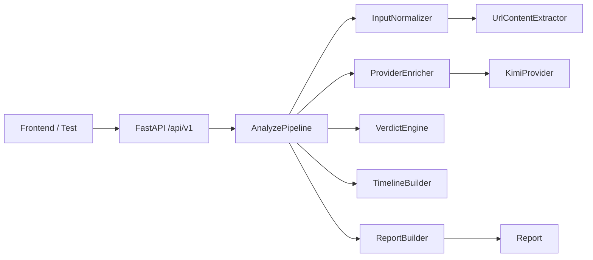

# Backend

本目录承载 rumor-checking 的后端主链路。当前已经提供：

- `GET /api/v1/health`
- `POST /api/v1/analyze`
- 统一配置、`request_id` 中间件、统一错误响应
- 与 `contracts/` 对齐的裸 `Report` 输出
- 规则链路 + 可选 Kimi provider enrichment

## 当前状态

- `C1` 到 `C8` 已完成并稳定可测
- `C9` 已进入第一阶段：Kimi provider 配置、调用封装、事件/claim enrichment、安全回退与测试已完成
- `C10` 已完成：公开 HTML 页面 URL 正文抽取、结构化字段回填与清晰 fallback 已接入

## 快速框架图



更完整的架构图、时序图、provider 回退流程图、请求/响应样例和演进路线图见 [backend/docs/api-foundation-implementation-record.md](/home/forwaryan/mianshi/rumor-checking/backend/docs/api-foundation-implementation-record.md)。
真实检索链路的专项解释，包括架构图、时序图、缓存流程图、模块表、方法与可行性分析，见 [backend/docs/real-retrieval-pipeline.md](/home/forwaryan/mianshi/rumor-checking/backend/docs/real-retrieval-pipeline.md)。
这轮 `question_only` 主体漂移修复的专项说明、修复前后流程图、表格对比和回归护栏见 [backend/docs/entity-drift-fix-and-regression-guard.md](/home/forwaryan/mianshi/rumor-checking/backend/docs/entity-drift-fix-and-regression-guard.md)。

## Provider 开关

当前真实 provider 默认关闭，只有显式配置后才会调用：

- `ANALYSIS_PROVIDER=off|kimi`
- `KIMI_API_KEY`
- `KIMI_BASE_URL`，默认 `https://api.moonshot.cn/v1`
- `KIMI_MODEL`，默认 `moonshot-v1-8k`
- `PROVIDER_TIMEOUT_SECONDS`，默认 `20`

当前 provider 只负责“事件理解 + claim 抽取”增强，不负责 verdict、timeline、URL 抽取或检索。
如果 provider 未配置、超时、返回非法 JSON，后端会自动退回既有规则链路，不中断 `analyze` 请求。

## URL 输入能力边界

- 当前 URL 输入已接入公开 HTML 页面正文抽取，优先从 `<title>`、meta、JSON-LD、`<article>/<main>` 中提取标题、摘要、来源、发布时间和正文片段。
- 抽取成功时，这些字段会进入 `event.title / summary / source_name / published_at`；抽取失败时会按 `partial / empty / timeout / error / unsupported` 返回明确提示，并继续输出保守结果。
- 当前不支持登录页、强反爬页面、需要浏览器渲染的动态页、PDF/图片正文，也不会做任何绕过站点限制的抓取。

## 真实检索开关

当前检索支持三种模式：

- `RETRIEVAL_PROVIDER=mock`：只走本地 mock retrieval，适合稳定回归
- `RETRIEVAL_PROVIDER=gdelt`：走公开 GDELT provider，失败时可回退到 mock
- `RETRIEVAL_PROVIDER=kimi`：走 Kimi 内置 `$web_search` 联网搜索，再把网页整理成 retrieval hits
- `RETRIEVAL_PROVIDER=off`：关闭检索，只保留保守链路

相关环境变量：

- `RETRIEVAL_TIMEOUT_SECONDS`，默认 `12`
- `RETRIEVAL_GDELT_BASE_URL`，默认 `https://api.gdeltproject.org/api/v2/doc/doc`
- `RETRIEVAL_MAX_RESULTS`，默认 `8`
- `KIMI_SEARCH_MODEL`，默认继承 `KIMI_MODEL`；联网搜索推荐显式设为 `kimi-k2-turbo-preview`
- `RETRIEVAL_CACHE_ENABLED`，默认 `true`
- `RETRIEVAL_CACHE_TTL_SECONDS`，默认 `43200`
- `RETRIEVAL_CACHE_ALLOW_STALE_ON_ERROR`，默认 `true`
- `RETRIEVAL_FALLBACK_TO_MOCK`，默认 `true`
- `RETRIEVAL_CACHE_DIR`，默认 `data/cache/retrieval`

当 `RETRIEVAL_PROVIDER=gdelt` 时，`question_only` 输入会先做查询改写，再走“真实检索 -> 去重归并 -> evidence / timeline”主链路。
当 `RETRIEVAL_PROVIDER=kimi` 时，`question_only` 会优先保留原问题，交给 Kimi 的 `$web_search` 做联网搜索，再进入同一套后续判断链路。
内部还预留了三个 request-level 开关，供 replay 或 smoke 使用：

- `request_context.bypass_retrieval_cache=true`
- `request_context.retrieval_cache_only=true`
- `request_context.allow_stale_retrieval_cache=true`

注意：当前“真实检索”解决的是公开来源候选抓取，不是完整的 agent 上网调查；verdict 和 timeline 仍是基于已检索证据的规则/启发式判断。

## 如何提供你的 Kimi Key

当前后端会在读取进程环境变量之前，先尝试读取以下文件中的配置：

1. 仓库根目录 `.env`
2. `backend/.env`

进程环境变量优先级更高；如果 shell 里已经设置了同名变量，会覆盖 `.env` 文件中的值。

推荐做法：

1. 复制 `backend/.env.example` 为 `backend/.env`
2. 在 `backend/.env` 中填写：

```text
ANALYSIS_PROVIDER=kimi
KIMI_API_KEY=你的真实 key
KIMI_BASE_URL=https://api.moonshot.cn/v1
KIMI_MODEL=moonshot-v1-8k
PROVIDER_TIMEOUT_SECONDS=20
```

3. 启动后端：

```bash
uvicorn backend.app.main:app --reload
```

这样就不需要每次在终端里手动 `set` 环境变量。

## 最小联调方式

先检查服务是否启动：

```bash
curl http://127.0.0.1:8000/api/v1/health
```

再发送一条文本新闻输入：

```bash
curl -X POST http://127.0.0.1:8000/api/v1/analyze \
  -H "Content-Type: application/json" \
  -d '{
    "input": "网传某地出台新规，要求周末全面停工整顿，相关图片正在社交平台传播。",
    "input_type": "text_news"
  }'
```

如果 `ANALYSIS_PROVIDER=kimi` 且 `KIMI_API_KEY` 有效，后端会尝试调用 Kimi 做事件理解与 claim 抽取；如果 provider 失败，接口仍会返回规则链路结果。

也可以直接发送 URL 输入验证 `C10` 路径：

```bash
curl -X POST http://127.0.0.1:8000/api/v1/analyze \
  -H "Content-Type: application/json" \
  -d '{
    "input": "https://news.example.com/article",
    "input_type": "url"
  }'
```

如果该 URL 是可直接抓取的公开 HTML 页面，返回结果里的 `event.title / summary / source_name / published_at` 会优先使用抽取字段；如果页面不可抽取，接口仍会返回保守模式和明确的 fallback 提示。

## 如何判断当前是否真的走了 Kimi

当前最实用的判断方式是：

- 使用 `text_news` 输入，而不是 URL 输入
- 在日志中观察 provider 是否有超时、网络或 JSON 解析回退
- 对比开启和关闭 `ANALYSIS_PROVIDER` 时，事件摘要和 claim 抽取结果是否发生变化

注意：当前 provider 还没有完成“线上真实 key 小样本验收”和“prompt/输出质量调优”，所以“能调用”不等于“质量已收口”。

## C9 文本样本验收

本轮新增了可复用的小样本验收集：

- `evals/minimal_v1/provider_text_news_cases.json`
  - `12` 条 `text_news` 样例，覆盖标题党、传闻问句、真假混杂、旧视频翻炒、政策误读、辟谣跟进等常见输入。
- `backend/tests/test_kimi_provider_quality.py`
  - 覆盖 provider 结构化输出清洗、enrichment 合并、以及 `ANALYSIS_PROVIDER=off` 与 provider 打开时的帮助性对照。

推荐验证命令：

```bash
pytest backend/tests/test_kimi_provider.py backend/tests/test_kimi_provider_quality.py backend/tests/test_api.py -q
```

当前这组验收证明的是：

- provider 输出在 schema 不漂移的前提下，能更稳定地补标题、摘要和多条 claims
- `ANALYSIS_PROVIDER=off` 的基线路径仍然可测，provider 失败回退没有被破坏
- 至少有一条文本新闻样例能稳定显示“provider 打开后比 off 更有帮助”的可见差异

当前这组验收不证明：

- URL 正文抽取已经可用：这仍属于 `C10`
- 下游 verdict / timeline 已经完全 grounded：这仍属于 `C11`
- 随机 live 新闻已经通过最终验收：这仍属于 `F8`
## 目录边界

- `app/api/`
  路由与接口编排入口。
- `app/core/`
  配置、日志、异常处理等基础设施。
- `app/models/`
  后端内部 schema 与对外 contract 模型。
- `app/services/`
  输入标准化、provider enrichment、claim、verdict、timeline、report 编排。
- `tests/`
  pytest、主链路回归与 provider 回退测试。
- `docs/`
  实现记录、交接文档与补充说明。

## 本地运行

1. `python -m pip install -r backend/requirements-dev.txt`
2. 如需启用真实 provider，按上文在 `backend/.env` 或 shell 中配置环境变量
3. `uvicorn backend.app.main:app --reload`
4. 访问 `http://127.0.0.1:8000/docs`

## 当前已知边界

- 已支持 `RETRIEVAL_PROVIDER=gdelt` 的公开来源检索、缓存与 `question_only` 取证；但 verdict 和 timeline 仍是基于检索结果的规则/启发式判断，不是完整 RAG / agent 搜证系统
- URL 输入已支持公开 HTML 抽取，但仍不处理登录页、强反爬、浏览器渲染页面与 PDF/图片正文
- `demo-cases / replay` 后端接口仍未实现，但当前前端已不依赖这两个接口
- 共享协议仍以 `contracts/` 为准，后续 schema 冻结变更仍需同步更新后端与前端
- 测试数据仍优先读取根目录 `evals/minimal_v1/`


