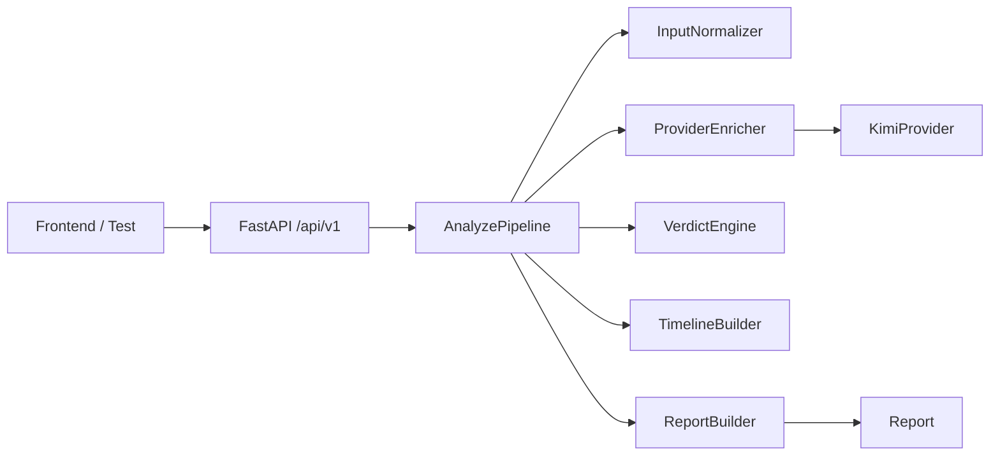

# Backend

本目录承载 rumor-checking 的后端主链路。当前已经提供：

- `GET /api/v1/health`
- `POST /api/v1/analyze`
- 统一配置、`request_id` 中间件、统一错误响应
- 与 `contracts/` 对齐的裸 `Report` 输出
- 规则链路 + 可选 Kimi provider enrichment

## 当前状态

- `C1` 到 `C8` 已完成并稳定可测
- `C9` 已进入第一阶段：Kimi provider 配置、调用封装、事件/claim enrichment、安全回退与测试已完成
- `C10` 尚未开始，URL 正文抽取仍未接入

## 快速框架图

更完整的架构图、时序图、provider 回退流程图、请求/响应样例和演进路线图见 [backend/docs/api-foundation-implementation-record.md](/home/forwaryan/mianshi/rumor-checking/backend/docs/api-foundation-implementation-record.md)。

## Provider 开关

当前真实 provider 默认关闭，只有显式配置后才会调用：

- `ANALYSIS_PROVIDER=off|kimi`
- `KIMI_API_KEY`
- `KIMI_BASE_URL`，默认 `https://api.moonshot.cn/v1`
- `KIMI_MODEL`，默认 `moonshot-v1-8k`
- `PROVIDER_TIMEOUT_SECONDS`，默认 `20`

当前 provider 只负责“事件理解 + claim 抽取”增强，不负责 verdict、timeline、URL 抽取或检索。
如果 provider 未配置、超时、返回非法 JSON，后端会自动退回既有规则链路，不中断 `analyze` 请求。

## 目录边界

- `app/api/`
  路由与接口编排入口。
- `app/core/`
  配置、日志、异常处理等基础设施。
- `app/models/`
  后端内部 schema 与对外 contract 模型。
- `app/services/`
  输入标准化、provider enrichment、claim、verdict、timeline、report 编排。
- `tests/`
  pytest、主链路回归与 provider 回退测试。
- `docs/`
  实现记录、交接文档与补充说明。

## 本地运行

1. `python -m pip install -r backend/requirements-dev.txt`
2. 如需启用真实 provider，配置上述环境变量
3. `uvicorn backend.app.main:app --reload`
4. 访问 `http://127.0.0.1:8000/docs`

## 当前已知边界

- verdict、evidence 和 timeline 仍然是规则/场景库驱动，还没有接真实检索
- URL 输入仍未接入正文抽取，`C10` 尚未开始
- `demo-cases / replay` 后端接口仍未实现，但当前前端已不依赖这两个接口
- 共享协议仍以 `contracts/` 为准，后续 schema 冻结变更仍需同步更新后端与前端
- 测试数据仍优先读取根目录 `evals/minimal_v1/`
