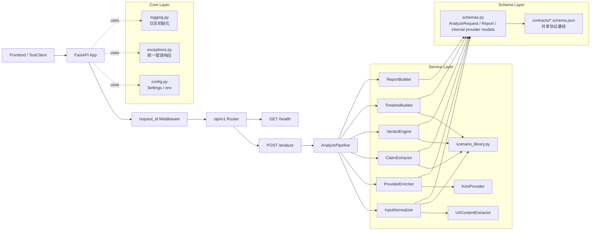
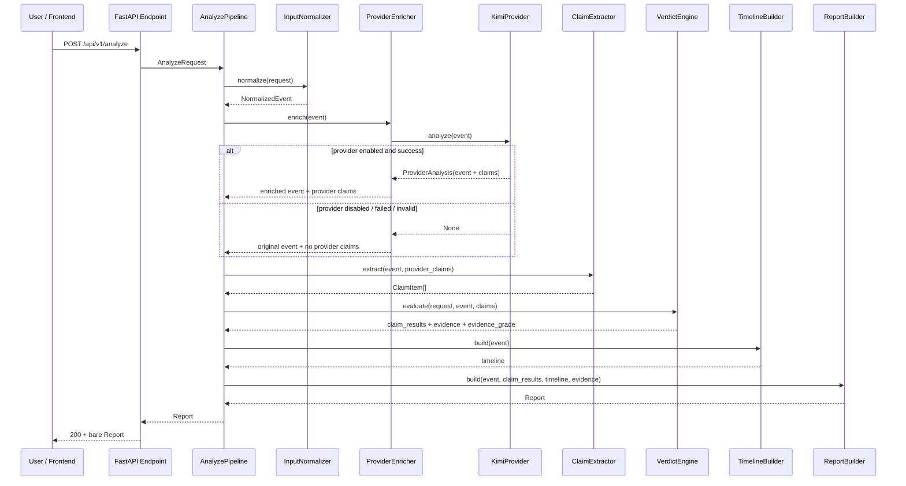
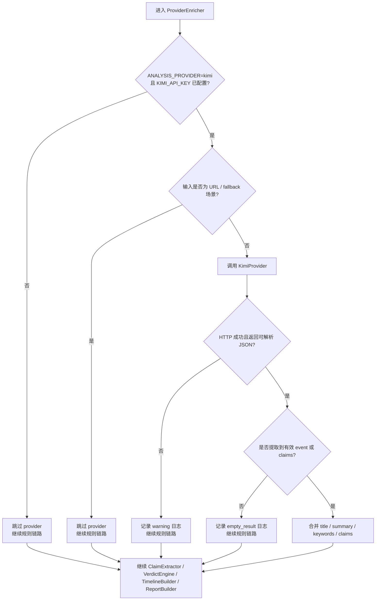
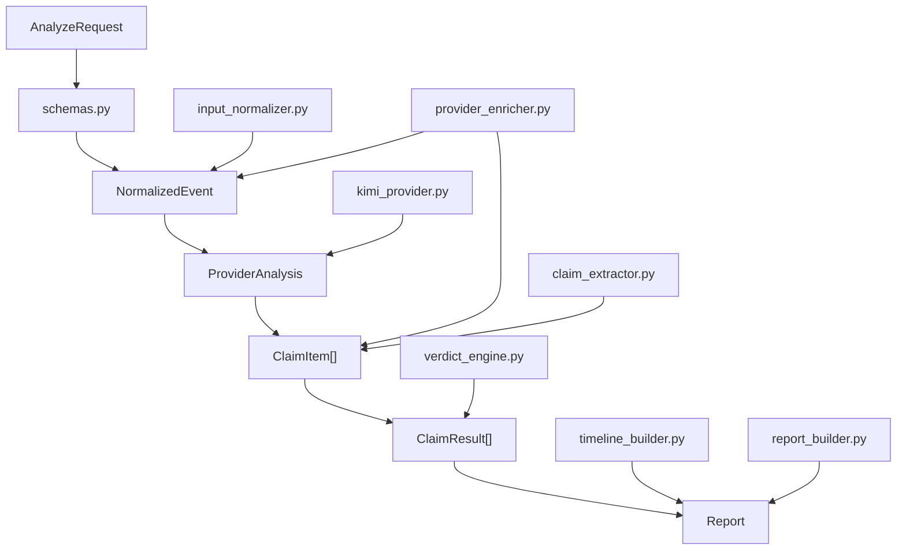
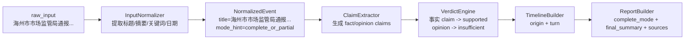
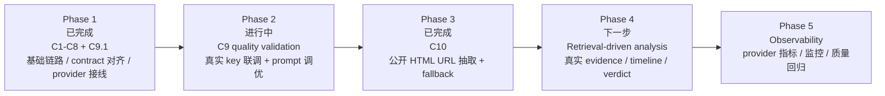

# API Foundation Implementation Record

## 1. 文档目的

这份文档记录 `Cluster-C / API Foundation` 到 2026-03-13 的实际实现状态。
它的目标不是写成 PR 摘要，而是作为后续接手、复盘和继续开发时的基线文档。

这份文档重点回答 4 个问题：

1. 当前后端到底已经做完了什么。
2. `POST /api/v1/analyze` 现在是怎么跑起来的。
3. Kimi provider 是怎么接进来的，什么时候会生效，什么时候会回退。
4. 还有哪些没有完成，下一步应该从哪里接着做。

## 2. 当前状态总览

### 2.1 已完成范围

- `C1` 到 `C8` 的后端基础链路已经完成。
- 后端输出已经与 `contracts/` 的主结构对齐。
- 前后端 `analyze` 请求/响应形状已经对齐。
- `C9` 第一阶段已经完成：Kimi provider 配置、调用封装、结构化解析、事件与 claim enrichment、安全回退、测试。
- `C10` 已完成：公开 HTML 页面 URL 正文抽取、结构化字段回填与清晰 fallback 已接入。

### 2.2 未完成范围

- `C9` 已打通最小在线联调，但还没有形成系统化小样本验收与质量收口。
- `C9` 还没有做 prompt 质量调优与真实输出稳定性评估。
- `C10` 的基础链路已完成，但公开 HTML 之外的 URL 能力边界尚未扩展。
- verdict、evidence、timeline 还没有接入真实检索链路。
- 后端 `demo-cases / replay` 仍未实现，但当前前端已经不依赖这两个接口。

### 2.3 当前对外接口

- `GET /api/v1/health`
- `POST /api/v1/analyze`

## 3. 架构总览图

下面这张图描述当前后端的整体框架，而不是理想终态架构。



## 4. 模块职责框架

| 层级 | 文件/模块 | 当前职责 | 是否已接真实能力 |
| --- | --- | --- | --- |
| 应用入口 | `backend/app/main.py` | 创建 FastAPI app、挂载路由、安装异常处理、中间件写入 `request_id` | 是 |
| 基础设施 | `backend/app/core/config.py` | 读取环境变量与 provider 开关 | 是 |
| 基础设施 | `backend/app/core/exceptions.py` | 统一 4xx/5xx 错误响应 | 是 |
| 接口层 | `backend/app/api/v1/endpoints/analyze.py` | 接收请求并返回裸 `Report` | 是 |
| 输入层 | `backend/app/services/input_normalizer.py` | 输入类型识别、文本摘要、URL 抽取结果接入、生成 `NormalizedEvent` | 规则实现 |
| 输入层 | `backend/app/services/url_content_extractor.py` | 抓取公开 HTML 页面并抽取标题、正文、摘要、来源、发布时间 | 轻量真实能力 |
| Provider 层 | `backend/app/services/kimi_provider.py` | 调用 Kimi、请求 JSON、解析与清洗 provider 结果 | 第一阶段已接入 |
| Provider 层 | `backend/app/services/provider_enricher.py` | 把 provider 输出合并回事件与 claims | 第一阶段已接入 |
| 理解层 | `backend/app/services/claim_extractor.py` | 规则型 claim 抽取，或与 provider claims 合并 | 半真实 |
| 判定层 | `backend/app/services/verdict_engine.py` | 用规则和场景库给 claim 输出 verdict/confidence | 规则实现 |
| 时间线层 | `backend/app/services/timeline_builder.py` | 生成 timeline | 规则实现 |
| 输出层 | `backend/app/services/report_builder.py` | 组装 contract 对齐的最终 `Report` | 是 |
| 基准数据 | `backend/app/services/scenario_library.py` | 已知 case 的 deterministic fallback | 规则实现 |

这里最关键的一点是：
当前只有“事件理解 + claim 抽取”的前半段开始接入真实 provider，后半段 verdict / evidence / timeline 仍然是规则型实现。

## 5. `POST /api/v1/analyze` 主流程图

下面这张图描述的是请求进入后端后的真实执行顺序。



## 6. Provider 分流与回退流程图

这张图专门说明本轮 `C9` 第一阶段最重要的设计约束：provider 不能破坏现有可用链路。



## 7. 当前请求处理框架说明

### 7.1 请求入口层

`POST /api/v1/analyze` 当前直接接收 `AnalyzeRequest`，并直接返回裸 `Report`。
不再使用历史的 `{ request_id, report }` 外层包裹结构。

同时为了兼容前端已经存在的请求体，后端在 schema 层仍支持：

- `input -> raw_input` 的字段映射
- `text / url / question / auto` 风格的 `input_type`

### 7.2 输入标准化层

`InputNormalizer` 当前负责以下事情：

- 判断输入是文本、链接还是问题
- 对 URL 输入优先调用 `UrlContentExtractor`，消费标题、正文、摘要、来源名、发布时间与 fallback reason
- 尽量从文本中提取标题、摘要、关键词、来源名、日期
- 在 URL 抽取失败、正文为空、非 HTML 页面、超时等场景下输出保守 fallback
- 输出统一内部对象 `NormalizedEvent`

这一层仍主要是规则实现。
也就是说，provider 不是替代 normalizer，而是在 normalizer 之后进行增强；URL 路径也仍以本地抽取规则为主，而不是交给 provider。

### 7.3 Provider 增强层

`ProviderEnricher` 当前只做两件事：

- 调用 `KimiProvider` 获取结构化 `event + claims`
- 将 provider 的结果合并回 `NormalizedEvent`

当前合并策略是保守的：

- `title / summary / keywords` 可以被 provider 增强
- `source_name / published_at` 只在 `text_news` 输入里尝试用 provider 值覆盖
- 如果 provider 没有任何有效结果，就完全保留原规则结果

### 7.4 Claim 抽取层

`ClaimExtractor` 现在有两种路径：

- 没有 provider claims 时，走原规则路径
- 有 provider claims 时，优先使用 provider claims

但这里有一个关键保护：
在已知场景中，provider claims 不会粗暴替换掉规则 claims，而是做有序合并。

原因是当前 `verdict_engine` 仍是规则实现，对部分 claim 文案存在命中依赖。
如果完全替换，会导致已有测试场景回归。

### 7.5 Verdict / Timeline / Report 层

这三层当前仍然是“规则稳定优先”的策略：

- `VerdictEngine` 继续根据场景库 evidence 和规则输出 verdict
- `TimelineBuilder` 继续根据场景模板或 fallback 输出 timeline
- `ReportBuilder` 根据 claim、timeline、evidence 选出 `complete_mode / partial_mode / safe_mode`

所以当前系统的真实状态不是“已经 fully AI-native”，而是“前半段开始引入真实 provider，后半段仍然基于 deterministic fallback 保持稳定”。

## 8. Kimi provider 接入细节

### 8.1 配置项

当前新增并生效的配置项如下：

- `ANALYSIS_PROVIDER`
  可选 `off` 或 `kimi`，默认 `off`
- `KIMI_API_KEY`
  未配置时不会发起真实 provider 请求
- `KIMI_BASE_URL`
  默认 `https://api.moonshot.cn/v1`
- `KIMI_MODEL`
  默认 `moonshot-v1-8k`
- `PROVIDER_TIMEOUT_SECONDS`
  默认 `20`

### 8.2 Provider 请求格式

当前 provider 通过 OpenAI-compatible chat completion 接口调用。
请求里显式要求：

- 返回 JSON 对象
- 只做事件与 claim 结构化抽取
- 不要假装已经检索互联网
- `claims` 最多 5 条
- `keywords` 最多 6 条

这意味着当前 provider 不是直接输出结论型报告，而是作为中间理解层使用。

### 8.3 Provider 响应清洗策略

后端对 provider 响应做了几层防御：

- 支持纯 JSON 字符串
- 支持 fenced JSON
- 非法 JSON 直接判定失败
- 非法 `claim_type` 直接丢弃
- `published_at` 统一归一为 datetime string
- 空字符串、重复关键词、重复 claim 会被清洗

### 8.4 为什么 provider 失败时仍返回 200

这是有意设计，不是遗漏异常处理。

原因是当前 provider 只是增强层，而不是系统唯一主链路。
如果 provider 失败就直接把 `analyze` 打成 500，会让已经稳定的规则链路失去价值，也会让前端体验明显退化。

所以当前策略是：

- provider 是 best-effort
- 主接口优先保证可用性
- provider 失败写 warning 日志，不向用户暴露 provider 级内部错误

## 9. Contract 对齐状态

当前后端对外返回的 `Report` 顶层字段已经和 `contracts/` 保持一致：

- `mode`
- `event`
- `timeline`
- `claim_results`
- `final_summary`
- `risks`
- `sources`

这里有两个接手时容易误判的点：

1. `sources` 是顶层字段，不再叫 `evidence`。
2. `analyze` 返回的是裸 `Report`，不再是双层包裹对象。

## 10. 关键文件与数据流对应关系



## 11. 请求与响应样例走读

这一节不只是贴 JSON，而是说明一条真实样例是如何穿过当前链路的。

### 11.1 样例输入来源

这里使用 `evals/minimal_v1/input_cases.json` 中的 `I01` 文本样例。
它对应当前最稳定的 `complete_mode` 场景之一。

### 11.2 示例请求体

```json
{
  "raw_input": "【海州市市场监管局通报】2026年3月1日，海州市市场监管局发布通报称，在例行抽检中发现海州新鲜屋连锁门店有2批次酸奶超过保质期，涉事门店已停业整改。目前未发现大规模食物中毒病例。",
  "input_type": "text_news"
}
```

如果从前端发起，同一条请求也可以使用兼容形式：

```json
{
  "input": "【海州市市场监管局通报】2026年3月1日，海州市市场监管局发布通报称，在例行抽检中发现海州新鲜屋连锁门店有2批次酸奶超过保质期，涉事门店已停业整改。目前未发现大规模食物中毒病例。",
  "input_type": "text"
}
```

### 11.3 示例响应体节选

下面这个响应节选来自当前 contract 对齐后的 `complete_mode` demo payload，字段名与真实接口返回结构一致。

```json
{
  "mode": "complete_mode",
  "event": {
    "title": "海州市市场监管局通报海州新鲜屋酸奶抽检结果",
    "summary": "海州市市场监管局通报称，海州新鲜屋部分酸奶批次超过保质期，涉事门店已停业整改。",
    "source_url": "https://example.org/input/text-news",
    "source_name": "用户提供文本",
    "published_at": "2026-03-01T00:00:00+08:00",
    "keywords": ["海州新鲜屋", "酸奶", "停业整改", "海州市市场监管局"],
    "mode": "complete_mode"
  },
  "timeline": [
    {
      "node_type": "origin",
      "title": "监管部门发布抽检通报"
    },
    {
      "node_type": "turn",
      "title": "品牌方公开致歉并说明整改"
    }
  ],
  "claim_results": [
    {
      "claim": "海州市市场监管局已对涉事门店下达停业整改通知。",
      "claim_type": "fact",
      "verdict": "supported",
      "confidence": "high"
    }
  ],
  "final_summary": "当前高可信证据已支撑主链路，核心结论围绕“海州市市场监管局已对涉事门店下达停业整改通知。”展开。",
  "risks": [],
  "sources": [
    {
      "title": "海州市市场监管局通报海州新鲜屋整改情况",
      "source_tier": "S"
    }
  ]
}
```

### 11.4 样例数据如何在链路中变化



### 11.5 字段解读框架

| 返回字段 | 当前来源 | 说明 |
| --- | --- | --- |
| `event.title` | `InputNormalizer` 或 provider enrichment | 当前是“规则优先、provider 可增强” |
| `event.summary` | `InputNormalizer` 或 provider enrichment | 文本输入可被 provider 改写得更像摘要 |
| `claim_results` | `ClaimExtractor + VerdictEngine` | claim 可能来自 provider，但 verdict 仍来自规则 |
| `timeline` | `TimelineBuilder` | 目前仍然是规则/模板生成 |
| `sources` | `VerdictEngine` 的 evidence pool | 目前不是实时检索结果 |
| `mode` | `ReportBuilder` | 由 evidence 质量、claim 判定、timeline 完整度共同决定 |

这里最容易误解的是：
当前看起来最像“最终结果”的 `claim_results / timeline / sources`，实际上还没有进入真实检索阶段。

## 12. 当前测试与验证

### 12.1 已实际执行的验证命令

```text
pytest backend/tests/test_api.py -q
```

### 12.2 当前结果

- `pytest backend/tests/test_api.py -q` 通过，结果为 `15 passed`

### 12.3 当前测试覆盖内容

- `GET /api/v1/health`
- 422 统一错误结构
- 500 统一错误结构
- `complete_mode / partial_mode / safe_mode`
- 前端请求体兼容 `input -> raw_input`
- 裸 `Report` contract 顶层字段
- provider 成功路径
- provider 超时/失败后的规则链路回退
- URL 抽取成功后写入 `event.title / summary / source_name / published_at`
- 非 HTML 页面、抓取超时、抽取失败时的 URL fallback
- 文本输入不触发 URL 抽取器，原有文本/问题输入不回归

### 12.4 当前没有验证到的内容

- 真实 Kimi key 下的在线调用结果
- 真实 Kimi 返回质量是否稳定
- 真实检索 evidence 与真实 timeline 生成
## 13. 当前边界与风险

### 13.1 架构边界

- provider 只负责事件理解和 claim 抽取增强
- verdict 仍依赖规则与场景库
- timeline 仍依赖规则与场景库
- evidence 仍然不是检索产物
- URL 输入已支持公开 HTML 页抽取，但仍不处理登录页、强反爬、PDF/图片正文与浏览器渲染链路

### 13.2 工程边界

- 还没有 provider 级监控、耗时统计和调用指标
- 还没有 provider prompt A/B 或质量调优记录
- 真实 key 的最小 smoke 已做，但还没有系统化回归记录
- `demo-cases / replay` 接口仍未补齐，但现在不是前端阻塞项

## 14. 后续演进路线图

下面这张图不是“理想蓝图”，而是推荐的实际落地顺序。



### 14.1 每个阶段要完成什么

| 阶段 | 目标 | 当前状态 | 主要风险 |
| --- | --- | --- | --- |
| Phase 1 | 让 API 可跑、contract 对齐、provider 可接入且可回退 | 已完成 | 无 |
| Phase 2 | 验证真实 Kimi 调用是否稳定并收口输出质量 | 进行中 | JSON 不稳定、超时、模型兼容性 |
| Phase 3 | 让 URL 输入不再只能保守 fallback | 已完成 | 公开 HTML 之外的页面仍不支持 |
| Phase 4 | 让 verdict/timeline 建立在真实 evidence 上 | 未完成 | 检索质量、判定一致性 |
| Phase 5 | 为线上使用补观测与回归手段 | 未完成 | 无法持续评估模型漂移 |

### 14.2 为什么 `C10` 完成后仍不能直接把 verdict 交给 LLM

当前系统虽然已经能对公开 HTML 页面做 URL 抽取，但 verdict 仍然缺真实检索证据池。
如果在 evidence 仍主要由规则和场景库驱动时，把最终 verdict 直接交给 LLM，系统会同时失去可回归性和边界清晰度。

### 14.3 `C10` 完成后真正的下一步是什么

优先级仍然是：

1. 继续收口 `C9` 的真实在线联调、输出质量和观测记录。
2. 推进 `C11`，削弱 `scenario_library`、模板 evidence 与 demo payload 对主链的依赖。
3. 在需要时扩展 URL 能力边界，但保持只支持公开 HTML 页面，不引入登录、反爬绕过或浏览器渲染链路。
4. 最后补 provider / retrieval 指标和长期质量回归。

## 15. 后续接手建议

建议继续按照下面顺序推进，而不是并行乱改：

1. 先做 `C9` 质量收口。
   用真实 Kimi key 跑最小 smoke cases，确认模型名、超时、返回 JSON 稳定性，并沉淀小样本验收记录。
2. 再做 `C11` 主链去占位。
   让 verdict、evidence、timeline 逐步摆脱 `scenario_library` 和模板证据。
3. 如确有业务价值，再扩 URL 处理边界。
   只在公开 HTML 页面范围内增强抽取质量，不建议扩到登录页、反爬绕过、PDF OCR 或浏览器渲染链路。
4. 最后补 observability。
   增加 provider / retrieval 级监控、耗时、失败类型和回归基线。

## 16. 本轮改动落点

本轮与 `C10` 直接相关的实现与验证落点如下：

- `backend/app/models/schemas.py`
  扩展 `MockFetchResult` 的 URL 抽取状态、来源、发布时间和 fallback reason 字段。
- `backend/app/services/url_content_extractor.py`
  新增轻量 URL 抽取模块，使用 `httpx`、meta/JSON-LD/HTML block 规则抽取标题、正文、摘要、来源和发布时间。
- `backend/app/services/input_normalizer.py`
  在 URL 输入上优先消费抽取结果，并把 `title / summary / source_name / published_at / fallback_reason` 写入 `NormalizedEvent`。
- `backend/app/services/report_builder.py`
  按 `fallback_reason` 输出 URL 专属风险提示，确保抽取失败时仍进入保守模式。
- `backend/tests/test_api.py`
  新增 URL 抽取成功、非 HTML fallback、超时 fallback、文本输入不触发 URL 抽取等回归测试。

## 17. 一句话结论

当前 Cluster-C 的真实状态是：
后端基础链路已经稳定，contract 已对齐，Kimi provider 与公开 HTML URL 抽取都已接入，且在失败时会清晰回退到保守输出；下一步的核心缺口已经不再是 URL 输入，而是 `C11` 的真实 evidence / verdict / timeline 主链收口。

