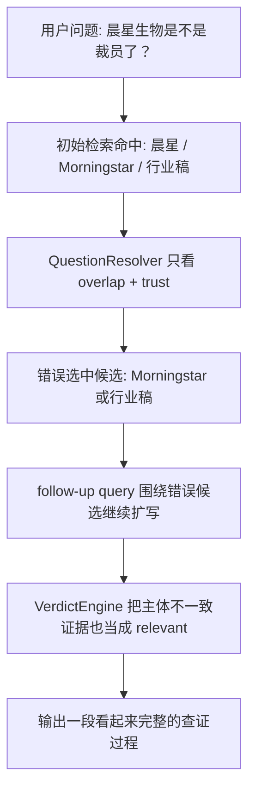
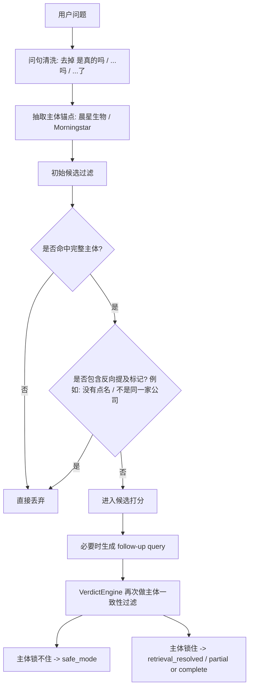
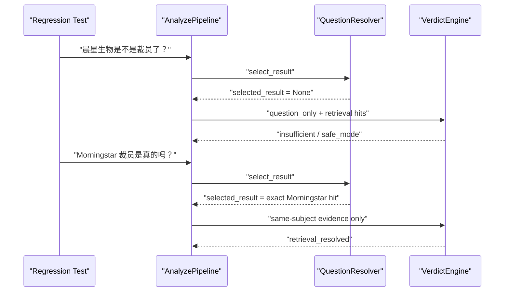

# Entity Drift Fix And Regression Guard

## 1. 这份文档解释什么

这份文档记录 2026-03-15 这一轮 `question_only` 链路修复，聚焦一个非常具体的失败模式：

- 用户问的是 `晨星生物是不是裁员了？`
- 系统却把主体漂移到了 `Morningstar`
- 随后又把行业裁员背景和旧闻混进了“查证过程”

目标不是把所有检索问题一次讲完，而是解释这次如何把“主体锚定错误”从主链里挡住，并补上回归护栏。

## 2. 失败样例长什么样

| 项目 | 现象 |
| --- | --- |
| 用户输入 | `晨星生物是不是裁员了？` |
| 错误主体 | `Morningstar` |
| 错误证据 | 深圳旧裁员新闻、生物医药行业裁员背景 |
| 错误输出特征 | 明明主体没锁定，却输出了很完整的“查证结论 + 查证过程” |
| 风险 | 用户会误以为系统已经查到同一家公司，只是“信息不足” |

## 3. 修复前的错误链路

修复前的根因不是单点，而是三个环节串联放大：

| 环节 | 修复前行为 | 为什么会出错 |
| --- | --- | --- |
| question query 清洗 | 会残留 `裁员是`、`裁员了` 这类脏词 | 真实 action term 被污染，精确主体问句反而不稳定 |
| QuestionResolver | 只要候选里提到相似主体就可能入围 | `晨星生物` 和 `Morningstar`、行业稿容易混在一起 |
| VerdictEngine | 只看 claim/evidence 词面重合 | `没有点名晨星生物` 这种反向提及也可能被当成相关证据 |

## 4. 修复后的判断流程

## 5. 这次实际改了什么

### 5.1 统一清理问句尾部噪声

新增 [question_text.py](../app/services/question_text.py)，把下面两类残留收口成一套规则：

| 类型 | 例子 | 处理方式 |
| --- | --- | --- |
| 真假问句尾巴 | `是真的吗`、`真的假的`、`属实吗` | 整段剥离 |
| 语气/时态尾巴 | `裁员了`、`裁员是`、`去世了` | term 级别去尾，保留动作核心词 |

这样做的直接收益是：

- `Morningstar 裁员是真的吗？` 不会再被切成 `Morningstar + 裁员是`
- `晨星生物是不是裁员了？` 仍然保留 `晨星生物 + 裁员`

### 5.2 把“主体一致性”变成硬闸门

在 [question_resolver.py](../app/services/question_resolver.py) 里，候选现在必须同时满足：

1. 命中主体锚点
2. 不包含反向提及标记
3. 与问题有足够词面重合

这意味着下面两类候选会被直接踢掉：

| 候选类型 | 现在的处理 |
| --- | --- |
| 只提到 `晨星`，没有完整 `晨星生物` | 丢弃 |
| 虽然提到了 `晨星生物`，但上下文是 `没有点名晨星生物` | 丢弃 |

### 5.3 把“反向提及”前置成通用规则

在 [entity_anchor.py](../app/services/entity_anchor.py) 里新增了主体不一致标记集合，当前覆盖：

- `未点名`
- `没有点名`
- `未提及`
- `不是同一家公司`
- `并非同一家公司`
- `无法确认是否同一公司`
- `没有确认与用户提问的是同一家公司`

这样 `QuestionResolver` 和 `VerdictEngine` 用的是同一套判定，不会出现：

- 前面说“这个候选不够像”
- 后面又把同一条证据拿回来当 supporting/refuting

### 5.4 VerdictEngine 再做一层兜底

即使候选阶段漏过了一条证据，[verdict_engine.py](../app/services/verdict_engine.py) 也会在 evidence 归类时再次过滤：

| evidence 情况 | 当前行为 |
| --- | --- |
| 主体不命中 | 不参与 supporting / refuting |
| 包含 `不是同一家公司` 这类标记 | 不参与 verdict |
| 只有行业背景，没有同一主体事实 | 最多留在 raw retrieval hits，不进入强判 |

## 6. 代码落点总表

| 文件 | 变更 | 作用 |
| --- | --- | --- |
| `backend/app/services/question_text.py` | 新增统一问句清洗 | 解决 `裁员是 / 裁员了` 这类脏词 |
| `backend/app/services/entity_anchor.py` | 新增 subject mismatch 规则 | 统一“同主体 / 非同主体”的基础判断 |
| `backend/app/services/question_resolver.py` | 收紧候选选择 | 防止 `晨星生物 -> Morningstar` |
| `backend/app/services/retrieval_service.py` | 收紧 question query rewrite | 提高 exact entity 问句的检索质量 |
| `backend/app/services/verdict_engine.py` | 过滤主体不一致 evidence | 防止 verdict 阶段重新污染结果 |
| `backend/tests/test_retrieval.py` | 新增并收口回归样例 | 把失败模式固定成长期护栏 |

## 7. 修复前后对比

| 场景 | 修复前 | 修复后 |
| --- | --- | --- |
| `晨星生物是不是裁员了？` | 可能漂移到 `Morningstar` 或行业稿 | 保持 `safe_mode`，不锁错主体 |
| `Morningstar 裁员是真的吗？` | 可能因 `裁员是` 脏词导致候选选不中 | 仍可正常进入 `retrieval_resolved` |
| `没有点名晨星生物` 这类证据 | 可能被当成 related evidence | 在 resolver 和 verdict 两层都被过滤 |

## 8. 回归护栏

当前新增/收口的重点回归：

| 用例 | 预期 |
| --- | --- |
| `晨星生物是不是裁员了？` | `safe_mode`，且不锁定 `Morningstar` |
| `Morningstar 裁员是真的吗？` | `retrieval_resolved`，允许 follow-up retrieval |
| 行业稿里写 `没有点名晨星生物` | 不得进入主体已锁定路径 |

## 9. 本轮验证结果

| 命令 | 结果 |
| --- | --- |
| `pytest backend/tests/test_retrieval.py -q` | `22 passed` |
| `pytest backend/tests/test_api.py -q` | `18 passed` |
| `pytest backend/tests/test_api.py backend/tests/test_retrieval.py backend/tests/test_kimi_provider.py backend/tests/test_kimi_provider_quality.py -q` | `46 passed` |

## 10. 这次没有解决什么

这轮修复是“止住主体漂移”，不是把 question-only 检索做成完整语义检索系统。当前仍然没有解决：

| 未解决项 | 说明 |
| --- | --- |
| 别名库 | 现在主要依赖显式主体锚点，不含行业级 alias registry |
| 多跳实体消歧 | 还没有公司简称、产品名、母子公司之间的系统性映射 |
| 真实 live 检索质量 | 这轮只修了规则链护栏，不代表 live 搜索召回已充分收口 |

## 11. 建议如何继续扩展

如果后面继续做增强，建议顺序是：

1. 别名白名单与主体词典
2. question-only 双阶段 query 策略的可观测指标
3. 把 `entity drift` 样例独立沉淀到 eval 集，而不只放在 pytest 中

这样下一轮才能从“避免明显误判”继续推进到“更稳定地找对同一主体”。
