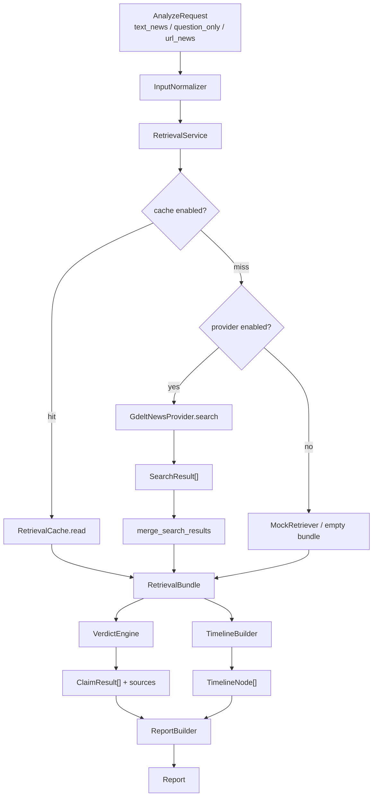
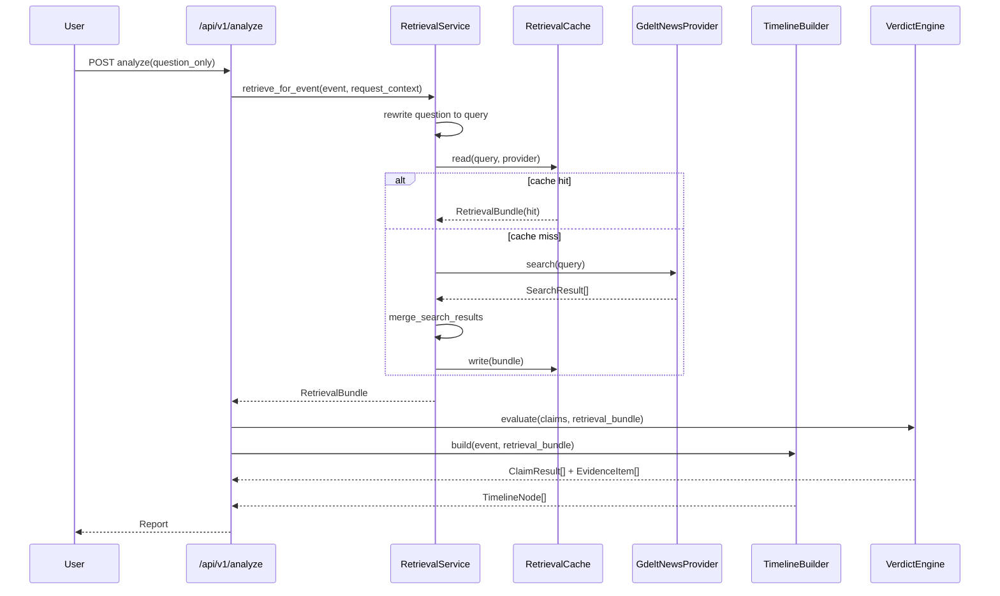
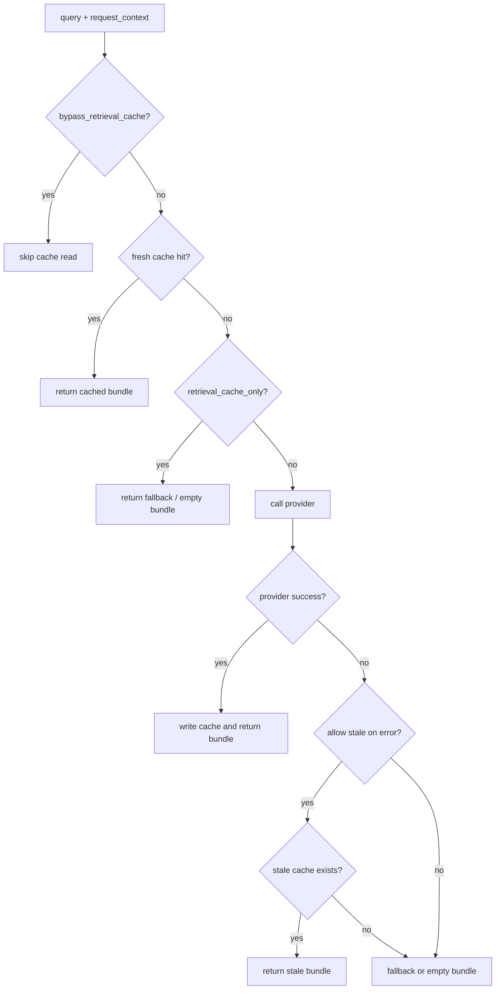

# Real Retrieval Pipeline

## 文档目的

这份文档专门解释 `real retrieval pipeline` 这一段后端能力的真实逻辑、系统架构、方法选择、可行性判断与当前边界。

它回答 5 个问题：

1. 当前“上网找证据再判断”到底做到了什么。
2. 一条开放式新闻问题是如何进入检索、缓存、去重、证据与时间线链路的。
3. 为什么当前选 `GDELT` 作为最小可用 provider。
4. 这套实现为什么在当前项目阶段可行。
5. 这套实现还不等于什么，下一步应该怎么继续推进。

## 一句话概括

当前系统已经从“只会吃 mock case 的场景化链路”，推进到“对 `question_only / text_news` 输入可以做真实公开来源检索、写入本地缓存、归并去重、产出 evidence 和 explainable timeline”的最小可用版本；但它仍然是“检索增强的规则核查器”，不是完整的 agent 式新闻调查系统。

## 目标与非目标

| 类别 | 内容 |
| --- | --- |
| 当前目标 | 让开放式新闻问题不再只能输出空证据或纯保守占位，而是至少拿到一批真实公开来源候选，并能继续驱动 verdict 与 timeline。 |
| 当前目标 | 保留 fallback，不让真实 provider 失败直接打断 `/api/v1/analyze`。 |
| 当前目标 | 让演示与 smoke 可复现，因此必须有本地缓存与 cache-only 入口。 |
| 当前非目标 | 不追求“自动上网全调查 + 多轮搜索 + 交叉验证 + 引文生成”的完整 agent 能力。 |
| 当前非目标 | 不追求生产级搜索召回覆盖率，也不承诺所有开放式新闻都能稳定命中高质量结果。 |
| 当前非目标 | 不做复杂的语义重排、事件聚类、跨轮查询规划。 |

## 总体架构图

## 模块分层表

| 层 | 文件 | 职责 | 关键输出 |
| --- | --- | --- | --- |
| Provider | `backend/app/services/retrieval_provider.py` | 调用公开 GDELT 新闻接口，解析 JSON，做时间与来源等级标准化 | `SearchResult[]` |
| Orchestrator | `backend/app/services/retrieval_service.py` | 决定走 cache、真实 provider、mock fallback 还是空 bundle；负责 question query rewrite | `RetrievalBundle` |
| Cache | `backend/app/services/retrieval_cache.py` | 基于 `provider + compact_query` 读写本地检索缓存，支持 stale read | 缓存文件 / `RetrievalBundle` |
| Internal Model | `backend/app/services/retrieval_models.py` | 定义内部 `SearchResult` 与 `RetrievalBundle` 结构，承接 runtime metadata | 统一内部对象 |
| Dedup | `backend/app/services/retrieval_deduper.py` | 去重、转载归并、canonical 结果保留 | `canonical_results` |
| Timeline | `backend/app/services/timeline_builder.py` | 把 canonical 结果选成 `origin / amplification / turn / clarification / peak` | `TimelineNode[]` |
| Verdict | `backend/app/services/verdict_engine.py` | 把检索结果转成 evidence pool，再驱动 claim verdict | `ClaimResult[]` |
| Output | `backend/app/services/report_builder.py` | 汇总 sources、timeline、claim_results、risk summary | `Report` |

## 开放式问题的真实逻辑

### 1. 输入如何被识别

- `text_news`：用户直接粘贴新闻文本或描述。
- `question_only`：用户输入的是问句，例如“最近是不是有一个女网红因为熬夜脑出血死掉了？”
- `url_news`：这条链路也允许真实检索继续接入，但它的前置是 URL 抽取先给出可用文本。

### 2. `question_only` 如何改写成可搜索 query

`RetrievalService` 内部有一套轻量 query rewrite 规则，目标不是“生成漂亮 query”，而是尽量把开放式问句压缩成适合公开新闻检索的核心实体串。

| 原始问句片段 | 处理方式 | 目的 |
| --- | --- | --- |
| `请问 / 想问 / 听说 / 网传` | 去掉问句前缀 | 去掉不带信息量的口语开头 |
| `是不是真的 / 属实吗 / 是不是 / 有没有 / 最近` | 去掉语气词、时效口语词 | 避免 query 被问句包装污染 |
| `死掉了 / 死掉` | 归一成 `死亡` | 提高和新闻标题的文本重合度 |
| 2-8 字中文片段 / 2+ 位英文数字 token | 取前 6 个去重 token | 控制 query 长度，保留实体与事件词 |

### Query Rewrite 示例

| 原始输入 | 改写后 query |
| --- | --- |
| `最近是不是有一个女网红因为熬夜脑出血死掉了？` | `女网红 熬夜 脑出血 死亡` |
| `网传晨星生物是不是要裁员40%？` | `晨星生物 裁员40%` |
| `听说某地 ferry 因为大雾停运是真的吗` | `ferry 大雾 停运` |

## 真实请求时序图

## 缓存决策流程图

## 缓存设计表

| 项 | 当前实现 | 说明 |
| --- | --- | --- |
| 缓存目录 | `data/cache/retrieval/<provider>/` | 按 provider 分目录，便于后续多 provider 扩展 |
| cache key | `sha256(v1|provider|compact_query)[:24]` | 可重复、稳定、可升级版本号 |
| 存储格式 | JSON | 便于 replay、调试和人工审查 |
| TTL | `RETRIEVAL_CACHE_TTL_SECONDS` | 当前默认 12 小时 |
| stale 策略 | `allow_stale=True` 时允许读取过期缓存 | 用于 provider 失败时兜底 |
| cache-only 入口 | `request_context.retrieval_cache_only=true` | 给 demo replay / smoke 固定复现用 |
| skip cache 入口 | `request_context.bypass_retrieval_cache=true` | 强制绕过缓存，直接打 provider |

## 内部数据模型

### `SearchResult`

| 字段 | 含义 | 用途 |
| --- | --- | --- |
| `title / snippet / url / source_name / published_at` | 标准化后的检索结果核心字段 | 给 verdict、timeline、sources 复用 |
| `source_tier` | `S/A/B/C` 来源等级 | 影响 evidence grade、timeline 选择 |
| `provider_name` | 当前结果来自哪个 provider | 调试、cache metadata |
| `merged_result_ids / merged_notes` | 被归并的转载或近重复结果 | 用于 explainability |
| `canonical_result_id / duplicate_reason` | 去重后的 canonical 信息 | Dedup 层使用 |

### `RetrievalBundle`

| 字段 | 含义 | 用途 |
| --- | --- | --- |
| `query` | 实际检索 query | 用于日志、cache key、排查 query rewrite 效果 |
| `raw_results` | provider 原始结果序列 | 便于时间排序与调试 |
| `canonical_results` | 去重归并后的结果序列 | verdict / timeline 的主输入 |
| `provider_name` | 当前 bundle 来自哪个 provider | 区分 `gdelt / mock / off` |
| `cache_status` | `hit / stale_hit / miss / bypassed / not_used` | 排查缓存行为 |
| `fallback_used` | 是否启用了 fallback | 风险提示与调试 |
| `fallback_reason` | fallback 原因 | explainability |
| `evidence_grade` | 内部证据等级推导 | 决定 sources 质量判断 |

## Provider 方法选择与可行性

### 为什么先选 GDELT

| 维度 | 选择 GDELT 的原因 | 代价 / 限制 |
| --- | --- | --- |
| 可接入性 | 公共接口、无需复杂 key，适合当前演示阶段 | 不保证稳定 SLA |
| 返回结构 | `ArtList + JSON`，包含标题、URL、时间、domain | 返回内容仍偏“搜索候选”，不是整理过的事实结论 |
| 工程成本 | 低依赖、低接线成本，便于先打通闭环 | 召回质量不如专用新闻检索方案 |
| 演示价值 | 足够证明系统已具备“开放式问题 -> 真实来源候选”能力 | 还不能宣称“生产级实时核查” |

### 当前来源等级方法

`GdeltNewsProvider` 不是把 provider 的原字段直接透传，而是做了一层可解释的来源等级映射：

| 规则 | 结果 |
| --- | --- |
| 命中 `gov.cn / .gov / police / court / edu.cn` | `S` |
| 命中 `news.cn / xinhuanet.com / people.com.cn / reuters.com / apnews.com / bbc.com ...` | `A` |
| 命中 `news / ifeng / sohu / 163 / qq / sina / msn / yicai` 等门户特征 | `B` |
| 其余 | `C` |

这套规则的目的不是绝对精确，而是让 `timeline / evidence_grade / verdict confidence` 至少有一套统一、可解释、低成本的来源分层基准。

## 时间线方法

### 关键思想

时间线不是简单按时间排序，而是从 `canonical_results` 中选择“传播链上有角色意义”的节点：

- `origin`：最早进入关键叙事的节点，通常偏 rumor 或最早权威起点
- `amplification`：扩散节点，通常是聚合、转发、门户放大
- `turn`：回应、否认、核查、致歉等转折节点
- `clarification`：转折后的补充说明、通报、更新节点
- `peak`：报道密度最高时段的峰值节点

### 节点选择方法表

| 节点 | 当前选择逻辑 | 为什么可行 |
| --- | --- | --- |
| `origin` | 优先找出现在权威回应之前、且带 rumor 信号的最早节点 | 能较稳定刻画“传闻从哪开始” |
| `amplification` | 找 rumor/转载/低可信扩散节点 | 能解释为什么事件会发酵 |
| `turn` | 找高可信来源中的回应/否认/核查节点 | 能体现叙事转折 |
| `clarification` | 在 `turn` 之后找说明/通报/更新节点 | 能表达“后续补充解释” |
| `peak` | 在起点之后按天统计报道密度，选峰值窗口代表节点 | 能补充传播最密集阶段 |

### 一个重要实现细节

真实 bundle 下，`peak` 现在被放在 `clarification` 之后选择。这是刻意的：

- 如果同一个高可信结果既能被视作“峰值报道”，又更适合承担“说明/澄清”角色，系统优先保留 `turn / clarification`。
- 这样时间线更接近“传播链解释”，而不是“把强结果过早消耗在峰值位置”。

## 当前 verdict 是怎么用检索结果的

当前 verdict 仍然是规则/启发式，不是 LLM 自由推理。

逻辑顺序是：

1. `RetrievalBundle.canonical_results` 转成 evidence pool。
2. `VerdictEngine` 先处理 scenario 特例，再走 generic claim 逻辑。
3. generic claim 会做轻量词项重合判断，并检查 `辟谣 / 不实 / 否认 / 谣言 / 仍在救治` 等否定信号。
4. 如果高重合结果里以否定信号为主，则判 `refuted`；如果支持和否定同时存在，则判 `conflicting`；如果重合不够，则继续 `insufficient`。

这意味着：

- 系统已经具备“基于真实来源候选做保守判断”的能力。
- 但它还没有做到 claim decomposition、多跳交叉验证、跨来源事实融合。

## 方法可行性判断

### 为什么这套方案在当前阶段可行

| 维度 | 当前判断 |
| --- | --- |
| 工程可行性 | 高。实现基于现有 `SearchResult / RetrievalBundle / TimelineBuilder / VerdictEngine` 结构扩展，不需要重写主 API。 |
| 演示可行性 | 高。`question_only` 已能进入真实检索链路，且有缓存、fallback、测试支撑。 |
| 维护可行性 | 中高。provider、cache、timeline、verdict 分层清楚，后续替换 provider 成本较低。 |
| 质量上限 | 中。当前质量更多取决于 provider 召回和规则质量，而不是深层 reasoning。 |
| 对未来演进友好度 | 高。后续可以继续替换 provider、补 rerank、加 replay 接口，而不需要推翻当前内部对象模型。 |

## 当前边界与风险

| 边界 | 当前状态 | 影响 |
| --- | --- | --- |
| 真实联网 smoke | 还未写入文档记录 | 目前通过的是 mocked HTTP + 本地回归，不是正式公网验收 |
| URL 正文抽取 | 仍属 `C10` 范围 | URL 新闻能否顺利接入真实检索，仍受抽取质量影响 |
| verdict 方式 | 规则/启发式 | 复杂 claim 容易落入 `insufficient` 或保守误判 |
| provider 覆盖面 | 只接了 GDELT | 对中文长尾新闻、地方媒体、截图型谣言覆盖有限 |
| 结果解释 | 已有 `why_selected / fallback_reason / cache_status` | 够交接、够演示，但还不是完整 provenance 体系 |

## 后续建议

### 近一步

1. 由 `Cluster-F / F7` 做一轮真实联网 smoke，记录 `RETRIEVAL_PROVIDER=gdelt` 的真实查询样例、返回质量和失败场景。
2. 把 smoke 中表现最稳定的开放式问题整理成 demo checklist，供前端和演示复用。

### 中一步

1. 补 `/api/v1/replay`，直接复用现有 cache-only 入口，把固定 query 的缓存结果显式暴露出来。
2. 给 `RetrievalBundle` 增加更多 provenance 字段，例如 provider latency、raw count、canonical count。
3. 对 query rewrite 增加时间词处理与实体保留策略，降低开放式问句的噪声。

### 再往后

1. 引入第二个 provider 或 rerank 层，对 GDELT 结果做语义重排。
2. 把 generic verdict 从纯词项重合推进到“claim 对 evidence”的结构化匹配。
3. 再考虑接完整 RAG / agent 搜证，而不是过早把当前系统描述成“自动较真机器人”。

## 代码落点索引

| 主题 | 代码文件 |
| --- | --- |
| provider 调用与来源分级 | `backend/app/services/retrieval_provider.py` |
| 检索编排、query rewrite、fallback | `backend/app/services/retrieval_service.py` |
| cache key、TTL、stale 读取 | `backend/app/services/retrieval_cache.py` |
| 内部数据模型 | `backend/app/services/retrieval_models.py` |
| 时间线角色选择 | `backend/app/services/timeline_builder.py` |
| 检索相关回归测试 | `backend/tests/test_retrieval.py` |

## 当前结论

这套 `real retrieval pipeline` 已经具备“真实逻辑闭环”和“演示级可行性”：

- 有真实 provider
- 有 query rewrite
- 有 cache
- 有 fallback
- 有 evidence
- 有 timeline
- 有测试
- 有任务记录

它当前最准确的定位是：

> 一个已经能处理开放式新闻问题、但仍以检索增强规则核查为核心的方法型后端基础设施。
