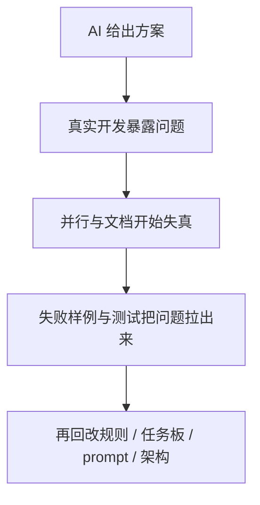
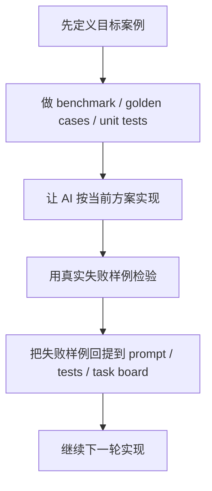

# 按我的 5 个关键点复盘：为什么会提出这些，以及它们在 `rumor-checking` 项目里是怎么暴露出来的

## 1. 这份文档怎么读

这份文档完全按我自己的 5 个观点来讲，不再重新发明分类。

每个点都回答 3 个问题：

1. 我为什么会提这个点
2. 这个项目里具体暴露了什么问题
3. 最后我得到的可执行方法是什么

这 5 个点分别是：

1. AI 不能自动给出真正可行的 V1 框架
2. 并行策略必须和模型/工具形态绑定
3. 并行 task 的 prompt 必须设计好边界
4. 文档管理必须模块化，而不是越多越好
5. benchmark、单测和失败样例是纠偏锚点

## 2. 一页总表

| 点 | 我为什么会提出来 | 本项目里暴露的问题 | 最后形成的方法 |
| --- | --- | --- | --- |
| `1` AI 不会自动给可行框架 | 早期方案看起来完整，但后面发现真正难点不在它写出来的那套结构里 | `V1` 蓝图能启动项目，但后续反复暴露出 mock/demo 与真实链路的差距 | 先让 AI 给第一版，再靠审计、测试和失败样例不断修正 |
| `2` 并行策略要看工具形态 | Codex app 多线程和 agent team 完全不是一回事 | 多线程时如果没有总控、规则和总表，状态会失真 | 先定义线程协作范式，再设计任务板、回写规则和批次 |
| `3` 每个 task 都要有限定 prompt | 并行时最大的成本不是少做，而是互相覆盖 | schema、README、tests、前后端共享字段都是高冲突区 | prompt 里写清文件范围、owner、最低交付和验收标准 |
| `4` 文档不是越多越好 | 上下文再长，也扛不住重复、冲突和失真 | 仓库里曾出现 README、overview、tasks 和代码状态不同步 | 用分层文档体系，每类文档只负责一种事情 |
| `5` benchmark 和测试是方向盘 | AI 很容易“看起来在做对”，实际却在漂移 | 随机 case、mode drift、entity drift、live retrieval 全都暴露过问题 | 用 benchmark、golden cases、回归测试和失败样例持续纠偏 |



---

## 3. 第一点：AI 不能自动给你一个真正可行的 V1 框架

## 3.1 我为什么会提这个点

因为我在这个项目里很早就发现：

- AI 很容易给出一版“结构上看起来完整”的方案
- 但那不等于它真的抓住了最难的地方

更直接一点说：

> 它很会给你列一个像样的框架，但不一定真能给你列一个能跑通、能讲清、能支撑最终目标的框架。

我会提出这个点，是因为这个项目里最开始的几版方案，虽然文档上非常像一个完整产品，但后面越做越发现：

- 真正困难的不是“页面、模块、流程”
- 而是“真实 retrieval、证据闭环、provider 稳定性、mode drift、mock 和 live 的边界”

## 3.2 这个项目里具体暴露了什么问题

最典型的起点是：

- [overview/03_v1_zero_key_blueprint.md](../overview/03_v1_zero_key_blueprint.md)

这份文档当时定义的 V1 很清楚：

> 输入一条新闻文本或 URL，系统生成事件概览、关键来源时间线、3 到 5 条 claim 核查结果，并在证据不足时安全降级。

它作为启动蓝图是有价值的。

但后面的开发证明了几个问题：

| 暴露的问题 | 在项目里的体现 |
| --- | --- |
| 框架看起来完整，但主链不一定真实成立 | `2026-03-13 23:40` 的复查已经明确指出：系统更多在消费缓存、样例 JSON 或 fallback，而不是真实 reasoning |
| AI 容易用较老的 Web Demo 思路来包装问题 | 早期更容易先得到“页面骨架 + 模块清单 + 流程图”，但没有真正把大模型嵌进 evidence-grounded 的主链 |
| 大模型可能被用浅了 | 早期更多是摘要、抽取、文档化，后面才逐步推进到 `claim -> retrieval -> evidence bundle -> verdict -> fallback` |
| 文档里的可行性和真实可交付性不是一回事 | [overview/14_v1-capability-assessment-and-next-parallel-plan.md](../overview/14_v1-capability-assessment-and-next-parallel-plan.md) 最终明确写了：当前可以演示，但不能说“对任意新闻稳定较真” |

后面这些文档其实都在修正这个问题：

| 文件 | 修正了什么 |
| --- | --- |
| [overview/09_stage-progress-and-task-audit.md](../overview/09_stage-progress-and-task-audit.md) | 开始明确区分“真实 analyze”和“demo/fallback” |
| [overview/14_v1-capability-assessment-and-next-parallel-plan.md](../overview/14_v1-capability-assessment-and-next-parallel-plan.md) | 开始明确区分“可演示”和“可对任意新闻稳定较真” |
| [tasks/high-score-final-execution-plan.md](../tasks/high-score-final-execution-plan.md) | 开始按高分路线重新设计主链，而不是只沿着最初 V1 文档走 |

## 3.3 我后来得到的方法

我现在会把 AI 给框架这件事看成第一步，而不是结论。

更可靠的做法是：

1. 先让 AI 给你一版结构化方案
2. 你自己判断真正的评分目标和主链难点
3. 用审计型 prompt 去反复问：
   - 哪些只是 mock
   - 哪些是真实能力
   - 哪些看起来完整但其实不可交付
4. 再把任务板和实现路线回改

一句话说：

> AI 可以帮我快速搭脚手架，但不能替我判断这套脚手架到底承不承重。

---

## 4. 第二点：并行策略必须和模型/工具形态绑定

## 4.1 我为什么会提这个点

因为我在这个项目里非常明显地感受到：

- “多 agent”
- “多线程”
- “多个窗口”
- “自动协作”

这几个词在方法论上很像，但在实际执行上完全不是一回事。

我会强调这一点，是因为如果你不把“工具协作范式”搞清楚，就会出现一种假象：

- 你觉得自己在做高级并行开发
- 但实际只是把混乱分发给更多窗口

## 4.2 这个项目里具体暴露了什么问题

最关键的例子就是：

- [tasks/multi-agent-execution-board.md](../tasks/multi-agent-execution-board.md)
- [tasks/high-score-final-execution-plan.md](../tasks/high-score-final-execution-plan.md)

前者更像 “角色化 / agent 化” 设计。

后者则是把这种设计改写成适合 Codex app 多线程的执行方案。

为什么会发生这种转变？

因为这个项目后面明确意识到：

| 方式 | 特征 | 对并行策略的影响 |
| --- | --- | --- |
| Codex app 多线程 | 共享仓库文件，但不共享隐式上下文，也不会自动编排 | 必须靠任务板、回写、总控线程来协作 |
| agent team 式协作 | 更容易做角色分工和自动编排 | 可以把更多协调逻辑交给系统，但仍然需要验收门 |

这个项目里后来明确补过一条结论：

- `2026-03-15 21:55 [log]`
- 这套方案在 Codex app 里可行
- 但不能按 “9 个自动协作 agent” 来理解
- 当前最推荐的是 `4 线程方案`

这说明我提出这个点，不是理论上的，而是项目里真的撞到过：

- 如果你拿错协作假设
- 后面的任务拆分、汇报方式、交接方式都会跟着错

## 4.3 这个项目里最典型的症状

| 症状 | 真实表现 |
| --- | --- |
| 线程之间不会天然知道彼此在做什么 | 所以需要 [workflows/prompt_logging_rules.md](../workflows/prompt_logging_rules.md) 强制写线程标识、上下文来源、交接建议 |
| 任务如果不集中汇总，很快就失真 | 所以后面必须补 [tasks/origin-problem-goal-matrix.md](../tasks/origin-problem-goal-matrix.md) 和总控计划 |
| 角色化设计不能直接落地到 Codex app | 所以后来又专门补了“角色 -> 线程”的映射 |
| 真正可承受的并行度要小于理论并行度 | 所以后来推荐的不是极限多线程，而是更务实的 `4 线程方案` |

## 4.4 我后来得到的方法

我现在会先问自己：

1. 我的工具支持自动协作，还是只支持并行执行？
2. 线程之间共享的是“文件”，还是“记忆 + 决策”？
3. 总控逻辑应该由谁承担？

如果是 Codex app 这种多线程模式，我会先设计：

- 总控线程
- 统一任务板
- 统一回写规则
- 固定批次和阶段屏障

而不会先盲目追求 “开更多线程”。

一句话说：

> 并行策略不是抽象设计题，而是工具协作原语决定的工程题。

---

## 5. 第二点的延伸：为什么我会强调“并行可视化”必须靠 rules 和进度表

这个点其实是你第二条里的后半部分，我单独展开，因为它在这个项目里特别重要。

## 5.1 我为什么会提这个

因为我很快发现，多线程里最危险的不是“没做事”，而是：

- 每个线程都在做事
- 但主控看不到全局
- 结果就是任务表、代码状态、文档口径三套系统开始分离

## 5.2 这个项目里具体怎么暴露出来的

典型信号就是：

- `2026-03-13 20:41`
- 当时已经发现 `tasks/` 里的大量状态还停留在初始化时的“未完成”
- 但真实代码已经走得更远

这意味着：

| 失真类型 | 在项目里的表现 |
| --- | --- |
| 任务表落后于代码 | `tasks/` 状态不能反映真实进度 |
| 文档落后于实现 | `README`、`overview`、`tasks` 曾经和当前代码事实冲突 |
| 并行线程之间没有统一的状态汇报口径 | 所以后面必须补统一日志、阶段审计和总矩阵 |

后面项目实际上补了 4 层可视化机制：

| 层 | 文件 | 作用 |
| --- | --- | --- |
| 线程日志层 | [prompt-history.md](../prompt-history.md) + [workflows/prompt_logging_rules.md](../workflows/prompt_logging_rules.md) | 记录每个线程做了什么、依赖什么、要交给谁 |
| cluster 层 | `tasks/cluster-*.md` | 记录模块级任务和子任务 |
| 总表层 | [tasks/origin-problem-goal-matrix.md](../tasks/origin-problem-goal-matrix.md) | 统一总览所有任务状态 |
| 批次执行层 | [tasks/high-score-final-execution-plan.md](../tasks/high-score-final-execution-plan.md) | 把线程、批次、状态、优先级收进一张母板 |

## 5.3 我后来得到的方法

如果并行任务想真正可视化，我现在会强制三件事：

1. 所有线程必须定期回写
2. task 必须拆到足够细
3. 一定要有总览级进度表

没有这三层，AI 并行开发大概率会变成：

- 聊天记录很多
- 代码改动不少
- 但项目状态没人能一句话讲清

---

## 6. 第三点：每个 task 在不同线程并行时，prompt 必须提前设计好边界

## 6.1 我为什么会提这个点

因为我在这个项目里越来越确认：

并行开发里最贵的错误不是“某个 task 没完成”，而是“多个 task 互相影响”。

具体来说，如果不提前设边界，就会出现：

- 多个线程同时改同一个文件
- 多个线程对同一个字段长出不同解释
- 多个线程都以为自己在对，最后合并成本爆炸

## 6.2 这个项目里具体暴露了什么问题

项目从很早就开始意识到这个问题。

例如：

- `2026-03-13 17:12` 就已经强调 schema 只能有单一 owner
- `2026-03-13 18:53` 前端线程被明确要求不要串线覆盖其他后端改动
- `2026-03-13 23:01` 的窗口 prompt 已经开始明确“读哪些文件、只能改哪里”
- [tasks/high-score-final-execution-plan.md](../tasks/high-score-final-execution-plan.md) 后面更直接写了高冲突文件 owner

本项目里，几个典型的高冲突区域是：

| 高冲突区 | 为什么危险 |
| --- | --- |
| `contracts/report.schema.json` 和共享 schema | 前后端、report builder、tests 都会依赖 |
| `backend/tests/` | QA、实现、修 bug 都可能同时改 |
| `README.md`、`overview/` | 文档线程和主控线程容易一起改 |
| provider / retrieval / verdict 交界处 | 逻辑边界不清时，多个线程会同时进入 |

## 6.3 本项目是怎么修正的

后来我越来越倾向于在 prompt 里直接写清：

```text
你只能改哪些文件
你尽量不要碰哪些文件
你的最低交付是什么
验收标准是什么
完成后回写到哪里
```

这在这些文档里都能看到痕迹：

| 文件 | 作用 |
| --- | --- |
| [tasks/current-wave-window-prompts.md](../tasks/current-wave-window-prompts.md) | 针对当前波次直接分发的窗口 prompt |
| [tasks/high-score-final-execution-plan.md](../tasks/high-score-final-execution-plan.md) | 把线程、owner、高冲突文件写到总控计划里 |
| [tasks/parallel-execution-playbook.md](../tasks/parallel-execution-playbook.md) | 把模块责任分析和具体 prompt 模板沉淀下来 |

## 6.4 我后来得到的方法

我现在不再把“并行 prompt”理解成“给不同窗口不同任务描述”。

而是要求每个 prompt 至少回答这几个问题：

| 问题 | 为什么必须有 |
| --- | --- |
| 这个线程负责什么 | 防止 scope 漂 |
| 这个线程不负责什么 | 防止越界 |
| 允许改哪些文件 | 防止互相覆盖 |
| 验收标准是什么 | 防止只做一半 |
| 完成后回写哪里 | 防止结果失踪 |

一句话说：

> 并行 prompt 不是“给不同任务”，而是“给不同边界”。

---

## 7. 第四点：文档管理不是越多越好，而是必须按模块治理

## 7.1 我为什么会提这个点

因为我在这个项目里非常强烈地感觉到：

- AI 的上下文再长，也不是无限的
- 真正拖垮模型判断的，不一定是“信息不够”
- 更可能是“重复文档太多、冲突文档太多、无用文档太多”

所以我才会特别强调：

> 文档管理的核心不是堆数量，而是控制层次、职责和重复度。

## 7.2 这个项目里具体暴露了什么问题

这个项目里后来出现过很典型的文档失真：

| 问题 | 真实表现 |
| --- | --- |
| 入口文档落后于真实代码 | [README.md](../README.md) 曾经停留在更早阶段 |
| 状态文档和任务文档不一致 | `tasks/`、`overview/`、真实实现之间出现时滞 |
| 如果继续叠加旁路文档，只会更乱 | 所以后来专门有一次文档纠偏，要求不要保留冲突原件归档，而是直接更新原文件 |

这个修正后来体现在：

- [docs/status/document-conflict-register.md](../docs/status/document-conflict-register.md)
- [docs/README.md](../docs/README.md)

后面项目的文档分层才逐渐稳定：

| 层 | 负责什么 |
| --- | --- |
| `overview/` | 阶段、架构、能力评估 |
| `tasks/` | 任务板、并行计划、执行母板 |
| `docs/status/` | 当前核验状态与冲突登记 |
| 代码邻近文档 | 某个模块的专项实现说明 |

## 7.3 为什么这和上下文长度有关

我会提到上下文长度，不是因为“上下文不够长”这么简单，而是因为：

- `256k`、`1M` 这种数字提高的是“可装载量”
- 不是“自动去重能力”
- 更不是“自动判断冲突文档哪个才是准的能力”

也就是说，哪怕上下文更长：

- 如果你塞进去很多重复 README
- 很多过时状态表
- 很多冲突说明
- 很多职责重叠的文档

模型照样会被误导，而且成本会更高。

## 7.4 我后来得到的方法

我现在会强制每类文档只承担一种职责。

如果出现冲突，我更倾向于：

1. 先登记问题
2. 再直接更新原文件
3. 而不是继续堆新的旁路总结

一句话说：

> 文档治理不是扩写系统，而是约束系统。

---

## 8. 第五点：benchmark、单元测试和全过程例子，是 AI 偏离时最重要的纠偏锚点

## 8.1 我为什么会提这个点

因为这个项目做到后面，我最清楚的一个感受就是：

- AI 会漂
- 而且它经常不是明显地漂
- 它是“看起来越来越完整”，但其实越来越偏离目标

所以你不能只靠“感觉”来纠偏，你必须给它锚点。

## 8.2 这个项目里具体暴露了什么问题

这个项目里，真正把问题拉出来的，往往不是再来一轮宏大规划，而是这些具体资产：

| 类型 | 项目里的真实例子 |
| --- | --- |
| benchmark 认知 | `2026-03-13 15:49` 对 FEVER、FEVEROUS、AVeriTeC、MuMiN、GDELT 的适配判断 |
| 最小回归集 | [evals/minimal_v1/README.md](../evals/minimal_v1/README.md) |
| smoke | [SMOKE_CHECKLIST.md](../SMOKE_CHECKLIST.md) |
| 随机 case 验收 | [overview/13_f8-random-acceptance.md](../overview/13_f8-random-acceptance.md) |
| 运行时真实问题 | “女网红脑出血”这条模糊传闻 |
| entity drift 失败样例 | “晨星生物是不是裁员了？” |
| mode drift 样例 | `chemical-odor`、`morningstar-layoff` |

这些例子非常关键，因为它们不是抽象问题，而是直接告诉你：

- 当前目标到底有没有达到
- 哪一段链路还在漂
- 哪种错误是“演示能过，但真实能力没过”

## 8.3 为什么我会特别强调“告诉 AI 全过程的例子”

因为 AI 偏离时，如果你只说：

- 你这里不对
- 你重新改一下

它很可能只是局部修补。

但如果你给它的是：

- 一个完整目标
- 一个具体失败样例
- 你期望它在这个样例上怎么表现
- 它为什么现在表现不对

那么它更容易回到正确轨道。

这个项目里，失败样例后来就不再只是“Bug”，而是变成了：

| 用途 | 说明 |
| --- | --- |
| 回归样本 | 确保以后不要再犯同类错误 |
| prompt 纠偏锚点 | 让模型理解“应该怎样才算对” |
| 路线判断依据 | 判断现在缺的是 provider、retrieval、entity anchoring，还是 mode control |

## 8.4 我后来得到的方法

现在我会把纠偏做成一个固定循环：



一句话说：

> benchmark、测试和失败样例，不是开发结束后的检查单，而是 AI 开发过程中持续校正方向的方向盘。

---

## 9. 最后一句总结

如果要用一句话概括我为什么会提出这 5 个点，我会这样说：

> 因为这个项目让我反复看到，AI 最容易出问题的地方不是“不会做”，而是“很会做出看起来像样的东西”，但这些东西如果没有边界、没有并行规则、没有文档治理、没有测试锚点，就会一点点偏离真实目标。

所以我现在最相信的方法不是“更相信 AI”，而是：

- 用 AI 加速
- 用规则约束
- 用任务板组织
- 用文档分层
- 用 benchmark 和失败样例持续纠偏

这才是这个项目里我真正得到的经验。
