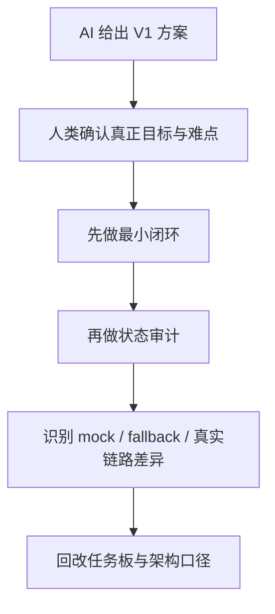
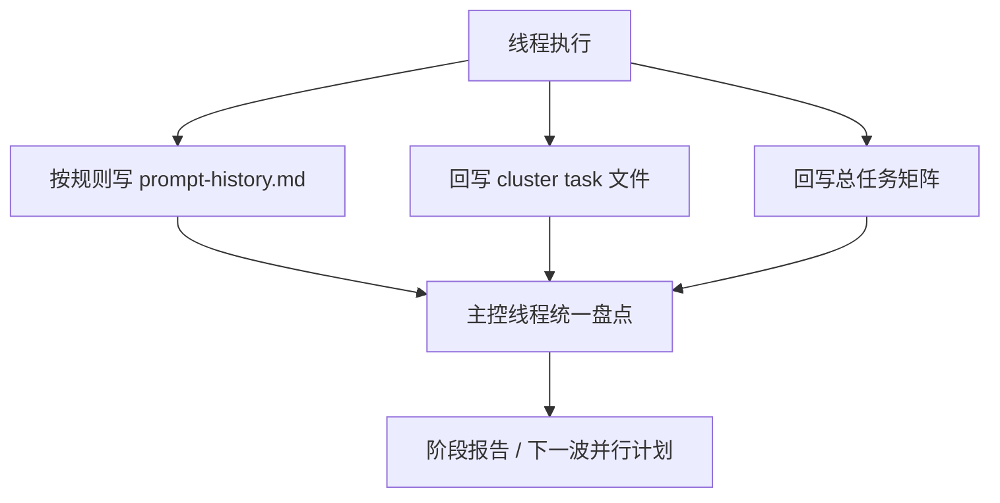
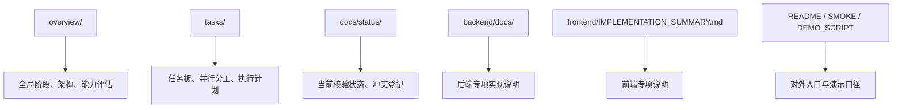
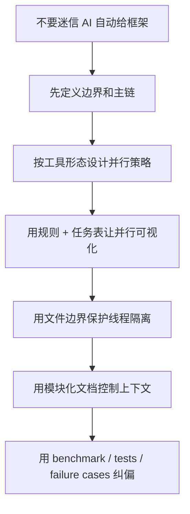

# 在 `rumor-checking` 项目里使用 AI 协作开发的 6 点真实心得

## 1. 为什么写这份文档

这不是一份泛泛的 “AI 很强” 总结，而是基于这个项目在 `2026-03-13` 到 `2026-03-15` 期间的真实开发记录，对 AI 参与产品设计、并行开发、文档管理和测试纠偏的一次复盘。

这份文档主要想回答 6 个问题：

1. 为什么不能让 AI 自己给你列一版 “看起来完整” 的 V1 框架
2. 为什么并行策略必须和你使用的模型/工具形态绑定
3. 为什么并行线程如果没有进度可视化机制，最后一定会失控
4. 为什么每个并行 task 都必须设计带边界的 prompt
5. 为什么文档管理必须模块化，而不是无限堆积
6. 为什么 benchmark、单测、golden cases 和失败样例是 AI 开发里的纠偏锚点

我在这次实践里的一个重要感受是：

> AI 非常适合帮你加速，但它并不能自动替代产品架构、协作机制和工程判断。你不给它规则、边界、验收门和回写机制，它就会越来越偏。

## 2. 一页结论

| 心得 | 一句话结论 | 本项目里的典型证据 |
| --- | --- | --- |
| 1 | 不要让 AI 自己定义 V1 框架 | `overview/03_v1_zero_key_blueprint.md` 之后，还需要多轮审计修正“mock/demo 像真实能力”的问题 |
| 2 | 并行策略必须匹配协作范式 | `tasks/multi-agent-execution-board.md` 后又专门补了 Codex app 线程映射 |
| 3 | 并行可视化要靠规则和任务总表 | `workflows/prompt_logging_rules.md`、`tasks/README.md`、`tasks/origin-problem-goal-matrix.md` |
| 4 | 每个线程都需要文件边界和 prompt 边界 | `tasks/current-wave-window-prompts.md`、`tasks/high-score-final-execution-plan.md` |
| 5 | 文档不是越多越好，而是要分层治理 | `docs/README.md`、`docs/status/document-conflict-register.md`、`overview/`、`tasks/` 分层 |
| 6 | benchmark 和测试是防止 AI 跑偏的锚点 | `evals/minimal_v1/`、`SMOKE_CHECKLIST.md`、`overview/13_f8-random-acceptance.md`、失败样例日志 |

## 3. 这个项目里 AI 协作的真实演化过程


这条链路后来让我意识到：

- AI 可以参与每个阶段
- 但 AI 在每个阶段扮演的角色完全不同
- 如果你把所有阶段都用同一种 prompt 或同一种协作策略处理，最后一定出问题

---

## 4. 心得一：不要让 AI 自己定义你的 V1 框架

## 4.1 我踩到的真实问题

这个项目早期有一条很典型的记录：

- `2026-03-13 15:53`
- 产出文件：[overview/03_v1_zero_key_blueprint.md](../overview/03_v1_zero_key_blueprint.md)

这份蓝图当时定义的 V1 很清晰：

> 输入一条新闻文本或 URL，系统生成事件概览、关键来源时间线、3 到 5 条 claim 核查结果，并在证据不足时安全降级。

从文档角度看，这个框架是完整的。

但后面的真实开发证明了一个问题：

- 它更像一个“便于启动实现的第一版口径”
- 不是一个已经能直接支撑最终目标的可行方案

后续在这些节点里，团队不得不反复修正它：

| 日期 | 后续证据 | 说明 |
| --- | --- | --- |
| `2026-03-13 23:40` | `prompt-history.md` 明确指出系统更多在消费缓存、样例 JSON 或 fallback，而不是真实 reasoning | 说明“V1 框架看起来完整”不等于“主链真的成立” |
| `2026-03-14 00:12` | [overview/09_stage-progress-and-task-audit.md](../overview/09_stage-progress-and-task-audit.md) | 阶段报告开始专门区分真实链路和 demo/fallback |
| `2026-03-14 22:27` | [overview/14_v1-capability-assessment-and-next-parallel-plan.md](../overview/14_v1-capability-assessment-and-next-parallel-plan.md) | 明确写出：当前能演示，但不能说“对任意新闻稳定较真” |

## 4.2 这件事背后的本质

AI 很容易给你列出一套“结构完整”的方案，但这类方案经常有三个问题：

| 问题 | 在本项目里的表现 |
| --- | --- |
| 对难点判断不准 | 早期 V1 重点是“零额外 key”和最小闭环，但真正最难的是 live retrieval、mode drift、provider 稳定性 |
| 会用旧的 Web Demo 思路包装问题 | 很容易先得到“页面、模块、流程图”，但没有真正把大模型放进可验证的证据闭环 |
| 容易把大模型用浅了 | 一开始更多是“摘要、抽取、文档化”，后来才逐步推进到 `claim -> retrieval -> evidence bundle -> verdict -> fallback` 的真实链路 |

## 4.3 我现在的判断

不是说早期 V1 蓝图没有价值。

它的价值是：

- 帮你快速冻结边界
- 帮你明确第一版不做什么
- 帮你启动任务拆解

但它不应该被当成最终产品框架。

更准确的做法是：

1. 让 AI 给出第一版框架
2. 你自己明确真正的评分目标、主链难点和不可回避的工程约束
3. 再用审计型 prompt 不断修正第一版框架

## 4.4 本项目最终学到的规则



一句话总结：

> AI 可以先帮你搭骨架，但不能替你决定什么是“真正可行的骨架”。

---

## 5. 心得二：并行策略必须匹配你用的模型和工具形态

## 5.1 我在项目里遇到的真实分叉

到了 `2026-03-15`，项目开始往多线程并行推进。

这时出现了一个很典型的问题：

- 从“方法论上”看，可以按多 agent、多角色去拆
- 但从“实际工具”看，我当时用的是 Codex app 多线程，不是自动协作的 agent team

这件事直接反映在两个文档上：

| 文件 | 它表达了什么 |
| --- | --- |
| [tasks/multi-agent-execution-board.md](../tasks/multi-agent-execution-board.md) | 从职责角色出发，设计多 agent / 多数据源交叉验证体系 |
| [tasks/high-score-final-execution-plan.md](../tasks/high-score-final-execution-plan.md) | 把上面的角色化方案改写成更适合 Codex app 的线程执行方式 |

后来在 `2026-03-15 21:55 [log]`，项目还专门补了一次结论：

- 这套方案在 Codex app 中可行
- 但不能按 “9 个自动协作 agent” 理解
- 最推荐的是 `4 线程方案`

## 5.2 为什么这件事很重要

因为不同工具的协作原语不一样。

### Codex app 多线程

- 线程之间共享仓库文件
- 但不共享隐式记忆
- 不会自动协商分工
- 更像“多个独立工程师同时工作”

### Claude Code / agent team 式协作

- 更容易建立代理间的角色分工
- 更适合自动编排和子任务流转
- 但同样需要明确边界和验收

所以并行不是抽象的“多开几个窗口”，而是一个要和工具协作方式绑定的策略问题。

## 5.3 这个项目后来怎么修正

项目后来不再只说“角色”，而是同时说“线程映射”和“文件边界”。

例如在 [tasks/multi-agent-execution-board.md](../tasks/multi-agent-execution-board.md) 里，最终形成了这样的判断：

| 档位 | 线程数 | 推荐理由 |
| --- | --- | --- |
| 保守 | `3` | 冲突少，适合先稳住 |
| 均衡 | `4` | 最符合 Codex app 的真实协作成本 |
| 激进 | `5-6` | 需要更强的手工合并和状态回写能力 |

## 5.4 我现在的经验判断

并行策略不是“越多线程越高级”，而是：

> 你要先搞清楚自己的工具到底支持“自动协作”还是“人工派工 + 文件回写”。

如果是 Codex app 这样的多线程模式，你必须额外设计：

- 总控线程
- 统一任务板
- 线程汇报规则
- 明确的 handoff 文档

否则并行只会把混乱放大。

---

## 6. 心得三：并行想真正可视化，必须有规则、汇报机制和总任务表

## 6.1 项目里最关键的一个改进

我在这个项目里很快发现：

如果只是把任务拆给不同窗口，而没有统一回写机制，那任务状态会迅速失真。

这在 `2026-03-13 20:41` 的盘点里已经暴露过：

- `tasks/` 中大多数子任务还停留在初始化时的“未完成”
- 但真实代码已经走得更远
- 于是“任务表口径”和“代码真实状态”开始脱节

后来项目补了几层机制来解决这个问题。

| 机制 | 文件 | 作用 |
| --- | --- | --- |
| Prompt 日志规则 | [workflows/prompt_logging_rules.md](../workflows/prompt_logging_rules.md) | 要求线程记录职责、上下文来源、产出与交接 |
| 顶层任务入口 | [tasks/README.md](../tasks/README.md) | 统一窗口分配和入口说明 |
| 全量状态矩阵 | [tasks/origin-problem-goal-matrix.md](../tasks/origin-problem-goal-matrix.md) | 给所有 cluster 和子任务一个可总览的进度表 |
| 最终执行母板 | [tasks/high-score-final-execution-plan.md](../tasks/high-score-final-execution-plan.md) | 把批次、线程、状态、进度统一到一个执行板 |

## 6.2 为什么一定要这样做

因为 AI 并行开发最容易出现的，不是“没人做事”，而是：

- 每个人都在做事
- 但没人知道别人做到哪了
- 最后总控人反而失去全局视图

## 6.3 这个项目最终演化出的可视化结构



## 6.4 真实经验

后来我不再满足于“把任务拆细”。

我会要求任务必须同时具备三层：

| 层级 | 作用 |
| --- | --- |
| cluster / 模块层 | 告诉你这是哪一块工作 |
| 子任务层 | 告诉你这一块里要做哪几件事 |
| 总表层 | 告诉你整个项目里它现在是什么状态、有没有阻塞 |

没有这三层，AI 并行开发就很难真正可视化。

---

## 7. 心得四：每个并行 task 的 prompt 都必须设计文件边界

## 7.1 这是并行开发里最容易被低估的一点

很多人以为“拆任务”就等于“可以并行”。

但实际不是。

真正决定能不能并行的是：

- 哪些文件谁可以改
- 哪些文件谁不能改
- 哪些字段谁是唯一 owner

本项目在这方面有非常明确的演化。

例如：

- `2026-03-13 17:12` 开始强调 schema 单一 owner、前端不等真实后端、测试尽量解耦
- `2026-03-13 23:01` 的 `current-wave-window-prompts` 开始为每个窗口写“读哪些文件、只能改哪里”
- [tasks/high-score-final-execution-plan.md](../tasks/high-score-final-execution-plan.md) 后期已经把高冲突文件 owner 直接写成表

## 7.2 本项目里典型的边界设计

| 线程 / 模块 | 允许重点修改 | 尽量不要碰 |
| --- | --- | --- |
| `W-A` 总控 / Contract | `contracts/report.schema.json`、共享 schema、总控板 | 前端组件、retrieval 细节实现 |
| `W-D` Retrieval / Timeline | `retrieval_*.py`、`timeline_builder.py` | `kimi_provider.py`、README、大段前端 UI |
| `W-F` Frontend | `frontend/components/*`、`frontend/lib/*` | provider、retrieval 深逻辑 |
| `W-G` QA / Docs | `backend/tests/*`、README、SMOKE、DEMO_SCRIPT | 主业务实现逻辑 |

## 7.3 为什么必须这样

因为多线程里最贵的不是“没人做”，而是：

- 多个线程改同一文件
- 互相覆盖
- 最后还要回头判定哪一版才是对的

## 7.4 我的实际做法

后来我会在 prompt 里明确写：

```text
你只能改哪些文件
你不能改哪些文件
本轮最低交付是什么
验收标准是什么
完成后如何回写和交接
```

这种 prompt 看起来比普通 prompt 更“死板”，但并行开发时它反而更可靠。

一句话总结：

> 并行 task 不是只要拆主题，还要拆文件权、字段权和合并权。

---

## 8. 心得五：文档管理一定要少而精、按模块治理

## 8.1 这是我这次项目里感受最强的一点

很多人觉得 AI 项目就是要多写文档。

但我这次实践恰恰相反：

> 文档不是越多越好，而是越分层、越模块化、越少重复越好。

因为 AI 的上下文虽然越来越长，但依然不是无限的。

我这次开发时使用的经验是：

- 在 Codex app 的 `GPT-5.4 fast` 实践里，可用上下文大约是 `256k`
- 其他工具例如 Claude Code 能支持更长上下文
- 但上下文更长不等于可以容忍无限增长的重复文档
- 上下文一旦充满重复、冲突和无用描述，模型仍然会判断失真，而且成本也会上升

所以问题从来不是“能不能塞进去”，而是“塞进去之后是否仍然清晰”。

## 8.2 本项目是怎么一步步把文档治理做出来的

这个项目后来形成了比较清晰的分层：



后面还有一次非常关键的修正：

- `2026-03-14 22:11`
- 文档纠偏线程明确要求：不要保留冲突原件归档，而是直接更新原文件，并维护问题登记表

这个决策特别重要，因为它说明：

- 文档治理不是不断增加新文件
- 而是让每一类文档只承担一种职责
- 冲突出现时优先修正原文，而不是制造更多平行版本

## 8.3 我现在对文档管理的规则

| 文档类型 | 负责什么 | 不负责什么 |
| --- | --- | --- |
| `overview/` | 全局架构、阶段判断、能力评估 | 不承载每个线程的细碎执行步骤 |
| `tasks/` | 任务拆解、状态、并行计划 | 不重复讲实现细节 |
| `docs/status/` | 当前核验状态、冲突问题表 | 不替代原文件正文 |
| 代码邻近文档 | 模块实现说明 | 不负责全局路线和总任务管理 |

一句话总结：

> 文档管理的核心不是“记住所有东西”，而是“让模型和人都能尽快找到对的东西”。

---

## 9. 心得六：benchmark、单测和失败样例，是 AI 开发里最重要的纠偏锚点

## 9.1 我为什么越来越重视这件事

AI 开发很容易出现一种错觉：

- 看起来会说
- 看起来能跑
- 看起来有结果页

但你一旦遇到真实输入，就会发现它早就偏了。

这个项目里，真正把系统拉回正确方向的，不是“再写一版漂亮 prompt”，而是这些锚点：

| 锚点类型 | 本项目里的真实资产 |
| --- | --- |
| benchmark 调研 | `2026-03-13 15:49` 对 FEVER、FEVEROUS、AVeriTeC、MuMiN、GDELT 等做适配分析 |
| 最小回归集 | [evals/minimal_v1/README.md](../evals/minimal_v1/README.md) |
| 单元测试 / 回归测试 | `backend/tests/` |
| smoke 检查 | [SMOKE_CHECKLIST.md](../SMOKE_CHECKLIST.md) |
| 随机 case 验收 | `F8`，见 [overview/13_f8-random-acceptance.md](../overview/13_f8-random-acceptance.md) |
| 失败样例日志 | `女网红脑出血`、`晨星生物裁员`、`chemical-odor`、`morningstar-layoff` |

## 9.2 本项目里的几个关键失败例子

| 样例 | 暴露的问题 | 后续影响 |
| --- | --- | --- |
| “最近有个女网红脑出血死了真的假的？” | 模糊传闻、question-only、provider 超时、retrieval 没切到 live | 让我们意识到：歧义问题要先做候选澄清，不能直接硬判 |
| “晨星生物是不是裁员了？” | entity drift，把主体猜成 `Morningstar` 金融公司 | 推动了实体锚定、主体不一致停止扩写、回归集补样例 |
| `chemical-odor` | mode drift，预期 `partial_mode` 漂成 `safe_mode` | 暴露 demo 稳定性问题 |
| `morningstar-layoff` | 预期 `safe_mode` 漂成 `complete_mode` | 暴露 verdict 与 provider 路径的模式漂移 |

## 9.3 我后来学到的一个关键方法

当 AI 偏离时，不要只说“你错了”。

更有效的是：

1. 给它一个完整的目标过程
2. 给它一个具体失败例子
3. 告诉它你期望的行为边界
4. 再让它回到测试和任务表里修

这也是为什么我越来越强调：

- golden cases
- replay
- benchmark
- unit test
- smoke
- failure case log

这些东西不是“额外工作”，而是 AI 项目里真正的方向盘。

---

## 10. 最后，我会怎么概括这次项目里的 AI 开发经验

如果要把这次项目的经验讲给别人听，我会这么说：

### 10.1 产品方法上的结论

AI 能帮你快速生成方案、文档和代码，但它无法自动判断哪一版架构真的可行。你必须自己定义目标、边界、主链难点和验收门，然后用审计、失败样例和测试不断把它拉回正轨。

### 10.2 协作方法上的结论

并行开发不是简单多开几个窗口，而是要和你使用的工具协作形态绑定。Codex app 适合“多线程 + 任务板 + 明确边界 + 定期回写”，如果没有这些配套规则，并行只会放大混乱。

### 10.3 工程方法上的结论

AI 项目最怕三件事：

- 架构看起来完整，实际上主链不成立
- 文档越来越多，但没有清晰分层
- 没有 benchmark、单测和失败样例，导致系统一直悄悄跑偏

## 11. 一张总结图



## 12. 最后一段话

这次项目让我真正确认了一件事：

> AI 不是一个会自己把项目做对的“自动工程师”，它更像一个能力很强、速度很快、但需要被架构、规则、任务板、测试和文档体系共同约束的协作者。

只要这些东西立住了，AI 会非常好用；如果这些东西没有立住，AI 越快，项目反而越容易失控。
