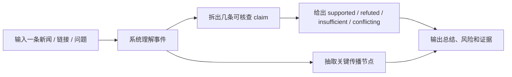
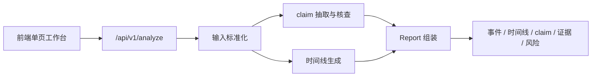

# 原始题意对照、当前完成度与演示策略

## 1. 这份文档解决什么问题

这份文档以 `rules/origin_problem_statement.md` 为唯一原始目标基线，不再从我们自己的 task 倒推“做了什么”，而是直接回答下面 5 个问题：

1. 题目真正要我们解决的是什么问题
2. 我们现在已经实现了哪些关键能力
3. 哪些能力还明显不够，不能过度宣称
4. 面试演示时应该怎么讲，才能让不懂技术的人也看懂
5. 我们离最终目标还有多远，下一步最难的部分是什么

## 2. 先把原始题意翻译成人话

题目本质上不是让我们做一个“新闻摘要器”，而是做一个“较真”的新闻观察员。

这位观察员收到一条新闻事件后，要完成两件核心事情：

1. **传播链还原**
   不是只给一个结论，而是尽量说明这条消息怎么发酵、什么时候出现关键转折、哪些节点最值得看。

2. **内容核查**
   不是只说“真”或“假”，而是要把文本拆开：哪些是事实、哪些是观点、哪些证据不足、哪些说法彼此冲突。

如果把题目用一句话讲给外行听，可以这么说：

> **输入一条新闻或一个传闻，系统会告诉你：这件事大概是怎么传播起来的、哪些说法站得住、哪些地方还不能下结论。**

## 3. 题目要求 vs 当前实现

## 3.1 核心要求对照表

| 原始要求 | 当前状态 | 现在怎么展示 | 当前缺口 |
| --- | --- | --- | --- |
| 输入一条新闻事件并进行分析 | 已实现 | 前端已支持文本 / URL / 问题输入；`POST /api/v1/analyze` 已联通 | URL 目前还是保守 fallback，正文抽取未接入 |
| 传播链还原 | 部分实现 | 页面已有时间线面板，稳定 demo 能展示 `origin / turn` 等节点 | 真实开放场景下的检索、去重、排序和完整传播链还原还没完成 |
| 内容核查 | 部分实现但可演示 | 已能输出 claim 表、verdict、evidence、风险提示和三档模式 | 很多 verdict 仍依赖规则/场景库，不是基于真实检索证据的完整核查 |
| 产品形态不限，但必须能 demo | 已实现 | 当前已有 Web 单页工作台，且有稳定本地 demo fallback | replay 资产和最终演示脚本仍未收口 |
| 关键实现要能讲清 | 已实现基础盘 | 已有前端、后端、contracts 的实现总结文档 | 还缺一份直接对照原题与评分标准的“总口径文档” |

## 3.2 如果按“面试官看到的效果”来分

当前项目最容易被看出来的已完成能力有：

- 已有可运行的 Web Demo，而不是只有脚本或方案图。
- 输入后能返回结构化结果，而不是单段自由文本。
- 页面能清楚展示事件摘要、时间线、claim、证据、风险和模式。
- 系统有 `complete / partial / safe_mode` 三档边界表达，不会一律装作“都查清了”。
- 当前代码结构、共享 schema、基础测试和实现文档都已经成型。

当前最容易被追问、也最容易暴露缺口的地方有：

- 传播链还原更多是“演示级 foundation”，还不是“真实新闻的完整传播追踪器”。
- verdict 和 evidence 目前仍偏规则驱动，而不是完整的真实检索驱动。
- URL 输入还没有真正抽正文。
- replay、最终 smoke checklist 和演示口播材料还不完整。

## 4. 现在这个产品，应该怎么讲给不懂的人听

## 4.1 最推荐的一句话介绍

> **这是一个新闻核查工作台。你给它一段新闻、一条链接或一个问题，它会把消息拆成几个可验证说法，告诉你哪些有证据、哪些还不能下结论，并把关键传播节点按时间线展示出来。**

## 4.2 最推荐的展示结构

对外行来说，这个图比直接讲模块名更有效，因为它只强调三件可见的事情：

- 系统先理解输入
- 然后分别做“说法核查”和“传播梳理”
- 最后把结果和边界一起展示出来

## 4.3 页面各区域该怎么解释

| 页面区域 | 给外行的解释方式 | 不要怎么讲 |
| --- | --- | --- |
| 输入区 | “你可以贴新闻正文、贴链接，或者直接问一个传闻问题。” | “这里支持多模态输入归一化。” |
| 状态条 | “系统会明确告诉你：这次是完整结果、部分结果，还是只能保守输出。” | “这是状态机和容错分支。” |
| 事件卡片 | “先用一句话告诉你这件事现在大概是什么情况。” | “这是事件对象序列化结果。” |
| 时间线 | “如果消息传播过程里有关键节点，这里会按时间展示出来。” | “这是 timeline builder 的输出。” |
| claim 表 | “系统会把混在一起的说法拆开，分别判断哪些站得住。” | “这是 claim extraction + verdict engine。” |
| 证据与风险 | “为什么这么判断，以及哪些地方还不能过度确信。” | “这是 evidence pool 和 risk synthesis。” |

## 5. 演示时到底应该怎么演

题目原始流程明确说：

- 40 分钟内
- 15 分钟产品介绍
- 15 分钟关键实现介绍
- 10 分钟 Q&A

所以不需要准备复杂 PPT，更适合按“产品 -> 实现 -> 边界”三段讲。

## 5.1 最稳的 15 分钟产品演示结构

### 第 1 段：30 秒先讲问题

可以直接说：

> 今天信息很多，但真假、观点、转述、补充、澄清混在一起。我们做的不是一个普通摘要器，而是一个“较真”的新闻观察员，重点做两件事：传播链还原 + 内容核查。

### 第 2 段：4 分钟演示 `complete_mode`

建议用：`expired-yogurt`

重点讲：

- 系统先总结事件
- 再把说法拆成多条 claim
- 给出 supported verdict 和高可信证据
- 时间线里能看到官方通报与企业回应这两个关键节点

这段的目标是让面试官先相信：

- 主流程是通的
- 页面不是假的
- 结果是结构化的

### 第 3 段：4 分钟演示 `partial_mode`

建议用：`chemical-odor`

重点讲：

- 有些消息不是“真/假”二选一，而是证据彼此冲突
- 系统会把冲突和边界显式展示出来，而不是硬判
- 这体现的是产品的可信边界，而不是功能不完整

这段很关键，因为它能体现“较真”的味道。

### 第 4 段：3 分钟演示 `safe_mode`

建议用：`morningstar-layoff`

重点讲：

- 如果只是一个传闻问题，且没有足够证据，系统不会装作已经查实
- 它会给出保守结论、风险提示和空时间线

这段能直接体现失败处理和边界意识，是评分里很加分的部分。

### 第 5 段：3 分钟讲“现在还没做完什么”

这一段不要回避，反而应该主动讲：

- 真实开放检索和完整传播链还原还在补
- URL 正文抽取还没接
- 当前很多稳定演示来自规则链路 + demo 基线 + fallback，而不是完全开放环境的自由发挥

如果这段讲得诚实，反而会让工程判断更可信。

## 5.2 15 分钟关键实现介绍，建议只讲 4 个点

只讲这 4 个点最稳：

1. 为什么用单页工作台
   因为演示路径最短，输入、状态、结果可以一次讲清。

2. 为什么做三档模式
   因为真实世界里经常不是“全查清”或“完全失败”两种情况。

3. 为什么现在是规则链路 + 可选 provider enrichment
   因为在有限时间里，要先保证可跑、可演示、可解释，再逐步补真实能力。

4. 为什么共享 schema 很重要
   因为前后端、demo payload、测试都要围绕同一套 `Report` 结构，不然演示一定漂。

## 6. 现在离目标还有多远

## 6.1 先给结论

如果按“**能不能做一场可信的复试演示**”来算，当前项目大概已经走到了 **70% 到 75%**。

如果按“**是否真正完成题目原始目标**，尤其是传播链还原 + 内容核查都在真实开放环境下成立”来算，当前整体大概在 **55% 到 65%**。

差异这么大的原因是：

- 演示层已经比较完整
- 但最难、最高权重的“真实传播链还原”仍未真正闭环

## 6.2 按维度估计完成度

| 维度 | 当前估计 | 依据 |
| --- | --- | --- |
| 产品演示与体验 | 75% | 已有单页 Demo、三档模式、稳定案例、边界提示 |
| 内容核查 | 70% | claim 表、verdict、evidence、风险已可展示，但仍偏规则和场景库驱动 |
| 传播链还原 | 40% | 有时间线面板、retrieval foundation、origin/turn 思路，但真实开放检索和完整传播链还原未闭环 |
| 工程与文档 | 70% | schema、前后端分层、实现总结、基础测试已具备，但 final README、smoke、replay 未收口 |
| AI 原生与可解释性 | 65% | provider enrichment、结构化输出、fallback 思路已有，但真实 Prompt 与异常治理的对外表达还可以更强 |

## 6.3 为什么“传播链还原”拖住整体进度

原题的两件核心事里，当前我们更接近“内容核查 Demo 可用”，而不是“传播链还原真正完成”。

这意味着：

- 即使页面已经很好看
- 即使 `analyze` 能返回结果
- 即使已有时间线

也还不能说我们已经完整解决了题目。

## 7. 接下来最难的部分是什么

## 7.1 最难的不是页面，也不是 schema

当前最难的部分是：

> **把“传播链还原”从 demo/foundation 级能力，推进成真实新闻可用的能力。**

## 7.2 为什么它最难

因为这件事不是一个点，而是 5 个问题绑在一起：

1. **检索难**
   同一事件可能有大量重复报道、转述、二次解读和无关噪声。

2. **去重归并难**
   不同来源可能标题不同、内容相近、发布时间接近，但其实说的是同一节点。

3. **时间线选择难**
   不是所有搜到的结果都该上时间线，要选出真正的 `origin / amplification / turn / clarification`。

4. **可信度判断难**
   传播链不是简单按时间排序，还要考虑来源等级、是否权威、是否只是转发。

5. **演示表达难**
   就算内部逻辑做出来了，也必须让外行一眼看懂“为什么选这几个节点”。

## 7.3 第二难的是“真实 evidence 驱动的核查”

当前很多 verdict 之所以稳定，是因为：

- 有场景库
- 有规则
- 有 demo payload

但如果进入真实开放输入，下一步难点会变成：

- evidence 从哪里来
- evidence 是否足够支持 claim
- 冲突证据如何排序和解释
- 什么时候该坚持 `insufficient`

## 7.4 相对没那么难，但必须补的部分

这些不是最难，但都是演示前必须补齐的：

- `C10` URL 正文抽取
- `F2 / F3 / F4 / F6` 按 eval 文件驱动的独立回归
- `F7` 演示前 smoke checklist
- `G5` 演示顺序与口播提纲
- `G6` 最终 README 收口

## 8. 现在最应该怎么排优先级

建议按这个顺序推进：

1. **先补 C10 + D5~D7 的真实能力缺口**
   因为这决定我们离原题核心目标还有多远。

2. **再补 F7 和最终回归**
   因为这决定演示会不会翻车。

3. **最后补 G5/G6 的表达和交付收口**
   因为这决定别人能不能快速看懂、信服并复现。

## 9. 对外表达时，什么该强调，什么不要过度宣称

应该强调：

- 我们已经做出一个可运行、可展示、可解释的新闻核查工作台
- 已经把输入、事件理解、claim 核查、时间线展示、风险提示串成闭环
- 已经有三档模式和保守 fallback，而不是只会展示“成功样例”

不要过度宣称：

- 不要说我们已经完成任意新闻的完整传播链还原
- 不要说 verdict 已经完全建立在真实互联网证据上
- 不要说 URL 输入已经稳定支持正文抓取

## 10. 一句话判断

当前项目已经足够支撑一场“有产品、有实现、有边界感”的演示，但还没有完全达到题目原始目标里的强版本；距离真正补齐原题，最大的难点仍然是真实传播链还原与真实 evidence 驱动核查。
