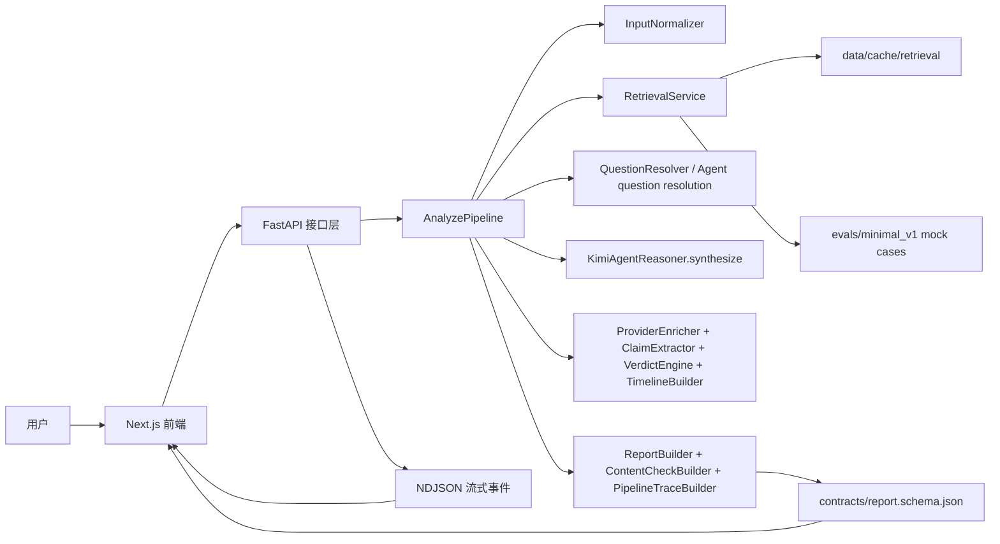
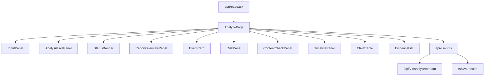
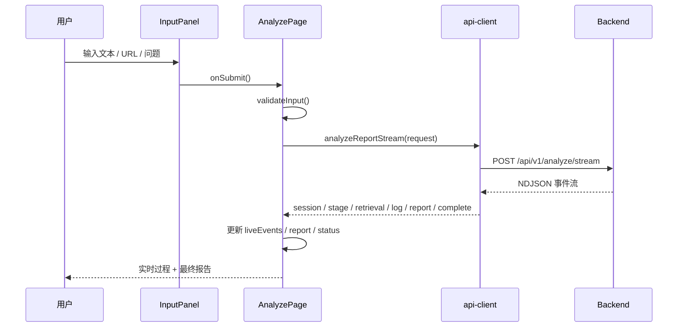
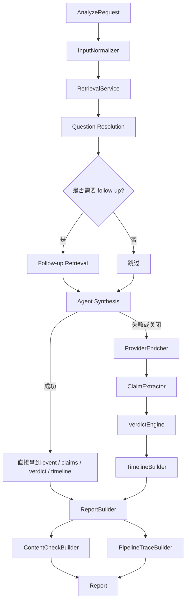
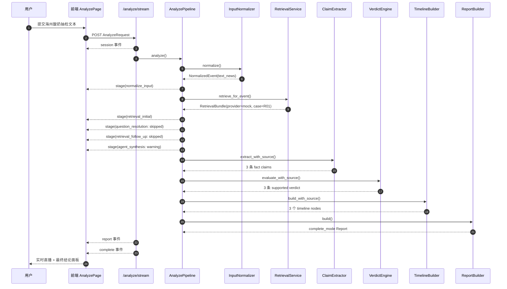

# 当前代码结构与项目架构说明

更新时间：2026-03-27（Asia/Shanghai）

这份文档只讲三件事：

1. 现在这套代码是怎么分层的。
2. 现在这个项目的主架构是怎么跑的。
3. 用一个真实能在当前代码里跑通的例子，把整条链路讲清楚。

---

## 1. 一句话先讲清楚

`rumor-checking` 现在是一套 **Next.js 单页前端 + FastAPI 后端 + 共享 Report 契约 + 可流式观测的分析流水线**。

它不是“前端调一个黑盒模型然后等答案”，而是：

- 前端负责输入、实时过程展示、结构化结果展示。
- 后端负责把输入拆成标准化事件、检索、消歧、判定、时间线和最终报告。
- `contracts/` 负责把前后端都要认的字段结构固定下来。
- `evals/` 和 `mock` 检索负责给这条链路提供稳定、可回归的样例。

---

## 2. 先看当前运行路径

项目现在同时存在两条运行路径：

| 路径 | 作用 | 关键开关 |
| --- | --- | --- |
| 稳定基线 | 联调、演示、回归测试 | `ANALYSIS_PROVIDER=off`、`RETRIEVAL_PROVIDER=mock`、`RETRIEVAL_FALLBACK_TO_MOCK=true` |
| 实时增强路径 | 接 Kimi 做联网检索和 agent 综合判断 | `ANALYSIS_PROVIDER=kimi`、`RETRIEVAL_PROVIDER=agent/kimi/gdelt` |

代码默认基线来自 [backend/.env.example](../backend/.env.example)，当前工作区的 `backend/.env` 又把本地运行切到了 Kimi/agent 路径。  
所以理解架构时要分两层看：

- **代码结构层**：始终是“输入标准化 -> 检索 -> 消歧 -> agent/规则判定 -> 报告组装”。
- **运行配置层**：只是决定“这一步走 mock 还是走真实 provider、agent 是否启用”。

下面这份说明主图会把两条分支都画出来。贯穿示例则使用稳定的 `off + mock` 路径，因为它最容易复现，也最符合当前仓库里的回归资产。

---

## 3. 仓库结构总览

```text
rumor-checking/
├─ backend/
│  ├─ app/
│  │  ├─ api/                # FastAPI 路由与接口入口
│  │  ├─ core/               # 配置、日志、异常
│  │  ├─ models/             # Pydantic 数据模型
│  │  └─ services/           # 真正的业务流水线与能力组件
│  ├─ tests/                 # 后端测试
│  └─ eval_regression_tests/ # 回归相关脚本
├─ frontend/
│  ├─ app/                   # Next.js 页面入口与全局样式
│  ├─ components/            # 页面编排与展示组件
│  ├─ lib/                   # API client、工具函数、demo case
│  └─ types/                 # 前端侧 Report 类型
├─ contracts/                # 前后端共享 schema
├─ docs/                     # 项目级说明文档
├─ evals/minimal_v1/         # mock 检索与最小回归用例
├─ data/cache/               # 运行期缓存
└─ README.md                 # 仓库总入口
```

### 3.1 各目录在当前架构里的角色

| 目录 | 当前职责 | 关键文件 |
| --- | --- | --- |
| [backend/app/api](../backend/app/api) | 定义 HTTP 接口与流式响应入口 | [backend/app/api/v1/endpoints/analyze.py](../backend/app/api/v1/endpoints/analyze.py) |
| [backend/app/core](../backend/app/core) | 读取配置、安装异常处理、配置日志 | [backend/app/core/config.py](../backend/app/core/config.py) |
| [backend/app/models](../backend/app/models) | 定义 `AnalyzeRequest`、`Report` 等结构 | [backend/app/models/schemas.py](../backend/app/models/schemas.py) |
| [backend/app/services](../backend/app/services) | 实现输入标准化、检索、判定、时间线、报告组装 | [backend/app/services/analyze_pipeline.py](../backend/app/services/analyze_pipeline.py) |
| [frontend/components](../frontend/components) | 把最终 `Report` 和流式事件拆成多个 UI 面板 | [frontend/components/analyze-page.tsx](../frontend/components/analyze-page.tsx) |
| [frontend/lib](../frontend/lib) | 前端请求后端、解析 NDJSON、整理展示逻辑 | [frontend/lib/api-client.ts](../frontend/lib/api-client.ts) |
| [contracts](../contracts) | 固定共享协议，避免前后端各说各话 | [contracts/report.schema.json](../contracts/report.schema.json) |
| [evals/minimal_v1](../evals/minimal_v1) | 提供 mock 检索和最小回归样例 | [evals/minimal_v1/retrieval_cases.json](../evals/minimal_v1/retrieval_cases.json) |
| [data/cache](../data/cache) | 存真实检索缓存，而不是把缓存散落在业务目录 | [data/README.md](../data/README.md) |

---

## 4. 项目总架构图



这张图里最重要的三个点是：

1. **后端主链路不在路由层，在 `AnalyzePipeline`。**
2. **检索和判定是分开的。**
3. **前端不是只拿最终 JSON，而是同时消费实时事件流和最终 `Report`。**

---

## 5. 前端架构

### 5.1 前端现在的定位

前端现在承担两个角色：

- 一个“输入工作台”
- 一个“执行过程直播台 + 报告展示台”

也就是说，前端不只是提交按钮，而是当前项目“可解释性”的一半。

### 5.2 前端核心文件

| 文件 | 当前职责 |
| --- | --- |
| [frontend/app/page.tsx](../frontend/app/page.tsx) | 页面入口，只挂载 `AnalyzePage` |
| [frontend/components/analyze-page.tsx](../frontend/components/analyze-page.tsx) | 页面主控制器，维护输入、状态、流式事件、报告结果 |
| [frontend/components/input-panel.tsx](../frontend/components/input-panel.tsx) | 输入区域和 demo case 选择 |
| [frontend/components/analysis-live-panel.tsx](../frontend/components/analysis-live-panel.tsx) | 渲染 NDJSON 事件流 |
| [frontend/lib/api-client.ts](../frontend/lib/api-client.ts) | 请求 `/health`、`/analyze`、`/analyze/stream`，并解析后端返回 |
| [frontend/lib/report-utils.ts](../frontend/lib/report-utils.ts) | 展示层二次整理，例如来源标签、得分解读、事件标题兜底 |
| [frontend/types/report.ts](../frontend/types/report.ts) | 前端侧 `Report`、`AnalysisLiveEvent` 类型定义 |

### 5.3 前端组件关系图



### 5.4 前端请求和渲染流程



前端这层最值得讲给面试官的点是：

- `AnalyzePage` 其实就是一个轻量状态机。
- `api-client.ts` 读的是 **NDJSON 流**，不是等到最后一次性读 JSON。
- `AnalysisLivePanel` 让后端每个阶段都能被用户看到。

---

## 6. 后端架构

### 6.1 后端分层

| 层级 | 当前职责 | 关键文件 |
| --- | --- | --- |
| 应用层 | 创建 FastAPI、挂中间件、挂路由 | [backend/app/main.py](../backend/app/main.py) |
| 接口层 | 提供同步分析与流式分析接口 | [backend/app/api/v1/endpoints/analyze.py](../backend/app/api/v1/endpoints/analyze.py) |
| 配置层 | 读取 `.env` / `.env.example` 对应的运行开关 | [backend/app/core/config.py](../backend/app/core/config.py) |
| 协议层 | 定义 `AnalyzeRequest`、`Report`、`PipelineTrace` | [backend/app/models/schemas.py](../backend/app/models/schemas.py) |
| 流水线层 | 串起所有业务步骤 | [backend/app/services/analyze_pipeline.py](../backend/app/services/analyze_pipeline.py) |
| 能力组件层 | 输入标准化、检索、判定、时间线、报告、内容核查 | [backend/app/services](../backend/app/services) |

### 6.2 后端主链路图



### 6.3 流式观测是怎么做的

这里有一个很关键但容易忽略的结构：

- [backend/app/api/v1/endpoints/analyze.py](../backend/app/api/v1/endpoints/analyze.py) 用线程包了一层 `AnalyzePipeline`
- [backend/app/services/progress.py](../backend/app/services/progress.py) 用 `ContextVar` 维护当前请求的回调
- `AnalyzePipeline` 和各服务调用 `emit_stage()`、`emit_log()`、`emit_api_call()`、`emit_retrieval()`
- 前端于是能持续收到 `stage / log / retrieval / report / complete` 等事件

这意味着：

- 流式接口不是把 LLM token 原样回传
- 它回传的是“流水线执行事件”

这正是当前项目和普通聊天页最大的架构区别之一。

### 6.4 核心服务职责表

| 服务 | 当前职责 | 说明 |
| --- | --- | --- |
| [backend/app/services/input_normalizer.py](../backend/app/services/input_normalizer.py) | 识别 `text / url / question`，抽取标题、摘要、关键词、来源 | URL 输入还会尝试正文抽取 |
| [backend/app/services/retrieval_service.py](../backend/app/services/retrieval_service.py) | 生成 query plan，决定走 mock / gdelt / kimi，做缓存与 fallback | 检索不是一条 query，而是一组 query |
| [backend/app/services/question_resolver.py](../backend/app/services/question_resolver.py) | 对问句做事件收束 | 只在 `question_only` 路径生效 |
| [backend/app/services/agent_reasoner.py](../backend/app/services/agent_reasoner.py) | 用 Kimi 做 question resolution 和 synthesis | 配置关闭时整段分支失效 |
| [backend/app/services/provider_enricher.py](../backend/app/services/provider_enricher.py) | 给事件补结构化标题/摘要/claim | 属于 fallback 链的一部分 |
| [backend/app/services/claim_extractor.py](../backend/app/services/claim_extractor.py) | 把一句话拆成原子 claim | 规则抽取是默认兜底 |
| [backend/app/services/verdict_engine.py](../backend/app/services/verdict_engine.py) | 给 claim 打 `supported/refuted/insufficient/conflicting` | 依据是 retrieval evidence |
| [backend/app/services/timeline_builder.py](../backend/app/services/timeline_builder.py) | 从检索结果挑时间线节点 | 形成 `origin / amplification / peak / turn / clarification` |
| [backend/app/services/report_builder.py](../backend/app/services/report_builder.py) | 组装最终 `Report`，决定 `safe/partial/complete` | 还负责 investigation 和评分 |
| [backend/app/services/content_check_builder.py](../backend/app/services/content_check_builder.py) | 生成“哪些更像真/假/争议/观点”视图 | 主要为了前端展示 |
| [backend/app/services/pipeline_trace_builder.py](../backend/app/services/pipeline_trace_builder.py) | 把流水线压缩成用户可读的步骤摘要 | 给前端结果区复盘用 |

---

## 7. 核心数据对象

当前代码最重要的四个对象如下：

| 对象 | 所在位置 | 作用 |
| --- | --- | --- |
| `AnalyzeRequest` | [backend/app/models/schemas.py](../backend/app/models/schemas.py) | 前端提交给后端的输入 |
| `NormalizedEvent` | [backend/app/models/schemas.py](../backend/app/models/schemas.py) | 后端内部使用的标准化事件草稿 |
| `RetrievalBundle` | [backend/app/services/retrieval_models.py](../backend/app/services/retrieval_models.py) | 一轮检索的聚合结果 |
| `Report` | [backend/app/models/schemas.py](../backend/app/models/schemas.py) | 前端最终消费的统一结构 |

### 7.1 `AnalyzeRequest`

```json
{
  "raw_input": "用户原始输入",
  "input_type": "text | url | question | auto",
  "request_context": {}
}
```

### 7.2 `NormalizedEvent`

后端会先把原始输入压成一个内部事件对象，大致包含：

- `title`
- `summary`
- `keywords`
- `source_name`
- `input_type`
- `mode_hint`
- `event_source`

这一步的价值是：**后面的检索、claim 提取、时间线构建都不再直接啃原始输入。**

### 7.3 `RetrievalBundle`

它不只是“搜索结果数组”，还包括：

- 实际 query
- provider 名称
- cache 状态
- 原始结果和去重后的 canonical 结果
- evidence grade
- fallback 信息

所以它是当前后端里最像“证据中台对象”的东西。

### 7.4 `Report`

最终 `Report` 是一个面向前端展示的聚合对象，至少包含：

- `mode`
- `event`
- `timeline`
- `claim_results`
- `final_summary`
- `risks`
- `sources`
- `retrieval_hits`
- `provenance`

并且还会带上：

- `content_check`
- `pipeline_trace`
- `investigation`
- `score_breakdown`

这也是为什么前端各个面板都只是“消费同一个 Report 的不同切片”。

---

## 8. 用一个真实例子把整条流程讲清楚

### 8.1 例子选型

这里用前端 demo case 里的“海州酸奶抽检”作为贯穿例子：

```text
海州市市场监管局通报称，海州新鲜屋部分酸奶批次超过保质期，涉事门店已停业整改。
```

原因有两个：

1. 它在当前仓库里有稳定 mock 检索数据。
2. 它能完整覆盖“输入标准化 -> 检索 -> claim -> verdict -> timeline -> report”的整条链路。

### 8.2 本例采用的运行配置

为了让例子稳定可复现，这里按默认稳定基线讲解：

```dotenv
ANALYSIS_PROVIDER=off
RETRIEVAL_PROVIDER=mock
RETRIEVAL_FALLBACK_TO_MOCK=true
RETRIEVAL_CACHE_ENABLED=false
```

这意味着本例会走：

- 不启用 Kimi synthesis
- 走 mock retrieval
- 走规则型 claim / verdict / timeline 链路

### 8.3 例子在当前代码里的实际中间结果

#### 第一步：输入标准化

`InputNormalizer` 会把输入整理成：

```json
{
  "input_type": "text_news",
  "title": "海州市市场监管局通报称，海州新鲜屋部分酸奶批次超过保质期",
  "summary": "海州市市场监管局通报称，海州新鲜屋部分酸奶批次超过保质期，涉事门店已停业整改。",
  "keywords": ["海州市市场监管局", "海州新鲜屋", "停业整改", "酸奶", "涉事门店已停业"],
  "source_name": "海州市市场监管局",
  "mode_hint": "complete_or_partial",
  "event_source": "input_normalized"
}
```

这一步的含义是：

- 输入已经被识别为“文本新闻”
- 后端已经拿到了标题、摘要、关键词
- 后面不是直接拿原句去判断，而是拿这个标准化结果继续跑

#### 第二步：生成 query plan 并做首轮检索

`RetrievalService` 针对这段文本生成了 3 条主要 query：

| query label | 实际 query 作用 |
| --- | --- |
| `event_core` | 用标题、摘要、关键词抓主结果 |
| `event_claim` | 收紧到更接近 claim 的表述 |
| `event_official` | 优先抓官方回应与权威结果 |

在 mock 路径里，这组 query 最终命中了回归样例 `R01`：

```json
{
  "provider": "mock",
  "matched_case_id": "R01",
  "mode_hint": "complete",
  "evidence_grade": "A",
  "canonical_results": 4,
  "high_trust_result_count": 3,
  "independent_source_count": 4
}
```

命中的典型结果包括：

- 海州市市场监管局通报
- 海州日报跟进报道
- 海州新鲜屋致歉说明
- 一条低可信自媒体“多人中毒”说法

这一步的意义是：**后面所有 verdict 和 timeline 都要建立在 `RetrievalBundle` 上，而不是建立在输入句子本身上。**

#### 第三步：问题消歧在本例里会跳过

因为本例是 `text_news`，不是 `question_only`，所以：

- `question_resolution` 跳过
- `retrieval_follow_up` 也跳过

这说明当前后端流水线是 **按输入类型分支** 的，不是每次都把所有步骤跑一遍。

#### 第四步：Agent synthesis 在本例里不会生效

因为本例配置了 `ANALYSIS_PROVIDER=off`，所以：

- `agent_synthesis` 会进入 warning/跳过式路径
- 后端退回规则兜底链路

这也是当前代码里一个很关键的架构特点：

- **流水线始终先保留 agent 分支的位置**
- **但默认稳定演示路径仍然依赖规则兜底保证可交付**

#### 第五步：Claim 抽取

`ClaimExtractor` 在本例里抽出了 3 条事实 claim：

```text
1. 海州市市场监管局通报称。
2. 海州新鲜屋部分酸奶批次超过保质期。
3. 酸奶已停业整改。
```

这里要注意，它抽出来的是“可判定的原子事实”，不是整段原文。

#### 第六步：Claim 判定

`VerdictEngine` 基于 `RetrievalBundle` 给这 3 条 claim 的结果都是：

| claim | verdict | confidence |
| --- | --- | --- |
| 海州市市场监管局通报称。 | `supported` | `high` |
| 海州新鲜屋部分酸奶批次超过保质期。 | `supported` | `high` |
| 酸奶已停业整改。 | `supported` | `high` |

对应证据来源是：

```json
{
  "evidence_source": "retrieval_mock",
  "evidence_grade": "A"
}
```

也就是说，这个例子不是“模型说是真的”，而是：

- 官方通报和主流媒体已经足够支撑核心 claim
- 所以规则引擎可以把它们判成 `supported`

#### 第七步：时间线构建

`TimelineBuilder` 为本例还原出了 3 个节点：

| 节点类型 | 节点内容 |
| --- | --- |
| `origin` | 海州市市场监管局通报海州新鲜屋整改情况 |
| `amplification` | 海州日报：海州新鲜屋两门店停售整改 |
| `turn` | 海州新鲜屋发布致歉说明 |

对应结果：

```json
{
  "source": "retrieval",
  "nodes": 3,
  "completeness": 65,
  "confidence": 92
}
```

这一步把“有证据”进一步提升为“证据之间有传播顺序和角色关系”。

#### 第八步：最终报告组装

`ReportBuilder` 最终给出的核心结果是：

```json
{
  "mode": "complete_mode",
  "overall_credibility_score": 87.4,
  "overall_credibility_label": "high_credibility",
  "provenance": {
    "source_type": "backend_mock",
    "claim_source": "rule",
    "evidence_source": "retrieval_mock",
    "timeline_source": "retrieval"
  }
}
```

最终总结语是：

> 已形成相对完整的公开证据链，当前更倾向于：海州市市场监管局通报称。

同时它还保留了一个重要风险提示：

> 当前结果来自 mock 数据或 mock 回退路径，不能当作真实联网核查结论。

这就是当前项目的设计取舍：

- 结果可以完整
- 但 provenance 也必须老实告诉你它是不是 mock

### 8.4 这条例子的完整时序图



### 8.5 这个例子能说明什么

这个例子把当前系统最核心的设计讲出来了：

1. **输入先标准化，再进入后续链路。**
2. **检索是流水线中枢，claim、verdict、timeline 都围绕它。**
3. **Agent 是可选增强，不是唯一依赖。**
4. **最终输出不是一段话，而是一份结构化 `Report`。**
5. **前端展示的不只是答案，还包括答案是怎么来的。**

---

## 9. 当前项目最适合怎么讲

如果你要向别人解释这个项目，最稳的表述是：

> 这是一个带执行过程可视化的谣言核查工作台。前端负责把一次分析过程完整展示出来，后端把输入加工成标准化事件，再做检索、消歧、claim 判定、时间线构建和报告组装。当前代码同时支持稳定 mock 基线和 Kimi 增强路径，但无论走哪条路径，最终都统一收敛到一份带 provenance 的 `Report`。

再压缩一点，可以直接说：

> 当前架构的关键词不是“大模型”，而是“结构化流水线 + 流式可观测 + 契约化输出”。 

---

## 10. 你看代码时的推荐阅读顺序

如果你要自己继续深入，推荐按这个顺序读：

1. [frontend/components/analyze-page.tsx](../frontend/components/analyze-page.tsx)
2. [frontend/lib/api-client.ts](../frontend/lib/api-client.ts)
3. [backend/app/api/v1/endpoints/analyze.py](../backend/app/api/v1/endpoints/analyze.py)
4. [backend/app/services/analyze_pipeline.py](../backend/app/services/analyze_pipeline.py)
5. [backend/app/services/input_normalizer.py](../backend/app/services/input_normalizer.py)
6. [backend/app/services/retrieval_service.py](../backend/app/services/retrieval_service.py)
7. [backend/app/services/claim_extractor.py](../backend/app/services/claim_extractor.py)
8. [backend/app/services/verdict_engine.py](../backend/app/services/verdict_engine.py)
9. [backend/app/services/timeline_builder.py](../backend/app/services/timeline_builder.py)
10. [backend/app/services/report_builder.py](../backend/app/services/report_builder.py)
11. [contracts/report.schema.json](../contracts/report.schema.json)

按这个顺序读，最容易把“页面怎么发请求”一路连到“报告是怎么长出来的”。
