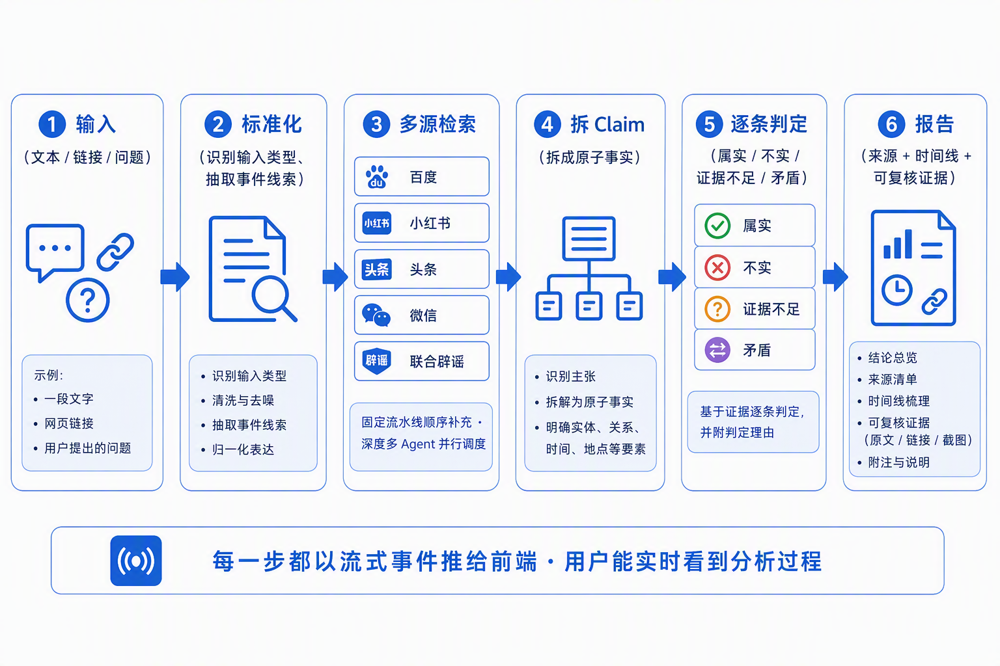
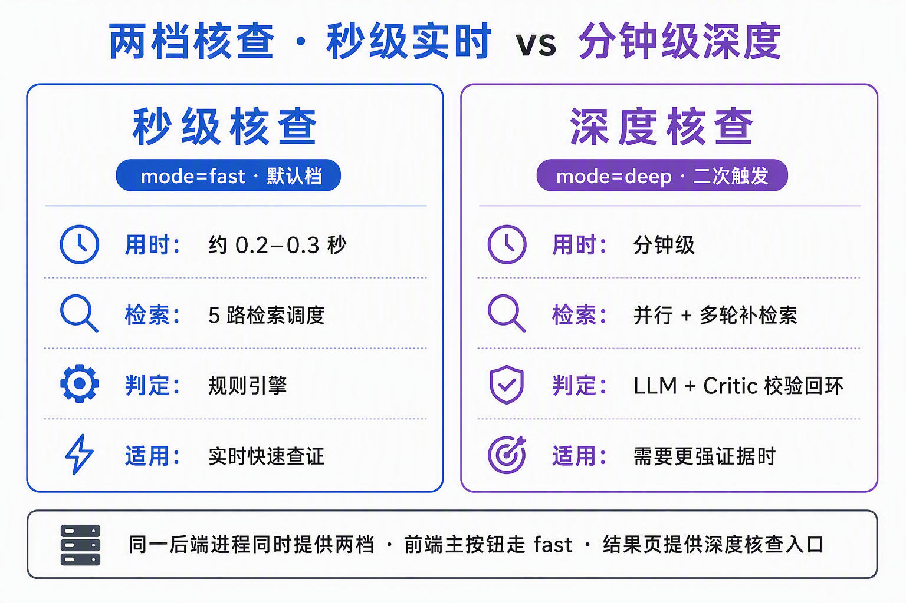
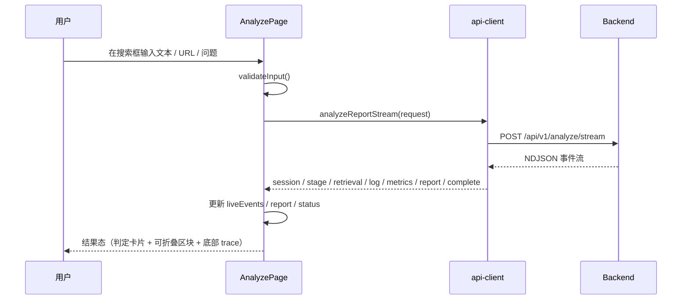
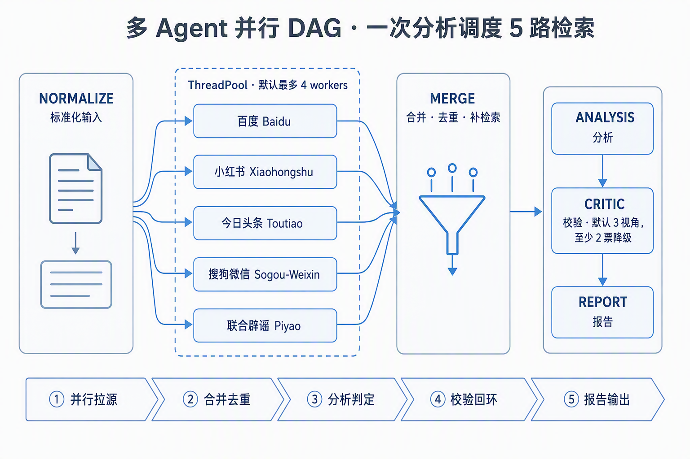
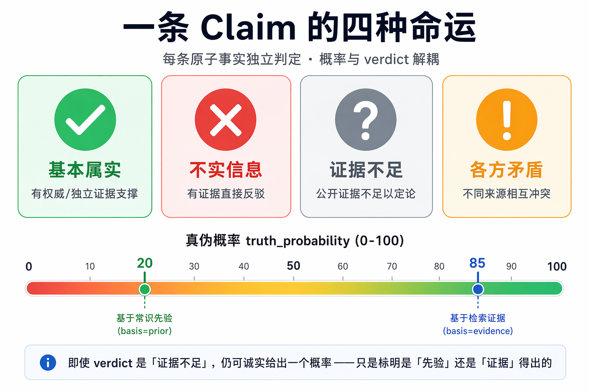
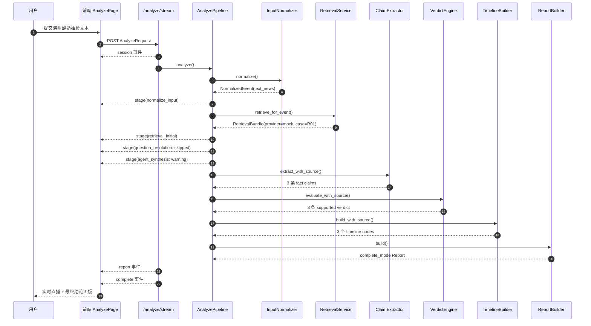

# 代码结构与架构详解

> 更新时间：2026-07-29（Asia/Shanghai）
> 
> 目的：把这套代码「怎么分层、怎么跑、每个模块干什么」讲清楚。所有链接和口径与当前主分支代码一致。

<p align="center">
  
</p>

---

## 目录

1. [一句话架构](#1-一句话架构)
2. [核查全流程](#2-核查全流程)
3. [仓库结构](#3-仓库结构)
4. [两档核查设计](#4-两档核查设计)
5. [前端架构](#5-前端架构)
6. [后端架构](#6-后端架构)
7. [多 Agent 并行编排](#7-多-agent-并行编排)
8. [核心数据对象](#8-核心数据对象)
9. [贯穿示例：一次真实分析的 8 步](#9-贯穿示例一次真实分析的-8-步)
10. [推荐阅读顺序](#10-推荐阅读顺序)

---

## 1. 一句话架构

`rumor-checking` 是一套 **Next.js 前端 + FastAPI 后端 + 共享 Report 契约 + 可流式观测的分析流水线**。它刻意**不是「前端调一个黑盒模型然后等答案」**：

- **前端**负责输入、实时过程展示、结构化结果展示
- **后端**负责把输入拆成标准化事件 → 检索 → 消歧 → 判定 → 时间线 → 最终报告
- **`contracts/`** 固定前后端共享的字段结构，避免各说各话
- **`evals/` + mock 检索**给整条链路提供稳定、可回归的样例

> **关键取舍**：架构的关键词不是「大模型」，而是「结构化流水线 + 流式可观测 + 契约化输出」。

---

## 2. 核查全流程

<p align="center">
  
</p>

后端主链路始终是这 6 步（不管深浅档）：

| # | 步骤 | 谁负责 | 关键输出 |
|---|---|---|---|
| 1 | **输入** | 前端 `SearchInput` | `AnalyzeRequest` |
| 2 | **标准化** | `InputNormalizer` | `NormalizedEvent`（标题、摘要、关键词、来源、input_type） |
| 3 | **并行检索** | `RetrievalService` / 多 Agent 4 路 | `RetrievalBundle`（canonical_results、grade） |
| 4 | **拆 Claim** | `ClaimExtractor` / LLM synthesis | 原子 fact/statement/opinion 列表 |
| 5 | **逐条判定** | `VerdictEngine` + LLM 补判 / Critic | 每条 `verdict + confidence + truth_probability + evidence` |
| 6 | **报告** | `ReportBuilder` + `PipelineTraceBuilder` | `Report`（前端消费） |

**每一步都以流式事件推给前端**（`emit_stage` / `emit_log` / `emit_retrieval` / `emit_api_call`），用户能实时看到当前进度、失败原因、每次 LLM 调用的问答（人类可读/原始 JSON 两个 tab）。

---

## 3. 仓库结构

```text
rumor-checking/
├─ backend/
│  ├─ app/
│  │  ├─ api/                # FastAPI 路由与接口入口
│  │  ├─ core/               # 配置、日志、异常
│  │  ├─ models/             # Pydantic 数据模型
│  │  ├─ agent/              # Agent 编排层（含 multi/ 多 Agent DAG）
│  │  ├─ agent_tools/        # 把 services 里的能力薄封装成工具
│  │  └─ services/           # 真正的业务流水线与能力组件
│  ├─ tests/                 # 后端测试（~540 用例）
│  └─ eval_regression_tests/ # 回归相关脚本
├─ frontend/
│  ├─ app/                   # Next.js 页面入口与全局样式
│  ├─ components/            # 页面编排与展示组件
│  ├─ lib/                   # API client、工具函数、demo case
│  └─ types/                 # 前端侧 Report 类型
├─ contracts/                # 前后端共享 schema
├─ docs/                     # 项目级说明文档
├─ evals/minimal_v1/         # mock 检索与最小回归用例
├─ data/cache/               # 运行期缓存
└─ README.md                 # 仓库总入口
```

**各目录职责**：

| 目录 | 职责 | 关键文件 |
|---|---|---|
| [backend/app/api](../backend/app/api) | HTTP 接口与流式响应入口 | [analyze.py](../backend/app/api/v1/endpoints/analyze.py) |
| [backend/app/core](../backend/app/core) | 读取配置、异常处理、日志 | [config.py](../backend/app/core/config.py) |
| [backend/app/models](../backend/app/models) | 定义 `AnalyzeRequest`、`Report` 等结构 | [schemas.py](../backend/app/models/schemas.py) |
| [backend/app/services](../backend/app/services) | 输入标准化、检索、判定、时间线、报告组装 | [analyze_pipeline.py](../backend/app/services/analyze_pipeline.py) |
| [backend/app/agent](../backend/app/agent) | Agent 编排（单 Agent + 多 Agent 层） | [runner.py](../backend/app/agent/runner.py) / [multi/supervisor.py](../backend/app/agent/multi/supervisor.py) |
| [frontend/components](../frontend/components) | 判定卡片、逐条核查、证据、时间线、trace 等展示 | [analyze-page.tsx](../frontend/components/analyze-page.tsx) |
| [frontend/lib](../frontend/lib) | 请求后端、解析 NDJSON、展示层整理 | [api-client.ts](../frontend/lib/api-client.ts) |
| [contracts](../contracts) | 固定共享协议 | [report.schema.json](../contracts/report.schema.json) |

---

## 4. 两档核查设计

<p align="center">
  
</p>

同一后端进程**同时提供两档**，不靠环境变量切换：

| 档位 | 触发 | 路径 | 时延 | 适用 |
|---|---|---|---|---|
| **`fast`**（默认） | `request_context.mode=fast` 或缺省 | 零 LLM 规则路径 + 真实检索 + 规则 verdict（可 LLM 补判） | ~0.2–0.3s | 真实用户当下就能用的秒级核查 |
| **`deep`** | `request_context.mode=deep` | LLM/agent 全链路（序列规划器、synthesis、critic、多 Agent 并行 DAG） | 几分钟级 | 需要更强判定时的异步深度核查 |

**为什么这样分档**：

- **fast** 保证「用户按下按钮 → 立刻看到结果」的体验，不阻塞在 LLM 上
- **deep** 是 fast 结果页的二次入口，用户觉得快档结论不够放心时才触发
- **同一套检索**：`mode` 只切换分析深度，检索 provider 始终由 `RETRIEVAL_PROVIDER` 决定

**运行选择三层可叠加**：

| 维度 | 稳定基线（默认） | 增强路径 | 关键开关 |
|---|---|---|---|
| 分析 provider | 规则兜底 | LLM 综合判断 | `ANALYSIS_PROVIDER=off\|kimi` |
| 检索 provider | mock | playwright / gdelt / LLM 内建联网 | `RETRIEVAL_PROVIDER=mock\|playwright\|gdelt\|kimi\|off` |
| 主编排 | 固定 pipeline | 可插拔 agent 循环 + 多 Agent DAG | `AGENT_ORCHESTRATOR_ENABLED` + `MULTI_AGENT_ENABLED` |

三个开关都默认取"稳定基线"一侧，所以**开箱即 `off + mock + 固定 pipeline`**，零 key、可复现、可回归。

---

## 5. 前端架构

### 5.1 定位

前端是**面向普通用户的核查产品**，不是内部工作台。它承担两件事：

- **搜索态**：像搜索引擎首页一样，居中输入框 + 几个示例卡片
- **结果态**：大号判定卡片打头 → 逐条核查（可展开看证据）→ 证据来源 → 传播时间线 → 底部执行 trace（默认折叠）

普通用户先看到一句话结论和判定色块，需要时再逐层展开细节；开发/调试信息不占主视线。

### 5.2 核心文件

`AnalyzePage` 只做状态机与编排（输入、流式事件、报告状态、两态切换），把每个展示区块交给独立组件：

| 文件 | 职责 |
|---|---|
| [analyze-page.tsx](../frontend/components/analyze-page.tsx) | **编排组件**：搜索态 / 结果态两个视图，维护输入、流式事件、报告状态 |
| [search-input.tsx](../frontend/components/search-input.tsx) | 搜索态：输入框 + 示例卡片 + 后端状态点 + 源开关 |
| [verdict-card.tsx](../frontend/components/verdict-card.tsx) | 结果态打头的整体判定卡片 |
| [claim-list.tsx](../frontend/components/claim-list.tsx) | 逐条核查（可折叠），每条带 verdict + 真伪概率 + `<details>判定依据`（含来源分级 + 相关性说明） |
| [evidence-list.tsx](../frontend/components/evidence-list.tsx) | 证据来源与未被引用的检索命中 |
| [possibilities-section.tsx](../frontend/components/possibilities-section.tsx) | 「可能性分布」与「更可能的答案」 |
| [timeline-section.tsx](../frontend/components/timeline-section.tsx) | 传播时间线（日期由后端从 SERP 真实抽取，不足时降级为「时间未知」） |
| [trace-timeline.tsx](../frontend/components/trace-timeline.tsx) | 底部执行过程 trace（默认折叠） |
| [run-metrics-panel.tsx](../frontend/components/run-metrics-panel.tsx) | 深度档观测面板：per-agent elapsed_ms、source_hits、tokens |
| [lib/api-client.ts](../frontend/lib/api-client.ts) | 请求 `/health`、`/models`、`/analyze`、`/analyze/stream`，解析 NDJSON |
| [lib/report-utils.ts](../frontend/lib/report-utils.ts) | 展示层二次整理：verdict 标签、置信度格式化、来源分级 meta |

### 5.3 请求与渲染时序


```mermaid
sequenceDiagram
    participant U as 用户
    participant A as AnalyzePage
    participant C as api-client
    participant B as Backend

    U->>A: 在搜索框输入文本 / URL / 问题
    A->>A: validateInput()
    A->>C: analyzeReportStream(request)
    C->>B: POST /api/v1/analyze/stream
    B-->>C: NDJSON 事件流
    C-->>A: session / stage / retrieval / log / metrics / report / complete
    A->>A: 更新 liveEvents / report / status
    A-->>U: 结果态（判定卡片 + 可折叠区块 + 底部 trace）
```

**要点**：

- `AnalyzePage` 是轻量状态机（搜索态/结果态两个视图），展示逻辑按职责拆给一组聚焦组件
- `api-client.ts` 读 **NDJSON 流**，不等最后一次性读 JSON；`parseLiveEvent` 对未知事件类型返回 `null`（前向兼容跳过），单行 JSON 坏了不会中止整个流
- **不伪造时间**：`published_at` 缺失时保持空字符串，让 UI 显示「时间未知」而不是 `new Date().toISOString()`

---

## 6. 后端架构

### 6.1 分层

| 层级 | 职责 | 关键文件 |
|---|---|---|
| 应用层 | 创建 FastAPI、挂中间件、挂路由 | [main.py](../backend/app/main.py) |
| 接口层 | 同步分析 + 流式分析接口 | [analyze.py](../backend/app/api/v1/endpoints/analyze.py) |
| 配置层 | 读取环境变量 | [config.py](../backend/app/core/config.py) |
| 协议层 | 定义 `AnalyzeRequest`、`Report`、`PipelineTrace` | [schemas.py](../backend/app/models/schemas.py) |
| 流水线层 | 串起所有业务步骤 | [analyze_pipeline.py](../backend/app/services/analyze_pipeline.py) |
| 编排层 | 单 Agent 循环 + 多 Agent DAG | [agent/runner.py](../backend/app/agent/runner.py) / [agent/multi/supervisor.py](../backend/app/agent/multi/supervisor.py) |
| 能力组件层 | 输入标准化、检索、判定、时间线、报告 | [services/](../backend/app/services/) |

### 6.2 核心服务职责表

| 服务 | 职责 |
|---|---|
| [input_normalizer.py](../backend/app/services/input_normalizer.py) | 识别 `text / url / question`，抽取标题/摘要/关键词/来源；URL 走正文抽取 |
| [retrieval_service.py](../backend/app/services/retrieval_service.py) | 生成 query plan，多 provider 调度，缓存与 fallback；**主体+事件双层相关性过滤** |
| [playwright_search_provider.py](../backend/app/services/playwright_search_provider.py) | httpx 抓百度/Bing SERP，**从 `prefix-time` span 真实抽取日期**（支持绝对/相对/中文三种格式） |
| [toutiao_search_provider.py](../backend/app/services/toutiao_search_provider.py) | 今日头条源（httpx SERP 抓取） |
| [sogou_weixin_provider.py](../backend/app/services/sogou_weixin_provider.py) | 搜狗微信公众号源，tier 判定基于 `source_name`（不受标题攻击） |
| [xhs_provider.py](../backend/app/services/xhs_provider.py) | 小红书源（走 xhs-cli） |
| [question_resolver.py](../backend/app/services/question_resolver.py) | 对问句做事件收束，只在 `question_only` 路径生效 |
| [agent_reasoner.py](../backend/app/services/agent_reasoner.py) | `LlmAgentReasoner`：LLM synthesis + critic + question resolution + 序列规划 |
| [claim_extractor.py](../backend/app/services/claim_extractor.py) | 把一句话拆成原子 claim |
| [verdict_engine.py](../backend/app/services/verdict_engine.py) | 给 claim 打 `supported/refuted/insufficient/conflicting` |
| [timeline_builder.py](../backend/app/services/timeline_builder.py) | 从检索结果挑 `origin / amplification / peak / turn / clarification` |
| [report_builder.py](../backend/app/services/report_builder.py) | 组装最终 `Report`，决定 `safe/partial/complete` mode |
| [content_check_builder.py](../backend/app/services/content_check_builder.py) | 生成"哪些更像真/假/争议/观点"视图 |
| [pipeline_trace_builder.py](../backend/app/services/pipeline_trace_builder.py) | 把流水线压缩成用户可读的步骤摘要 |
| [contract_utils.py](../backend/app/services/contract_utils.py) | 日期规范化：`ensure_datetime_string_or_empty` 用于 SOURCE 日期，**永远不 fallback 到 `datetime.now()`** |

### 6.3 流式观测怎么做

这是本项目和普通聊天页最大的架构区别：

- [api/v1/endpoints/analyze.py](../backend/app/api/v1/endpoints/analyze.py) 用线程包了一层 `AnalyzePipeline`
- [services/progress.py](../backend/app/services/progress.py) 用 `ContextVar` 维护当前请求的回调
- 各服务通过 `emit_stage()` / `emit_log()` / `emit_api_call()` / `emit_retrieval()` 打点
- 前端持续收到 `stage / log / retrieval / metrics / report / complete` 等事件

**流式接口不是把 LLM token 原样回传，回传的是「流水线执行事件」。**

⚠️ **重要坑**：`ThreadPoolExecutor.submit` 的 worker 拿不到父线程的 `ContextVars`，进而 `progress` 回调静默失效。多 Agent 层的 `Supervisor._execute_batch` 用 `copy_context().run()` 包装 worker 修复了这个问题。任何新加的并行 fan-out 必须遵守这个模式。

---

## 7. 多 Agent 并行编排

深度档 + `MULTI_AGENT_ENABLED=true` 会走一层 **Supervisor 多 Agent DAG**，把原来的串行检索改成并行拉源：

<p align="center">
  
</p>

### 7.1 触发条件

三个开关**都开**才走这条路：

```
deep_mode + AGENT_ORCHESTRATOR_ENABLED + MULTI_AGENT_ENABLED
```

任一未开 → 回退到「固定 pipeline」（`AnalyzePipeline`），行为不变。**入口在** `analyze_pipeline.py::_run_multi_agent`。

### 7.2 DAG 结构

```
NORMALIZE
    ├─→ RETRIEVAL_BAIDU     ┐
    ├─→ RETRIEVAL_XHS       │  4 路并行（ThreadPool）
    ├─→ RETRIEVAL_TOUTIAO   │
    └─→ RETRIEVAL_WEIXIN    ┘
                 ↓
           RETRIEVAL_MERGE   合并 · 去重 · 补检索
                 ↓
             ANALYSIS
                 ↓
              CRITIC          可选 N 路多视角并行
                 ↓
              REPORT
```

设 `MULTI_AGENT_RETRIEVAL_MODE=sequential` 时回退为单节点 `RETRIEVAL`（老链路）。

### 7.3 每个 Agent 一个文件

| 文件 | 角色 |
|---|---|
| [multi/__init__.py](../backend/app/agent/multi/__init__.py) | Protocol 定义（`AgentRole` / `AgentConfig` / `SubAgent` / `SubAgentResult`） |
| [multi/supervisor.py](../backend/app/agent/multi/supervisor.py) | 编排：拓扑排序、`_ready_agents`、`_execute_batch`、loop_back、`_emit_run_summary` |
| [multi/normalize_agent.py](../backend/app/agent/multi/normalize_agent.py) | 输入标准化 |
| [multi/source_agents.py](../backend/app/agent/multi/source_agents.py) | 工厂 `build_source_agents` + `SOURCE_ROLES`，4 个源共用同一个 `SourceRetrievalAgent` 类 |
| [multi/merge_agent.py](../backend/app/agent/multi/merge_agent.py) | 命名空间化 result_id (`baidu::…`)、`merge_search_results`、跑 resolve_question / follow_up / fetch_url |
| [multi/retrieval_agent.py](../backend/app/agent/multi/retrieval_agent.py) | sequential 模式的单体节点 |
| [multi/analysis_agent.py](../backend/app/agent/multi/analysis_agent.py) | 依赖参数化（`depends_on=RETRIEVAL_MERGE` 或 `RETRIEVAL`） |
| [multi/critic_agent.py](../backend/app/agent/multi/critic_agent.py) | 多视角并行 critic，只允许**下调**未被证据支撑的判定（单调安全） |
| [multi/report_agent.py](../backend/app/agent/multi/report_agent.py) | 组装最终报告 |

### 7.4 关键设计约束（都是踩过的坑）

| 约束 | 为什么 |
|---|---|
| Source agent 全部 `config.model=None` | `reasoner.model_override` 是全局态，多线程并发写会花，`_execute_batch` 会 assert |
| `TokenUsage.add` 加了 `threading.Lock` | 并发 LLM 回调会漏计数 |
| 单源失败 = `COMPLETED` + 空 bundle，不是 `FAILED` | 让 `MERGE` 继续跑；只有 `NORMALIZE` / `RETRIEVAL_MERGE` 是 critical |
| `pool.submit(copy_context().run, worker, ...)` | 不这么做，父线程的 `ContextVars` 不传播，观测事件静默失效 |
| Source 只用一个 `primary_query` | 跳过 3 次 LLM query-extract（百度还有自己的富 query plan） |
| 用户 toggle 关掉的源 → `SKIPPED` | `_ready_agents` 视同满足，MERGE 继续跑 |
| Loop back 至多一次 | 由 `supervisor_loop_back` 标记守护 |

### 7.5 观测入口

深度档结束时 `Supervisor._emit_run_summary` 会 emit 一个结构化 `metrics` 事件（per-agent `elapsed_ms` / `source_hits` / `tokens` / `mode`），前端 `RunMetricsPanel` 消费它。

### 7.6 单 Agent 循环（`AGENT_ORCHESTRATOR_ENABLED=true, MULTI_AGENT_ENABLED=false`）

在多 Agent 层之下还有一层单 Agent 编排（`AnalyzePipeline` 顶层的 planner 循环）：

- [agent/state.py](../backend/app/agent/state.py) — `AgentState` 黑板，字段对应固定 pipeline 里的中间产物
- [agent/planner.py](../backend/app/agent/planner.py) — `Planner` 协议 + `RulePlanner`（默认）/ `LlmPlanner`；`legal_actions(state)` 是排序的唯一真相源
- [agent/runner.py](../backend/app/agent/runner.py) — 主循环 `plan → tool → observe → decide → finalize`
- [agent_tools/tools.py](../backend/app/agent_tools/tools.py) — 把 `RetrievalService` / `VerdictEngine` / `ReportBuilder` 薄封装成工具

**Planner 可插拔**：
- `RulePlanner`（默认）：永远取第一个合法动作，复刻固定 pipeline，`off + mock` 上产出与旧链路**逐字节一致**的 `Report`
- `LlmPlanner`（配 LLM 时）：只在真实岔路口调用 LLM，序列规划器一次规划一串动作，失败退回单步决策，再失败退回规则

**多轮迭代 + Critic 保护**：
- 弱证据 claim 触发 `per_claim_search` → `re_judge_claims` 循环，`max_per_claim_iterations=3` 封顶
- 开 LLM 时 synthesis 结果经 `SYNTHESIS_CRITIC` 校验，**只能下调 `insufficient`、永不上调**
- `verdict_engine` 的 LLM 补判也只升级不降级，失败优雅退回规则结果

---

## 8. 核心数据对象

当前代码最重要的四个对象：

| 对象 | 位置 | 作用 |
|---|---|---|
| `AnalyzeRequest` | [schemas.py](../backend/app/models/schemas.py) | 前端提交给后端的输入 |
| `NormalizedEvent` | [schemas.py](../backend/app/models/schemas.py) | 后端内部使用的标准化事件草稿 |
| `RetrievalBundle` | [retrieval_models.py](../backend/app/services/retrieval_models.py) | 一轮检索的聚合结果 |
| `Report` | [schemas.py](../backend/app/models/schemas.py) | 前端最终消费的统一结构 |

### 8.1 `AnalyzeRequest`

```json
{
  "raw_input": "用户原始输入",
  "input_type": "text | url | question | auto",
  "request_context": { "mode": "fast|deep", "search_sources": ["baidu", "xhs", ...] }
}
```

### 8.2 `NormalizedEvent`

后端先把原始输入压成一个内部事件对象：`title` / `summary` / `keywords` / `source_name` / `input_type` / `mode_hint` / `event_source`。

**这一步的价值**：后面的检索、claim 提取、时间线构建都不再直接啃原始输入。

### 8.3 `RetrievalBundle`

不只是「搜索结果数组」，还包括：`query` / `provider` / `cache_status` / `raw_results` / `canonical_results` / `evidence_grade` / `conflict_signals` / `fallback` 信息。

**它是当前后端里最像「证据中台对象」的东西。**

### 8.4 `Report`

面向前端展示的聚合对象：

- **核心**：`mode` / `event` / `timeline` / `claim_results` / `final_summary` / `risks` / `sources` / `retrieval_hits` / `provenance`
- **展示辅助**：`content_check` / `pipeline_trace` / `investigation` / `score_breakdown` / `overall_credibility_score`

**前端各个面板都只是「消费同一个 Report 的不同切片」。**

### 8.5 判定四态 + 真伪概率

<p align="center">
  
</p>

| verdict | 含义 | 触发 |
|---|---|---|
| `supported` | 基本属实 | 有权威/独立证据支撑 |
| `refuted` | 不实信息 | 有证据直接反驳 |
| `insufficient` | 证据不足 | 公开证据不足以定论（grounded 兜底） |
| `conflicting` | 各方矛盾 | 不同来源相互冲突（含数量冲突） |

**真伪概率与 verdict 解耦**：`truth_probability`（0–100）+ `probability_basis`（`evidence` / `prior`）。一条 `insufficient` 的 claim 仍可带 `truth_probability=15, basis=prior`——诚实区分「有检索证据」vs「凭常识先验」。

---

## 9. 贯穿示例：一次真实分析的 8 步

用「海州酸奶抽检」demo case 走一遍。运行配置：默认稳定基线（`off + mock + 固定 pipeline`），零 key、可复现。

### Step 1 · 输入标准化

`InputNormalizer` 把输入压成 `NormalizedEvent`：

```json
{
  "input_type": "text_news",
  "title": "海州市市场监管局通报称，海州新鲜屋部分酸奶批次超过保质期",
  "summary": "海州市市场监管局通报称...涉事门店已停业整改。",
  "keywords": ["海州市市场监管局", "海州新鲜屋", "停业整改", "酸奶"],
  "source_name": "海州市市场监管局",
  "mode_hint": "complete_or_partial",
  "event_source": "input_normalized"
}
```

### Step 2 · 生成 query plan 并首轮检索

`RetrievalService` 生成 3 条 query：`event_core` / `event_claim` / `event_official`。命中回归样例 `R01`：

```json
{
  "provider": "mock", "matched_case_id": "R01",
  "canonical_results": 4, "evidence_grade": "A",
  "high_trust_result_count": 3, "independent_source_count": 4
}
```

命中的典型结果：海州市市场监管局通报 · 海州日报跟进 · 海州新鲜屋致歉 · 一条低可信自媒体"多人中毒"说法。

### Step 3 · Question resolution / follow-up 跳过

本例是 `text_news`，不是 `question_only` → `question_resolution` + `retrieval_follow_up` 都跳过。

**这说明**：流水线是**按输入类型分支**的，不是每次都把所有步骤跑一遍。

### Step 4 · Agent synthesis 跳过（配置了 `ANALYSIS_PROVIDER=off`）

`agent_synthesis` 进入 warning/跳过路径，后端退回**规则兜底链路**。

**架构特点**：流水线始终先保留 agent 分支的位置，但默认稳定演示路径依赖规则兜底保证可交付。

### Step 5 · Claim 抽取

`ClaimExtractor` 抽出 3 条事实：

```
1. 海州市市场监管局通报称。
2. 海州新鲜屋部分酸奶批次超过保质期。
3. 酸奶已停业整改。
```

**抽的是「可判定的原子事实」，不是整段原文。**

### Step 6 · Claim 判定

`VerdictEngine` 基于 `RetrievalBundle` 判定：

| claim | verdict | confidence |
|---|---|---|
| 海州市市场监管局通报称 | `supported` | `high` |
| 海州新鲜屋部分酸奶批次超过保质期 | `supported` | `high` |
| 酸奶已停业整改 | `supported` | `high` |

「模型说是真的」的不是模型——是**官方通报和主流媒体已经足够支撑核心 claim**，规则引擎才把它们判成 `supported`。

### Step 7 · 时间线构建

`TimelineBuilder` 还原出 3 个节点：

| 节点类型 | 节点内容 |
|---|---|
| `origin` | 海州市市场监管局通报海州新鲜屋整改情况 |
| `amplification` | 海州日报：海州新鲜屋两门店停售整改 |
| `turn` | 海州新鲜屋发布致歉说明 |

结果：`source=retrieval, nodes=3, completeness=65, confidence=92`。

「有证据」进一步提升为「证据之间有传播顺序和角色关系」。

### Step 8 · 最终报告组装

`ReportBuilder` 给出：

```json
{
  "mode": "complete_mode",
  "overall_credibility_score": 87.4,
  "overall_credibility_label": "high_credibility",
  "provenance": {
    "source_type": "backend_mock",
    "claim_source": "rule",
    "evidence_source": "retrieval_mock",
    "timeline_source": "retrieval"
  }
}
```

最终总结：

> 已形成相对完整的公开证据链，当前更倾向于：海州市市场监管局通报称。

**同时保留一个重要风险提示**：

> 当前结果来自 mock 数据或 mock 回退路径，不能当作真实联网核查结论。

**设计取舍**：结果可以完整，但 provenance 必须老实告诉你它是不是 mock。

### 9.1 完整时序图


```mermaid
sequenceDiagram
    autonumber
    participant U as 用户
    participant FE as 前端 AnalyzePage
    participant API as /analyze/stream
    participant PIPE as AnalyzePipeline
    participant N as InputNormalizer
    participant R as RetrievalService
    participant C as ClaimExtractor
    participant V as VerdictEngine
    participant T as TimelineBuilder
    participant B as ReportBuilder

    U->>FE: 提交海州酸奶抽检文本
    FE->>API: POST AnalyzeRequest
    API-->>FE: session 事件

    API->>PIPE: analyze()
    PIPE->>N: normalize()
    N-->>PIPE: NormalizedEvent(text_news)
    PIPE-->>FE: stage(normalize_input)

    PIPE->>R: retrieve_for_event()
    R-->>PIPE: RetrievalBundle(provider=mock, case=R01)
    PIPE-->>FE: stage(retrieval_initial)

    PIPE-->>FE: stage(question_resolution: skipped)
    PIPE-->>FE: stage(agent_synthesis: warning)

    PIPE->>C: extract_with_source()
    C-->>PIPE: 3 条 fact claims
    PIPE->>V: evaluate_with_source()
    V-->>PIPE: 3 条 supported verdict
    PIPE->>T: build_with_source()
    T-->>PIPE: 3 个 timeline nodes

    PIPE->>B: build()
    B-->>PIPE: complete_mode Report
    API-->>FE: report 事件
    API-->>FE: complete 事件
    FE-->>U: 实时直播 + 最终结论面板
```

### 9.2 这条例子能说明什么

1. **输入先标准化，再进入后续链路**
2. **检索是流水线中枢**，claim、verdict、timeline 都围绕它
3. **Agent 是可选增强，不是唯一依赖**
4. **最终输出不是一段话，而是一份结构化 `Report`**
5. **前端展示的不只是答案，还包括答案是怎么来的**

---

## 10. 推荐阅读顺序

按这个顺序读，最容易把"页面怎么发请求"一路连到"报告是怎么长出来的"：

1. [frontend/components/analyze-page.tsx](../frontend/components/analyze-page.tsx) — 编排与状态机
2. [frontend/lib/api-client.ts](../frontend/lib/api-client.ts) — NDJSON 流的解析
3. [backend/app/api/v1/endpoints/analyze.py](../backend/app/api/v1/endpoints/analyze.py) — 流式响应入口
4. [backend/app/services/analyze_pipeline.py](../backend/app/services/analyze_pipeline.py) — **主链路，先看这里**
5. [backend/app/services/input_normalizer.py](../backend/app/services/input_normalizer.py) — 输入标准化
6. [backend/app/services/retrieval_service.py](../backend/app/services/retrieval_service.py) — 检索调度 + 相关性过滤
7. [backend/app/services/playwright_search_provider.py](../backend/app/services/playwright_search_provider.py) — SERP 抓取 + 日期抽取
8. [backend/app/services/claim_extractor.py](../backend/app/services/claim_extractor.py) — Claim 拆分
9. [backend/app/services/verdict_engine.py](../backend/app/services/verdict_engine.py) — Verdict 判定
10. [backend/app/services/timeline_builder.py](../backend/app/services/timeline_builder.py) — 时间线还原
11. [backend/app/services/report_builder.py](../backend/app/services/report_builder.py) — 最终报告组装
12. [backend/app/agent/multi/supervisor.py](../backend/app/agent/multi/supervisor.py) — 多 Agent 并行 DAG
13. [contracts/report.schema.json](../contracts/report.schema.json) — 前后端契约

---

## 11. 事实边界与仲裁

已核验事实（当文档与代码冲突时，以本节和对应实现为准）：

- **公开 API 只有 4 个**：`GET /api/v1/health` · `GET /api/v1/models` · `POST /api/v1/analyze` · `POST /api/v1/analyze/stream`（没有 `demo-cases` / `replay`）
- **两档分析**：`request_context.mode="fast"`（零 LLM 规则路径，~0.2–0.3s）/ `"deep"`（LLM/agent 全链路）— 由 `backend/tests/test_api.py::test_fast_mode_skips_llm_enrichment_while_deep_mode_uses_it` 锁定
- **provenance 收敛**：`Report.provenance.source_type` 后端只输出 `backend_live` 或 `backend_mock`;前端缺失时保守落到 `unknown`（不是后端枚举）
- **Grounded verdict**：任何 `supported/refuted/conflicting` 必须带有效 `evidence_result_id`，否则降级 `insufficient`（`backend/tests/test_agent_grounded_verdict.py` 锁定）
- **LLM 补判 verdict**：`llm_judge_claims` 只从 insufficient 升级、**永不降级**，失败优雅退回规则结果
- **合成 critic 单调性**：`SYNTHESIS_CRITIC` 只能下调未被证据支撑的判定、永不上调（`backend/tests/test_synthesis_critic.py` 锁定）
- **概率与 verdict 解耦**：`truth_probability`(0–100) + `probability_basis`(`evidence`|`prior`);一条 `insufficient` 也能带 `prob=15, basis=prior`（`test_probability.py` 锁定）
- **SERP 日期真实抽取**：`playwright_search_provider` 从 Baidu `prefix-time` span 抽取，抽不到返回空串，**永远不伪造 `datetime.now()`**

## 12. 联网检索选型（历史决策记录）

当前推荐路径：**判定层走内部网关（不动） + 检索层用 `playwright`（httpx 抓百度/Bing）**。为什么不选其他方案：

| 备选 | 为什么不选 |
|---|---|
| 内部网关自带 web search | 网关只做 chat/completions 转发，物理上不带搜索工具 |
| DeepSeek 官方 API 联网 | 官方 API 不暴露联网能力（只有 App/网页版有），官方建议自接第三方搜索 |
| 智谱 GLM Web Search API | 中文覆盖好、按次计费低，是最强备选;当前 playwright 已够用暂未接入 |
| Kimi `$web_search` | 官方标注"功能升级中，近期不建议使用"，生产先排除 |
| Anthropic Claude web_search | 中文小众源覆盖存疑，且判定+联网绑定成本高 |
| GDELT | 英文偏向，中文热点覆盖弱，当下国内事件基本抓不到 |
| Tavily / Brave / Serper | 境外 API 中文小众源覆盖差，不适合中文核查主场 |

**核心区分**：`App/网页版"联网搜索"按钮 ≠ 官方 API 联网能力`;`内部判定网关 ≠ 厂商官方平台`。选型时反复踩这个坑。

**架构取向**：判定与检索解耦，判定模型可换（走 OpenAI 兼容 chat/completions），检索走独立 provider，两者独立演进。

---

<p align="center">
  <sub>用一句话总结当前架构：<b>结构化流水线 + 流式可观测 + 契约化输出</b></sub>
</p>
