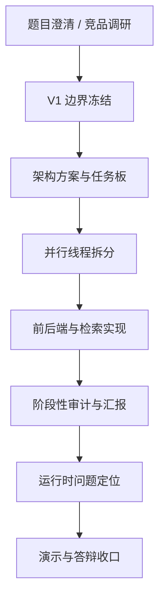

# `prompt-history.md` 优秀 Prompt 梳理与可复用模板

## 1. 先说结论

`prompt-history.md` 里最值得借鉴的，不是某一句“特别神”的 prompt，而是一套很稳定的 prompt 设计方法：

- 先定义线程角色
- 再绑定上下文来源
- 冻结目标和边界
- 明确约束与策略
- 指定产出文件
- 最后给出交接建议

这让 prompt 不只是“让 AI 写点东西”，而是变成了产品设计、工程拆解、文档沉淀和协作交接的统一接口。


## 2. `prompt-history.md` 好在哪里

| 优点 | 在日志中的体现 | 为什么有效 | 你对外可以怎么讲 |
| --- | --- | --- | --- |
| 目标很具体 | 几乎每条都写清“本线程目标” | AI 不会只做泛泛总结，而会围绕明确结果收敛 | 我们不是让 AI 随便发挥，而是把每轮任务定义成一个明确问题 |
| 上下文锚定很强 | 每条都列出 `上下文来源` 文件 | AI 输出更贴近当前仓库，而不是脱离项目乱推 | 我们要求 AI 先读哪些文件，再工作，保证输出贴着项目真实状态 |
| 约束写在前面 | 常见约束包括 V1 边界、不能串线、不要夸大能力、保留 fallback | AI 更容易做对事，也更不容易越界 | 我们把限制条件也写进 prompt，让 AI 带着边界工作 |
| 强产物导向 | 大量条目都明确 `产出与落点 (Artifacts)` | 输出直接沉淀到仓库，不停留在聊天里 | 我们要求每次 prompt 最终落到文档、代码或任务板里 |
| 适合并行协作 | 多数条目都带 `线程标识`、`窗口职责`、`交接建议` | 可以把任务安全分给不同窗口 | 这套 prompt 体系本质上支持多线程协作，而不是单次问答 |
| 强调真实边界 | 多次强调 “不能夸大当前能力”“mock 不等于真实 reasoning” | 有助于产品表达可信，不会 demo 漂移 | 我们会用 prompt 主动约束 AI 诚实描述已实现与未实现能力 |
| 能做阶段复盘 | 有很多 audit、report、status、gap analysis 类型条目 | 方便持续修正文档、任务和演示口径 | prompt 不只用来生成功能，也用来做过程管理和风险审计 |

## 3. 一图看懂这套 Prompt 是怎么支撑产品设计的



这张图能说明一个关键点：这里的 prompt 不是零散的，而是贯穿了产品从“理解问题”到“最后对外表达”的全过程。

## 4. 最值得拿出来讲的代表性 Prompt

下面这些条目最适合你在讲产品和讲设计过程时引用。

| 日期 | 类型 | 原始任务摘要 | 借鉴价值 | 适合你怎么讲 |
| --- | --- | --- | --- | --- |
| `2026-03-13 11:25` | 竞品研究型 | 调研腾讯新闻“较真AI”等同类产品，并反推自己的设计目标 | 不是为了抄竞品，而是为了通过外部参照收敛产品边界 | 我先用 prompt 做竞品与开源研究，再反推出我们自己的目标定义 |
| `2026-03-13 15:53` | V1 边界冻结型 | 基于现有 overview 和分析文档，做一版尽量零额外 key 的 V1 蓝图 | 非常适合说明“先收边界，再谈实现” | 我们先用 prompt 冻结 V1 最小闭环，避免一开始就做成大而散的系统 |
| `2026-03-13 17:12` | 并行拆解型 | 把 V1 task board 细化成可并行的 cluster，并给每个分工命名 | 很强的工程组织能力，不是简单列 Todo | 我把 prompt 用来拆并行任务，明确 owner、依赖和不该做的事 |
| `2026-03-13 18:53` | 模块实现型 | 让前端窗口实现单页壳，并补文件级交接记录 | 体现“实现 + 文档 + 交接”一体化 | 对我来说 prompt 不只是写页面，还要求形成可交接的工程记录 |
| `2026-03-13 20:41` | 设计说明型 | 为前端实现补一份图文并茂的设计总结 | 适合讲“为什么这样设计”，而不是只讲做了什么 | 我会用 prompt 让 AI 把实现过程反向整理成他人可读的设计文档 |
| `2026-03-13 23:11` | 接入真实能力型 | 把项目从“支持 Kimi provider”推进到“用户可安全提供 key 并最小联调” | 很适合讲“从原型到真实能力接入”的过程 | 我们不是停在 mock，而是用 prompt 逐步把真实 provider 接进来 |
| `2026-03-14 00:12` | 阶段审计型 | 把任务盘点整理成图文并茂的阶段报告，明确还缺哪些子任务 | 体现 prompt 在项目管理上的价值 | 我会定期用 prompt 做阶段审计，而不是等项目失控后再回头梳理 |
| `2026-03-14 16:20` | 真实检索实现型 | 继续推进“上网找证据再判断”，补真实检索、缓存和时间线 | 这是产品核心能力闭环的重要例子 | 在产品核心链路上，我会把 prompt 写成“真实能力 + fallback + 测试”三件事同时交付 |
| `2026-03-14 22:56` | 调试诊断型 | 定位为什么某条新闻被打成 `safe_mode + unknown`，没有走联网路径 | 很适合讲 AI 不是只会“生成”，也能做工程诊断 | 我也用 prompt 做运行时问题定位，先复现，再看代码和配置，最后解释根因 |
| `2026-03-15` | 总控规划型 | 基于多线程/多角色思路，做最终执行计划和总任务进度表 | 最适合展示你的系统化设计能力 | 到后期我会用 prompt 做总控规划，让不同线程围绕统一执行板推进 |

### 4.1 例子一：先做竞品研究，不是先做功能

> `2026-03-13 11:25`
>
> 原始指令摘要：调研 GitHub 和各大公司是否有与题目类似的实现，重点包括腾讯新闻“较真AI”等产品，列举并分析对比这些产品，进而反推出我们自己的设计目标。

这个例子好的地方，在于它问的不是“给我列几个竞品”，而是“先研究外部世界，再反推自己的产品目标”。

| 拆解点 | 这个例子里怎么体现 | 为什么值得讲 |
| --- | --- | --- |
| 问题定义 | 不是找资料，而是反推设计目标 | 说明你用 prompt 做产品定义，而不是只做信息收集 |
| 分析框架 | 按媒体产品、平台工具、研究型开源、数据底座四类拆解 | 说明你的调研是带方法的 |
| 判断维度 | 传播链、claim 核查、证据透明度、工程可落地性 | 这些维度后来会直接影响你的产品设计 |
| 产出方式 | 最后沉淀进 `requirements` 文档 | 说明调研结果进入了工程资产，而不是停在聊天里 |

你可以这样讲这个例子：

我一开始没有让 AI 直接帮我设计页面或写代码，而是先让它分析腾讯“较真AI”和相关开源实现。关键不是“谁做过”，而是“他们做到哪一步、哪些能力值得做进 V1、哪些能力暂时不做”。这个 prompt 帮我把产品目标先收敛了。

### 4.2 例子二：先冻结 V1 边界，再开始实现

> `2026-03-13 15:53`
>
> 原始指令摘要：基于现有 overview 和最小可行方案，制定一版 V1 文档，要求除大模型 API key 调用外尽量做到零额外 key，并将文档与现有分析文档全部关联起来。

这是一个非常典型的“边界型 prompt”。

| 拆解点 | 这个例子里怎么体现 | 为什么值得讲 |
| --- | --- | --- |
| 上下文很强 | 一次性绑定了多份 `overview/` 和 `requirements/analysis/` 文档 | 说明 prompt 不是凭空生成，而是读取项目积累 |
| 约束很硬 | `V1` 先保证最小闭环，尽量零额外 key，不能扩 scope | 说明你在控制复杂度 |
| 输出很实 | 不是泛泛方案，而是 `overview/03_v1_zero_key_blueprint.md` | 说明 prompt 直接产出执行蓝图 |
| 交接清晰 | 后续交给 `T-main` 冻结边界，再交给实现线程落代码 | 说明 prompt 为后续协作服务 |

你可以这样讲这个例子：

在真正动手前，我专门设计过一个 prompt 去冻结 V1 边界。因为新闻核查这个题目很容易越做越大，所以我要求 AI 基于已有分析文档，明确第一版到底做什么、不做什么、哪些能力暂时不能依赖更多外部 key。这个 prompt 的作用不是“生成文档”，而是帮我锁住范围。

### 4.3 例子三：把任务拆成可并行执行的 cluster

> `2026-03-13 17:12`
>
> 原始指令摘要：进一步细化当前 V1 的并行方案，要求把能并行的前后端任务拆得更细，并为每个分工方案起明确名字，方便直接分配给不同窗口或集群执行。

这是最能体现“prompt 被拿来做工程组织”的例子之一。

| 拆解点 | 这个例子里怎么体现 | 为什么值得讲 |
| --- | --- | --- |
| 目标明确 | 从里程碑级 task 变成可派发的工作包 | AI 不只是列 Todo，而是在做工程分工 |
| 约束清楚 | schema 单一 owner、前端不等后端、测试尽量解耦 | 这是典型的并行协作边界设计 |
| 输出结果 | cluster、阶段波次、启动条件、依赖关系、不该做的事 | 输出可直接拿来分发线程 |
| 实际价值 | 降低多窗口协作时的冲突成本 | 说明 prompt 在解决真实研发问题 |

你可以这样讲这个例子：

我不是只让 AI 帮我列一个开发清单，而是让它把任务拆成真正可以并行推进的 cluster。比如哪些模块可以独立开工、哪些文件只能有单一 owner、前端是否要等真实后端、测试能不能独立推进。这种 prompt 很像一个项目经理和架构师混合在工作。

### 4.4 例子四：实现 prompt 也要带交接文档

> `2026-03-13 18:53`
>
> 原始指令摘要：窗口 5 负责 `T-impl-web`，先实现 `Cluster-E / Experience Shell` 的前端单页壳；随后用户要求在继续后续任务前，对目前修改过的代码补一份详细文件记录。

这个例子重要在于，它不是单纯要求“把前端做出来”，而是要求“实现 + 记录 + 可交接”一起完成。

| 拆解点 | 这个例子里怎么体现 | 为什么值得讲 |
| --- | --- | --- |
| 目标范围 | 输入区、状态条、事件概览、时间线、claim 表、证据列表 | 输出不是抽象页面，而是具体模块清单 |
| 工程约束 | 三档模式必须区分，失败时不能伪装完整结果，Node 18 兼容 | prompt 带着技术边界和运行边界 |
| 策略设计 | 先补 contracts，再补 demo payload，再做页面和样式 | 实现顺序是被设计过的 |
| 产出落点 | 代码文件之外，还要求补 `frontend/FILE_RECORD.md` | 说明你把“可交接”也写进 prompt |

你可以这样讲这个例子：

我在写实现类 prompt 的时候，不会只写“把这个页面做出来”。我会要求它连同 schema、mock 数据、类型层、组件层和文件级交接记录一起完成。这样后面接手的人不是只看到代码，而是能知道为什么这么设计、接口怎么对、接下来该从哪里继续。

### 4.5 例子五：从 mock 走向真实能力接入

> `2026-03-13 23:11`
>
> 原始指令摘要：用户以 `[log]` 方式说明希望提供自己的 Kimi key，让当前项目真正走真实大模型 provider 路径，以便继续完善“较真”新闻应用的能力和完成度。

这个例子很适合你讲“项目不是停在原型层”。

| 拆解点 | 这个例子里怎么体现 | 为什么值得讲 |
| --- | --- | --- |
| 目标变化 | 从“代码支持 provider”推进到“用户可安全启用 provider” | 这是从代码能力到可用能力的跨越 |
| 关键约束 | 先登记 task，再补 `.env` 自动加载，再补 README，再跑测试 | 说明接入真实能力时也保持工程纪律 |
| 输出落点 | `config.py`、`.env.example`、`backend/README.md`、task 文档 | 这不是一句配置说明，而是完整接入路径 |
| 后续安排 | 用户写入真实 `KIMI_API_KEY` 后再做在线联调和质量调优 | 说明 prompt 还管下一步路线 |

你可以这样讲这个例子：

我会专门用 prompt 去推进“真实能力接入”这种事情。比如这里不是一句“接下 Kimi API”，而是要求 AI 先让配置路径正确、文档说明清楚、启动方式完整、测试不被破坏。这样 mock 能力才会真正变成可用能力。

### 4.6 例子六：核心链路要同时考虑真实能力、fallback 和测试

> `2026-03-14 16:20`
>
> 原始指令摘要：用户要求继续推进“上网找证据再判断”的后端能力，确认这条线没有别的线程在做后，按 `D5 ~ D7` 把真实检索、缓存和时间线能力补成可交付状态。

这是你讲“产品核心能力是怎么被设计和推进的”时最好的一个例子。

| 拆解点 | 这个例子里怎么体现 | 为什么值得讲 |
| --- | --- | --- |
| 能力定义 | 真实公开来源检索 + 本地缓存 + 可解释时间线 | 不是一句“联网搜索”，而是完整能力链路 |
| 风险控制 | 必须保留 analyze 主链路 fallback，不重写前端，不重做主 API | 说明 prompt 有边界感 |
| 技术路径 | 选 GDELT 作为最小真实检索入口，串到 `AnalyzePipeline` | 这是有现实落地性的方案 |
| 验证闭环 | 日志里给出 `pytest backend/tests -q` 通过 `26 passed` | 说明 prompt 输出是可验证的，不是口头完成 |

你可以这样讲这个例子：

在产品最核心的“上网找证据再判断”链路上，我会把 prompt 写成三件事必须同时满足：第一是真实能力要接上，第二是失败时要能安全降级，第三是必须有测试证明没有把主链打坏。这个例子很能体现我是怎么把 prompt 用到工程主链里的。

### 4.7 例子七：阶段审计 prompt 用来防止“看起来能跑”

> `2026-03-14 00:12`
>
> 原始指令摘要：用户要求把刚才的任务盘点整理成一份阶段性报告，要求图文并茂，并明确列出对 task 任务做了哪些分析和修改，以及各 task 下目前仍未完成的子任务。

这个例子体现的是：prompt 不只是拿来生成新东西，也可以拿来审视项目现状。

| 拆解点 | 这个例子里怎么体现 | 为什么值得讲 |
| --- | --- | --- |
| 核心问题 | “真实 analyze” 与 “demo/fallback” 容易混淆 | 这是很多 AI 项目最容易自欺的地方 |
| 审计目标 | 给团队或评审一眼看懂当前完成度和关键短板 | 说明你在控制口径一致性 |
| 报告结构 | Mermaid 图、状态表、任务修改记录、未完成清单 | 这是面向协作和汇报的文档设计 |
| 分发价值 | 可直接作为下一波并行窗口的主控材料 | 报告不是留档，而是继续驱动执行 |

你可以这样讲这个例子：

项目进入中期以后，我会专门用 prompt 去做阶段审计，因为 AI 项目很容易出现“页面能跑起来，但核心能力其实还是 mock 或 fallback”的错觉。这个 prompt 的价值就在于把“能演示”和“真实现”明确拆开。

### 4.8 例子八：运行时问题要用 prompt 做根因定位

> `2026-03-14 22:56`
>
> 原始指令摘要：用户指出“最近有个女网红脑出血死了真的假的？”在当前项目里被展示成 `safe_mode + unknown`，要求解释为什么没有上网查询或调用 Kimi web search 来判断真伪。

这是最具体、最像真实线上问题处理的一个例子。

| 拆解点 | 这个例子里怎么体现 | 为什么值得讲 |
| --- | --- | --- |
| 输入很真实 | 用户直接丢了一个模糊传闻问题 | 很接近实际使用场景 |
| 定位步骤 | 先复现，再看前后端代码和日志，再重启后端区分旧实例问题与主链问题 | 这是标准的工程排障路径 |
| 根因输出 | 旧后端实例、`KimiProvider` 超时、`.env` 未设置 `RETRIEVAL_PROVIDER=gdelt` | 结果足够具体，不是泛泛而谈 |
| 实际价值 | 不只是解释“为什么错”，还说明下一步怎么修 | 这类 prompt 非常适合拿来展示工程成熟度 |

你可以这样讲这个例子：

我也会用 prompt 做运行时问题定位。比如用户问一个很模糊的新闻传闻，系统为什么没有联网查证、为什么落到了 `safe_mode`，我不是让 AI 猜，而是让它先复现、再看当前运行实例、再看配置和日志，最后给出具体根因。这个例子能很好地说明 prompt 也在帮我做工程调试，而不只是写文档。

### 4.9 如果你只挑 3 个案例讲，建议选这三个

| 场景 | 最推荐讲的例子 | 原因 |
| --- | --- | --- |
| 讲产品怎么定义出来 | `2026-03-13 11:25` + `2026-03-13 15:53` | 一个负责看外部世界，一个负责冻结内部边界 |
| 讲设计过程怎么推进 | `2026-03-13 17:12` + `2026-03-13 18:53` | 一个体现任务拆解，一个体现实现与交接 |
| 讲项目如何接近真实落地 | `2026-03-14 16:20` + `2026-03-14 22:56` | 一个体现核心能力落地，一个体现真实问题定位 |

## 5. 哪些 Prompt 最值得你在答辩里重点提

如果你时间有限，建议优先讲下面四类：

| 优先级 | Prompt 类型 | 为什么最值得讲 | 代表条目 |
| --- | --- | --- | --- |
| `P1` | 产品边界定义 | 最能体现你不是“先写代码”，而是先定义问题 | `2026-03-13 11:25`、`2026-03-13 15:53` |
| `P1` | 并行工程拆解 | 最能体现你把 AI 用在真实研发协作里 | `2026-03-13 17:12`、`2026-03-15` |
| `P1` | 核心能力落地 | 最能体现产品不是 PPT，而是真的在补主链能力 | `2026-03-13 23:11`、`2026-03-14 16:20` |
| `P1` | 审计与调试 | 最能体现你对真实边界和风险有控制 | `2026-03-14 00:12`、`2026-03-14 22:56` |

## 6. 这些 Prompt 的共同骨架

这是整份 `prompt-history.md` 最值得借鉴的地方。你以后自己写 prompt，也可以按这个结构走。

```text
你现在是 [线程角色 / 模块负责人]。

请基于以下上下文来源完成任务：
- [文件 A]
- [文件 B]
- [文件 C]

任务目标：
[明确说明这轮要解决什么问题，最后要得到什么结果]

已知约束：
- [约束 1]
- [约束 2]
- [约束 3]

执行策略：
1. 先确认当前已有实现/文档状态
2. 再补缺失部分
3. 最后把结果沉淀到指定文件并说明验证结果

产出要求：
- 落到哪些文件
- 哪些地方不能改
- 是否需要图、表格、测试或交接说明

完成后补充：
- 验证结果
- 下一步交接建议
```

一句话概括就是：

> 好 prompt 不是“写得华丽”，而是“让 AI 能在真实项目里接得住、做得完、交得出去”。

## 7. 可直接借鉴的 Prompt 模板

下面这些模板是从 `prompt-history.md` 里抽出来的，可直接改项目名和文件名后复用。

### 7.1 产品定位与竞品收敛模板

```text
请基于当前项目需求，调研与 [项目主题] 最接近的产品、开源项目或研究实现，优先参考官方页面、官方文档和仓库。

我的目标不是简单罗列竞品，而是回答三件事：
1. 市面上已经做到什么程度
2. 我们的产品应该把边界收在哪里
3. 哪些能力适合做成 V1，哪些应该后置

请按“产品形态、核心能力、证据透明度、工程可落地性、可演示性”做对比，最后反推出我们的设计目标，并把结论沉淀成一个 Markdown 文档。
```

### 7.2 V1 边界冻结模板

```text
请基于当前仓库已有文档，制定一版 [项目名] 的 V1 蓝图。

要求：
- 优先保证最小闭环
- 明确做什么、不做什么
- 明确页面骨架、后端链路、输入输出 schema
- 尽量减少额外依赖、额外 key 和重型能力
- 文档要能直接指导后续实现，而不是停留在概念层

请输出图文并茂的 Markdown 文档，并说明后续最合理的实现顺序。
```

### 7.3 并行任务拆解模板

```text
请把当前项目拆成可并行执行的工作包，每个工作包都要有：
- 名字
- owner 类型
- 负责范围
- 输入输出
- 依赖关系
- 不能改动的边界
- 启动条件
- 验收标准

注意：
- 尽量让不同工作包少改同一文件
- schema 和总控只能有单一 owner
- 前端不要等待真实后端才能开始

最后输出一份适合多线程分发的任务文档。
```

### 7.4 单模块实现模板

```text
你现在负责 [模块名]。

请基于以下文件：
- [任务文档]
- [架构文档]
- [规则文档]
- [相关代码目录]

实现该模块的最小可用版本。

要求：
- 不越界修改其他线程负责的模块
- 保留 fallback 或安全降级
- 补齐最小测试 / 类型检查 / 构建验证
- 除代码外，再补一份交接文档，说明设计目标、关键文件、接口依赖、运行方式和当前边界
```

### 7.5 阶段性审计与汇报模板

```text
请基于当前任务文档、代码实现和测试结果，做一份阶段性审计报告。

重点回答：
1. 哪些能力已经真正落地
2. 哪些只是 mock、demo 或 fallback
3. 哪些任务文件状态已经过时
4. 当前最关键的短板是什么
5. 下一波最适合并行推进哪些任务

输出要求：
- 图文并茂
- 带状态表
- 带每个 cluster/模块的未完成项
- 适合直接给团队或评审阅读
```

### 7.6 运行时问题定位模板

```text
用户反馈：[具体现象]

请不要直接猜原因，而是按下面顺序定位：
1. 先复现问题
2. 再看当前运行实例是不是旧版本
3. 再检查前端请求、后端日志、配置项和 provider 路径
4. 区分是前端展示问题、后端主链问题、配置问题，还是外部服务超时
5. 给出根因解释、当前状态判断和下一步修复建议

如果需要，请同步把结果沉淀到 runbook 或相关文档中。
```

### 7.7 对外讲产品与设计过程的整理模板

```text
请把当前项目的设计过程整理成适合答辩或产品介绍的讲稿提纲。

要求分成两部分：
1. 产品层：我要解决什么问题，为什么这样定义 V1，核心价值是什么
2. 设计过程层：我在研究、边界冻结、架构拆解、实现、审计和调试阶段分别用了哪些 prompt，它们解决了什么问题

请输出：
- 3 分钟版本
- 8 分钟版本
- 一张总结表
- 一张 Mermaid 图
```

## 8. 你可以怎么讲“我在设计过程中用了哪些 Prompt”

你可以直接借下面这套表达：

### 8.1 30 秒版本

我不是把 prompt 当成一次性生成工具，而是把它当成整个产品设计流程的驱动器。前期我用 prompt 做竞品调研和题目边界收敛，中期用 prompt 做 V1 架构拆解和并行任务分发，后期再用 prompt 做阶段审计、文档收口和运行时问题定位，所以它贯穿了从设计到实现再到演示的全过程。

### 8.2 90 秒版本

这个项目里我使用 prompt 的方式比较工程化。第一类 prompt 用来定义问题，比如调研同类产品、确认题目边界、冻结 V1 范围；第二类 prompt 用来做架构和任务拆解，比如把系统拆成前端、后端、检索、测试、演示等并行 cluster；第三类 prompt 用来推进真实实现，比如接入 Kimi provider、补真实检索和缓存链路；第四类 prompt 用来做项目管理和纠偏，比如阶段性审计、状态回写和运行时问题定位。这样做的好处是，prompt 产出的不是临时聊天答案，而是可以直接沉淀到代码、文档和任务板里的工程资产。

## 9. 建议你讲的时候重点强调的关键词

| 关键词 | 你可以表达的意思 |
| --- | --- |
| `边界` | 我先用 prompt 定义做什么、不做什么，而不是先堆功能 |
| `上下文` | 每次 prompt 都绑定具体仓库文件，保证输出贴近项目真实状态 |
| `落盘` | 我要求 AI 把结果沉淀成文档、任务板、代码或报告 |
| `并行` | prompt 被设计成支持多线程协作，不是单轮对话 |
| `审计` | 我会用 prompt 定期审视“真实能力”和“演示能力”之间的差距 |
| `诚实` | 我会在 prompt 里明确要求不能夸大已实现能力 |

## 10. 最后一句总结

如果要用一句话概括 `prompt-history.md` 的优秀之处，可以这样说：

> 这份日志里的 prompt 真正厉害的地方，不是它让 AI 写出了多少内容，而是它把“产品设计、工程实现、过程审计、多人协作”都变成了可复用、可交接、可落盘的结构化工作流。
