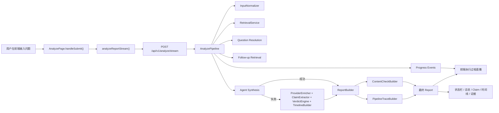
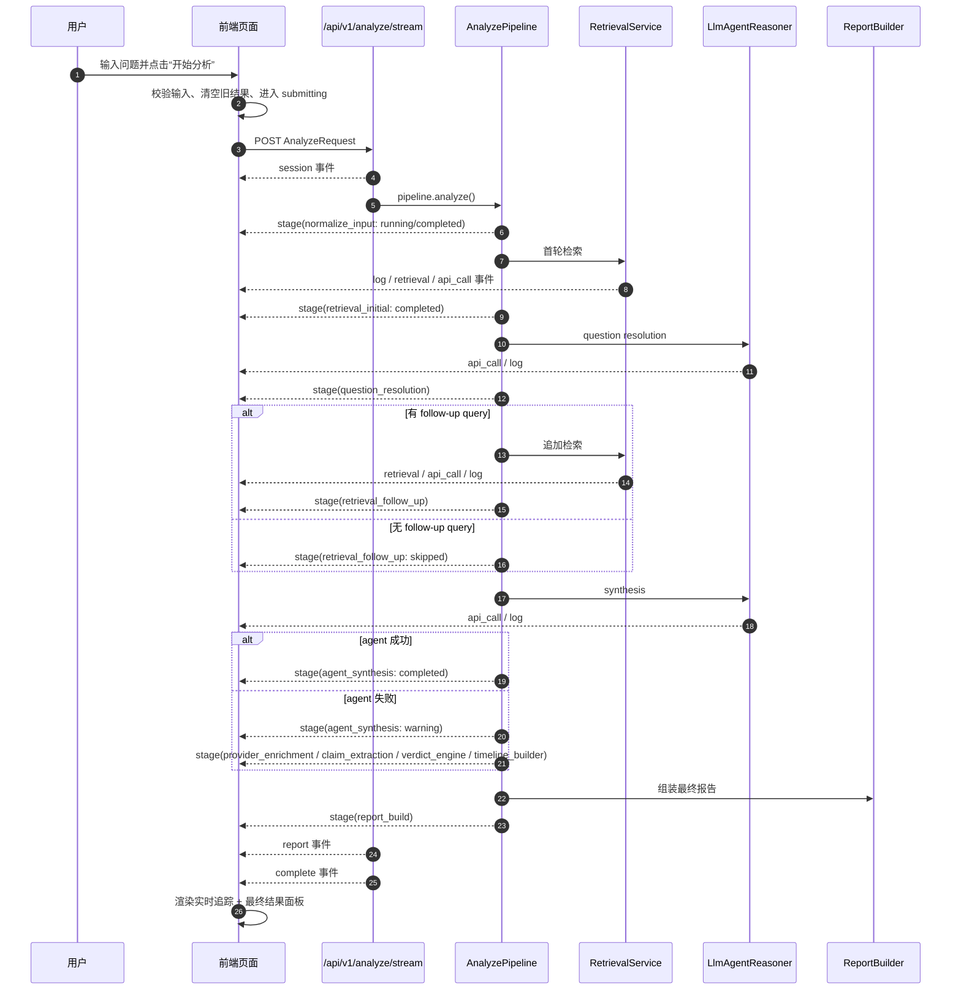
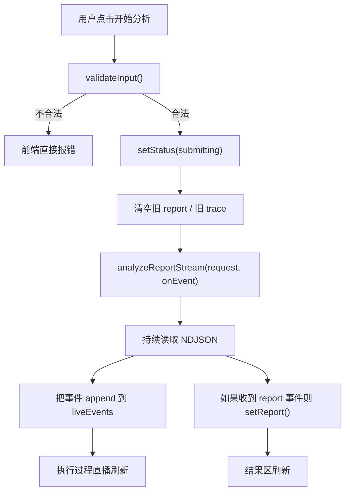
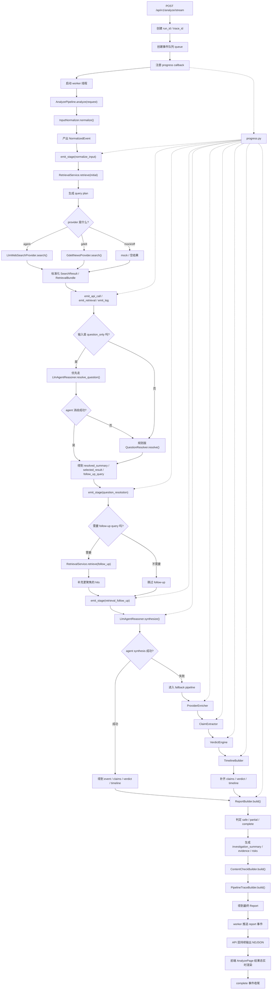
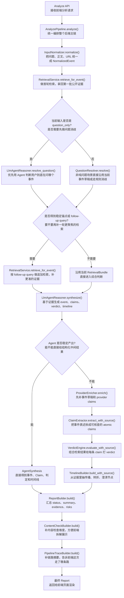
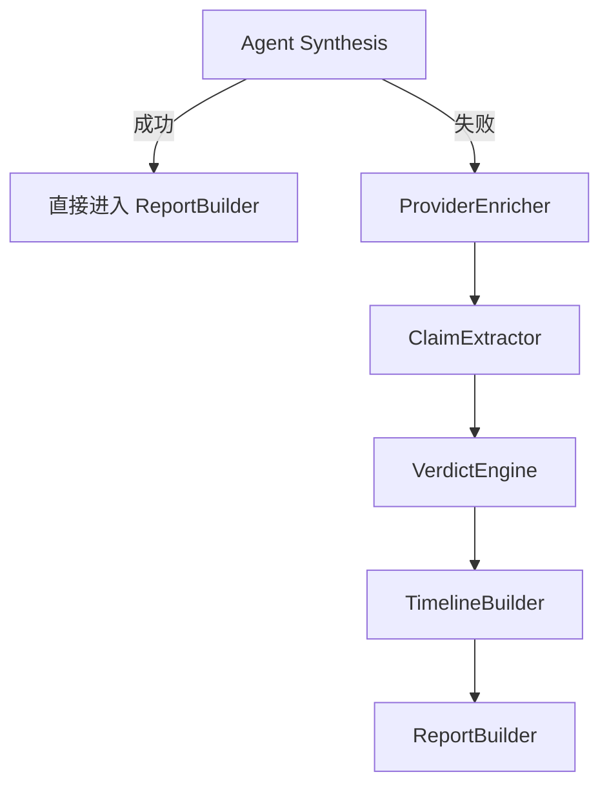
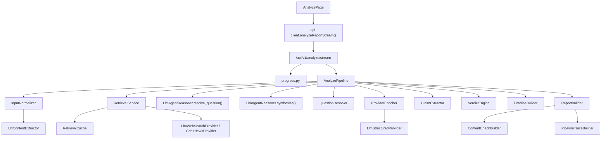
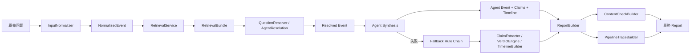

# 提问分析全链路说明

基于当前代码实现整理，时间点为 `2026-07-23`。  
这份文档的目标不是讲“理想架构”，而是讲“现在这个项目，用户点一次开始分析，系统真实做了什么”。

适用场景：

- 你向老师、评委、面试官讲解项目实现
- 你自己复盘“一个问题是怎么被系统消化掉的”
- 你要解释为什么这个系统不是单纯的关键词匹配，也不是一个完全黑盒的聊天机器人

---

## 1. 一句话概括

当前系统是一条 **前端流式可观测 + 后端 agent-first + 结构化报告输出 + 规则兜底 fallback** 的谣言核查链路。

更直白一点：

> 用户输入一个问题后，前端不是傻等；后端会一边做输入标准化、检索、问题消歧、agent 综合判断、fallback 判定、报告组装，一边把每一步做成流式事件推给前端，最后落成结构化 `Report`。

---

## 2. 系统总览图

---

## 3. 一次提问的完整时序

---

## 4. 端到端阶段表

| 阶段 | 核心模块 | 主要输入 | 主要输出 | 前端是否实时可见 | 作用 |
| --- | --- | --- | --- | --- | --- |
| 1. 提交请求 | `AnalyzePage` + `analyzeReportStream()` | 文本、输入类型 | 流式 HTTP 请求 | 是 | 发起分析并开启 NDJSON 读取 |
| 2. 接口入口 | `/api/v1/analyze/stream` | `AnalyzeRequest` | `session` 事件、后台 worker | 是 | 把同步 pipeline 包装成流式任务 |
| 3. 输入标准化 | `InputNormalizer` | 原始问题 | `NormalizedEvent` | 是 | 识别这是问题/正文/URL，并抽取初始线索 |
| 4. 首轮检索 | `RetrievalService` | `NormalizedEvent` | `RetrievalBundle` | 是 | 生成 query plan，向外部世界拿第一批结果 |
| 5. 问题消歧 | `LlmAgentReasoner.resolve_question()` 或 `QuestionResolver` | 问题 + 检索结果 | `QuestionResolution` | 是 | 决定能不能把问题锁到单一事件 |
| 6. 追加检索 | `RetrievalService` | `follow_up_query` | 更精确的 `RetrievalBundle` | 是 | 围绕候选事件补抓更准的结果 |
| 7. Agent 综合判断 | `LlmAgentReasoner.synthesize()` | 事件 + 检索结果 | event / claims / timeline / verdict | 是 | 用 evidence-grounded agent 生成主要中间结果 |
| 8. 规则兜底 | `ProviderEnricher` / `ClaimExtractor` / `VerdictEngine` / `TimelineBuilder` | 事件 + 检索结果 | claim 结果、时间线、证据判断 | 是 | agent 不稳定时保证系统仍能产出结构化结果 |
| 9. 报告构建 | `ReportBuilder` | 中间结果 | `Report` | 是 | 决定 safe/partial/complete，并生成调查总结和评分 |
| 10. 扩展展示数据 | `ContentCheckBuilder` / `PipelineTraceBuilder` | `Report` | `content_check` / `pipeline_trace` | 间接可见 | 让前端更容易展示“真假拆解”和“链路摘要” |
| 11. 页面渲染 | `AnalyzePage` 结果态（判定卡片 + 可折叠区块 + 底部 trace） | 流式事件 + `Report` | 最终页面 | 是 | 让用户看到结论和过程，不再黑盒 |

---

## 5. 前端到底做了什么

### 5.1 前端关键职责

前端现在是一个**面向普通用户的核查产品**（搜索态 + 结果态两个视图），同时承担两件事：

1. 作为输入入口，把用户的问题组织成结构化请求。
2. 作为结果与过程展示层：先给判定卡片和一句话结论，再把逐条核查、证据、时间线折叠成可展开区块，执行过程 trace 内联在结果页底部（默认折叠）。

### 5.2 前端关键文件

前端已从早期的“多面板工作台”**收敛为单一页面组件**，展示逻辑全部内联在 `AnalyzePage` 里。

| 文件 | 职责 | 你讲项目时可以怎么说 |
| --- | --- | --- |
| `frontend/components/analyze-page.tsx` | **唯一页面组件**：搜索态/结果态两个视图，内联判定卡片、逐条核查、证据、时间线、执行 trace，并串起提交、流式消费、结果落盘 | 这里是页面状态机的核心 |
| `frontend/lib/api-client.ts` | `analyzeReportStream()` 解析 NDJSON | 前端不是等一个 JSON，而是在读一个事件流 |
| `frontend/lib/report-utils.ts` | verdict 标签、置信度格式化、证据收集等展示层整理 | 结果页只是消费结构化 report |
| `frontend/types/report.ts` | 定义 `AnalysisLiveEvent`、`Report` 等类型 | 前后端不是随便传字符串，而是走类型化契约 |

### 5.3 前端提交流程

### 5.4 前端现在能看到什么

普通用户看到的主视线是判定卡片和一句话结论；需要复盘时，展开结果页底部的“执行过程”trace 区块，可以看到：

- 后端走过的阶段事件序列
- 调了哪些外部 API、做了哪些检索
- 每条事件的标题、状态与摘要

这意味着用户不再只看到“分析中...”，而是能追溯：

- 正在做输入标准化
- 正在请求联网检索（`playwright` 抓取百度/Bing，或支持内建搜索时走 LLM `$web_search`）
- 当前 query 是什么
- 命中了哪些网页
- Agent 解析成功还是失败
- 是不是已经退回 fallback 链路

---

## 6. 后端全过程逻辑

这一部分是讲项目实现时最重要的部分。

---

### 6.1 入口层：为什么新增 `/api/v1/analyze/stream`

旧版后端只有：

- `POST /api/v1/analyze`

它的问题是：

- 只能最后一次性返回 `Report`
- 中间过程全部不可见
- 前端只能用一个 loading 态硬等

现在新增：

- `POST /api/v1/analyze/stream`

这个接口的做法是：

1. 收到请求后，先创建一个事件队列。
2. 启一个后台线程跑 `AnalyzePipeline.analyze()`。
3. 用 `progress.py` 的 callback 机制，把 pipeline 中途的阶段事件写进队列。
4. API 层持续把队列里的事件按 NDJSON 推给前端。
5. 最后输出 `report` 和 `complete`。

所以你可以把它讲成：

> 我没有改掉原来的同步分析逻辑，而是在外面包了一层“流式观察壳”，这样既保留了原来的 pipeline，又让前端能实时看到执行过程。

---

### 6.2 事件总线：`progress.py`

`backend/app/services/progress.py` 做了一件很重要的事：

- 用 `ContextVar` 挂一个当前请求专属的 progress callback
- 任何服务只要调用 `emit_stage()` / `emit_api_call()` / `emit_retrieval()` / `emit_log()`
- 事件就会被推回当前流式请求

这相当于把“日志”升级成了“可消费的结构化执行事件”。

### 6.3 事件类型表

| 事件类型 | 由谁发出 | 典型内容 | 用途 |
| --- | --- | --- | --- |
| `session` | `analyze_stream` | run_id、trace_id、输入预览 | 标识一次任务开始 |
| `stage` | `AnalyzePipeline` | 阶段名、状态、摘要、细节 | 表示 pipeline 当前在第几步 |
| `api_call` | LLM/GDELT 调用层 | endpoint、model、status_code | 表示正在调什么外部接口 |
| `retrieval` | `RetrievalService` | query、provider、hit 摘要 | 表示每次检索拿到了什么 |
| `log` | 任意服务 | 提示、警告、降级原因 | 表示边界、异常、说明信息 |
| `report` | `analyze_stream` | 最终 `Report` | 表示最终结构化报告到达 |
| `error` | `analyze_stream` | code、message、details | 表示任务失败 |
| `complete` | `analyze_stream` | success=true/false | 表示流式任务收尾 |

---

### 6.3.1 后端完整处理流程图

下面这张图可以直接拿去讲“后端到底做了什么”。它不是抽象架构图，而是按当前代码真实执行顺序展开的。

你讲的时候可以按下面这个顺序说：

1. 入口层不直接做分析，而是先把同步 pipeline 包成一个“可流式观察”的任务。
2. 真正的主链还是 `AnalyzePipeline`，先标准化输入，再做首轮检索。
3. 对问题型输入，会先做消歧，必要时再做一轮更聚焦的 follow-up 检索。
4. 然后优先走 agent synthesis；agent 不稳时，再退回规则链兜底。
5. 最后统一由 `ReportBuilder` 装配成前端可消费的 `Report`，并通过 NDJSON 一边执行一边推送。

---

我还想讲一下目前的心得：

1. 比较新的实现ai没办法真的去给你自己列一个框架，比如说它列的V1版本根本不可行，而且方法比较落后，没有真正的用到大模型。
2. 想要并行任务的时候一方面要考虑模型是什么比如说codex是多线程分开的，但是claude code可以做到agent team。那面对不同的情况你必须定义不同的并行策略。 同时，想要把并行的任务真正的可视化需要你写好rules要求所有的并行线程定期的定时的去汇总汇报自己完成的进度。而且一定要把task分的非常详细，要有可以总览的任务表格进度表格才行。 
3. 每个task在不同的线程中并行的时候也需要设计好prompt，要防止多个并行的任务之间相互影响，你可以设置它可以修改的文件范围之类的。 
4. 一定要做好文档管理，不是说文档越多越好，因为ai目前的上下文还是不够长的，不可能容忍你的文档一直无限的增长，而且包含很多的重复的没用的内容让他自己去判断。我在开发的时候使用的codex app gpt 5.4 fast 上下文长度是256k，当然现在的claude code已经可以1M 上下文了，gpt也可以但是成本比较高。在这个过程中你一定要通过rules设定一些文档，这些文档负责某个模块的管理负责某个模块的计划规划。 
5. 要定义好benchmark也就是基准测试和单元测试，你可以尽量的先想象你要达到的目标是什么，每隔一段时间ai偏离的时候就告诉它这个全过程的例子，告诉他你要达到什么目标，从形象的任务上把他纠正回来。  把我这些想法结合我这个项目中的真实经历，给我写一个图文并茂的文档。

### 6.3.2 后端主链模块调用关系图（自上而下版）

如果你在答辩里不想讲线程、队列、provider 选型这些细节，而是只想说明“后端核心模块是怎么一级一级往下调用的”，可以直接用这张图。

这张图的讲法可以更口语化：

- 最上层入口只是接收请求，真正调度整个后端的是 `AnalyzePipeline.analyze()`。
- 第一段主链是“标准化输入 -> 首轮检索 -> 问题消歧”，目标不是立刻下结论，而是先把用户问题映射到一个相对稳定的事件上下文。
- 如果消歧后还需要补证据，就会再走一轮 follow-up 检索，把结果集缩窄到更聚焦的候选事件。
- 证据够了之后，优先让 `LlmAgentReasoner.synthesize()` 产出结构化中间结果。
- 如果 agent 产出不稳，就退回 `ProviderEnricher -> ClaimExtractor -> VerdictEngine -> TimelineBuilder` 这条规则兜底链。
- 最后统一交给 `ReportBuilder` 系列模块，把中间结果装成前端可消费的 `Report`。

---

### 6.3.3 主链模块说明表

下面这张表是给你讲“每个模块大概怎么做”的。它不追求源码级细节，而是抓住每个函数的职责、输入、处理思路和产出。

| 模块 / 函数 | 在主链里的位置 | 主要输入 | 大概怎么做 | 主要输出 | 讲解口径 |
| --- | --- | --- | --- | --- | --- |
| `Analyze API` `/api/v1/analyze/stream` | 整条链路的入口 | `AnalyzeRequest` | 接收前端请求后，先做参数校验，再创建 `run_id`、事件队列和后台 worker；worker 内部跑同步 pipeline，API 层把中间事件和最终结果按 NDJSON 持续推给前端。 | `session` / `stage` / `report` / `complete` 事件流 | 它本身不负责“判断真假”，它负责把后端分析过程变成一个前端可实时观察的流式任务。 |
| `AnalyzePipeline.analyze()` | 总编排器 | `AnalyzeRequest` | 顺序调度标准化、检索、消歧、follow-up、agent synthesis、fallback、report build；同时在关键节点发 `emit_stage()`，把执行轨迹暴露给前端。 | 各阶段中间结果和最终 `Report` | 这是后端的总控器，决定整条链怎么走、什么时候切换分支。 |
| `InputNormalizer.normalize()` | 第一阶段 | 原始文本、输入类型、上下文 | 先识别是问题、正文还是 URL，再抽标题、摘要、关键词、时间词、来源等基础线索，统一映射成一个 `NormalizedEvent`，避免后面每个模块都直接吃原文。 | `NormalizedEvent` | 先把脏输入洗干净、压成统一结构，后面模块才能在同一套数据模型上工作。 |
| `RetrievalService.retrieve_for_event()`（首轮） | 标准化之后的第一轮外部取证 | `NormalizedEvent` | 按输入类型生成 query plan，把原问题、claim 版本、官方视角、传播视角拆成几组检索；拿到结果后做标准化、去重、证据等级估计和缓存处理，最后组成 `RetrievalBundle`。 | 第一版 `RetrievalBundle` | 检索层不是“搜一下”，而是主动把证据池搭出来。 |
| `LlmAgentReasoner.resolve_question()` | 问题型输入的优先消歧 | 用户问题 + 首轮检索 hits | 只在 `question_only` 且有检索结果时启用；把“问题文本 + 第一轮 hits”交给 agent，让它判断能不能锚定到一个具体事件，并尝试生成 `follow_up_query`。 | `QuestionResolution` | 它不是直接给结论，而是先回答“用户到底在问哪件事”。 |
| `QuestionResolver.resolve()` | agent 消歧失败或非 agent 路径的兜底消歧 | `NormalizedEvent` + `RetrievalBundle` | 用规则做轻量级 event anchoring：看主体词、动作词、时间词、标题噪声、主语错位等信号，判断能不能稳定选中某个候选结果。 | `QuestionResolution` | 这是消歧兜底器，确保 agent 不稳定时系统也不会完全失明。 |
| `RetrievalService.retrieve_for_event()`（follow-up） | 消歧之后的补证据阶段 | 已消歧事件 + `follow_up_query` | 如果上一阶段给出了 follow-up query，就按更聚焦的问题再抓一轮结果；这轮检索的目标不是扩范围，而是收窄范围、提高命中精度。 | 更聚焦的 `RetrievalBundle` | 第二轮检索不是重复搜索，而是围绕候选事件补“更像证据”的结果。 |
| `LlmAgentReasoner.synthesize()` | 主判断分支 | 事件草稿 + 当前证据池 | 把当前事件上下文和检索 hits 交给 LLM，让它只基于现有证据输出结构化 JSON，里面包含 `event`、`claims`、`timeline`；随后再把这些 JSON 转回系统内部的数据结构。 | `AgentSynthesis` | 这是 agent-first 的核心，不是自由生成长文，而是 evidence-grounded 的结构化综合判断。 |
| `ProviderEnricher.enrich()` | fallback 分支第一步 | 当前事件草稿 | 如果 agent 没稳定产出，就先调用 provider 做一轮结构化补全，尽量把事件摘要、claims 草稿补出来；如果 provider 也失败，就继续沿用当前事件草稿。 | 补全后的事件 + provider claims | 它相当于 fallback 链里的“先补材料”。 |
| `ClaimExtractor.extract_with_source()` | fallback 分支第二步 | 事件描述 + provider claims | 把事件摘要或 provider 返回的 claim 候选拆成更短、更原子化、可核查的 claim；会做规则 refine、去重、过滤过泛表述。 | `ClaimExtraction` | 它把“一个大事件描述”拆成“若干条可以分别判定的核查点”。 |
| `VerdictEngine.evaluate_with_source()` | fallback 分支第三步 | 事件、claims、检索结果 | 针对每条 claim 看有哪些 retrieval hits 能支持、反驳或只有弱相关；再汇总成 claim-level verdict、evidence 列表和总体 evidence grade。 | `VerdictEvaluation` | 它不是对整段话一刀切，而是对每条 claim 分别打分和判定。 |
| `TimelineBuilder.build_with_source()` | fallback 分支第四步 | 事件 + 检索结果 | 从当前 evidence 里挑出“起源、放大、转折、澄清”等时间节点，尽量把传播和澄清过程串成一条可展示的 timeline。 | `TimelineBuild` | 它负责把散落的网页证据整理成一条人能读懂的事件演进线。 |
| `ReportBuilder.build()` | 汇总阶段 | event、claims、verdict、timeline、provenance | 根据中间结果决定这次报告是 `safe`、`partial` 还是 `complete`；同时生成调查摘要、claim review、evidence、风险提示、得分和状态文案。 | 主 `Report` 对象 | 前面模块产的是零件，这一步才真正装成前端页面需要的报告。 |
| `ContentCheckBuilder.build()` | 报告增强 | `Report` | 按 claim、来源、表达方式、缺失点等维度，生成更适合前端“逐格解释”的内容检查结构。 | `content_check` | 它是给页面讲解层服务的，让用户知道具体卡在哪些维度。 |
| `PipelineTraceBuilder.build()` | 报告增强 | `Report` + provenance | 把本次到底走了 agent 还是 fallback、证据源是什么、是否用了 provider、时间线来源是什么，整理成一份链路摘要。 | `pipeline_trace` | 它回答的是“这次结果是怎么做出来的”，方便前端解释和答辩时说明链路。 |

#### 你可以怎么整体概括这张表

你可以把整条后端主链总结成 4 句话：

1. 先把原始输入标准化，得到一个统一的事件草稿。
2. 再通过检索和消歧，把“用户在问什么”尽量锚定到一个具体事件或一个更明确的趋势问题。
3. 然后优先让 agent 基于证据生成结构化判断；如果 agent 不稳，就用规则链把 claim、verdict、timeline 补齐。
4. 最后把所有中间结果装配成一个结构化 `Report`，同时把执行链路和内容检查信息一并交给前端展示。

---

### 6.4 阶段 1：输入标准化 `InputNormalizer`

#### 它要解决的问题

用户的输入可能是：

- 一句问题
- 一段新闻正文
- 一个 URL
- 一个带截图、聊天记录、爆料口吻的噪声文本

后续链路不能直接吃原始文本，所以第一步必须做统一化。

#### 核心动作

| 动作 | 说明 |
| --- | --- |
| 输入类型映射 | 前端 `question` 会被映射为后端 `question_only` |
| URL 检测 | 如果像 URL，会走 URL 提取分支 |
| 问句规整 | 问题会被保留为 question 类型，并生成基础 summary |
| 标题/摘要抽取 | 正文型输入会切出初始 title 和 summary |
| 关键词抽取 | 抽主体、动作、时间词，供后续检索和判定使用 |
| `mode_hint` 预估 | 根据输入类型和信息完整度，先给后续链路一个安全/部分/较完整的提示 |
| fallback 标记 | URL 提取失败、正文不完整时，提前打上 `fallback_used` / `fallback_reason` |

#### 输出

输出对象是 `NormalizedEvent`，它包含：

- `title`
- `summary`
- `keywords`
- `source_name`
- `source_url`
- `published_at`
- `input_type`
- `mode_hint`
- `fallback_used`
- `fallback_reason`
- `event_source`
- `raw_input`

#### 讲解口径

你可以这样讲：

> 我们没有让所有下游模块直接吃用户原文，而是先做标准化，把问题、正文、URL 全部映射到一个统一的 `NormalizedEvent`。这样后续 retrieval、agent、verdict 和 report 都是在同一种结构上工作。

---

### 6.5 阶段 2：首轮检索 `RetrievalService`

#### 它要解决的问题

标准化之后，系统还不知道外部世界有没有相关公开证据。  
所以第二步一定是检索，而且不是只打一条 query。

#### 当前 provider 策略

| 配置 | 实际行为 |
| --- | --- |
| `RETRIEVAL_PROVIDER=playwright` | 纯 httpx 抓取百度（主）+ Bing（兜底）搜索结果页并解析（当前推荐的真实联网路径） |
| `RETRIEVAL_PROVIDER=kimi` | 走 LLM 内建 `$web_search`（仅对支持该工具的供应商有效；当前新模型无此能力） |
| `RETRIEVAL_PROVIDER=gdelt` | 走 GDELT 免费新闻 API（英文偏向、中文覆盖弱） |
| `RETRIEVAL_PROVIDER=mock` | 走 mock retrieval |
| `RETRIEVAL_PROVIDER=off` | 不检索 |

当前本地你这套运行链路，主打的是：

- `playwright` 检索，也就是抓取百度/Bing 搜索结果页（不依赖浏览器二进制，也不依赖模型内建搜索）

#### 问题输入的 query plan 逻辑

这是讲解时特别值得展开的一点。

| 输入情形 | query plan 逻辑 |
| --- | --- |
| 宽泛趋势问题 | 只做 `trend_topic`，不强行拆成单一事件 |
| 普通 question_only | 生成 `question_raw / question_claim / question_official / question_propagation` |
| follow-up 检索 | 生成 `follow_up_core / follow_up_official / follow_up_propagation` |
| 普通正文/事件 | 生成 `event_core / event_claim / event_official / event_propagation` |

#### 这四类 query 分别在干什么

| query | 作用 |
| --- | --- |
| `*_raw` | 尽量保留原问题口吻，先找最接近原句的公开结果 |
| `*_claim` | 压缩成更像事实 claim 的表达，减少只命中泛传闻 |
| `*_official` | 主抓官方、机构、医院、警方、通报、辟谣 |
| `*_propagation` | 主抓“传播过程”，比如网传、热议、发酵、转发 |

#### 缓存和退化逻辑

`RetrievalService` 不只是裸搜，它还有：

- cache read/write
- stale cache fallback
- provider unavailable fallback
- optional mock fallback
- query failure 汇总

#### 输出

输出对象是 `RetrievalBundle`，里面有：

- `raw_results`
- `canonical_results`
- `provider_name`
- `cache_status`
- `evidence_grade`
- `failure_detail`
- `query_groups`

#### 讲解口径

> 检索层不是“拿一个 query 去搜”，而是会生成一个 query plan，分别覆盖原句、claim、官方回应和传播扩散四个视角。这样后面的判断层就不只盯着一个搜索结果，而是拿到一个更像证据集的 `RetrievalBundle`。

---

### 6.6 阶段 3：问题消歧 `Question Resolution`

这是“提问分析”特有的关键步骤。

#### 它要解决的问题

像这种问题：

- “最近是不是有女网红脑梗死了？”
- “是不是某公司要大裁员了？”

问题本身常常很模糊，可能对应：

- 多个不同事件
- 一个传闻 + 一个辟谣
- 一个真实事件 + 一堆二次加工细节

如果直接往下判，很容易锚错对象。

#### 当前消歧策略

1. **先走 agent 版消歧**  
   `LlmAgentReasoner.resolve_question()`

2. **agent 失败则走规则版消歧**  
   `QuestionResolver.resolve()`

#### agent 版消歧做什么

它拿到：

- 用户问题
- 当前 summary
- 第一轮 retrieval hits

它输出：

- `selected_result_id`
- `resolved_summary`
- `follow_up_query`

原则是：

- 只允许基于 retrieval hits 选
- 如果命中的是多个不同事件，不要硬选
- 如果问题本来就是广义趋势问题，不要硬选

#### 规则版消歧做什么

规则版会综合：

- 词项重叠
- 主体锚点匹配
- 时间/动作词
- 高可信来源要求

来决定是否选中某个 `selected_result`。

#### 输出

输出 `QuestionResolution`：

- `event`
- `follow_up_query`
- `selected_result`

#### 讲解口径

> 这个系统不是一看到“女网红脑梗”就直接选一个搜索结果，而是专门有一个问题消歧阶段，判断这句话到底能不能安全收束到单一事件。如果不能，就宁可保留模糊，不强判。

---

### 6.7 阶段 4：追加检索 `Follow-up Retrieval`

如果问题消歧阶段已经挑出了更可信的候选事件，就会进一步做追加检索。

#### 目的

第一轮检索更像“找方向”，第二轮检索更像“围绕这个候选对象补抓更准的证据”。

#### 触发条件

- `question_resolution.follow_up_query` 存在

#### 行为

系统会把 `follow_up_query` 放进 `request_context.force_retrieval_query`，然后再跑一轮 `retrieve_for_event()`。

#### 结果采用策略

如果 follow-up bundle：

- 有 `canonical_results`
- 或者有 `matched_case_id`

那么就用 follow-up bundle 覆盖首轮 bundle。

#### 讲解口径

> 我们把问题检索拆成了两轮。第一轮是把模糊问题拉到可能的候选事件，第二轮才围绕那个候选事件做更窄、更精确的抓取。这样能减少把泛问题直接硬判成单事件的风险。

---

### 6.8 阶段 5：Agent 综合判断 `LlmAgentReasoner.synthesize()`

这是当前主链最“智能”的部分。

#### 它拿什么做输入

- `AnalyzeRequest`
- 当前 `event`
- `RetrievalBundle`

#### 它被要求做什么

模型不会被要求自由发挥，而是必须返回一个 JSON：

- `event`
- `claims`
- `timeline`

其中每条 claim 还必须带：

- `verdict`
- `confidence`
- `evidence_result_ids`

也就是说，agent 的判断必须指向具体 retrieval result id，而不是凭空说“我觉得是这样”。

#### 这一步为什么重要

因为这一步把系统从：

- “LLM 抽一下 + 规则判”

升级到了：

- “LLM 基于证据做 event / claim / timeline 的结构化综合”

#### 设计上的关键约束

| 约束 | 目的 |
| --- | --- |
| 只能用提供的 retrieval hits | 避免模型乱编 |
| 必须输出 JSON | 便于下游稳定消费 |
| `evidence_result_ids` 必须引用已有 hit | 保证 judgment 可追溯 |
| 趋势问题可以 pattern-level 回答 | 避免强行锚到一个人 |
| 如果证据不足，必须输出 `insufficient` | 避免黑盒强判 |

#### 成功时产出什么

如果 synthesis 成功，就直接得到：

- `AgentSynthesis.event`
- `AgentSynthesis.claim_extraction`
- `AgentSynthesis.verdict`
- `AgentSynthesis.timeline`

这条路会成为当前主输出链。

#### 讲解口径

> 我们不是把 agent 当成最后直接说答案的聊天机器人，而是把它当成一个“受检索约束的结构化综合器”。它只能在给定证据集合里做选择，并把判断结果落回结构化字段。

---

### 6.9 阶段 6：规则 fallback 链路

如果 `agent_synthesis` 失败，系统不会直接挂掉，而是退回规则链。

#### fallback 链路包含什么

| 模块 | 作用 |
| --- | --- |
| `ProviderEnricher` | 用 LLM 做结构化事件/claim 补全，但不是完整 agent |
| `ClaimExtractor` | 规则拆 claim |
| `VerdictEngine` | 基于证据重叠、否定词、主体锚点等做 verdict |
| `TimelineBuilder` | 从检索结果中挑选 origin / amplification / peak / turn / clarification |

#### 为什么要保留 fallback

因为纯 agent 会带来：

- 非确定性
- 输出不稳定
- 演示时漂移
- 回归难做

所以当前系统是：

- **agent-first**
- **fallback-safe**

#### 讲解口径

> 这套系统不是 all-in 黑盒 agent，而是 agent 优先、规则兜底。这样既能提升智能度，又不会在模型失稳时整条链路直接断掉。

---

### 6.10 阶段 7：判定层 `VerdictEngine`

即使 agent 成功，这个模块的思想仍然值得讲，因为它代表系统的“证据约束原则”。

#### `VerdictEngine` 判什么

每条 fact claim 最终会被判成：

- `supported`
- `refuted`
- `conflicting`
- `insufficient`

#### 它主要看什么

| 维度 | 含义 |
| --- | --- |
| 主体锚点匹配 | 证据是不是在说同一个人/机构/事件 |
| 词项重叠 | claim 和 evidence 在讲的是不是同一件事 |
| 否定信号 | 有没有“辟谣 / 否认 / 不实 / 未发现”之类的反向证据 |
| 高可信来源 | S/A 级来源是否支持或否定 |
| 数量冲突 | 同一数量细节是否被高可信来源给出不同版本 |
| 趋势型 claim | 是否允许 pattern-level 支持 |

#### 讲解口径

> 结论层不是让模型直接拍脑袋，而是要求 claim 必须和 evidence 对齐。即便在 fallback 链里，也会用主体锚点、否定词、来源等级、数量冲突这些规则来做保守判断。

---

### 6.11 阶段 8：时间线构建 `TimelineBuilder`

时间线不是简单按时间排序，而是试图从 retrieval hits 中挑出传播链角色。

#### 当前支持的节点类型

| 节点类型 | 含义 |
| --- | --- |
| `origin` | 最早可见起点 |
| `amplification` | 扩散放大节点 |
| `peak` | 传播高峰节点 |
| `turn` | 回应/辟谣/核查带来的转折点 |
| `clarification` | 后续解释、说明、公告 |

#### 它怎么选

它会综合：

- 发布时间
- 来源等级
- 是否像 rumor
- 是否像 official response
- propagation score
- 是否聚合/转发

来为每个角色挑一个代表节点。

#### 讲解口径

> 传播链不是所有搜索结果都堆上去，而是把结果映射成“起点、扩散、峰值、转折、澄清”五种角色。这样页面上展示的不是原始搜索列表，而是可讲述的传播过程。

---

### 6.12 阶段 9：最终报告构建 `ReportBuilder`

#### 这一步解决什么问题

前面的模块给了很多中间结果，但前端真正需要的是一个统一 contract：

- `mode`
- `event`
- `claim_results`
- `timeline`
- `sources`
- `final_summary`
- `risks`
- `investigation`
- `score_breakdown`
- `provenance`

#### `mode` 是怎么选出来的

| 模式 | 典型条件 |
| --- | --- |
| `safe_mode` | 没有 decisive claim、没有证据、问题过泛或 fallback 过重 |
| `partial_mode` | 有部分 decisive claim，但证据链不完整 |
| `complete_mode` | 非问题输入、证据等级高、decisive claim 足够、时间线也较完整 |

#### `ReportBuilder` 还会生成什么

| 字段 | 作用 |
| --- | --- |
| `final_summary` | 给用户最先看到的一句话总结 |
| `risks` | 说明边界和不能过度宣称的地方 |
| `investigation` | 把“系统是怎么想的”整理成可展示的话术 |
| `overall_credibility_score` | 总体可信度评分 |
| `score_breakdown` | 分项评分 |
| `claim_contributions` | 哪些 claim 在拉高/拉低分数 |

#### 讲解口径

> 前面的 agent、规则、检索，其实都是在给 `ReportBuilder` 喂结构化中间结果。真正对前端负责的是 `Report` 合同，而不是某个模型输出的一段自然语言。

---

### 6.13 阶段 10：结果再加工

#### `ContentCheckBuilder`

把 claim 再分成：

- `likely_true`
- `likely_false`
- `controversial`
- `opinions`
- `uncertain`

并额外生成：

- `possible_answers`

它的价值是把“系统判定”改写成更适合人类理解的内容核查视图。

#### `PipelineTraceBuilder`

这不是流式 trace，而是 **最终报告里的摘要版链路回放**。  
它会把这次请求概括成几个稳定步骤，供前端结果页回顾。

#### 讲解口径

> 流式 trace 面向“正在发生什么”，pipeline trace 面向“这次请求最后是怎么走完的”。一个是直播，一个是回放摘要。

---

### 6.14 模块实现细节速查

前面的 6.1 到 6.13 讲的是阶段逻辑。  
如果你在讲项目时要更进一步，被追问“这个模块内部到底怎么写的”，可以直接用这一节。

#### 6.14.1 模块依赖图

#### 6.14.2 前端模块细节表

| 模块 | 输入 | 输出 | 内部怎么做 |
| --- | --- | --- | --- |
| `AnalyzePage` | 用户输入、输入类型、流式事件 | 页面状态、最终 report、两个视图 | 管理 `status / report / liveEvents / isStreaming`，提交前先 `validateInput()`，提交流式请求，收到 `report` 事件就落盘，收到错误就切到 `error` 状态；渲染逻辑（判定卡片/逐条核查/证据/时间线/trace）全部内联在本组件 |
| `api-client.analyzeReportStream()` | `AnalyzeRequest` | `AnalysisLiveEvent[]` + 最终 `Report` | 用 `fetch()` 调 `/api/v1/analyze/stream`，拿 `response.body.getReader()` 按行读取 NDJSON，逐条 `JSON.parse()` 后映射成强类型事件 |
| `AnalyzePage` 结果态区块 | 流式事件 / `Report` | 判定卡片 + 可折叠区块 + 底部 trace | 执行过程 trace 把 `session / stage / api_call / retrieval / log / report / error / complete` 统一渲染成折叠列表；判定/核查/证据/时间线直接消费结构化 `Report`，本身不做推理 |

#### 6.14.3 `AnalyzePage` 具体实现点

| 代码动作 | 具体实现 |
| --- | --- |
| 输入校验 | 先走 `validateInput()`，不合法直接前端报错，不打后端 |
| 提交前清理 | 提交时会清空旧 `report`、旧 `reportProvenance`、旧 `liveEvents`，并重置各折叠区块的展开状态 |
| 流式追踪接入 | `handleStreamEvent()` 对每个事件做 `setLiveEvents([...current, event])` |
| 结果提前落盘 | 只要流里出现 `report` 事件，前端就已经能刷新结果区，不必等整个请求完全结束 |
| 视图切换 | `showResult` 为假时渲染搜索态（居中输入框 + 示例），为真时渲染结果态；“新查询”按钮 `handleReset()` 回到搜索态 |

#### 6.14.4 `api-client.analyzeReportStream()` 具体实现点

| 细节 | 实现方式 |
| --- | --- |
| 协议格式 | 后端返回 `application/x-ndjson` |
| 读取方式 | 用 `ReadableStreamDefaultReader` 逐块读取 |
| 分帧方式 | 累积到 `buffer`，按换行符 `\n` 切帧 |
| 类型保护 | 每帧先走 `parseLiveEvent()`，把原始 JSON 转成前端类型系统里的 `AnalysisLiveEvent` |
| 异常传播 | 如果流中收到 `error` 事件，会组装成 `ApiClientError` 抛出 |
| 成功条件 | 最终必须拿到 `report` 事件，否则视为异常 |

#### 6.14.5 结果态执行过程 trace 的实现思路

早期版本用独立的 `AnalysisLivePanel` 组件渲染“执行过程直播”；前端重写为单页产品界面后，这段逻辑内联到 `AnalyzePage` 结果态底部的可折叠 trace 区块，思路不变：

| 问题 | 当前实现怎么解决 |
| --- | --- |
| 事件类型很多，UI 难统一 | 对每个事件按 `type` 取标题、状态与摘要，统一渲染成一行 trace item |
| 普通用户不需要每步细节 | trace 区块默认折叠，判定卡片和结论优先占据主视线 |
| 加载态需要反馈 | 加载卡片显示最新一条事件的标题，让用户知道当前进行到哪 |
| 需要看错误/完成状态 | 每条 trace item 按事件状态给一个统一的状态色点 |

#### 6.14.6 流式接口 `POST /api/v1/analyze/stream` 具体实现点

| 步骤 | 具体实现 |
| --- | --- |
| 建立任务上下文 | 生成 `run_id` 和 `trace_id` |
| 启动后台执行 | 新开一个 `Thread` 跑 `pipeline.analyze()` |
| 绑定事件回调 | 通过 `set_progress_callback(push_event)` 把当前请求和 progress 总线绑定 |
| 事件入队 | 每个进度事件先塞进 `queue.Queue` |
| 流式输出 | `StreamingResponse(event_stream(), media_type="application/x-ndjson")` |
| 错误处理 | `AppError` 会转成结构化 `error` 事件；未知异常也会转 `error` + `complete(false)` |
| 正常结束 | 先发 `report`，再发 `complete(success=true)` |

#### 6.14.7 `progress.py` 具体实现点

| 能力 | 具体实现 |
| --- | --- |
| 请求级事件总线 | 用 `ContextVar` 保存当前请求的 callback |
| 通用事件发射 | 核心入口是 `emit_progress(event_type, **payload)` |
| 阶段事件 | `emit_stage(stage_key, title, status, summary, details)` |
| API 事件 | `emit_api_call(call_type, status, title, summary, details)` |
| 检索事件 | `emit_retrieval(query_label, query, provider_name, summary, details)` |
| 普通日志 | `emit_log(title, summary, details, level)` |

它的设计价值是：

- pipeline 不需要知道 HTTP 连接怎么流式输出
- API 层也不需要知道 retrieval/agent 细节
- 二者通过“结构化事件”解耦

#### 6.14.8 `InputNormalizer` 具体实现点

| 细节 | 当前做法 |
| --- | --- |
| 输入类型识别 | `text / url / question / auto` 会被映射到 `text_news / url_news / question_only` |
| 问句识别 | 看 `? / ？ / 真假 / 是不是 / 是否属实` 这类模式 |
| 噪声清洗 | 对“截图显示、聊天记录显示、网传、爆料”等噪声前缀做重写 |
| URL 分支 | 如果像 URL，会调用 `UrlContentExtractor.extract()` |
| 关键词抽取 | 抽主体、动作词、时间词，最多保留 6 个关键词 |
| 时间抽取 | 用正则识别 `YYYY-MM-DD`、`X月X日`、`今天/昨天/下周` 等 |
| `mode_hint` 初判 | 问句或 fallback 倾向 `safe`；来源较稳且信息充分时倾向 `complete_or_partial` |

#### 6.14.9 `UrlContentExtractor` 具体实现点

虽然你这次重点在“提问”，但标准化模块里它仍然是关键子模块。

| 细节 | 当前做法 |
| --- | --- |
| 抓取方式 | `httpx.get()`，带固定 `User-Agent`，允许跳转 |
| HTML 识别 | 看 `content-type` 和页面片段是否像 HTML |
| 元信息抽取 | 抓 `og:title`、`description`、`article:published_time`、`json-ld` 等 |
| 正文抽取 | 优先 `<article>`、`<main>`，再退化到正文块拼接 |
| 清洗 | 删除脚本、样式、页脚、广告、相关推荐等 |
| 状态判定 | 抽取结果会被标成 `ok / partial / empty / timeout / error / unsupported` |
| fallback 原因 | URL 类输入失败时会被映射成 `url_content_incomplete / timeout / unsupported` 等原因 |

#### 6.14.10 `RetrievalService` 具体实现点

| 细节 | 当前做法 |
| --- | --- |
| provider 选择 | 根据配置构造 `GdeltNewsProvider` 或 `LlmWebSearchProvider` |
| query plan 生成 | `_build_query_plan()` 按输入情形生成 1 到 4 条检索 query |
| query 去重 | `_dedupe_query_plan()` 对 query 做规范化和去重 |
| 缓存读取 | 优先读 `RetrievalCache`，支持 stale cache |
| cache-only | 可只读缓存不打真实 provider |
| provider 错误兜底 | 真实检索失败时，可退回 stale cache 或 mock |
| 多 query 合并 | `_combine_query_bundles()` 汇总 `raw_results / canonical_results / failure_detail` |
| 运行时埋点 | 每条 query 都会发 `log` 和 `retrieval` 事件给前端 |

#### 6.14.11 query plan 不是怎么“想的”，而是怎么“写的”

| 场景 | 实现细节 |
| --- | --- |
| 宽泛趋势问题 | 走 `trend_topic`，直接保留主题，不强行切成某个人 |
| 普通 question_only | 生成 `question_raw / question_claim / question_official / question_propagation` |
| follow-up query | 生成 `follow_up_core / follow_up_official / follow_up_propagation` |
| 正文输入 | 生成 `event_core / event_claim / event_official / event_propagation` |

这样做的本质是：

- 一条 query 负责找原句相近结果
- 一条 query 负责找可核查事实
- 一条 query 负责找权威回应
- 一条 query 负责找传播链

#### 6.14.12 `LlmWebSearchProvider` / `GdeltNewsProvider` 具体实现点

##### `GdeltNewsProvider`

| 细节 | 当前做法 |
| --- | --- |
| 外部接口 | 调 GDELT ArtList JSON API |
| 参数 | `query / mode=ArtList / format=json / maxrecords / sort=DateDesc` |
| 结果解析 | 把 article 转成内部 `SearchResult` |
| 来源等级 | 根据域名和来源名推断 `S / A / B / C` |

##### `LlmWebSearchProvider`

| 细节 | 当前做法 |
| --- | --- |
| 调用方式 | 调配置指定的 OpenAI 兼容 `/chat/completions` 端点 |
| 工具使用 | 强制要求模型先调用 `$web_search` |
| system prompt | 明确要求只返回 JSON，且 URL 必须来自当前 web search |
| 循环逻辑 | `_run_search_loop()` 最多跑 4 轮 tool call |
| 模型选择 | 由配置（`LLM_SEARCH_MODEL` / `LLM_MODEL`）决定；模型名只放 `backend/.env` |
| 结果解析 | 把模型 JSON 里的 `results[]` 转成 `SearchResult` |

#### 6.14.13 `SearchResult` / `RetrievalBundle` 内部结构为什么重要

| 结构 | 作用 |
| --- | --- |
| `SearchResult` | 表示一条原始或去重后的检索结果 |
| `source_tier` | 表示来源等级 |
| `source_category` | 区分 official / mainstream / aggregator / other |
| `independence_key` | 估算“是不是独立来源” |
| `signal_tags` | 标记 rumor / response / clarification / peak |
| `RetrievalBundle.evidence_grade` | 汇总整包结果的证据等级 |
| `to_evidence_items()` | 把搜索结果转成报告里的证据项 |
| `to_retrieval_hit_items()` | 把搜索结果转成页面展示用 retrieval hits |

这套结构的意义是：

- 后面不是直接拿原始网页列表在判断
- 而是拿一组带“来源等级、独立性、信号标签”的结果对象做推理

#### 6.14.14 `QuestionResolver` 规则消歧是怎么做的

| 细节 | 当前做法 |
| --- | --- |
| 问题词项提取 | `_extract_terms()` 会把中文词块、数字、英文 token 都切出来 |
| 主体锚点抽取 | 用 `extract_subject_anchors()` 抓人名、机构名、对象名 |
| 宽泛趋势判断 | 趋势问题直接不强锚 |
| 候选打分 | 同时看词项重叠、来源权重、具体性 bonus、是否高可信 |
| 选中条件 | 至少有足够 overlap，且必须出现高可信来源 |
| follow-up query 构造 | 结合 summary、标题、snippet 和 source_name 拼后续检索词 |

#### 6.14.15 `LlmAgentReasoner` 具体实现点

| 子能力 | 具体实现 |
| --- | --- |
| `resolve_question()` | 把问题和前几条 retrieval hit 发给 LLM，让它判断是否能锁单一事件 |
| `synthesize()` | 把 request + event + retrieval hits 发给 LLM，让它返回结构化 event/claims/timeline |
| 输出约束 | 都必须是 JSON，且只能引用已有 `result_id` |
| 证据绑定 | claim 的 `evidence_result_ids` 会回查成具体 `EvidenceItem` |
| 时间线绑定 | timeline 节点必须引用已有 `result_id`，再映射成 `TimelineNode` |
| 模型选择 | 优先用配置的 `LLM_SEARCH_MODEL`，否则回落 `LLM_MODEL`；模型名只放 `backend/.env` |
| 失败策略 | 解析失败直接返回 `None`，由上层 fallback |

#### 6.14.16 `ProviderEnricher` 和 `LlmStructuredProvider` 的区别

很多人会把这两个和 agent 混掉，实际上不是一回事。

| 模块 | 定位 | 当前实现方式 |
| --- | --- | --- |
| `LlmAgentReasoner` | agent 综合判断 | 基于 retrieval hits 做 evidence-grounded synthesis |
| `LlmStructuredProvider` | 结构化抽取器 | 只对输入文本做 event + claims 的结构化抽取 |
| `ProviderEnricher` | 包装层 | 用 `LlmStructuredProvider` 的结果补全标题、摘要、关键词、来源 |

也就是说：

- `LlmStructuredProvider` 更像 “抽取器”
- `LlmAgentReasoner` 更像 “带证据约束的综合器”

#### 6.14.17 `ClaimExtractor` 具体实现点

| 细节 | 当前做法 |
| --- | --- |
| 优先级 | 有 provider_claims 时优先 refine provider_claims，否则走规则抽取 |
| 宽泛趋势问题 | 会直接把趋势问句改写成一个 pattern-level fact claim |
| 规则切分 | 先按句号切，再按逗号和连接词切 compound fragment |
| 噪声清洗 | 去掉“网传、截图显示、聊天记录显示”等前缀 |
| 主体补全 | 片段没有主体时，会尝试用 topic subject 或上一个主体补齐 |
| claim 分类 | 按 opinion / prediction / unverifiable / fact 分类 |
| query hints | 为每条 claim 额外生成后续检索提示词 |

#### 6.14.18 `VerdictEngine` 具体实现点

| 细节 | 当前做法 |
| --- | --- |
| 先分 claim 类型 | `opinion / prediction / unverifiable` 直接不给真假强判 |
| 证据池选择 | 优先 `mock_evidence`，否则 retrieval bundle 转成 evidence pool |
| 主体锚点校验 | claim 和 evidence 必须主体对得上 |
| 否定信号识别 | 看 “辟谣 / 不实 / 否认 / 系谣言 / 并未 / 未发现” 等 |
| 段落级对齐 | 不是只看整条证据，而是按 segment 看 claim overlap |
| 数量冲突检测 | 会识别百分比、人数、线路数等 quantitative conflict |
| 趋势型 claim | 可以在 pattern-level 上给出 supported |
| 最终 verdict | `supported / refuted / conflicting / insufficient` |

#### 6.14.19 `TimelineBuilder` 具体实现点

| 细节 | 当前做法 |
| --- | --- |
| 起点选择 | 先找最早 rumor-like 或 authoritative source |
| 扩散节点 | 偏向聚合、转发、主流媒体、传播分数高的结果 |
| 高峰节点 | 找同一天传播得分最高的时间窗口 |
| 转折节点 | 找 response / official source |
| 澄清节点 | 找 turn 之后的官方说明或后续更新 |
| 完整度评分 | 按 `origin/amplification/peak/turn/clarification` 权重累计 |
| 置信度评分 | 综合独立来源数、高可信来源数、传播角色覆盖度 |

#### 6.14.20 `ReportBuilder` 具体实现点

| 细节 | 当前做法 |
| --- | --- |
| mode 选择 | 结合 decisive claims、evidence grade、timeline 完整度、fallback 情况决定 safe/partial/complete |
| `final_summary` 生成 | 根据 supported/refuted/conflicting/insufficient 组合生成一句话结论 |
| `risks` 生成 | 汇总 fallback、source type、timeline source、证据缺口等风险 |
| `investigation` 生成 | 自动写“问题改写、思路过程、可能性、最终结论” |
| 评分 | 计算 claim score、source quality、cross-source agreement、timeline score |
| credibility label | 根据总分和 verdict 结构映射 high / medium / low / mixed / insufficient |

#### 6.14.21 `ContentCheckBuilder` 具体实现点

| 细节 | 当前做法 |
| --- | --- |
| 类目划分 | 按 verdict 和 claim_type 分成 `likely_true / likely_false / controversial / opinions / uncertain` |
| 排序 | 先按 confidence，再按 evidence 数量排序 |
| `possible_answers` | 根据当前模式和 claim 结构，生成更适合对外说的人类语言回答 |
| 趋势型问题适配 | 对 broad trend question 会优先生成“最近确实有相关消息，但不是单一事件”这种回答 |

#### 6.14.22 `PipelineTraceBuilder` 具体实现点

| 细节 | 当前做法 |
| --- | --- |
| 不是直播数据 | 它构建的是最终报告里的“摘要版步骤回放” |
| 输入步骤 | 记录原始输入、输入类型、mock 状态 |
| 标准化步骤 | 记录 summary、title、keywords、fallback |
| 检索步骤 | 记录 query、provider、cache、top results |
| 问题消歧步骤 | 记录是否成功锁定事件、follow-up query 是什么 |
| verdict / timeline / report 步骤 | 记录关键数量和结论摘要 |

#### 6.14.23 一张“模块如何协同”的讲解图

这一张图适合你回答“模块不是很多吗，它们之间到底怎么配合”的追问。

---

## 7. 为什么这条链路不是“纯分词”

这个问题你讲项目时很容易被问到。

### 不是纯分词的地方

| 层级 | 不是纯分词的原因 |
| --- | --- |
| 检索层 | 会做 query plan，不止一条 query |
| 消歧层 | 会判断能不能锁到单一事件，不是词一重叠就选 |
| agent 层 | LLM 需要在 retrieval hits 上做结构化综合 |
| verdict 层 | 会看否定信号、主体锚点、数量冲突、来源等级 |
| 时间线层 | 会映射传播角色，不是简单时间排序 |
| 报告层 | 会做 mode 选择、风险边界、调查总结、评分 |

### 但它也不是完全黑盒 agent

| 设计选择 | 原因 |
| --- | --- |
| agent 只在给定证据集上工作 | 防止乱编 |
| 输出必须结构化 | 方便测试和前端消费 |
| 保留 fallback | 防止模型漂移导致整条链断掉 |
| mode / score 仍是 contract 驱动 | 保证结果稳定可讲 |

一句话总结：

> 这套系统既不是纯关键词匹配，也不是放飞式聊天机器人，而是“agent 驱动理解，结构化 contract 负责落地”。

---

## 8. 一个真实问题是怎么被处理的

以这类问题为例：

> “最近是不是有女网红脑梗死了？”

### 处理逻辑

1. **输入标准化**
   - 被识别成 `question_only`
   - 保留原问题语义，不直接改写成一个确定事件

2. **首轮检索**
   - 根据问题宽泛程度，可能保留较原始的 query 表达
   - 抓取相关公开网页结果

3. **问题消歧**
   - 如果结果指向多个不同事件，不强行选一个人
   - 如果结果足够集中，则生成 `follow_up_query`

4. **追加检索**
   - 围绕候选事件补抓官方/媒体/传播链结果

5. **Agent 综合判断**
   - 如果这是广义趋势型问题，可以按“最近确实有若干相关案例”做 pattern-level 回答
   - 如果证据不足，则必须停在 `insufficient` / `safe_mode`

6. **报告输出**
   - 如果只是模糊传闻，保守输出
   - 如果已经有较稳定公开证据，则输出 `partial_mode`
   - 页面上同时给出 claim、timeline、evidence、risks

### 为什么这个例子特别适合讲

因为它能说明三件事：

- 问题输入和正文输入不是一回事
- 宽泛问题不能直接硬锚到单一事件
- 系统为什么需要“消歧 + follow-up retrieval + agent synthesis + fallback”

---

## 9. 你讲项目时最值得强调的设计点

| 设计点 | 你可以怎么讲 |
| --- | --- |
| 可观测性 | 我们把“分析中”拆成了实时执行轨迹，而不是让用户盲等 |
| agent-first | 现在不是单纯规则，而是先让 LLM 在证据约束下做综合判断 |
| fallback-safe | agent 不稳定时会回退，不会让系统直接失明 |
| evidence-grounded | 每个结论都尽量回到检索结果，而不是自由生成 |
| contract-driven output | 最终页面消费的是结构化 report，不是模型散文 |
| question-specific resolution | 对“问题输入”专门做了消歧和二次检索，不和正文链路混为一谈 |

---

## 10. 讲解项目时的建议话术

### 10.1 30 秒版本

> 这个系统处理一个提问时，不是把问题直接丢给大模型，而是先标准化输入，再做多路检索，再做问题消歧和二次检索，之后优先让 agent 在证据集上做结构化综合；如果 agent 不稳定，就退回规则链。整个过程会以流式事件实时推给前端，所以用户不再只看到“分析中”，而是能看到后端每一步在干什么，最后再统一落成结构化 report。

### 10.2 90 秒版本

> 一次提问进来后，前端会走流式接口而不是普通接口。后端先把输入规整成统一的 `NormalizedEvent`，然后生成 query plan 做首轮检索。对问题型输入，会额外做一个消歧阶段，判断能不能把问题锁到单一事件；如果能，就再做一轮更窄的 follow-up retrieval。接着系统优先让 LLM 在给定 retrieval hits 上输出结构化的 event、claims、timeline 和 judgment；如果这一步失败，就退回 provider enrichment、claim extraction、verdict engine 和 timeline builder 这条规则链。最后由 report builder 统一决定 safe / partial / complete，并生成风险边界、调查总结和评分，同时整个过程不断把阶段事件、API 调用和检索结果推回前端，让用户实时看到系统在干什么。

---

## 11. 关键源码导航

| 模块 | 路径 |
| --- | --- |
| 流式接口入口 | `backend/app/api/v1/endpoints/analyze.py` |
| 执行事件总线 | `backend/app/services/progress.py` |
| 主 pipeline | `backend/app/services/analyze_pipeline.py` |
| 输入标准化 | `backend/app/services/input_normalizer.py` |
| 检索调度 | `backend/app/services/retrieval_service.py` |
| 在线检索 provider | `backend/app/services/retrieval_provider.py` |
| agent 消歧与综合 | `backend/app/services/agent_reasoner.py` |
| fallback provider | `backend/app/services/llm_provider.py` |
| verdict 判定 | `backend/app/services/verdict_engine.py` |
| 时间线构建 | `backend/app/services/timeline_builder.py` |
| 报告构建 | `backend/app/services/report_builder.py` |
| 内容核查视图 | `backend/app/services/content_check_builder.py` |
| 回放摘要 | `backend/app/services/pipeline_trace_builder.py` |
| 页面主控 | `frontend/components/analyze-page.tsx` |
| 实时追踪面板 | 内联于 `frontend/components/analyze-page.tsx`（结果态底部 trace 区块） |
| 流式客户端 | `frontend/lib/api-client.ts` |

---

## 12. 当前边界

这份文档讲的是“现在真实实现到了哪里”，所以边界也要讲清楚。

| 边界 | 说明 |
| --- | --- |
| 不是全链路自由 agent | report / score / mode 仍然是结构化 contract 驱动 |
| 宽泛问题可能仍然保守 | 如果不能安全锚定，就会停在 `safe_mode` 或 `partial_mode` |
| agent 仍受检索质量约束 | retrieval 没拿到好结果，agent 也不可能凭空变聪明 |
| fallback 会让链路更稳，但也更保守 | 这是一种故意的工程取舍 |
| 流式 trace 讲的是“系统行为”，不是开放式思维链 | 页面展示的是阶段、API、命中和结果，不是模型完整内心独白 |

---

## 13. 结论

如果你要用一句话总结整个“提问背后的全过程逻辑”，最准确的说法是：

> 用户的问题先被标准化，再进入多路检索和问题消歧；系统会优先用 evidence-grounded agent 做结构化综合，如果 agent 不稳定则退回规则链；所有阶段都通过流式事件实时暴露给前端，最后统一收束成一个可展示、可解释、可追踪的结构化报告。
