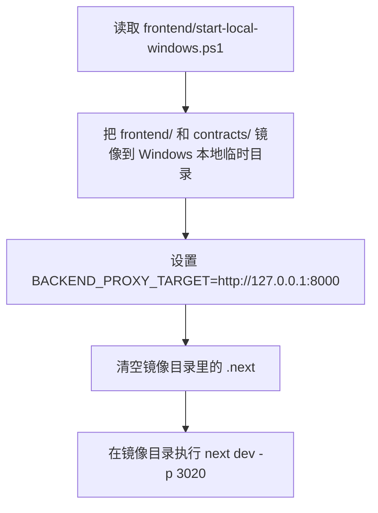

# Startup And Test Runbook

更新时间：2026-03-14 22:27（Asia/Shanghai）

这份文档记录两部分内容：

1. 我这次实际是怎么把前后端跑起来的。
2. 你之后如果要从零启动，应该按什么顺序做。

## 1. 当前运行状态

| 服务 | 地址 | 状态 | 说明 |
| --- | --- | --- | --- |
| Backend | `http://127.0.0.1:8000` | 已运行 | 直接复用了已有的 `uvicorn` 进程 |
| Frontend | `http://127.0.0.1:3020` | 已运行 | 本次由 Windows 镜像脚本新启动 |

## 2. 这次实际启动流程

### 2.1 先检查端口

我先检查了 `8000` 和 `3020`：

```powershell
netstat -ano | Select-String ':8000|:3020'
```

结果：

- `8000` 已经被一个 `python -m uvicorn backend.app.main:app --host 127.0.0.1 --port 8000` 进程占用。
- `3020` 当时未占用。

### 2.2 确认后端是不是本项目，且健康正常

我没有盲目再起一个后端，而是先验证现有 `8000` 是否就是本项目服务：

```powershell
Invoke-RestMethod -Uri http://127.0.0.1:8000/api/v1/health | ConvertTo-Json -Depth 4
```

返回：

```json
{
  "status": "ok",
  "service": "rumor-checking-backend",
  "environment": "development",
  "version": "0.1.0"
}
```

然后我又查了监听进程：

```powershell
Get-CimInstance Win32_Process -Filter "ProcessId = 11164" | Select-Object ProcessId,Name,CommandLine | Format-List
```

确认结果：

- PID：`11164`
- 进程：`python.exe`
- 命令：`python -m uvicorn backend.app.main:app --host 127.0.0.1 --port 8000`

结论：后端已经正常运行，所以本次没有再重复启动第二个后端实例。

### 2.3 启动前端

由于当前仓库路径是 `\\wsl.localhost\...`，直接从 UNC/WSL 路径跑 Next.js dev 容易出 watcher 问题，所以我按仓库现成脚本启动前端：

```powershell
powershell -ExecutionPolicy Bypass -File .\frontend\start-local-windows.ps1 -BackendUrl http://127.0.0.1:8000 -Port 3020
```

本次我用的是后台方式启动，并把输出写入日志：

- 标准输出：`frontend-live-user.out.log`
- 标准错误：`frontend-live-user.err.log`

脚本实际做的事情是：



镜像目录实际落点：

- `C:\Users\WarYan\AppData\Local\Temp\rumor-checking-live\frontend`
- `C:\Users\WarYan\AppData\Local\Temp\rumor-checking-live\contracts`

前端启动日志里已经出现：

- `Next.js 15.5.12`
- `Local: http://localhost:3020`
- `Ready in 4.6s`

### 2.4 验证前端是否真的起来了

我做了两步验证：

```powershell
netstat -ano | Select-String ':3020'
```

确认 `3020` 已监听，对应 PID 为 `16724`。

然后访问页面：

```powershell
(Invoke-WebRequest -Uri http://127.0.0.1:3020 -UseBasicParsing).StatusCode
```

返回 `200`，说明前端页面已经可访问。

我又检查了前端进程：

```powershell
Get-CimInstance Win32_Process -Filter "ProcessId = 16724" | Select-Object ProcessId,Name,CommandLine | Format-List
```

确认结果：

- PID：`16724`
- 进程：`node.exe`
- 运行位置：Windows 本地镜像目录中的 Next.js dev server

## 2.5 本次出现过的一个典型问题

本次曾出现“后端离线”假象，但根因不是后端真的挂了，而是前端本地 dev 代理把目标地址拼成了无效 URL，导致前端自己的健康检查先 `500`。

最终修复方式是：

- 保持后端运行在 `http://127.0.0.1:8000`
- 让前端直接使用 `NEXT_PUBLIC_API_BASE_URL=http://127.0.0.1:8000`
- 继续保留 Windows 本地镜像启动方式，避免 `\\wsl.localhost` watcher 问题

如果你之后看到页面显示“后端离线”，但 `http://127.0.0.1:8000/api/v1/health` 其实是通的，优先重启前端并确认它使用的是更新后的启动脚本。

## 3. 如果你要从零启动，建议按这个顺序

### 3.1 启动后端

在仓库根目录执行：

```bash
python -m pip install -r backend/requirements-dev.txt
python -m uvicorn backend.app.main:app --host 127.0.0.1 --port 8000
```

如果你需要 provider，先准备：

- `backend/.env`
- 或进程环境变量中的 `ANALYSIS_PROVIDER`、`KIMI_API_KEY` 等配置

最小健康检查：

```powershell
Invoke-RestMethod -Uri http://127.0.0.1:8000/api/v1/health | ConvertTo-Json -Depth 4
```

### 3.2 启动前端

如果你当前环境也是 Windows + `\\wsl.localhost\...` 仓库路径，优先用：

```powershell
powershell -ExecutionPolicy Bypass -File .\frontend\start-local-windows.ps1 -BackendUrl http://127.0.0.1:8000 -Port 3020
```

如果你是在 Linux/WSL 本地目录直接运行，没有 UNC watcher 问题，再用：

```bash
cd frontend
npm install
npm run dev
```

### 3.3 启动后做 3 个最小检查

1. 后端健康检查

```powershell
Invoke-RestMethod -Uri http://127.0.0.1:8000/api/v1/health | ConvertTo-Json -Depth 4
```

2. 前端页面可访问

```powershell
(Invoke-WebRequest -Uri http://127.0.0.1:3020 -UseBasicParsing).StatusCode
```

3. 页面打开后，确认状态条和输入框正常显示

- 前端地址：`http://127.0.0.1:3020`
- 后端地址：`http://127.0.0.1:8000/docs`

## 4. 本次相关日志与进程

| 项目 | 值 |
| --- | --- |
| Backend PID | `11164` |
| Frontend PID | `16724` |
| Frontend stdout log | `frontend-live-user.out.log` |
| Frontend stderr log | `frontend-live-user.err.log` |

## 5. 如果你要停止它们

### 停止前端

按 PID 停：

```powershell
Stop-Process -Id 16724
```

### 停止后端

如果你要停当前这个后端实例：

```powershell
Stop-Process -Id 11164
```

## 6. 当前可直接开始测试的地址

- 前端：`http://127.0.0.1:3020`
- 后端健康检查：`http://127.0.0.1:8000/api/v1/health`
- 后端 Swagger：`http://127.0.0.1:8000/docs`


