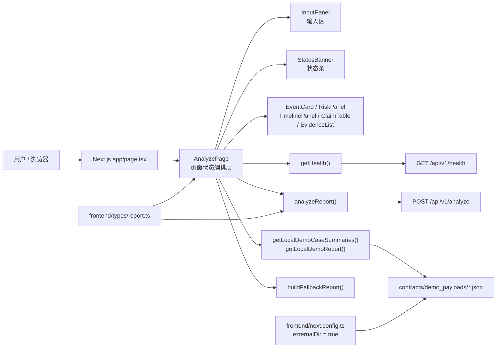
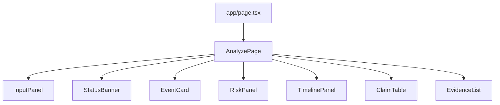
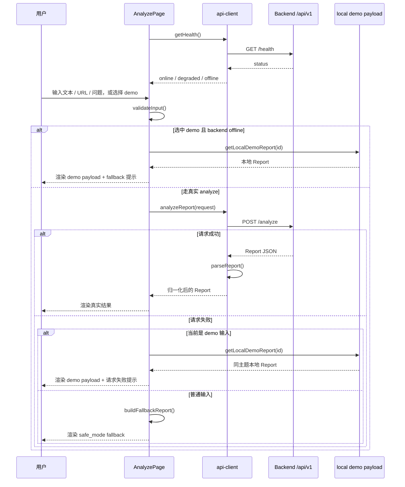

# Cluster-E / Experience Shell 实现总结

更新时间：2026-03-13 20:41（Asia/Shanghai）

## 1. 这份文档是干什么的

这份文档不是简短 README，也不是逐文件清单，而是一份给“接手者 / 评审者 / 演示者”看的完整实现说明。

目标只有一个：让别人不需要反复翻代码，也能快速理解这部分前端为什么这样设计、现在做到哪里、底层依赖了什么、怎么运行、怎么调接口、后续应该从哪里接着改。

## 2. 先看结论

当前 `Cluster-E / Experience Shell` 已经实现成一个可运行的 Next.js 单页工作台，核心特点如下：

- 页面只做一页，但把输入、状态、事件概览、风险、时间线、claim 和 evidence 都串起来了。
- 前端优先调用真实后端 `POST /api/v1/analyze`。
- 页面启动时会先检查真实后端 `GET /api/v1/health`。
- 如果后端离线或请求失败，demo 输入会回退到同主题本地 payload。
- 如果是普通输入且后端失败，页面会进入保守的 `safe_mode` fallback，而不是伪造完整结果。
- 三档模式 `complete_mode / partial_mode / safe_mode` 都已经在页面层做了明确区分。
- 前端 parser、输入校验和证据聚合逻辑已经补了最小 Vitest 单元测试。

一句话概括：这不是静态样板页，而是一个“真实 analyze 优先、离线演示可兜底、边界表达保守”的前端壳。

## 3. 为什么这样设计

### 3.1 设计目标

原始任务来自 `tasks/cluster-e-experience-shell.md`，目标不是单纯把页面画出来，而是把 rumor-checking 的 V1 演示体验落成一个可交互、可联调、可演示的前端工作台。

### 3.2 我采用的四个设计原则

1. 真实链路优先，不做纯假页面。
   前端优先调用真实 `analyze`，这样一旦后端 ready，就能直接进入联调，而不是再返工一轮 mock-to-real 替换。

2. 回退必须保守，不能“演示成功感”压过真实性。
   如果接口失败，页面不能装作分析完成，只能进入 demo payload 或 `safe_mode` fallback，并明确告诉使用者这是回退结果。

3. 类型和 schema 先收口，再做 UI。
   前端先把 `Report`、`Event`、`TimelineNode`、`ClaimResult`、`Evidence` 固定下来，避免组件层到处猜字段。

4. 页面状态统一编排，不让子组件各自发请求。
   这就是为什么 `AnalyzePage` 是核心调度层，而 `InputPanel / StatusBanner / EventCard / TimelinePanel / ClaimTable / EvidenceList / RiskPanel` 都保持展示型职责。

## 4. 一图看懂整体架构



这张图对应的是当前真实代码结构：

- 页面入口很薄，只负责挂载 `AnalyzePage`
- 所有请求、状态和 fallback 决策都集中在 `AnalyzePage`
- 所有后端结果先经过 `api-client.ts` 的 parser 归一化后再进入 UI
- 本地 demo payload 只作为离线演示和请求失败时的兜底数据源

## 5. 底层到底用了什么框架和能力

| 层级 | 技术 / 框架 | 当前用法 | 代码落点 | 说明 |
| --- | --- | --- | --- | --- |
| 页面框架层 | Next.js 15.5.12 | 使用 `app/` 目录的 App Router 组织页面 | `frontend/app/page.tsx`、`frontend/app/layout.tsx` | 当前只有单页，没有拆多路由 |
| 交互层 | React 19.2.4 | 通过 `useState / useEffect / useMemo` 管理页面状态 | `frontend/components/analyze-page.tsx` | 没有引入 Redux、Zustand、React Query |
| 类型层 | TypeScript | 固定 `Report` 及其子结构 | `frontend/types/report.ts` | 前端与后端对齐靠这里收口 |
| 请求层 | 浏览器 `fetch` | 调用真实 `health / analyze` 接口 | `frontend/lib/api-client.ts` | 失败时抛 `ApiClientError` |
| 演示数据层 | 本地 JSON payload | 提供三条稳定 demo 场景 | `frontend/lib/demo-cases.ts`、`contracts/demo_payloads/*.json` | 仅用于离线或失败回退 |
| 样式层 | 原生 CSS | 全局样式和单页布局 | `frontend/app/globals.css` | 没引 Tailwind 或组件库 |
| 测试层 | Vitest 1.6.0 | 覆盖纯函数和 parser | `frontend/vitest.config.ts`、`frontend/lib/__tests__/*.test.ts` | 当前未接 E2E |

这里有两个刻意的“没用”：

- 没用全局状态库，因为当前状态范围只在单页内，集中在 `AnalyzePage` 已够用。
- 没用远端 `demo-cases / replay` 接口，因为当前后端并不存在这两个接口，强行依赖会把前端演示能力绑死在后端未完成能力上。

## 6. 页面逻辑框架怎么组织



### 6.1 为什么 `AnalyzePage` 是核心

`AnalyzePage` 负责五件事：

1. 页面启动时调用 `getHealth()` 判断后端在线状态。
2. 管理输入值、输入类型、demo 选择、最后一次请求等状态。
3. 在提交前做 `validateInput()`。
4. 决定是走真实 `analyze`、本地同主题 demo 回退，还是通用 `safe_mode` fallback。
5. 把最终 `Report` 分发给下面的展示组件。

这意味着下面那些组件都不承担业务编排职责：

- `InputPanel` 只负责收集输入和触发提交。
- `StatusBanner` 只负责把当前状态翻译成可读文案。
- `EventCard / RiskPanel / TimelinePanel / ClaimTable / EvidenceList` 只负责渲染 `Report` 的不同切面。

### 6.2 这样拆的好处

- 后续如果接 `abort / retry / timeout / query cache`，主要改 `AnalyzePage` 就够了。
- 展示组件更容易复用，也更容易单独做 UI 回归。
- 测试可以先从纯函数和 parser 开始，而不用一上来就上重型页面测试。

## 7. 数据模型怎么设计

当前前端最核心的数据模型在 `frontend/types/report.ts`，可以理解成“前端渲染 contract 的唯一入口”。

### 7.1 顶层结构

```ts
interface Report {
  mode: "complete_mode" | "partial_mode" | "safe_mode";
  event: Event;
  timeline: TimelineNode[];
  claim_results: ClaimResult[];
  final_summary: string;
  risks: string[];
  sources: Evidence[];
}
```

### 7.2 关键子结构

| 类型 | 作用 | 核心字段 |
| --- | --- | --- |
| `Event` | 页面顶部事件概览 | `title / summary / source_url / source_name / published_at / keywords / mode` |
| `TimelineNode` | 时间线节点 | `node_type / title / url / source_name / published_at / summary / why_selected` |
| `ClaimResult` | claim 核查结果 | `claim / claim_type / verdict / confidence / evidence / notes` |
| `Evidence` | 证据条目 | `title / url / source_name / published_at / snippet / relevance_reason / source_tier` |
| `AnalyzeRequest` | 发往后端的请求体 | `raw_input / input_type / request_context?` |
| `HealthResponse` | 健康检查响应 | `status / detail?` |

### 7.3 为什么 parser 要做保守归一化

`api-client.ts` 里的 `parseReport()` 不是简单 `as Report` 强转，而是做了几层保守处理：

- 非对象直接抛错，防止 UI 吞掉异常后渲染假数据。
- `mode / verdict / confidence / source_tier` 都做合法值收口。
- 数组字段不合法时回空数组，而不是让组件炸掉。
- 字符串字段缺失时会给出明确的保守默认值，例如“未命名事件”“暂无综合结论”。

这样做的目的不是掩盖后端错误，而是让 UI 在联调初期尽量稳定，同时把“字段不完整”表达成保守页面，而不是前端运行时崩溃。

## 8. 真实接口有哪些，怎么调用

当前前端只依赖两个真实后端接口。

### 8.1 `GET /api/v1/health`

用途：页面启动时判断后端是否在线。

前端调用入口：`getHealth()`

```ts
const health = await getHealth();
```

返回值在前端被收口为：

```ts
interface HealthResponse {
  status: "ok" | "degraded" | "error";
  detail?: string;
}
```

示例调用：

```bash
curl http://localhost:8000/api/v1/health
```

### 8.2 `POST /api/v1/analyze`

用途：提交用户输入，让后端返回完整 `Report`。

前端调用入口：`analyzeReport()`

```ts
const report = await analyzeReport({
  raw_input: "晨星生物已经宣布裁员40%了吗？",
  input_type: "question",
});
```

请求体结构：

```json
{
  "raw_input": "3月1日海州市市场监管局通报海州新鲜屋部分酸奶超过保质期，涉事门店已停业整改，目前未发现大规模食物中毒病例。",
  "input_type": "text"
}
```

响应体前端期望结构：

```json
{
  "mode": "partial_mode",
  "event": {
    "title": "北城区化工厂异味投诉仍处在核查阶段",
    "summary": "居民投诉、企业回应与环保部门核查信息同时存在。",
    "source_url": "https://example.org/input/text-news",
    "source_name": "用户提供文本",
    "published_at": "2026-03-03T00:00:00+08:00",
    "keywords": ["北城区化工厂", "异味"],
    "mode": "partial_mode"
  },
  "timeline": [],
  "claim_results": [],
  "final_summary": "当前已有部分可核验结论，但证据链或时间线仍不完整，需要保留边界。",
  "risks": ["存在相互冲突的证据，不能把单一版本当成最终事实。"],
  "sources": []
}
```

示例调用：

```bash
curl -X POST http://localhost:8000/api/v1/analyze \
  -H "Content-Type: application/json" \
  -d '{
    "raw_input": "晨星生物已经宣布裁员40%了吗？",
    "input_type": "question"
  }'
```

### 8.3 当前明确不依赖的后端接口

当前前端**不依赖**以下接口：

- `GET /api/v1/demo-cases`
- `POST /api/v1/replay`

原因很直接：后端当前没有这两类接口。如果前端继续假设它们存在，页面演示会被未完成的后端能力卡死。

### 8.4 后端地址如何覆盖

默认 base URL：

```bash
http://localhost:8000
```

如需修改：

```bash
NEXT_PUBLIC_API_BASE_URL=http://localhost:8000
```

## 9. 请求、回退和页面状态到底怎么流转



这套流程体现了当前实现最重要的原则：

- demo 不会抢在真实 analyze 前面执行
- 真实 analyze 失败后也不会直接伪造“完整成功页”
- 页面始终把“这是后端真实结果”还是“这是回退结果”说清楚

## 10. 三档模式是怎么落实到页面上的

| 模式 | 页面意图 | 当前页面表现 | 使用边界 |
| --- | --- | --- | --- |
| `complete_mode` | 证据链和时间线都相对完整 | 可以完整展示事件、时间线、claim、证据 | 不应在接口失败时伪造 |
| `partial_mode` | 有部分可验证结果，但仍有缺口或冲突 | 展示已知节点与 claim，同时保留风险和缺口提示 | 不能伪装成“全部查清” |
| `safe_mode` | 关键证据不足，必须保守收口 | 时间线可为空，claim 也可很少，只强调边界和风险 | 禁止输出过度确定结论 |

这个模式区分体现在两个地方：

1. `report.mode` 决定 UI 的状态标签和状态条文案。
2. fallback 逻辑决定什么时候必须落回 `safe_mode`。

## 11. demo 是怎么设计和使用的

### 11.1 当前三条 demo

| demo id | 模式 | 用途 | 示例输入 |
| --- | --- | --- | --- |
| `expired-yogurt` | `complete_mode` | 演示完整模式的时间线和多条 supported claim | 海州酸奶抽检事件 |
| `chemical-odor` | `partial_mode` | 演示 partial 模式下的冲突证据与边界提示 | 北城区化工厂异味核查 |
| `morningstar-layoff` | `safe_mode` | 演示 question-only 的安全模式 | 晨星生物裁员传闻 |

### 11.2 为什么 demo 不直接替代真实请求

当前 demo 的职责是“离线演示和失败兜底”，不是“主链路数据源”。

所以页面行为是：

- 有 demo 时，先把示例输入填进输入框。
- 真正点击提交后，仍然优先走真实 `analyze`。
- 只有在后端离线或请求失败时，才读取本地 demo payload。

这样就同时满足了两个目标：

- 有真实后端时，页面能直接联调。
- 没有真实后端时，页面仍然可演示三档模式。

## 12. 对应任务 E1 ~ E8 现在做到哪里

| 子任务 | 当前状态 | 说明 |
| --- | --- | --- |
| E1 初始化 Next.js 项目骨架 | 已完成 | 已有 `app/`、布局、样式、运行脚本 |
| E2 定义前端类型与 API client | 已完成 | `types/report.ts` 与 `lib/api-client.ts` 已对齐真实后端接口 |
| E3 实现输入区与提交状态 | 已完成 | `InputPanel + StatusBanner` 已接提交、错误和重试 |
| E4 实现事件概览与结论区 | 已完成 | `EventCard + RiskPanel` 已落地 |
| E5 实现时间线面板 | 已完成 | `TimelinePanel` 已支持排序、空态和节点类型 |
| E6 实现 claim 表与证据列表 | 已完成 | `ClaimTable + EvidenceList` 已落地 |
| E7 联通三档模式 | 已完成 | `complete / partial / safe` 已区分展示 |
| E8 增加空态、失败提示和边界说明 | 已完成 | 离线 fallback、失败提示、safe fallback 均已接通 |

如果按任务定义来判断，`Cluster-E / Experience Shell` 的最小实现闭环已经成立。

## 13. 如何使用这部分代码

### 13.1 本地启动

```bash
cd frontend
npm install
npm run dev
```

### 13.2 最常用的验证命令

```bash
npm test
npm run typecheck
npm run build
```

### 13.3 联调使用方式

1. 先启动后端，让它监听 `http://localhost:8000`。
2. 再启动前端。
3. 打开页面后，系统会先检查 `GET /api/v1/health`。
4. 你可以直接输入文本、URL、问题，也可以先点 demo。
5. 点击提交后，页面会优先走真实 `POST /api/v1/analyze`。
6. 如果后端挂了，页面会自动切到 demo payload 或 `safe_mode` fallback。

### 13.4 代码层调用方式

如果后续要在别的页面或组件复用当前能力，最关键的几个入口如下：

```ts
import { analyzeReport, getHealth } from "@/lib/api-client";
import { getLocalDemoCaseSummaries, getLocalDemoReport } from "@/lib/demo-cases";
import { buildFallbackReport, validateInput, getStatusFromMode } from "@/lib/report-utils";
```

最常见的组合方式：

```ts
const validation = validateInput(inputValue, inputType);
if (!validation) {
  const report = await analyzeReport({ raw_input: inputValue, input_type: inputType });
  const status = getStatusFromMode(report.mode);
}
```

## 14. 关键文件从哪里看起

如果别人第一次接手，建议按下面顺序读代码：

1. `frontend/components/analyze-page.tsx`
   先看页面状态和 fallback 总流程。

2. `frontend/lib/api-client.ts`
   再看真实接口怎么调、后端返回怎么被 parser 收口。

3. `frontend/types/report.ts`
   再看前端真正依赖的数据模型。

4. `frontend/lib/demo-cases.ts`
   了解离线 demo 从哪里来。

5. `frontend/lib/report-utils.ts`
   了解输入校验、状态映射、fallback report 和 evidence 聚合。

6. `frontend/components/*.tsx`
   最后看具体展示组件。

## 15. 现在已经实现了什么，没实现什么

### 15.1 已实现

- 单页工作台 UI
- 三档模式表达
- 真实 `health / analyze` 联调入口
- demo 输入与本地 payload 回退
- 输入校验、重试入口、空态与边界文案
- 最小单元测试

### 15.2 尚未实现

- 页面级 smoke test / E2E
- 请求取消、超时控制、并发保护
- 更细的错误码分层展示
- 如果后端后续补 `demo-cases / replay`，对应远端 demo 能力还没恢复
- 与真实后端所有 scenario 的系统性联调验收

## 16. 测试与验证情况

当前已完成的验证：

- `npm test` 通过
- `npm run typecheck` 通过
- `npm run build` 通过

当前测试覆盖内容：

- `parseReport()`：验证完整 payload、稀疏 payload 和非法 payload
- `validateInput()`：验证输入校验
- `getStatusFromMode()`：验证模式映射
- `collectEvidence()`：验证去重和倒序排序

## 17. 当前已知环境问题

这个问题不是业务代码缺陷，而是当前机器环境的执行限制：

- Windows Node 直接操作 `\\wsl.localhost\...` 路径时，`test / build` 可能出现兼容问题。
- 这也是为什么我在验证时优先把 `frontend/` 和 `contracts/` 复制到 Windows 本机临时目录再跑命令。
- 代码层问题已经被排掉；当前剩余风险主要在路径和运行时环境，而不是页面逻辑本身。

## 18. 后续如果继续推进，优先改哪里

建议按这个优先级继续：

1. 先做真实后端 `Report` 输出和前端 parser 的全量联调。
2. 再补 `abort / timeout / retry policy / duplicate submit guard`。
3. 然后加页面级 smoke test，保证展示层不会在字段变化时静默坏掉。
4. 如果后端未来补远端 demo 接口，再决定是否恢复 `demo-cases / replay` 的远端能力。

## 19. 最后的定位总结

这部分前端代码的定位可以概括成三句话：

- 它是 rumor-checking V1 的“单页工作台”，不是单纯的静态展示页。
- 它把真实 analyze 联调、离线演示、保守 fallback 三件事统一到了一个页面状态流里。
- 它当前已经具备继续联调和继续扩展的稳定骨架，后续主要是补强，而不是推倒重写。