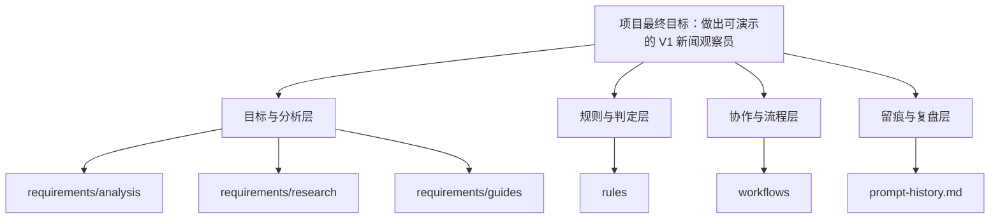

# 当前目标与项目分层说明

## 1. 现在的目标是什么

如果只用一句话总结当前目标：

**我们现在的目标，不是继续扩写分析，而是把“较真新闻观察员”项目收敛成一个两天内可实现、可演示、可解释的 V1 闭环。**

更具体一点，当前目标已经收敛成下面三步：

1. 冻结 V1 的硬边界与关键规则
2. 验证输入、检索、verdict 这三条最小技术链路
3. 在验证通过后，搭一个最小可跑的 Web Demo 骨架

## 2. 当前阶段是什么

当前仓库**还不是代码实现仓库**，更准确地说，它是一个：

- 面向实现前阶段的需求与规则冻结仓库
- 面向答辩的高分导向准备仓库
- 面向 AI 协作的流程和留痕仓库

所以它现在承担的核心任务，不是“把系统写完”，而是：

- 把题目从模糊方向翻译成可执行边界
- 把高分路径从抽象想法翻译成可交付清单
- 把 AI 协作从一次性聊天翻译成可复盘过程

## 3. 当前项目的最小目标画像

结合现有分析文档，V1 的合理目标已经比较清楚：

- 面向单条新闻事件
- 支持新闻文本输入，URL 输入作为增强
- 输出关键来源时间线
- 输出 3 到 5 条 claim 核查结果
- 每条结果尽量带证据来源、时间和链接
- 支持 `supported / refuted / insufficient / conflicting`
- 遇到失败场景能降级，而不是胡乱下结论

换句话说，我们现在追求的是：

**一个可解释、可演示、可控的核查工作台**

而不是：

**一个完整的新闻传播监测平台**

## 4. 为什么现在要停在这个目标上

因为从现有文档反复得出的结论都一样：

- 真正的难点不是页面样式
- 真正的难点不是模型接入
- 真正的难点是边界模糊、证据不稳、两条主线容易同时失控

所以现在最重要的不是“做更多”，而是“把必须做的部分做稳”。

## 5. 项目分层图

这张图表达的是：

- `requirements/` 负责回答“我们要做什么、为什么这样做”
- `rules/` 负责回答“哪些边界和判定必须固定”
- `workflows/` 负责回答“AI 协作时按什么流程做”
- `prompt-history.md` 负责回答“这一路我们做过什么”

## 6. 当前仓库的五层结构

可以把当前仓库理解成 5 层。

### 第一层：目标层

回答的问题是：

- 这个项目最终要交付什么
- 为什么这个方向对题目和评分标准是对的

对应内容主要在：

- 根目录 `README.md`
- `requirements/analysis/01_scope_and_v1_design.md`
- `requirements/research/02_product_benchmark_and_design_goals.md`

### 第二层：分析层

回答的问题是：

- 当前方案已经想清楚了什么
- 还缺什么
- 真正的难点和风险在哪里

对应内容主要在：

- `requirements/analysis/`

这是当前仓库信息密度最高的一层。

### 第三层：规则层

回答的问题是：

- 评分按什么标准看
- 传播链怎样才算关键节点
- evidence / verdict 怎样才算合法
- 失败场景该怎么降级

对应内容主要在：

- `rules/`

这一层的作用是把“能讲清楚”变成“能判定、能执行”。

### 第四层：工作流层

回答的问题是：

- AI 线程怎么协作
- `[Log]`、Prompt 留痕、双层留痕怎么触发
- 过程资料怎么沉淀

对应内容主要在：

- `workflows/`

### 第五层：留痕层

回答的问题是：

- 这个仓库在推进过程中到底做过哪些任务
- 各线程分别负责了什么

对应内容主要在：

- `prompt-history.md`

## 7. 现在最应该怎么读这个仓库

如果你想快速理解当前仓库，建议按这个顺序看：

1. 根目录 `README.md`
2. `overview/01_current_goal_and_layers.md`
3. `overview/02_folder_rationale.md`
4. `requirements/analysis/01_scope_and_v1_design.md`
5. `requirements/analysis/04_implementation_difficulty_analysis.md`
6. `requirements/analysis/07_v1_execution_plan.md`
7. `rules/README.md`
8. `workflows/README.md`

这个顺序的好处是：

- 先建立总目标
- 再理解当前分层
- 再进入具体分析和规则

## 8. 当前最重要的判断

对这个仓库来说，当前最重要的一句话是：

**我们已经基本完成“理解题目”和“冻结方向”的阶段，下一步应该进入“冻结硬规则 + 三项验证 + 最小骨架”的实现前收口阶段。**

