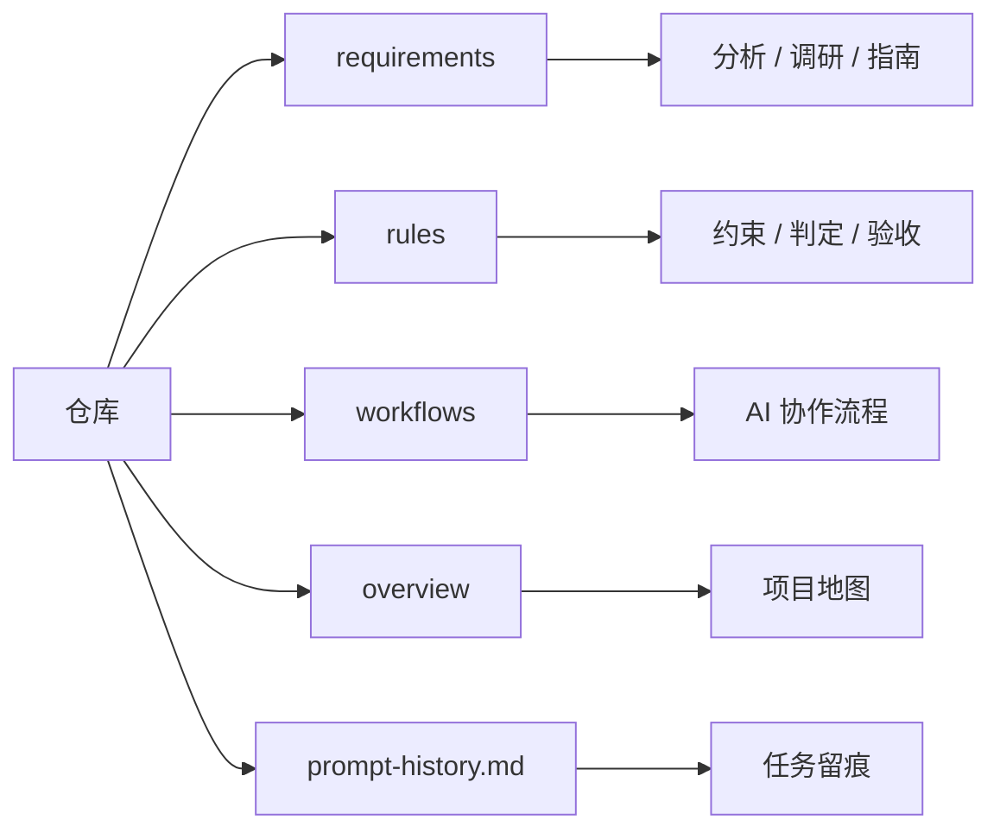

# 为什么需要这些文件夹

## 1. 先说结论

当前仓库里的文件夹并不是随便分的，它们分别承担不同职责。

如果把所有内容都堆在一起，会出现 3 个问题：

1. 不知道哪里是“分析”，哪里是“规则”
2. 不知道哪里是“项目内容”，哪里是“AI 协作流程”
3. 后面进入实现阶段时，很难知道哪些信息该被继承，哪些只是背景材料

所以需要做结构分层。

## 2. 顶层结构图

## 3. 为什么要有 `requirements/`

### 它解决什么问题

`requirements/` 用来回答：

- 项目到底要做什么
- 为什么这样定义 V1
- 已有分析、调研和方案是怎样逐步收敛出来的

### 为什么不能把它并到别处

因为这里承载的是“项目内容本身”的理解，而不是执行规则。

如果没有 `requirements/`：

- 团队会只看到零散规则，却不知道规则服务的目标是什么
- 实现时很容易脱离最初的题目理解
- 后面答辩时也很难讲清“为什么这样设计”

### 它内部为什么还要分层

`requirements/analysis/`

- 放项目内生分析
- 例如边界、难点、缺口、执行计划

`requirements/research/`

- 放外部世界调研
- 例如竞品、开源参考、设计目标反推

`requirements/guides/`

- 放辅助说明和模板
- 例如触发指令总览、Prompt 资产模板、评测模板

这样分的好处是：

- 你能知道某份文档是在“分析自己”
- 还是在“参考外部”
- 还是在“辅助执行”

## 4. 为什么要有 `rules/`

### 它解决什么问题

`rules/` 用来回答：

- 哪些约束是硬边界
- 哪些判定是必须统一的
- 哪些输出格式和验收口径不能再漂

### 为什么不能只靠 `requirements/`

因为分析文档可以讨论、比较、推演，但规则文件负责“定下来”。

比如下面这些内容，最好就不应该只停留在分析里：

- score 对齐规则
- commit 规则
- propagation chain 节点判定
- evidence / verdict 判定
- failure fallback
- random news demo 降级规则

换句话说：

- `requirements/` 更像“为什么”
- `rules/` 更像“最终按什么做”

## 5. 为什么要有 `workflows/`

### 它解决什么问题

`workflows/` 不是在定义产品功能，而是在定义：

- AI 协作时怎么记录
- 多线程怎么分工
- 什么时候只写轻日志
- 什么时候进入 Prompt 资产双层留痕

### 为什么不能并到 `rules/`

因为 `rules/` 面向的是项目产物边界，`workflows/` 面向的是协作过程边界。

一个关注“系统怎么判断”，一个关注“协作怎么推进”。

如果把它们混在一起，会出现：

- 项目规则和协作流程相互打架
- 后续新增 AI 协作规则时很难管理

## 6. 为什么现在要新增 `overview/`

### 它解决什么问题

当前仓库已经有很多分析、规则和流程文档，但缺一个“地图层”。

也就是缺少一层专门解释：

- 仓库当前的总目标是什么
- 它现在处于哪个阶段
- 每个文件夹存在的原因是什么
- 该按什么顺序理解这些内容

### 为什么不能直接只看 README

根目录 `README.md` 适合做入口，但不适合承载太多解释。

如果把所有总览、分层、文件夹职责都塞进一个 README：

- 会变得过长
- 不利于后续继续扩展
- 新人进入仓库时仍然会缺“结构地图”

所以 `overview/` 的价值在于：

- 它不和需求分析抢位置
- 它不和规则文件抢职责
- 它专门承担“解释这个仓库”的任务

## 7. 为什么还要保留 `prompt-history.md`

因为不管分析和规则写得多完整，项目推进过程本身仍然需要留痕。

`prompt-history.md` 的作用是记录：

- 这个仓库最近做过什么任务
- 当时的目标是什么
- AI 采用了什么处理策略
- 后续该怎么交接

它不是规则库，也不是需求文档，而是推进轨迹。

## 8. 一句话理解每一层

你可以这样记：

- `overview/`：解释整个仓库
- `requirements/`：解释项目要做什么
- `rules/`：解释项目必须按什么边界做
- `workflows/`：解释 AI 协作时按什么流程做
- `prompt-history.md`：解释这个仓库已经做到了哪一步

## 9. 当前最合理的后续扩展方式

如果仓库继续演进，我建议保持这个结构：

- 新的项目分析继续进 `requirements/analysis/`
- 新的外部资料继续进 `requirements/research/`
- 新的模板和速查表继续进 `requirements/guides/`
- 新的判定协议和验收规则继续进 `rules/`
- 新的 AI 协作流程继续进 `workflows/`
- 新的总览和结构地图继续进 `overview/`

这样后面进入代码阶段时，仍然能保持清楚的“内容层”和“过程层”分离。
