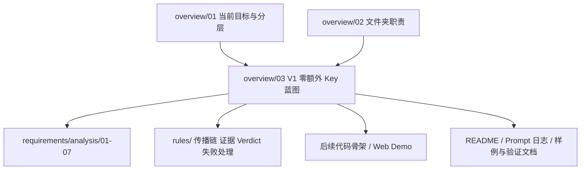
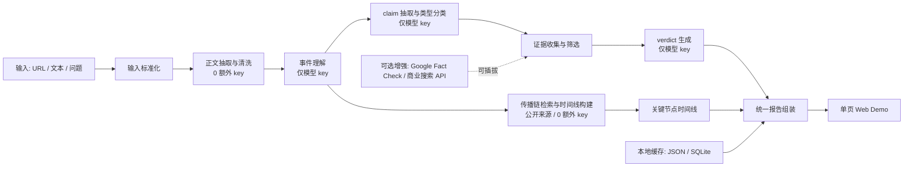
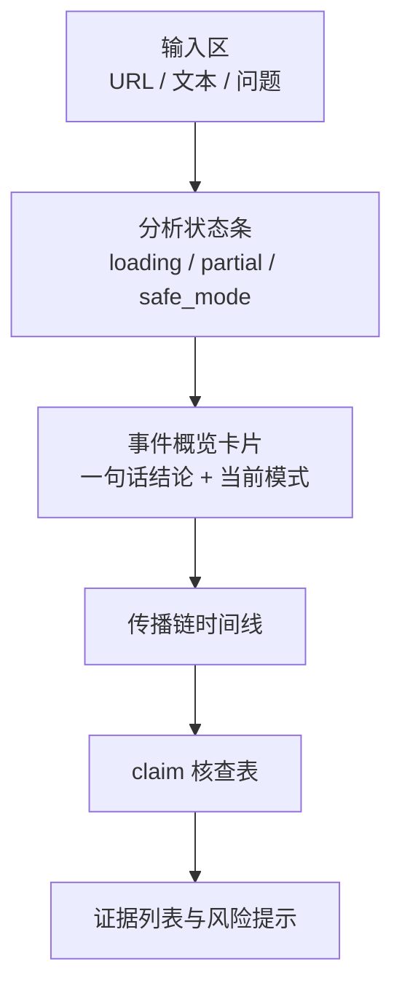
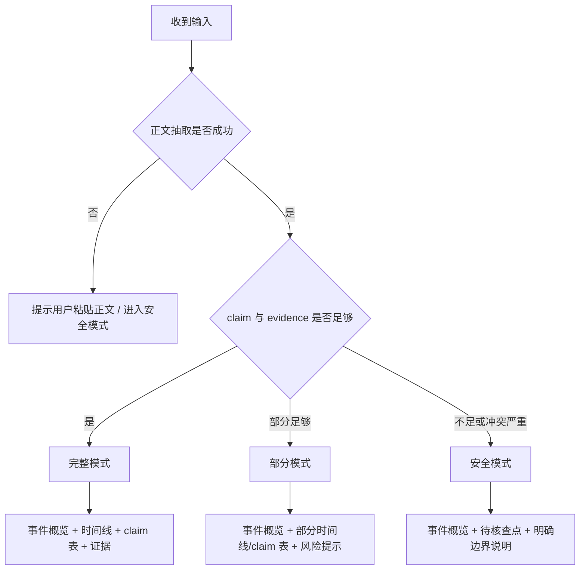

# V1 零额外 Key 实施蓝图

## 1. 这份文档解决什么问题

`overview/` 已经回答了“仓库现在处于什么阶段、各层分别负责什么”，但还缺一份把这些总览信息直接翻译成 **V1 可执行定义** 的桥接文档。

这份蓝图专门回答 4 个问题：

1. 当前 V1 到底要做到什么程度
2. 哪些能力在 V1 中必须做到“除大模型 API key 外 0 额外 key”
3. 现有分析文档分别如何落到 V1 决策上
4. 实现 V1 时必须同步维护哪些文档产物

一句话概括：

> **V1 = 一个面向单条新闻事件、仅依赖大模型 API key、其余链路不强依赖额外 key 的新闻观察员 Web Demo。**

## 2. 先给最终口径

### 2.1 V1 一句话定义

**输入一条新闻文本或 URL，系统生成事件概览、关键来源时间线、3 到 5 条 claim 核查结果，并在证据不足时安全降级。**

### 2.2 V1 的硬边界

- 面向单条新闻事件，不做全网实时监控
- 文本输入必须稳定可用，URL 输入作为增强
- 传播链只承诺“关键来源时间线”，不承诺完整平台传播图
- 内容核查按 `claim -> evidence -> verdict` 做，不做整文一把梭真假判定
- **默认仅允许依赖 1 个必需凭证：大模型 API key**
- 除大模型外，其余链路默认采用：
  - 公开网页
  - 本地缓存
  - 本地文件
  - 可公开访问的数据源

### 2.3 V1 不做什么

- 不做多模态核查
- 不做复杂知识图谱
- 不做大规模实时爬虫
- 不做社交平台全量传播图谱
- 不把 Google Fact Check、商业搜索 API、付费新闻 API 设为必需依赖

## 3. V1 与现有文档的关系地图

## 3.1 上游总览文档

| 文档 | 作用 | 本蓝图如何继承 |
| --- | --- | --- |
| [overview/01_current_goal_and_layers.md](./01_current_goal_and_layers.md) | 定义当前目标是“冻结边界 + 最小闭环 + Web Demo 骨架” | 本蓝图把这一目标进一步收敛成“仅模型 key 必需”的 V1 口径 |
| [overview/02_folder_rationale.md](./02_folder_rationale.md) | 说明仓库为什么分层 | 本蓝图作为 `overview/` 内的“桥接层”，把地图层直接连接到实现前蓝图 |

## 3.2 与所有分析文档的关联矩阵

| 分析文档 | 它提供了什么结论 | 本蓝图采用的 V1 决策 |
| --- | --- | --- |
| [requirements/analysis/01_scope_and_v1_design.md](../requirements/analysis/01_scope_and_v1_design.md) | 定义双核心任务与 V1 的基本形态 | 继承“事件概览 + 时间线 + claim 核查 + 综合结论”的输出结构 |
| [requirements/analysis/02_prototype_review_and_alignment.md](../requirements/analysis/02_prototype_review_and_alignment.md) | 说明当前仓库仍是文档原型仓库 | 明确本蓝图属于“实现前桥接文档”，不是代码原型 |
| [requirements/analysis/03_high_score_gap_analysis.md](../requirements/analysis/03_high_score_gap_analysis.md) | 指出高分缺口在规则、稳定性和 Demo 作战 | 将“0 额外 key、可降级、可解释、文档化”设为 V1 显式要求 |
| [requirements/analysis/04_implementation_difficulty_analysis.md](../requirements/analysis/04_implementation_difficulty_analysis.md) | 强调真正难点是边界、证据和双主线 scope 控制 | 明确 V1 先保传播链时间线和 claim 核查表，不扩第三主线 |
| [requirements/analysis/05_difficulty_summary_and_boundary_confirmation.md](../requirements/analysis/05_difficulty_summary_and_boundary_confirmation.md) | 给出 V1 默认边界与沟通口径 | 直接采纳“文本输入必保、URL 增强、关键来源时间线、3-5 条 claim”的默认口径 |
| [requirements/analysis/06_propagation_vs_verification_depth_review.md](../requirements/analysis/06_propagation_vs_verification_depth_review.md) | 指出传播链表达成熟但协议偏薄、核查框架成熟但规则偏薄 | 将 V1 深度优先级设为“核查主链路更稳，传播链可部分模式降级” |
| [requirements/analysis/07_v1_execution_plan.md](../requirements/analysis/07_v1_execution_plan.md) | 给出执行清单和模块拆分 | 进一步增加“零额外 key 能力矩阵”和“必须同步维护的文档清单” |

## 3.3 V1 在整个仓库里的位置



这张图的意思是：

- `overview/01` 和 `overview/02` 提供“看懂仓库”的上下文
- 本蓝图把这些上下文压缩成一个可执行的 V1
- 之后真正实现时，应沿着本蓝图去消费 `requirements/` 与 `rules/`

## 4. V1 的“零额外 Key”定义

这里的“零额外 Key”不是完全不用任何凭证，而是：

> **除大模型 provider 的 API key 之外，V1 主链路不强依赖任何必须申请的新 key。**

对当前阶段，推荐默认 provider 为 `Kimi API`。因此 V1 的最小必需环境可以被定义为：

```text
KIMI_API_KEY=...
```

除此之外：

- 不要求 Google Fact Check API key
- 不要求商业搜索 API key
- 不要求 News API / GNews API key
- 不要求额外数据库账号
- 不要求自托管向量库账号

## 5. V1 能力矩阵

| 能力 | V1 是否承诺 | 是否需要额外 key | 默认实现 | 失败时如何降级 |
| --- | --- | --- | --- | --- |
| 文本输入分析 | 是 | 否 | 前端文本输入 + 后端标准化 | 提示用户补充上下文，拒绝直接强判 |
| URL 正文抽取 | 是，但作为增强 | 否 | `Crawl4AI` / `news-please` / 标题摘要 fallback | 提示用户粘贴正文继续 |
| 事件摘要与实体抽取 | 是 | 仅模型 key | `Kimi API` | 仅返回基础摘要字段 |
| claim 抽取与类型分类 | 是 | 仅模型 key | `Kimi API` + schema 校验 | 重试 1-2 次，仍失败则进入保守模式 |
| claim 核查 verdict | 是 | 仅模型 key | `claim -> evidence -> verdict` | 默认退到 `insufficient` / `conflicting` |
| 传播链关键时间线 | 是，但允许部分模式 | 否 | 公开网页来源 + 可公开访问的 GDELT 结果 + 本地缓存 | 明确标注“传播链暂不足以完整还原” |
| 外部 fact-check 命中 | 否，属于增强项 | 通常需要 | Google Fact Check / 其他 API | 直接跳过，不影响 V1 主链路 |
| 结果缓存与 demo case | 是 | 否 | 本地 JSON / SQLite | 读取最近一次有效结果 |
| 页面展示与状态切换 | 是 | 否 | 单页 Web Demo | 前端展示 `partial` / `safe_mode` |

## 6. V1 系统蓝图



这张图表达 3 个原则：

1. **模型 key 只服务于理解、抽取、归纳，不替代证据**
2. **传播链与核查并行，但传播链允许更强的降级**
3. **任何外部增强 API 都必须是可插拔的，而不是必需项**

## 7. 前端页面最小形态



页面必须做到：

- 先看结论
- 再看传播链
- 再看 claim 表
- 最后看证据和风险提示

这既继承了 [requirements/analysis/01_scope_and_v1_design.md](../requirements/analysis/01_scope_and_v1_design.md) 的单页闭环思路，也对齐了 [requirements/analysis/03_high_score_gap_analysis.md](../requirements/analysis/03_high_score_gap_analysis.md) 的“结果页一眼读懂”要求。

## 8. 输出模式与失败分流

V1 必须和规则层保持一致，至少支持三档模式：



对应规则来源：

- [rules/evidence_and_verdict_rules.md](../rules/evidence_and_verdict_rules.md)
- [rules/propagation_chain_rules.md](../rules/propagation_chain_rules.md)
- [rules/failure_handling_rules.md](../rules/failure_handling_rules.md)

## 9. V1 最小数据协议

本蓝图直接继承 [requirements/analysis/07_v1_execution_plan.md](../requirements/analysis/07_v1_execution_plan.md) 的协议思路，但把它收口成更适合第一版的 4 个核心对象：

### 9.1 `Event`

- `title`
- `summary`
- `source_url`
- `source_name`
- `published_at`
- `keywords`
- `mode`

### 9.2 `TimelineNode`

- `node_type`
- `title`
- `url`
- `source_name`
- `published_at`
- `summary`
- `why_selected`

### 9.3 `ClaimResult`

- `claim`
- `claim_type`
- `verdict`
- `confidence`
- `evidence[]`
- `notes`

### 9.4 `Report`

- `mode`
- `event`
- `timeline[]`
- `claim_results[]`
- `final_summary`
- `risks[]`
- `sources[]`

## 10. V1 实现阶段必须同步维护的文档

V1 不能只有代码，至少要同步维护下面这些文档产物：

| 文档 | 作用 | 是否 V1 必需 |
| --- | --- | --- |
| 本文档 | 统一 V1 边界、能力矩阵和执行口径 | 是 |
| 根目录 [README.md](../README.md) | 对外说明项目是什么、怎么跑、有哪些限制 | 是 |
| [requirements/guides/04_validation_execution_checklist.md](../requirements/guides/04_validation_execution_checklist.md) | 记录验证项和执行检查清单 | 是 |
| [requirements/guides/05_input_sample_bank_template.md](../requirements/guides/05_input_sample_bank_template.md) | 沉淀 demo case 与失败 case | 是 |
| [prompt-history.md](../prompt-history.md) | 留痕各线程推进过程 | 是 |

如果 V1 后续进入 Prompt 调优、schema 演化和 case 回归，则还要同步进入：

- [rules/prompt_and_eval_rules.md](../rules/prompt_and_eval_rules.md)
- [requirements/guides/02_prompt_asset_templates.md](../requirements/guides/02_prompt_asset_templates.md)

## 11. 推荐的 V1 执行顺序

### 阶段 A：冻结边界

- 认可本蓝图中的 V1 口径
- 锁定三份硬规则
- 明确“只把模型 key 设为必需依赖”

### 阶段 B：先用假数据跑通页面

- 先做单页 UI
- 先做 `Event / TimelineNode / ClaimResult / Report` 四类 schema
- 先返回 mock 数据，保证可演示结构成立

### 阶段 C：接主链路

- 文本输入
- URL 抽取
- Kimi 事件摘要
- Kimi claim 抽取
- evidence 组织
- verdict 输出

### 阶段 D：补传播链和降级

- 接公开来源时间线
- 接缓存
- 接部分模式 / 安全模式

### 阶段 E：补文档和样例

- 更新根 README
- 填 demo case
- 填失败 case
- 填 prompt-history

## 12. V1 Definition of Done

只有同时满足下面条件，才算 V1 真正成立：

1. 用户可以输入新闻文本，并稳定拿到一份报告
2. URL 抽取失败时，系统能明确降级到“请粘贴正文”
3. claim 表至少能稳定输出 3 到 5 条结果
4. verdict 不出现“无证据强判 supported / refuted”
5. 时间线至少能在完整模式或部分模式下输出关键节点
6. 页面显式展示 `loading / partial / safe_mode`
7. 除 `KIMI_API_KEY` 外，主链路不依赖新的外部 key
8. 至少准备 3 条稳定 demo case，并沉淀到样例文档
9. 当前实现、边界和降级逻辑能被 README 与本蓝图讲清楚

## 13. 最终建议

如果要用一句最稳的话来描述当前 V1，可以直接说：

> **我们先做一个“仅依赖大模型 key、其余链路零额外 key、支持部分模式和安全模式”的新闻观察员 Web Demo。**

这个定义同时满足了：

- `overview/` 的总目标收敛
- `requirements/analysis/` 的最小可行结论
- `rules/` 的硬边界约束
- 复试场景对稳定性、可解释性和可演示性的要求
