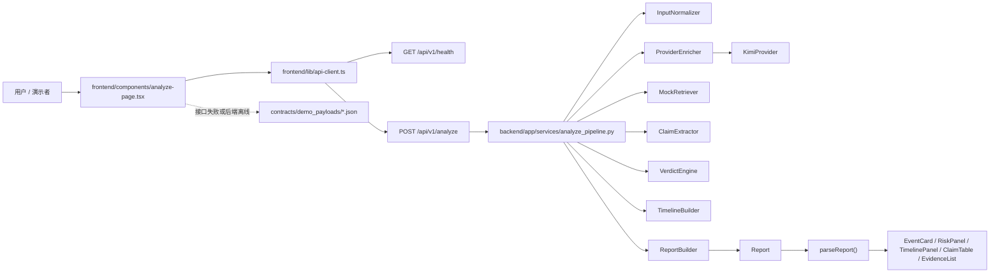

# 当前代码实现总览

## 1. 这份文档解决什么问题

这份文档只描述“仓库现在已经写出来的东西”。

它不是新的规划文档，也不是理想化蓝图，而是给后续 AI 和接手者一个短路径答案：

- 现在实际用了什么技术栈
- 前后端主链路是怎么串起来的
- 模块边界到底落在哪些目录和文件
- 哪些能力是真的已经有了，哪些只是任务计划里写过

## 2. 当前阶段判断

当前项目已经从“方案冻结阶段”进入“最小闭环已成形”的阶段。

当前已经成立的事实是：

- 前端和后端已经通过真实 `POST /api/v1/analyze` 联通
- `contracts/` 已经形成共享 schema 和稳定 demo payload
- 后端已经有统一配置、日志、异常响应和分析流水线
- 前端已经有单页工作台、真实 analyze 优先、离线 fallback 和三档模式展示
- 测试和 demo 已经有基础入口

当前还没有成立的事实是：

- URL 正文抽取已经完成
- verdict / evidence / timeline 已经建立在真实检索上
- replay 数据和演示脚本已经完整收口

## 3. 当前真实技术栈

| 层级 | 当前技术 | 落点 | 用途 |
| --- | --- | --- | --- |
| 前端页面层 | Next.js 15 + React 19 + TypeScript | `frontend/` | 单页 rumor-checking 工作台 |
| 前端样式层 | 原生 CSS | `frontend/app/globals.css` | 页面布局和组件视觉 |
| 前端测试层 | Vitest | `frontend/lib/__tests__/` | 保护 parser 与辅助函数 |
| 后端服务层 | FastAPI | `backend/app/` | 暴露 health / analyze 接口 |
| 后端模型层 | Pydantic v2 | `backend/app/models/schemas.py` | 内部模型与对外响应结构 |
| 后端 provider 调用 | httpx | `backend/app/services/kimi_provider.py` | 调用 Kimi 兼容接口 |
| 后端测试层 | pytest + FastAPI TestClient | `backend/tests/` | API、provider 回退、retrieval foundation 回归 |
| 协议层 | JSON Schema Draft 2020-12 | `contracts/*.schema.json` | 共享字段基线 |
| 评测/演示资产层 | 本地 JSON | `evals/minimal_v1/`、`contracts/demo_payloads/` | case 驱动测试与 demo 回退 |

## 4. 当前端到端主链路

一句话概括当前主链路：

> 前端优先走真实 analyze，后端先用规则链路保证可用，再在前半段接入 provider 增强；如果请求失败，前端再回退到本地 demo payload 或安全模式结果。

## 5. 当前模块边界

## 5.1 `contracts/` 是共享协议源头

这里不是“给前端看一份、给后端看一份”的镜像目录，而是事实上的 schema 基线。

当前已经固定的对象有：

- `Event`
- `TimelineNode`
- `Evidence`
- `ClaimResult`
- `Report`

前后端都没有直接运行这些 JSON Schema，但都围绕它们保持镜像：

- 后端镜像：`backend/app/models/schemas.py`
- 前端镜像：`frontend/types/report.ts`

## 5.2 `backend/` 是分析链路 owner

后端现在已经不是空骨架，而是一条可运行的流水线：

- `main.py`
  - 创建 FastAPI 应用、CORS、中间件和统一异常处理
- `api/v1/endpoints/analyze.py`
  - 接收请求并返回裸 `Report`
- `services/analyze_pipeline.py`
  - 主编排入口
- `services/input_normalizer.py`
  - 输入类型识别、URL fallback、标题/摘要/关键词提取
- `services/provider_enricher.py`
  - provider 输出合并层
- `services/kimi_provider.py`
  - Kimi 调用与 JSON 解析
- `services/mock_retriever.py`
  - 读取 `evals/minimal_v1/retrieval_cases.json` 的 mock 检索层
- `services/claim_extractor.py`
  - 规则 claim 抽取与 provider claim 合并
- `services/verdict_engine.py`
  - 规则 verdict 与 evidence 汇总
- `services/timeline_builder.py`
  - retrieval foundation + 场景模板时间线
- `services/report_builder.py`
  - 组装最终 `Report`

## 5.3 `frontend/` 是交互工作台 owner

前端采用“一个调度页 + 多个展示组件”的结构。

最核心的文件不是 `page.tsx`，而是：

- `frontend/components/analyze-page.tsx`

它负责：

- 页面启动时健康检查
- 输入值和 demo 状态管理
- 提交 analyze 请求
- 请求失败时的 fallback 选择
- 把 `Report` 分发给展示组件

其他组件基本都是展示职责：

- `InputPanel`
- `StatusBanner`
- `EventCard`
- `RiskPanel`
- `TimelinePanel`
- `ClaimTable`
- `EvidenceList`

## 5.4 `evals/` 和 `contracts/demo_payloads/` 是当前稳定资产层

当前仓库里有两套非常关键的 JSON 资产：

- `evals/minimal_v1/*.json`
  - 主要服务后端测试和 mock retrieval
- `contracts/demo_payloads/*.json`
  - 主要服务前端 demo 回退和三档模式展示

这两套资产的作用不同：

- `evals/` 偏验证
- `demo_payloads/` 偏演示

## 6. 当前实现不是“全真实链路”

接手时最容易误判的点有 4 个：

1. 前端虽然走真实 `analyze`，但并不等于后端已经接入真实 evidence 检索。
2. provider 已接入，但只覆盖“事件理解 + claim 抽取增强”的前半段。
3. retrieval/timeline 已经有代码和测试基础，但还不是 `Cluster-D` 的最终形态。
4. demo payload 已经稳定，但 replay 体系和演示脚本仍未完成。

## 7. 当前最值得先读的代码入口

如果要在最短时间内理解整个项目，推荐按下面顺序读代码：

1. `backend/app/services/analyze_pipeline.py`
2. `backend/app/models/schemas.py`
3. `frontend/components/analyze-page.tsx`
4. `frontend/lib/api-client.ts`
5. `contracts/report.schema.json`
6. `backend/tests/test_api.py`
7. `frontend/lib/demo-cases.ts`

## 8. 当前修改时的责任边界

- 改字段名、字段结构、模式枚举：
  先看 `contracts/`
- 改后端分析逻辑：
  主要改 `backend/app/services/`
- 改页面状态流、请求和 fallback：
  主要改 `frontend/components/analyze-page.tsx` 与 `frontend/lib/`
- 改 demo 输入和稳定演示结果：
  主要改 `frontend/lib/demo-cases.ts` 与 `contracts/demo_payloads/`
- 改回归样例：
  主要改 `evals/minimal_v1/` 与 `backend/tests/`

## 9. 一句话结论

当前项目的真实状态不是“只有计划”，也不是“所有能力都已经产品化”。

它已经具备一个能跑通的共享协议、后端主链路、前端工作台、最小测试与稳定 demo 基线；后续工作应该在这个基线上继续补强，而不是再重新发明一套架构。
