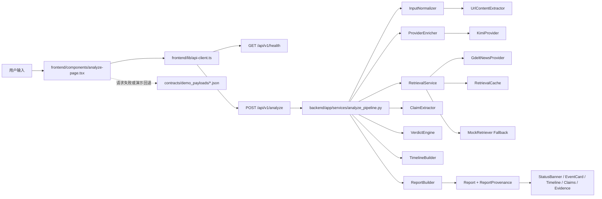

# 当前代码实现总览

## 1. 这份文档的定位

这份文档只描述当前仓库里已经能在代码中找到的实现，不再混入旧阶段判断。

如果你要先确认“哪些状态已经按代码核验过”，先读：

- [../docs/status/current-verified-state.md](../docs/status/current-verified-state.md)

## 2. 当前已成立的事实

- 前端和后端已经通过真实 `POST /api/v1/analyze` 联通。
- 后端主链已经接入 URL 抽取、provider enrichment、retrieval、verdict、timeline 和 provenance 输出。
- 前端已经真实消费 `report.provenance`，能区分 live、mock、replay、demo 和 frontend fallback。
- 当前没有公开的 replay HTTP 接口。

## 3. 当前真实主链路

## 4. 关键代码边界

### 4.1 后端

- `backend/app/services/input_normalizer.py`
  - 输入类型识别、URL 抽取接线、fallback reason 归一化。
- `backend/app/services/url_content_extractor.py`
  - 公开 HTML 页面抽取。
- `backend/app/services/retrieval_service.py`
  - 真实 retrieval、cache、mock fallback。
- `backend/app/services/verdict_engine.py`
  - 基于 evidence pool 的启发式 verdict 判定。
- `backend/app/services/timeline_builder.py`
  - 基于 retrieval 结果的启发式时间线节点选择。
- `backend/app/services/report_builder.py`
  - mode、risk、provenance 汇总。

### 4.2 前端

- `frontend/components/analyze-page.tsx`
  - 健康检查、提交、回退和页面调度。
- `frontend/components/status-banner.tsx`
  - provenance 标签、fallback 提示和模式展示。
- `frontend/lib/report-utils.ts`
  - provenance 状态映射与展示文案。

## 5. 当前不能从代码里推出的结论

- 不能推出“任意新闻 URL 都能稳定抽正文”。
- 不能推出“verdict 和 timeline 已经是完整 grounded reasoning 系统”。
- 不能推出“replay 已经是公开接口能力”。
- 不能推出“随机新闻开放输入已经完成最终验收”。

## 6. 推荐搭配阅读

1. [../backend/README.md](../backend/README.md)
2. [../frontend/README.md](../frontend/README.md)
3. [../backend/docs/api-foundation-implementation-record.md](../backend/docs/api-foundation-implementation-record.md)
4. [../backend/docs/real-retrieval-pipeline.md](../backend/docs/real-retrieval-pipeline.md)
5. [../overview/09_stage-progress-and-task-audit.md](../overview/09_stage-progress-and-task-audit.md)
