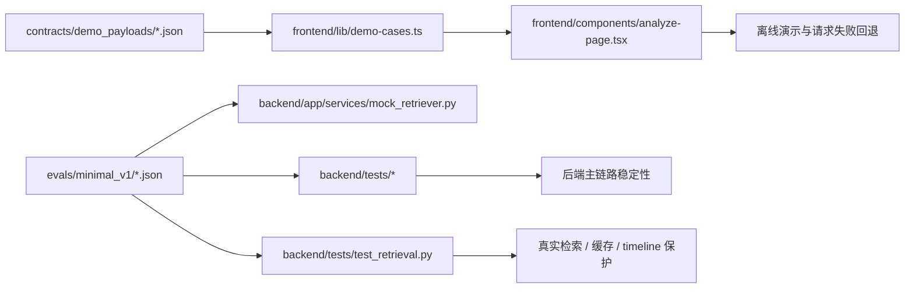

# 测试与 Demo 基线说明

## 1. 文档目的

这份文档专门记录当前 `Cluster-F / Quality Gate` 和 `Cluster-G / Demo Ops` 已经落地的基础能力。

它重点回答 4 个问题：

1. 当前测试是怎么接上 `evals/` 的
2. 已经有哪些真实可跑的回归和 demo
3. 这些测试与 demo 分别保护什么
4. 还有哪些测试和交付项没有真正完成

## 2. 当前完成状态

按任务文件的实际代码状态看，当前已经成立的是：

- `F1` 最小测试集目录接入已完成
- API 层基础回归已经存在
- retrieval / timeline 已经覆盖 mock 与最小真实检索路径
- 前端纯函数与 parser 已有最小单元测试
- `G1` 三条稳定 demo case 已完成并被页面实际消费
- `F7` 演示前 smoke checklist 已完成
- `G5` 演示顺序与口播要点已完成
- `G6` 顶层 README 收口版已完成

按任务定义还没有真正收口的是：

- `F2` `input_cases.json` 全量逐条回归
- `F3` `claim_classification_cases.json` 独立回归
- `F4` `verdict_cases.json` 独立回归
- `F6` `report_mode_cases.json` 独立回归
- `F8` 随机 case 与最终通过记录
- `G2` replay 数据格式
- `G3` 运行方式与环境变量说明进一步收口
- `G4` 已知限制与降级边界进一步统一

## 3. 当前用到的框架与资产

| 方向 | 当前实现 | 代码落点 | 说明 |
| --- | --- | --- | --- |
| 后端接口回归 | `pytest + FastAPI TestClient` | `backend/tests/test_api.py` | 覆盖 health、analyze、错误响应、provider 回退 |
| 后端 retrieval / timeline 回归 | `pytest` | `backend/tests/test_retrieval.py` | 覆盖 mock retrieval、GDELT provider、缓存、失败回退、真实 bundle timeline |
| 测试数据入口 | 本地 JSON fixture | `backend/tests/conftest.py`、`evals/minimal_v1/*.json` | 统一从根目录 eval 资产加载 |
| 前端最小单元测试 | `Vitest` | `frontend/lib/__tests__/` | 保护 parser、输入校验、模式映射、证据聚合 |
| 稳定 demo 注册 | 本地 TS registry | `frontend/lib/demo-cases.ts` | 把 demo 输入和 payload 绑定起来 |
| 稳定 demo 数据 | 本地 JSON payload | `contracts/demo_payloads/*.json` | 提供 complete / partial / safe 三档回退结果 |
| 演示前检查单 | Markdown checklist | `SMOKE_CHECKLIST.md` | 覆盖启动、接口、页面、fallback 和已知限制确认 |

## 4. 当前测试结构

## 4.1 后端 fixture 入口

`backend/tests/conftest.py` 做了两件关键事情：

- 固定仓库根目录下的 `evals/minimal_v1/` 为测试资产入口
- 提供统一的 `load_eval_fixture()` 与 `client()` fixture

这意味着后续补更多 case 回归时，不需要再为每个测试文件单独找数据路径。

## 4.2 `test_api.py` 当前保护什么

当前后端 API 回归已经覆盖：

- `GET /api/v1/health`
- 422 统一错误结构
- 500 统一错误结构
- `complete_mode / partial_mode / safe_mode`
- 前端兼容请求体 `input -> raw_input`
- 裸 `Report` contract 顶层结构
- provider 成功路径
- provider 超时/失败后的规则链路回退

这说明当前 API 侧已经不是“完全没测试”，而是“代表性样例已保护，但 case 资产还没系统性吃干榨尽”。

## 4.3 `test_retrieval.py` 当前保护什么

`backend/tests/test_retrieval.py` 已经不是单纯的 retrieval foundation 验证，而是当前后端“最小真实检索 + 缓存 + timeline”能力的核心保护层。

当前它保护的点包括：

- `MockRetriever` 能从 `retrieval_cases.json` 识别匹配 case
- 检索结果能做标准化、去重归并和 canonical result 选择
- merged result 的元数据不会丢
- `TimelineBuilder` 能基于 retrieval candidates 生成 timeline
- `origin` 和 `turn / clarification` 候选可以按样例校验
- `GdeltNewsProvider` 的配置、超时参数和字段映射不会漂移
- `RetrievalCache` 支持 round-trip、cache-only miss 和 bypass
- provider 失败时能安全回退到 mock
- `question_only` 输入能走真实检索 bundle
- 真实 bundle 也能产出 `origin / amplification / turn / clarification`

这部分非常重要，因为它说明 `Cluster-D` 已经从 mock foundation 走到了最小真实检索阶段。

## 4.4 前端最小测试当前保护什么

前端当前通过 `Vitest` 覆盖了展示层最容易静默坏掉的纯函数：

- `parseReport()`
- `validateInput()`
- `getStatusFromMode()`
- `collectEvidence()`

这里的策略很务实：

- 先保护 parser 和状态映射
- 暂时不直接上页面级 E2E

这样能先降低字段漂移导致的静默渲染错误。

## 5. 当前 Demo 基线

## 5.1 当前稳定 demo 列表

| demo id | 模式 | 输入类型 | 当前用途 | 数据落点 |
| --- | --- | --- | --- | --- |
| `expired-yogurt` | `complete_mode` | `text` | 演示完整时间线、多条 supported claim、高可信来源 | `contracts/demo_payloads/complete_mode_report.json` |
| `chemical-odor` | `partial_mode` | `text` | 演示 conflicting verdict、边界提示和部分完成模式 | `contracts/demo_payloads/partial_mode_report.json` |
| `morningstar-layoff` | `safe_mode` | `question` | 演示证据不足、空时间线和保守收口 | `contracts/demo_payloads/safe_mode_report.json` |

这些 demo 不是单纯的静态示例，而是和前后端当前场景设计相互对齐的：

- 前端用 `frontend/lib/demo-cases.ts` 管理 demo 输入与本地 payload
- 后端 API 测试也围绕相同主题场景构造代表性 case

## 5.2 当前 demo 的实际使用方式

当前页面逻辑不是“点 demo 就只看本地 JSON”，而是：

1. 先把 demo 对应的样例输入填进输入区
2. 用户提交后优先走真实 `POST /api/v1/analyze`
3. 如果后端离线或请求失败，再回退到本地 demo payload

这个设计让 demo 同时承担两种职责：

- 有后端时用于联调
- 无后端时用于稳定演示

## 5.3 当前已交付的演示文档

| 文档 | 当前作用 |
| --- | --- |
| [SMOKE_CHECKLIST.md](/home/forwaryan/mianshi/rumor-checking/SMOKE_CHECKLIST.md) | 演示前环境、接口、页面、fallback 检查单 |
| [DEMO_SCRIPT.md](/home/forwaryan/mianshi/rumor-checking/DEMO_SCRIPT.md) | 5 到 10 分钟演示顺序与口播要点 |
| [README.md](/home/forwaryan/mianshi/rumor-checking/README.md) | 第一次进入仓库时的总入口 |

## 6. 测试与 Demo 的关系

要点是：

- `evals/` 主要服务测试和 mock retrieval
- `contracts/demo_payloads/` 主要服务前端 demo 回退
- 两者都在帮助当前项目维持“能回归、也能演示”的基线

## 7. 现在还缺什么

从测试和 demo 视角看，当前最大的缺口不是“完全没有”，而是“还没有收口成验收体系”。

最缺的是：

- 按 `input / claim / verdict / report_mode` 分层的全量 case 回归
- 最终通过记录
- replay 数据格式
- provenance 和边界口径的进一步统一

## 8. 后续建议

建议按下面顺序继续推进：

1. 先把 `F2 / F3 / F4 / F6` 补成真正按 eval 文件驱动的独立回归。
2. 再补 `F8` 的稳定 demo / 随机 case 最终通过记录。
3. 继续收口 `G2 / G3 / G4`，把 replay、运行说明和边界表达补全。
4. 等 `C10 / C11 / E9` 有进展后，再补一轮演示前真实 smoke 记录。

## 9. 一句话结论

当前测试与 demo 层已经有了真实可用的基础设施，但它们的定位仍然是“开发基线”，还不是“最终验收包”。
