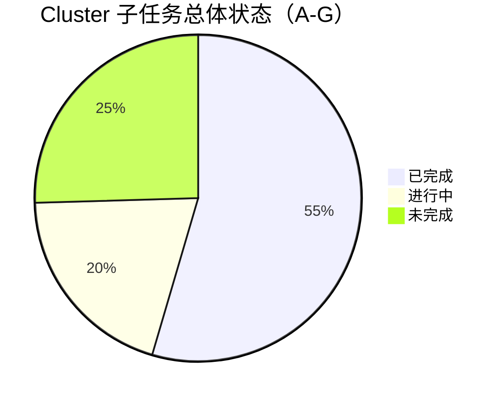
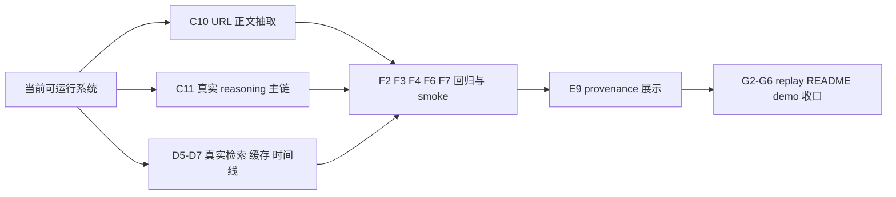

# 09 Stage Progress And Task Audit

更新时间：2026-03-14 00:12（Asia/Shanghai）

## 一句话结论

当前项目已经完成“前后端最小闭环 + mock retrieval/timeline + 基础测试”的阶段，但还不能被定义为“真实 reasoning / 真实检索 / 真实 URL / 真实回归闭环”版本。现在最大的风险不是不能演示，而是 demo、缓存、样例 JSON 和 fallback 太容易被误读成真实分析能力。

## 阶段状态图

## 当前瓶颈路径图

## 阶段判断

| 维度 | 当前结论 | 说明 |
| --- | --- | --- |
| 前端页面壳 | 已完成 | 页面可运行，三档模式、输入区、时间线、claim、evidence 都已接通 |
| 后端主接口 | 已完成 | `POST /api/v1/analyze` 已可返回统一 `Report` |
| 真实 provider | 部分完成 | `C9` 第一阶段完成，但还缺真实在线联调与质量调优 |
| mock retrieval / timeline | 已完成 | `D1-D4` 已形成标准化、去重、时间线闭环 |
| 真实 retrieval / timeline | 未完成 | `D5-D7` 仍未开始 |
| URL 正文抽取 | 未完成 | `C10` 仍未开始 |
| 真实 reasoning 主链 | 未完成 | 后端仍存在 `scenario_library` / 模板 evidence 依赖，已单独拆为 `C11` |
| provenance 表达 | 未完成 | 前端尚不能清楚区分真实结果、demo payload、fallback，已单独拆为 `E9` |
| case 回归与 smoke | 部分完成 | `F5` 已完成，但 `F2/F3/F4/F6/F7/F8` 仍未闭环 |
| demo 收口 | 部分完成 | `G1` 已完成，但 `G2-G6` 仍需等待真实链路稳定 |

## 当前系统为什么还不能算“真实分析”

### 前端侧问题

- [analyze-page.tsx](/home/forwaryan/mianshi/rumor-checking/frontend/components/analyze-page.tsx) 会优先请求真实 `POST /api/v1/analyze`，但请求失败时仍可能落到本地 demo payload 或前端 fallback 生成的 `Report`。
- [demo-cases.ts](/home/forwaryan/mianshi/rumor-checking/frontend/lib/demo-cases.ts) 和 [report-utils.ts](/home/forwaryan/mianshi/rumor-checking/frontend/lib/report-utils.ts) 让页面在离线或失败状态下仍可渲染完整结果，这对演示很有用，但如果没有 provenance 显示，就会模糊真实能力边界。

### 后端侧问题

- [api-foundation-implementation-record.md](/home/forwaryan/mianshi/rumor-checking/backend/docs/api-foundation-implementation-record.md) 已经明确：输入理解虽然开始接真实 provider，但 verdict、evidence、timeline 仍有明显规则化和场景化依赖。
- `AnalyzePipeline -> VerdictEngine -> TimelineBuilder` 虽然已经能稳定吐出 `Report`，但它还没有完全摆脱 `scenario_library`、模板 evidence、mock timeline 的支撑。
- `Cluster-D` 这一轮完成的是 mock 检索闭环，不是真实公开来源检索闭环，所以“会生成时间线”不等于“已经在网上找证据并还原传播链”。

## 本轮对 task 体系的分析与修改

本轮实际修改了以下任务文件与记录文件：

- [tasks/README.md](/home/forwaryan/mianshi/rumor-checking/tasks/README.md)
  - 修复文件截断问题。
  - 新增“当前最高优先级”段，明确 `C10/C11 -> D5-D7 -> F2/F3/F4/F6/F7 -> E9 -> G2-G6` 的推进顺序。
- [cluster-a-control-tower.md](/home/forwaryan/mianshi/rumor-checking/tasks/cluster-a-control-tower.md)
  - 确认 `A1` 为已完成。
  - 更新当前总控判断，从“补文档”切换为“区分真实能力与 demo/fallback”。
  - 修复 `A7` 冻结判断段的损坏内容。
- [cluster-c-api-foundation.md](/home/forwaryan/mianshi/rumor-checking/tasks/cluster-c-api-foundation.md)
  - 把默认聚焦从 `C9/C10` 调整为 `C10/C11`。
  - 明确 `C10` 是 URL 真实可用的第一阻塞点。
  - 新增 `C11`，专门跟踪“从 scenario 占位推进到真实 reasoning-grounded analyze 主链”。
- [cluster-e-experience-shell.md](/home/forwaryan/mianshi/rumor-checking/tasks/cluster-e-experience-shell.md)
  - 保持 `E1-E8` 已完成。
  - 新增 `E9`，专门处理 provenance 展示，避免用户把 demo payload / fallback 误判成真实分析。
- [cluster-f-quality-gate.md](/home/forwaryan/mianshi/rumor-checking/tasks/cluster-f-quality-gate.md)
  - 把 `F5` 回写为已完成。
  - 更新当前测试结论，强调 retrieval/timeline 回归已到位，但整体验收仍未闭环。
- [prompt-history.md](/home/forwaryan/mianshi/rumor-checking/prompt-history.md)
  - 追加本轮 `[log]` 记录，沉淀任务审计和优先级判断。

## 各 task 当前仍未完成的子任务清单

### Cluster-A / Control Tower

- `A3` 进行中：维护任务总表与推进顺序
- `A4` 进行中：审核共享 schema 变更
- `A5` 进行中：处理跨线程冲突与优先级调整
- `A6` 进行中：做里程碑集成验收
- `A7` 未完成：执行最终冻结判断

### Cluster-B / Contract Forge

- `B6` 进行中：写字段说明与边界注释
- `B7` 未完成：约束 schema 变更流程

### Cluster-C / API Foundation

- `C9` 进行中：接入真实 Kimi provider（仍缺真实在线联调和质量调优）
- `C10` 未完成：实现 URL 抽取与 fallback
- `C11` 未完成：把 analyze 主链从 scenario 占位推进到真实 reasoning-grounded 流程

### Cluster-D / Retrieval Lab

- `D5` 未完成：接真实公开来源检索 provider
- `D6` 未完成：接本地缓存与 replay 支持
- `D7` 未完成：强化真实时间线构建

### Cluster-E / Experience Shell

- `E9` 未完成：明确结果来源与运行模式 provenance

### Cluster-F / Quality Gate

- `F2` 进行中：输入标准化 case 回归
- `F3` 未完成：claim 分类 case 回归
- `F4` 进行中：verdict case 回归
- `F6` 进行中：report mode case 回归
- `F7` 未完成：建立演示前 smoke checklist
- `F8` 未完成：跑随机 case 与稳定 demo case

### Cluster-G / Demo Ops

- `G2` 未完成：设计 replay 数据格式
- `G3` 进行中：写运行方式与环境变量说明
- `G4` 进行中：写已知限制与降级边界
- `G5` 未完成：写演示顺序与口播要点
- `G6` 未完成：产出最终 README 收口版

## 当前最该优先拆细的子任务

### 重点一：后端真实 reasoning 主链

对应任务：`C10`、`C11`

建议拆法：

1. 先把 URL 正文抽取跑通，至少能拿到标题、正文、来源域名和抽取失败原因。
2. 盘点 analyze 主链中所有仍依赖 `scenario_library`、模板 evidence、mock timeline 的分支。
3. 明确真实路径和 fallback 路径的分叉条件，不让 `partial/safe` 伪装成完整分析。
4. 给 `Report` 增加稳定 provenance 字段，供前端和测试消费。
5. 用真实输入 + 无证据输入补回归，避免“空证据强判”。

### 重点二：真实检索、缓存、时间线

对应任务：`D5`、`D6`、`D7`

建议拆法：

1. 新增真实检索 provider 抽象，与 mock provider 保持统一 `SearchResult` 输出。
2. 以 `provider + normalized_query + version/date` 设计缓存 key。
3. 缓存 provider 原始响应和标准化响应，支持 replay。
4. 用真实结果跑去重、归并、时间线节点选择，保证 `origin/turn/clarification` 仍可解释。
5. 和 `Cluster-F` 一起补真实检索路径回归。

### 重点三：前端 provenance

对应任务：`E9`

建议拆法：

1. 在结果顶部显示当前来源类型。
2. 把“真实后端返回 / 后端 mock-replay / 前端 demo payload / 前端 fallback”四类结果明确区分。
3. 对缺 provenance 的旧 payload 做保守显示。
4. 为来源标签补测试和说明文案。

## 并行推进建议

| 并行窗口 | 现在该做什么 | 为什么现在就该启动 |
| --- | --- | --- |
| Cluster-C | `C10 + C11` | 这是“不是只会渲染 Report，而是真的会分析”的核心分水岭 |
| Cluster-D | `D5 + D6 + D7` | 真实传播链和时间线仍是当前最大功能空洞 |
| Cluster-F | `F2 + F3 + F4 + F6 + F7` | 不需要等实现全部完成，应该边实现边锁验收线 |
| Cluster-E | `E9` | provenance 不补，演示和评审都会误判当前能力 |
| Cluster-G | 暂缓主攻，仅维护文档 | 真实路径未稳定前，过早做 replay/口播收益很低 |

## 阶段性结论

当前项目最准确的描述是：

- 已经具备“可运行、可演示、可继续并行开发”的 V1 骨架。
- 尚未具备“真实 reasoning、真实公开检索、真实 URL 抽取、真实回归闭环”的 V1 冻结质量。
- 接下来最重要的不是再扩页面，而是把后端真实能力和 provenance 边界补齐。

只要 `C10/C11`、`D5-D7`、`E9`、`F7` 这四组任务打通，项目就会从“像一个系统”明显跨到“是一个系统”。
