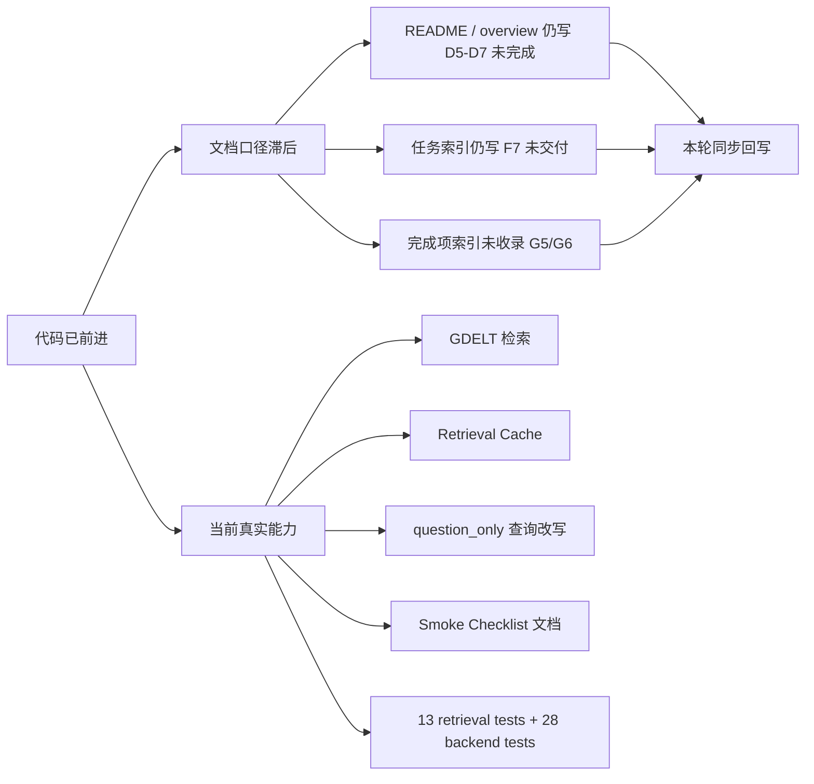

# 09 Stage Progress And Task Audit

更新时间：2026-03-14 16:42（Asia/Shanghai）

## 一句话结论

当前项目已经从“前后端最小闭环 + mock retrieval/timeline”推进到“最小真实检索 + 本地缓存 + smoke 文档已交付”的阶段，但还没有进入“真实 URL 抽取 + reasoning-grounded analyze + 分层回归冻结”的状态。

## 审计总图

## 1. 哪些代码变动此前没有被主文档写清楚

| 代码变动 | 代码落点 | 当前真实状态 | 之前缺在哪里 | 本轮更新落点 |
| --- | --- | --- | --- | --- |
| 检索主链已经从直接 `MockRetriever` 扩成 `RetrievalService -> GdeltNewsProvider / RetrievalCache / Mock fallback` | `backend/app/services/retrieval_service.py`、`backend/app/services/retrieval_provider.py` | 已支持 `RETRIEVAL_PROVIDER=gdelt`、缓存命中、失败回退、空结果回退 | 顶层 README、`overview/06_current_code_implementation.md` 仍主要按 mock retrieval 描述 | `README.md`、`overview/06_current_code_implementation.md` |
| `question_only` 输入已支持查询改写后再走真实检索 | `backend/app/services/retrieval_service.py` | 真实问题输入可走“问题改写 -> 检索 -> 去重 -> timeline” | 总览文档只写了 provider enrichment，没有把问题改写后的检索路径写出来 | `README.md`、`overview/06_current_code_implementation.md` |
| 检索缓存已经支持 `retrieval_cache_only`、`allow_stale_retrieval_cache`、`skip_retrieval_cache/skip_cache` 这些 request-level 控制开关 | `backend/app/services/retrieval_service.py`、`backend/app/services/retrieval_cache.py` | 已支持 cache-only、stale、bypass 和旧别名兼容 | 主文档只写了部分开关，没有把兼容别名和使用边界讲清 | `overview/06_current_code_implementation.md`、`overview/07_quality-and-demo-baseline.md` |
| retrieval 测试已经不只是 mock foundation，还覆盖了 GDELT 参数对齐、缓存 round-trip、provider 失败回退、cache-only miss、skip-cache alias、真实 bundle timeline 选择 | `backend/tests/test_retrieval.py` | `pytest backend/tests/test_retrieval.py -q` 当前 `13 passed` | 测试基线文档仍按“mock retrieval 基础回归”表述 | `overview/07_quality-and-demo-baseline.md` |
| 演示 smoke 文档已经独立交付 | `SMOKE_CHECKLIST.md` | 文档已可直接执行，且后端测试本轮已复跑通过 | README、overview、完成索引仍写“F7 未完成” | `README.md`、`overview/07_quality-and-demo-baseline.md`、`tasks/completed-subtask-doc-index.md` |

说明：

- 这里的“未写清楚”不是说完全没有任何记录，而是“代码已经成立，但总览层/入口层文档仍沿用旧口径”。
- `backend/README.md`、`data/README.md`、`tasks/cluster-d-retrieval-lab.md` 这三份文档已经较完整地记录了 D5-D7，本轮主要补的是顶层入口和导航层。

## 2. 哪些已完成任务此前没有同步到总览文档

| 已完成任务 | 任务文件中的真实状态 | 此前未同步的文档 | 本轮处理 |
| --- | --- | --- | --- |
| `D5` 真实公开来源检索 provider | `tasks/cluster-d-retrieval-lab.md` 已完成 | `README.md`、`overview/06`、`overview/09`、`tasks/README.md`、完成索引 | 已更新 |
| `D6` 本地缓存与 replay 预留入口 | `tasks/cluster-d-retrieval-lab.md` 已完成 | `overview/06`、`overview/07`、完成索引 | 已更新 |
| `D7` 真实时间线构建最小版 | `tasks/cluster-d-retrieval-lab.md` 已完成 | `README.md`、`overview/06`、`overview/09`、完成索引 | 已更新 |
| `F7` 演示前 smoke checklist | `tasks/cluster-f-quality-gate.md` 已完成 | `README.md`、`overview/07`、`overview/09`、完成索引 | 已更新 |
| `G5` 演示顺序与口播要点 | `tasks/cluster-g-demo-ops.md` 已完成 | `overview/07`、`overview/09`、完成索引 | 已更新 |
| `G6` 顶层 README 收口版 | `tasks/cluster-g-demo-ops.md` 已完成 | `overview/07`、`overview/09`、完成索引 | 已更新 |

## 3. 目前正在做的任务有哪些

### 3.1 正在进行中

| Cluster | 子任务 | 状态 | 当前含义 |
| --- | --- | --- | --- |
| A | `A3` | 进行中 | 维护总表、优先级和窗口分工 |
| A | `A4` | 进行中 | 审核共享 schema 变更 |
| A | `A5` | 进行中 | 处理跨线程冲突与优先级调整 |
| A | `A6` | 进行中 | 里程碑集成验收 |
| B | `B6` | 进行中 | 给核心字段补边界说明 |
| C | `C9` | 进行中（第一阶段已完成） | Kimi 已能真实联调，但仍缺质量调优和更稳定的小样本验收 |
| F | `F2` | 进行中 | `input_cases.json` 全量回归 |
| F | `F4` | 进行中 | `verdict_cases.json` 独立回归 |
| F | `F6` | 进行中 | `report_mode_cases.json` 独立回归 |
| G | `G3` | 进行中 | 运行方式与环境变量说明继续收口 |
| G | `G4` | 进行中 | 已知限制与降级边界继续统一 |

### 3.2 当前最值得立刻推进的未完成任务

| 优先级 | 子任务 | 为什么现在优先 |
| --- | --- | --- |
| 1 | `C10` URL 正文抽取 | 这是 URL 输入从“界面支持”变成“真实可用”的首个阻塞点 |
| 2 | `C11` reasoning-grounded analyze 主链 | 当前最核心的能力缺口仍是 verdict/evidence/timeline 没完全摆脱场景占位 |
| 3 | `F2/F3/F4/F6/F8` | 需要把“能跑”收成“可按 eval 文件验收” |
| 4 | `E9` provenance 展示 | 不补来源标签，评审容易把 demo payload / fallback 误判成真实分析 |
| 5 | `G2/G3/G4` | replay、运行说明和边界说明还要进一步收口 |

## 4. 当前阶段判断

| 维度 | 当前结论 | 说明 |
| --- | --- | --- |
| 前端页面壳 | 已完成 | 三档模式、事件卡片、时间线、claim、evidence 都已可用 |
| 后端主接口 | 已完成 | `POST /api/v1/analyze` 可稳定返回 `Report` |
| Kimi provider | 部分完成 | 真实在线调用已打通，但还缺质量调优与验收样本沉淀 |
| mock retrieval / timeline | 已完成 | `D1-D4` 已稳定 |
| 真实 retrieval / timeline | 已完成（最小可用版） | `D5-D7` 已落地 GDELT、缓存、真实 bundle timeline |
| URL 正文抽取 | 未完成 | `C10` 仍是核心缺口 |
| reasoning-grounded analyze | 未完成 | `C11` 仍需削弱 `scenario_library` 与模板 evidence 依赖 |
| provenance 表达 | 未完成 | `E9` 尚未把真实结果、demo payload、fallback 清楚分层 |
| case 回归与 smoke | 部分完成 | `F7` 已交付，`F2/F3/F4/F6/F8` 仍未收口 |
| demo 收口 | 部分完成 | `G5/G6` 已完成，`G2/G3/G4` 仍在推进 |

## 5. 本轮回写了哪些主文档

| 文档 | 回写内容 |
| --- | --- |
| [README.md](/home/forwaryan/mianshi/rumor-checking/README.md) | 修正真实检索、已完成 smoke checklist、当前未完成项 |
| [overview/06_current_code_implementation.md](/home/forwaryan/mianshi/rumor-checking/overview/06_current_code_implementation.md) | 更新当前主链路图和后端模块边界 |
| [overview/07_quality-and-demo-baseline.md](/home/forwaryan/mianshi/rumor-checking/overview/07_quality-and-demo-baseline.md) | 更新测试覆盖、smoke、demo 收口状态 |
| [overview/09_stage-progress-and-task-audit.md](/home/forwaryan/mianshi/rumor-checking/overview/09_stage-progress-and-task-audit.md) | 重新生成当前审计结论 |
| [tasks/README.md](/home/forwaryan/mianshi/rumor-checking/tasks/README.md) | 更新当前最高优先级和 D/F/G 口径 |
| [tasks/completed-subtask-doc-index.md](/home/forwaryan/mianshi/rumor-checking/tasks/completed-subtask-doc-index.md) | 补齐 D5-D7、F7、G5/G6 的完成导航 |

## 6. 本轮验证

| 验证项 | 结果 |
| --- | --- |
| `pytest backend/tests/test_retrieval.py -q` | `13 passed` |
| `pytest backend/tests/test_api.py -q` | `15 passed` |
| `pytest backend/tests -q` | `28 passed` |

## 7. 当前结论

当前最准确的表达已经不是“真实检索还没做”，而是：

- 真实检索、缓存和最小真实时间线已经接入。
- 但 URL 正文抽取、reasoning-grounded analyze、来源 provenance 和分层回归还没有收口。
- 下一波最该优先打的是 `C10 + C11 + F2/F3/F4/F6/F8 + E9`，而不是重新回头解释 `D5-D7` 是否存在。
