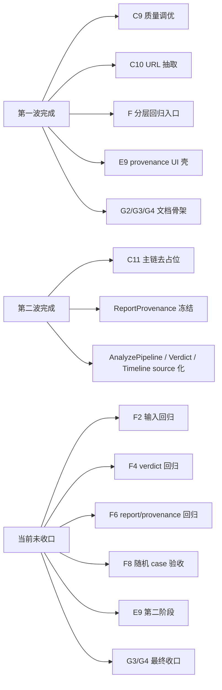

# 09 Stage Progress And Task Audit

更新时间：2026-03-14 20:00（Asia/Shanghai）

## 一句话结论

第一波与第二波的主实现已经推进到“`C10` 完成 + `C11` 第一阶段完成 + API/retrieval 主链可跑”的状态；当前真正没收口的，不再是“有没有主链”，而是“主链在 eval / 随机 case 上是否稳定”，以及“前端和文档是否正确表达 provenance”。

## 审计总图

## 1. 第二波确认完成了哪些关键代码变化

| 代码变化 | 代码落点 | 当前状态 | 对目标的意义 |
| --- | --- | --- | --- |
| `ReportProvenance` 与 source 枚举落入后端 schema | `backend/app/models/schemas.py` | 已落地 | 后端已经能稳定表达结果来源和降级边界。 |
| analyze 主链显式构建 provenance | `backend/app/services/analyze_pipeline.py` | 已落地 | `backend_live / backend_mock / backend_replay` 与 `provider_used / fallback_used` 已可区分。 |
| claim / verdict / timeline 改成带 source 的服务输出 | `backend/app/services/claim_extractor.py`、`backend/app/services/verdict_engine.py`、`backend/app/services/timeline_builder.py` | 已落地 | 主链已经不再只能靠模板 evidence / mock timeline 兜底。 |
| report builder 正式消费 provenance | `backend/app/services/report_builder.py` | 已落地 | mode、risk 与 provenance 已进入同一报告结构。 |
| endpoint 改为按请求实例化 pipeline | `backend/app/api/v1/endpoints/analyze.py` | 已落地 | 避免本地真实 Kimi key 污染测试或联调。 |
| API / retrieval 主链验证更新 | `backend/tests/test_api.py`、`backend/tests/test_retrieval.py` | 已通过 | 当前后端主链已能证明第二波不是只改文档。 |

## 2. 目前哪些任务已经完成，但入口文档还没同步好

| 任务 | 任务文件中的真实状态 | 入口层当前问题 | 需要同步到哪里 |
| --- | --- | --- | --- |
| `C10` | 已完成 | `tasks/README.md`、`overview/09`、`overview/10` 仍按未完成口径描述 | `tasks/README.md`、`overview/09`、`overview/10`、完成索引 |
| `C11` 第一阶段 | 已完成 | 入口层仍按“第二波只剩一个窗口 / 仍未完成”描述 | `tasks/README.md`、`overview/09`、`overview/10`、完成索引 |
| `F3` claim 分类回归 | 已完成 | 完成索引未明确列出 | 完成索引 |
| `E9` 第一阶段 | 已完成 | 入口层未强调“现在已可进入第二阶段” | `tasks/README.md`、`overview/09` |

## 3. 当前仍在进行中的任务

| Cluster | 子任务 | 当前状态 | 当前含义 |
| --- | --- | --- | --- |
| C | `C9` | 进行中 | provider 侧基本完成，仍有少量质量验证与测试适配尾项。 |
| F | `F2` | 进行中 | `input_cases.json` 当前 `1/6` 通过，重点是关键词、`mode_hint` 与 question-only 来源字段。 |
| F | `F4` | 进行中 | `verdict_cases.json` 当前 `4/8` 通过，重点是支持/反驳/冲突保留逻辑。 |
| F | `F6` | 进行中 | `report_mode_cases.json` 当前测试入口还未适配 `provenance` 参数。 |
| F | `F8` | 未完成 | 还没有随机 case 与稳定 demo 的最终验收记录。 |
| E | `E9` 第二阶段 | 未完成 | 后端 provenance 已冻结，可以正式接前端标签与文案。 |
| G | `G3/G4` | 进行中 | 运行说明与边界说明骨架已在，待 `F8` 结果后写最终口径。 |

## 4. 当前验证面

| 验证项 | 结果 | 结论 |
| --- | --- | --- |
| `pytest backend/tests/test_api.py -q` | `16 passed` | API 主链当前稳定。 |
| `pytest backend/tests/test_retrieval.py -q` | `15 passed` | retrieval/timeline 当前稳定。 |
| `pytest backend/tests/test_kimi_provider.py backend/tests/test_kimi_provider_quality.py -q` | `6 passed` | 第一波 Kimi 质量与帮助性测试已适配第二波 endpoint 变化。 |
| `pytest backend/eval_regression_tests -q` | `1 passed, 3 failed` | 当前真正的主阻塞已转移到 `F2 / F4 / F6`。 |

### 4.1 eval 回归失败清单

| 子任务 | 当前失败点 |
| --- | --- |
| `F2` | 关键词缺失、`mode_hint` 仍偏宽、`question_only` 仍伪造 `source_name` |
| `F4` | `supported/high`、`refuted/high`、`conflicting` 的收敛规则仍不稳 |
| `F6` | `ReportBuilder.build()` 已要求 `provenance`，但回归测试入口尚未适配 |

## 5. 当前阶段判断

| 维度 | 当前结论 | 说明 |
| --- | --- | --- |
| 后端主接口 | 已完成 | `POST /api/v1/analyze` 当前稳定返回带 `provenance` 的 `Report`。 |
| URL 正文抽取 | 已完成（第一阶段） | 可直接抓取公开 HTML，并在失败时清晰降级。 |
| reasoning-grounded analyze | 已完成第一阶段 | 已移除模板 evidence / mock timeline 的主链硬依赖，但启发式规则仍需验收。 |
| provenance 后端表达 | 已完成 | 字段已经冻结，可交给前端消费。 |
| provenance 前端展示 | 部分完成 | `E9` 第一阶段完成，第二阶段待接真实字段。 |
| eval 分层回归 | 部分完成 | 入口已建，但 `F2 / F4 / F6` 仍未收口。 |
| 随机新闻最终验收 | 未完成 | `F8` 还没有正式记录。 |
| 文档 / 交付口径 | 部分完成 | 结构和骨架已在，需按当前真实状态重新同步。 |

## 6. 下一波最值得立刻开的并行窗口

| 优先级 | 窗口 | 为什么现在最值当 |
| --- | --- | --- |
| 1 | `W-A / F2` | 输入标准化是所有随机新闻路径的最前置，当前回归最差。 |
| 2 | `W-B / F4` | verdict 冲突/反驳处理直接决定“较真”可信度。 |
| 3 | `W-C / F6` | 这是让 eval 回归重新跟上 C11 结构变化的最低成本窗口。 |
| 4 | `W-D / E9 第二阶段` | 后端 provenance 已冻结，前端现在可以安全接线。 |
| 5 | `W-E / F8` | 只有把随机 case 跑出来，才能证明系统真的向“任意新闻较真”又走了一步。 |
| 6 | `W-F / G3/G4` | 必须基于 `F8` 结果再写最终 README / 边界说明，避免再次漂移。 |

## 7. 当前结论

当前最准确的表达已经不是“第二波还没做”，而是：

- 第二波 `C11` 已完成第一阶段，后端主链已经从“模板占位”推进到“真实输入 + 真实检索 + provenance 输出”。
- 现在最该优先处理的是 `F2 / F4 / F6 / F8`，其次是 `E9` 第二阶段与 `G3/G4` 最终口径收口。
- 对“任意一个新闻都能较真”这个目标来说，当前最大的剩余风险已经从“功能不存在”转成“回归不够稳、随机 case 还没正式验收”。
