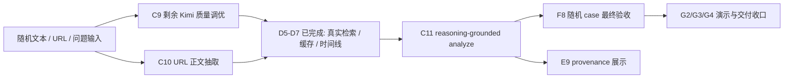
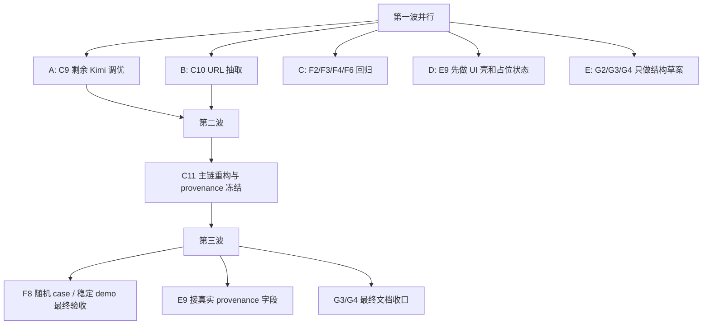

# 10 未完成任务优先级与并行分析

更新时间：2026-03-14 17:15（Asia/Shanghai）

## 1. 一句话判断

如果目标是把系统从“能演示”推进到“对随机新闻更像在较真”，当前未完成任务里最关键的不是文档和 replay，而是：

1. `C9` 剩余的 Kimi 输出质量调优
2. `C10` URL 正文抽取
3. `C11` reasoning-grounded analyze 主链
4. `F8` 用真实链路跑随机 case 的最终验收

需要先明确一个边界：**没有任何单个未完成任务能让系统“保证任何新闻都能较真”**。更准确的说法是，这几项任务能把系统从“主要适合稳定 demo”推进到“面对随机新闻时更常能给出可信的较真结果”。

## 2. 随机新闻较真的核心依赖图



结论：

- `D5-D7` 已经不是当前阻塞点，它们现在是 `C11` 的前置能力。
- 当前真正卡住“随机新闻较真”的，是 `C9` 的剩余质量问题、`C10` 的 URL 缺口、以及 `C11` 的下游推理仍偏场景化。

## 3. 哪些未完成任务最重要

### 3.1 按“能不能支撑随机新闻较真”排序

| 优先级 | 任务 | 是否必须 | 为什么重要 | 如果缺失会怎样 |
| --- | --- | --- | --- | --- |
| P0 | `C11` | 是 | 决定 analyze 是否真正基于输入 + 检索证据 + 保守判定出结果 | 仍会停留在 `scenario_library` / 模板 evidence / fallback 感很重的状态 |
| P0 | `C10` | 是 | 决定 URL 类型的随机新闻能不能进入真实链路 | URL 输入仍只是“界面支持”，不是“真实可用” |
| P0 | `C9` 剩余部分 | 是 | 决定 Kimi 对任意文本新闻的事件理解和 claim 抽取是否足够稳 | 文本型随机新闻仍容易出现 claim 偏保守、标题/摘要质量不稳 |
| P1 | `F8` | 强烈建议 | 决定我们能不能用真实随机 case 证明系统确实比 demo 更进一步 | 只能说“理论上能跑”，很难说“随机新闻也能较真” |
| P1 | `F2/F3/F4/F6` | 强烈建议 | 决定输入、claim、verdict、mode 四个层面有没有系统性回归保护 | 改一处容易坏一片，随机新闻效果不稳定 |
| P2 | `E9` | 不是功能必需，但几乎是演示必需 | 决定评审是否能分清真实结果和 fallback | 很容易把 demo payload 或缓存结果误判成真实较真 |
| P3 | `G2/G3/G4` | 否 | 属于交付和说明收口 | 不影响功能本身，但影响复现和口径 |
| P3 | `A3-A7`、`B6-B7` | 否 | 属于治理和协作规则 | 不直接提升随机新闻较真能力 |

### 3.2 可以直接当成“必须做”的最小集合

如果只保留一组最小必做项，我建议定义为：

- `C9` 剩余质量调优
- `C10`
- `C11`
- `F8`

其中：

- 前三个决定“系统能力是否存在”。
- `F8` 决定“我们是否证明过这套能力真的成立”。

## 4. 哪些任务可以并行，且不容易改到同一批文件

## 4.1 推荐并行分组

| 并行窗口 | 建议任务 | 主要文件范围 | 为什么适合并行 | 冲突风险 |
| --- | --- | --- | --- | --- |
| 窗口 A | `C9` 剩余质量调优 | `backend/app/services/kimi_provider.py`、`backend/app/services/provider_enricher.py`、新增 provider 验收测试文件 | 聚焦 Kimi prompt、输出校验、provider 级验收，不需要碰前端 | 中 |
| 窗口 B | `C10` URL 正文抽取 | 新增 URL 抽取模块、`backend/app/services/input_normalizer.py`、`backend/app/services/analyze_pipeline.py`、URL 相关测试 | 是独立输入链路能力，和前端/文档类任务天然分离 | 中高 |
| 窗口 C | `F2/F3/F4/F6` 分层回归 | `backend/tests/` 下新增 case 回归文件，尽量不改服务实现 | 主要消费已有 eval 资产，天然适合和实现窗口并行 | 低 |
| 窗口 D | `E9` provenance 展示 | `frontend/components/`、`frontend/types/`、`frontend/README.md` | 主要是前端表达层，不需要改后端实现细节 | 低到中 |
| 窗口 E | `G2/G3/G4` | `README.md`、`overview/`、`data/demos/` | 主要是文档和 replay 方案，和主实现文件基本隔离 | 低 |

## 4.2 不建议直接并行的组合

| 冲突组合 | 共同高风险文件 | 为什么容易“并行双死锁” | 建议做法 |
| --- | --- | --- | --- |
| `C10` 和 `C11` | `backend/app/services/analyze_pipeline.py`、`backend/app/services/report_builder.py` | 一个改输入接入，一个改主链推理与 provenance，都会碰编排层 | 先做 `C10`，再做 `C11`；或由同一 owner 持有编排层 |
| `C9` 和 `C11` | `provider_enricher.py`、`analyze_pipeline.py`、可能还有 schema / provenance 字段 | 一个改 Kimi 输出，一个改下游如何消费 Kimi 输出 | 允许并行设计，不建议并行直接改主链代码 |
| `C11` 和 `E9` | 可能涉及 provenance 字段和 report 结构 | 后端字段没冻住前，前端很容易反复改类型和展示逻辑 | 先冻结 provenance 字段，再让 `E9` 接 UI |
| `G3/G4` 和 `C10/C11` | `README.md`、边界说明文案 | 主能力还在变化时，文档窗口容易写旧口径 | 文档窗口只写结构，不抢写最终结论 |

## 4.3 最稳的并行波次



## 5. 哪些任务会去调用真实 Kimi API

### 5.1 直接调用 vs 间接依赖

| 任务 | 是否直接调用真实 Kimi API | 当前作用 | 备注 |
| --- | --- | --- | --- |
| `C9` | 是 | 真正负责 Kimi provider 调用、prompt、结构化 JSON 输出与回退 | 这是唯一“直接 owner” |
| `C10` | 间接是 | URL 抽取完成后，抽出的正文会进入既有 analyze/Kimi 路径 | 不新增 provider，但扩大 Kimi 可覆盖输入类型 |
| `C11` | 间接是 | 决定 Kimi 输出是否真正被下游 verdict / mode / provenance 消费 | 不一定新增 API 调用，但决定 Kimi 是否真的发挥作用 |
| `F8` | 间接是 | 应该在 `ANALYSIS_PROVIDER=kimi` 开启时跑随机 case 验收 | 不负责实现，但负责证明真实 API 帮上了忙 |
| `F2/F3/F4/F6` | 默认否 | 更适合先用固定 fixture 做稳定回归 | 不建议默认绑定真实 API，避免测试波动和成本 |
| `E9`、`G2/G3/G4` | 否 | 只消费结果，不负责调用 | 主要是展示和文档 |

### 5.2 Kimi 路线当前进度

下面的进度判断基于任务文档和现有测试结果，是**按里程碑推断**，不是精确工时估计。

| Kimi 相关任务 | 当前进度判断 | 已完成部分 | 剩余部分 |
| --- | --- | --- | --- |
| `C9` | 约 80% | provider 封装、环境变量、fallback、测试、真实在线 smoke 已完成 | 还缺小样本验收、prompt 调优、输出质量收口 |
| `C10` | 约 0% | 已有任务拆解与边界定义 | 还缺 URL 抽取模块、主链接线、fallback 文案、测试 |
| `C11` | 约 10% | 问题已经定义清楚，`D5-D7` 已经把检索基础补齐 | 还缺 scenario 依赖盘点、主链分叉梳理、provenance 字段、回归测试 |
| `F8` | 约 0% | smoke checklist 已有，demo case 已有 | 还缺真实随机 case 执行、结果记录和风险收口 |

### 5.3 要让“Kimi 真正帮助随机新闻较真”，还差几个任务块

如果只看 Kimi 这条主线，当前还差 **4 个任务块**：

1. `C9` 剩余质量调优
2. `C10` URL 输入接入真实链路
3. `C11` 下游 reasoning-grounded 重构
4. `F8` 用真实随机 case 做最终验收

如果按更细的执行步骤拆，保守估计还差 **14 个小步骤**：

- `C9` 剩余 3 步
  - 建 10 到 20 条真实新闻小样本验收集
  - 调 prompt / 输出约束，压低 claim 偏保守和结构化不稳问题
  - 固定一版验收标准与回归样例
- `C10` 剩余 4 步
  - 实现 URL 抽取模块
  - 接到 `AnalyzePipeline`
  - 补 fallback reason 和提示文案
  - 补 URL 相关测试
- `C11` 剩余 4 步
  - 盘点 `scenario_library` / 模板 evidence 依赖
  - 梳理真实路径与 fallback 路径
  - 稳定 provenance 字段
  - 补真实路径 / 回退路径回归
- `F8` 剩余 3 步
  - 跑稳定 demo case 的真实链路结果
  - 跑随机输入样例并记录模式分布
  - 汇总残余风险与可讲边界

## 6. Kimi 相关任务应该怎么并行分

### 6.1 推荐分成 3 个技术窗口 + 1 个验收窗口

| 窗口 | 负责任务 | 目标 | 文件边界 |
| --- | --- | --- | --- |
| K1 | `C9` 剩余质量调优 | 把 Kimi 的事件理解 / claim 抽取输出调到更稳 | 只碰 `kimi_provider.py`、`provider_enricher.py` 和新增 provider 验收文件 |
| K2 | `C10` URL 抽取 | 让 URL 新闻也能进入真实 Kimi + retrieval 链路 | 只碰 URL 抽取模块、`input_normalizer.py`、`analyze_pipeline.py`、URL 测试 |
| K3 | `C11` 设计先行，代码后置 | 先盘点依赖和设计 provenance；等 K2 接口稳定后再改主链 | 先写设计与测试草案，后再碰 `analyze_pipeline.py`、`verdict_engine.py`、`report_builder.py` |
| K4 | `F8` 验收 | 真实 Kimi 打开后跑随机新闻验收 | 只碰测试记录、smoke 文档和结果表 |

### 6.2 推荐执行顺序

1. `K1` 和 `K2` 可以先并行。
2. `K3` 在第一阶段只做依赖盘点、provenance 字段设计和测试草案，不立即改主链代码。
3. 等 `K2` 把 URL 输入接口冻住后，再让 `K3` 进入代码重构阶段。
4. `K4` 最后收口，负责证明“Kimi 打开以后，随机新闻真的更像在较真”。

## 7. 直接结论

### 7.1 最重要的未完成任务

- `C11`
- `C10`
- `C9` 剩余质量调优
- `F8`

### 7.2 最适合立刻并行的任务

- `C9` 剩余质量调优
- `C10`
- `F2/F3/F4/F6`
- `E9` 的 UI 壳阶段
- `G2/G3/G4` 的结构草案阶段

### 7.3 不要硬并行的任务

- `C10` 和 `C11`
- `C9` 和 `C11` 的主链代码改动阶段
- `C11` 字段未定之前的 `E9` 最终接线阶段

### 7.4 关于真实 Kimi API

- 真正直接调用真实 Kimi API 的 owner 仍是 `C9`。
- 但如果没有 `C10 + C11 + F8`，`C9` 即使已经能调通，也还不能支撑“随机新闻较真”这个目标。

## 8. 可直接复制给窗口的执行 Prompt

使用方式：

1. 先按本节的“波次”分发窗口。
2. 每个窗口拿到 prompt 后，先阅读指定上下文。
3. 正式改任何代码或文档前，必须先把 `本轮执行任务 / 执行步骤` 回写到对应 task 文件。
4. 完成后必须回写任务状态、完成记录、验证结果和交接建议。
5. 如果用户要求 `[log]`，同步更新 `prompt-history.md`。

## 8.1 第一波并行窗口 Prompt

### 窗口 A：C9 剩余质量调优 / Kimi 输出收口

建议线程名：`T-kimi-tuning`

```text
你现在负责窗口 `T-kimi-tuning`，对应 `Cluster-C / API Foundation` 的 `C9` 剩余部分。

你的唯一目标是：把已经打通的真实 Kimi provider，从“能调用”推进到“输出更稳、对随机文本新闻更有帮助”的状态，但不要越界去做 URL 抽取或主链重构。

开始前必须先读：
- `tasks/cluster-c-api-foundation.md`，重点看 `C9`
- `backend/app/services/kimi_provider.py`
- `backend/app/services/provider_enricher.py`
- `backend/app/services/analyze_pipeline.py`
- `backend/tests/test_api.py`
- `backend/README.md`
- `overview/10_unfinished-task-priority-and-parallel-analysis.md`

开始执行前，必须先在 `tasks/cluster-c-api-foundation.md` 的 `C9` 下补：
- `本轮执行任务`
- `执行步骤`

执行要求：
- 只围绕 `C9` 剩余质量调优推进，不去做 `C10` URL 抽取，不去做 `C11` 主链重构。
- 优先改 `kimi_provider.py`、`provider_enricher.py`、provider 验收测试或验收样例；不要随手改前端。
- 必须保留 `ANALYSIS_PROVIDER=off` 和 provider 失败回退行为。
- 如果要做小样本验收，样例要可复用、可回写，不要只停留在聊天记录里。

本轮至少要完成这些事：
1. 建一个 10 到 20 条的小样本验收集，覆盖文本新闻里常见的标题党、传闻问句、真假混杂输入。
2. 调整 Kimi prompt / 结构化输出约束，重点压低 claim 过度保守、字段缺失和事件摘要不稳的问题。
3. 增加一组 provider 级或 API 级验证，证明开关打开后比 `ANALYSIS_PROVIDER=off` 更有帮助，但又不破坏 fallback。
4. 回写 `C9` 的剩余问题和下一步交给 `C10 / C11 / F8` 的接口边界。

验收标准：
- 真实 Kimi 仍能稳定调用，且 schema 不漂移。
- 至少有一组样例能显示“调优前后”的可见差异。
- 现有 API 回退路径不被破坏。

完成后必须回写：
- `tasks/cluster-c-api-foundation.md`
- 相关后端说明文档
- 若产出了样例集或验收表，一并落库
```

### 窗口 B：C10 / URL 正文抽取

建议线程名：`T-impl-api-url`

```text
你现在负责窗口 `T-impl-api-url`，对应 `Cluster-C / API Foundation` 的 `C10`。

你的唯一目标是：完成 URL 正文抽取与 fallback，让系统对 URL 输入不再只有保守占位，而是在可抽取时拿到标题、正文摘要、来源和时间，在失败时仍然清楚降级。

开始前必须先读：
- `tasks/cluster-c-api-foundation.md`，重点看 `C10`
- `backend/docs/api-foundation-implementation-record.md`
- `backend/README.md`
- `backend/app/services/input_normalizer.py`
- `backend/app/services/analyze_pipeline.py`
- `backend/app/models/schemas.py`
- `backend/tests/test_api.py`
- `rules/failure_handling_rules.md`

开始执行前，必须先在 `tasks/cluster-c-api-foundation.md` 的 `C10` 下补：
- `本轮执行任务`
- `执行步骤`

执行要求：
- 只围绕 `C10` 推进，不去改 `C11` 主链判断，不去动前端页面。
- 优先选轻量、无额外 key、本地可跑的 URL 抽取路线。
- 允许新增后端依赖、辅助模块、配置项和测试，但要保持 fallback 清晰。
- URL 抽取失败时，必须继续输出保守结果，而不是让 analyze 崩掉。

本轮至少要完成这些事：
1. 明确 URL 抽取策略和边界：抓什么、不抓什么、失败如何降级。
2. 接入 URL 抽取实现，产出可供 `InputNormalizer` 使用的结构化结果。
3. 把抽取结果接到现有 analyze 主链路里，确保 `title / summary / source_name / published_at` 能被使用。
4. 补测试：至少覆盖 URL 抽取成功、抽取失败、超时/异常 fallback、文本输入不回归。
5. 更新后端说明文档。

验收标准：
- 对可抽取 URL，`POST /api/v1/analyze` 不再只是纯占位事件信息。
- 对不可抽取 URL，仍进入保守模式并给出明确提示。
- 文本输入和问题输入不回归。
```

### 窗口 C：F2/F3/F4/F6 / 分层 eval 回归

建议线程名：`T-eval-regression`

```text
你现在负责窗口 `T-eval-regression`，对应 `Cluster-F / Quality Gate` 的 `F2`、`F3`、`F4`、`F6`。

你的目标是：把当前“代表性 API 测试”推进成“按 eval 文件分层回归”，但不要把自己变成主实现窗口。

开始前必须先读：
- `tasks/cluster-f-quality-gate.md`，重点看 `F2`、`F3`、`F4`、`F6`
- `backend/tests/conftest.py`
- `backend/tests/test_api.py`
- `backend/tests/test_retrieval.py`
- `evals/minimal_v1/input_cases.json`
- `evals/minimal_v1/claim_classification_cases.json`
- `evals/minimal_v1/verdict_cases.json`
- `evals/minimal_v1/report_mode_cases.json`

开始执行前，必须先在 `tasks/cluster-f-quality-gate.md` 的对应子任务下补：
- `本轮执行任务`
- `执行步骤`

执行要求：
- 优先新建独立测试文件，不要和实现窗口争抢同一个服务文件。
- 默认使用固定 fixture，不默认绑真实 Kimi API。
- 只有当测试无法运行且必须最小修复时，才碰实现代码，并把原因写清楚。

本轮至少要完成这些事：
1. 为 `input / claim / verdict / report_mode` 四类 case 建独立回归入口。
2. 输出通过率、失败 case 和失配原因。
3. 把当前最危险的回归缺口标出来，交回 `Cluster-C` 或 `Cluster-E`。
4. 回写 `F2/F3/F4/F6` 状态和验证结论。

验收标准：
- 四类 eval 文件至少各有一层可运行测试。
- 失败不是一句“没过”，而是有可定位的问题清单。
- 不大规模修改业务实现。
```

### 窗口 D：E9 第一阶段 / provenance UI 壳

建议线程名：`T-provenance-ui-shell`

```text
你现在负责窗口 `T-provenance-ui-shell`，对应 `Cluster-E / Experience Shell` 的 `E9` 第一阶段。

你的目标是：先把 provenance 展示的 UI 壳搭起来，让页面能区分来源类型和 fallback 状态，但这轮不要等待 `C11` 最终字段冻结。

开始前必须先读：
- `tasks/cluster-e-experience-shell.md`，重点看 `E9`
- `frontend/components/analyze-page.tsx`
- `frontend/components/status-banner.tsx` 或同类顶部状态组件
- `frontend/types/report.ts`
- `frontend/README.md`
- `overview/10_unfinished-task-priority-and-parallel-analysis.md`

开始执行前，必须先在 `tasks/cluster-e-experience-shell.md` 的 `E9` 下补：
- `本轮执行任务`
- `执行步骤`

执行要求：
- 这轮只做 UI 壳和保守展示，不要求接最终 provenance 字段。
- 可以使用当前前端已知状态、本地 demo 入口、请求失败状态先做来源标签雏形。
- 不去改后端 schema，不抢 `C11` 的字段设计。

本轮至少要完成这些事：
1. 在顶部状态区或报告头部加一层 provenance 展示壳。
2. 先区分“真实后端响应”“本地 demo payload”“前端 safe fallback”三类当前可识别来源。
3. 对来源不明的数据做保守标签，不伪装成真实分析。
4. 补最小前端测试和说明文案。

验收标准：
- 页面上已经能看见 provenance 位置和基本标签。
- 旧 payload 或字段不足场景不会误导用户。
- 不依赖后端本轮同时改字段才能上线 UI 壳。
```

### 窗口 E：G2/G3/G4 第一阶段 / replay 与文档结构草案

建议线程名：`T-doc-structure`

```text
你现在负责窗口 `T-doc-structure`，对应 `Cluster-G / Demo Ops` 的 `G2`、`G3`、`G4` 第一阶段。

你的目标是：先把 replay、运行说明、边界说明的文档结构和占位骨架搭出来，但这轮不要抢写最终能力口径。

开始前必须先读：
- `tasks/cluster-g-demo-ops.md`，重点看 `G2`、`G3`、`G4`
- `README.md`
- `backend/README.md`
- `frontend/README.md`
- `SMOKE_CHECKLIST.md`
- `DEMO_SCRIPT.md`
- `overview/10_unfinished-task-priority-and-parallel-analysis.md`

开始执行前，必须先在 `tasks/cluster-g-demo-ops.md` 的对应子任务下补：
- `本轮执行任务`
- `执行步骤`

执行要求：
- 只做结构草案、目录落点和占位说明，不去抢写 `C10/C11` 尚未稳定的最终结论。
- 重点是让后续收口时有现成文档骨架和 replay 格式草案可填。
- 不改后端主实现和前端主交互。

本轮至少要完成这些事：
1. 定义 replay 数据格式草案与目录落点。
2. 把运行方式与环境变量说明拆出清晰章节结构。
3. 把限制与降级边界整理成后续可直接收口的章节骨架。
4. 在 task 文档中写明哪些段落必须等 `C10/C11/F8` 后再最终落笔。

验收标准：
- replay、运行说明、边界说明都有明确落点。
- 后续窗口可以直接在骨架上补最终内容。
- 本轮不会因为过早定稿而制造新一轮文档漂移。
```

## 8.2 第二波窗口 Prompt

### 窗口 F：C11 / reasoning-grounded analyze 主链重构

建议线程名：`T-real-analyze-core`

```text
你现在负责窗口 `T-real-analyze-core`，对应 `Cluster-C / API Foundation` 的 `C11`。

你的唯一目标是：把 analyze 主链从 `scenario_library` / 模板 evidence 的占位逻辑，推进成更真实地消费输入、Kimi 输出和检索证据的流程，并冻结 provenance 字段边界。

开始前必须先读：
- `tasks/cluster-c-api-foundation.md`，重点看 `C11`
- `backend/app/services/analyze_pipeline.py`
- `backend/app/services/verdict_engine.py`
- `backend/app/services/timeline_builder.py`
- `backend/app/services/report_builder.py`
- `backend/app/models/schemas.py`
- `backend/tests/test_api.py`
- `backend/tests/test_retrieval.py`
- `overview/10_unfinished-task-priority-and-parallel-analysis.md`

开始执行前，必须先在 `tasks/cluster-c-api-foundation.md` 的 `C11` 下补：
- `本轮执行任务`
- `执行步骤`

执行要求：
- 默认假设 `C10` 已经把 URL 输入接口基本稳定；如果还没稳定，先只做设计盘点与测试草案。
- 这轮是主链重构，不去做前端页面，也不去重做 Kimi provider 本身。
- 可以调整 schema / provenance 字段，但必须写清楚给 `E9` 的消费边界。
- 必须保留 `safe_mode / partial_mode` 的保守降级，不允许空证据强判。

本轮至少要完成这些事：
1. 盘点并削弱 `scenario_library`、模板 evidence、mock timeline 对主链的硬依赖。
2. 梳理真实路径与 fallback 路径的分叉条件。
3. 为 `Report` 冻结 provenance 输入，让前端能区分真实后端、mock / replay、demo payload 和 frontend fallback。
4. 补真实路径、回退路径和无证据保守判定的回归测试。
5. 明确交给 `E9` 和 `F8` 的字段与验证口径。

验收标准：
- analyze 结果更少依赖场景占位，更多依赖真实输入 + 检索证据。
- provenance 字段已冻结到可供前端接线。
- 回归测试覆盖真实路径和回退路径。
```

## 8.3 第三波窗口 Prompt

### 窗口 G：F8 / 随机 case 与稳定 demo 最终验收

建议线程名：`T-random-news-acceptance`

```text
你现在负责窗口 `T-random-news-acceptance`，对应 `Cluster-F / Quality Gate` 的 `F8`。

你的目标是：在 `ANALYSIS_PROVIDER=kimi` 和当前真实检索链路打开的前提下，真正跑一轮稳定 demo case + 随机新闻输入，形成可以对外说明的通过记录与残余风险清单。

开始前必须先读：
- `tasks/cluster-f-quality-gate.md`，重点看 `F8`
- `SMOKE_CHECKLIST.md`
- `DEMO_SCRIPT.md`
- `backend/README.md`
- `frontend/README.md`
- `overview/10_unfinished-task-priority-and-parallel-analysis.md`

开始执行前，必须先在 `tasks/cluster-f-quality-gate.md` 的 `F8` 下补：
- `本轮执行任务`
- `执行步骤`

执行要求：
- 这轮重点是验收记录，不是继续大改主实现。
- 随机 case 要记录输入类型、模式、是否有检索证据、是否命中 fallback、主要失败原因。
- 若发现阻断性 bug，可以最小化修复，但必须回写原因。

本轮至少要完成这些事：
1. 跑三条稳定 demo case 的真实链路结果。
2. 跑一组随机文本 / 问题 / URL 输入样例，并记录模式分布与失败原因。
3. 汇总“现在能怎么讲，不能怎么讲”的风险清单。
4. 回写 `F8` 状态和最终结论。

验收标准：
- 至少形成一份可引用的随机 case 结果记录。
- 结论里区分“能力成立”“能力不稳”“能力尚缺”。
- 演示口径和真实结果不打架。
```

### 窗口 H：E9 第二阶段 / 接真实 provenance 字段

建议线程名：`T-provenance-final`

```text
你现在负责窗口 `T-provenance-final`，对应 `Cluster-E / Experience Shell` 的 `E9` 第二阶段。

你的目标是：消费 `C11` 冻结下来的 provenance 字段，把前端来源展示从 UI 壳升级成真实接线版本。

开始前必须先读：
- `tasks/cluster-e-experience-shell.md`，重点看 `E9`
- `frontend/components/analyze-page.tsx`
- `frontend/types/report.ts`
- `backend/app/models/schemas.py` 或当前冻结下来的 provenance 字段说明
- `overview/10_unfinished-task-priority-and-parallel-analysis.md`

开始执行前，必须先在 `tasks/cluster-e-experience-shell.md` 的 `E9` 下补：
- `本轮执行任务`
- `执行步骤`

执行要求：
- 默认假设 `C11` 已经冻结 provenance 字段；如果没有，先停在类型和占位层，不要自己发明最终字段。
- 必须把“真实后端 / 后端 mock or replay / 本地 demo / 前端 fallback”讲清楚。
- 需要同步补前端测试和说明文案。

本轮至少要完成这些事：
1. 接上真实 provenance 字段。
2. 完整区分四类来源。
3. 对缺字段或旧数据做保守降级。
4. 回写 README / 说明文案，保证演示口径一致。

验收标准：
- 页面上能稳定看出结果来源。
- 不再把 demo payload 或 fallback 误讲成真实分析。
```

### 窗口 I：G3/G4 最终收口 / README 与边界说明定稿

建议线程名：`T-final-doc-pack`

```text
你现在负责窗口 `T-final-doc-pack`，对应 `Cluster-G / Demo Ops` 的 `G3`、`G4` 最终阶段。

你的目标是：基于 `C10/C11/F8/E9` 已经稳定下来的现实，完成运行说明、环境变量说明、限制与降级边界的最终定稿。

开始前必须先读：
- `tasks/cluster-g-demo-ops.md`，重点看 `G3`、`G4`
- `README.md`
- `backend/README.md`
- `frontend/README.md`
- `SMOKE_CHECKLIST.md`
- `overview/10_unfinished-task-priority-and-parallel-analysis.md`
- `F8` 的最终验收记录

开始执行前，必须先在 `tasks/cluster-g-demo-ops.md` 的对应子任务下补：
- `本轮执行任务`
- `执行步骤`

执行要求：
- 这轮才允许写最终口径。
- 必须以 `F8` 的真实验收结果和 `E9` 的实际展示为准，不凭想象补文档。
- 重点是把“怎么跑、哪里稳、哪里不稳、哪些会降级”写到第一次进仓库的人也能理解。

本轮至少要完成这些事：
1. 收口前后端运行方式与环境变量说明。
2. 定稿已知限制、降级边界和不要过度宣称的地方。
3. 如果 `G2` replay 方案已成熟，把它纳入最终文档；如果未成熟，明确标为后续项。
4. 回写 `G3/G4` 状态和交付结论。

验收标准：
- 顶层 README、前后端 README 和说明文档之间口径一致。
- 读者不需要先读 task 文件，也能知道项目当前真实能力边界。
```

## 8.4 推荐分发顺序

1. 第一波先并发发出：窗口 A、B、C、D、E。
2. 第二波等 `C10` 基本稳定后，再发窗口 F。
3. 第三波等 `C11` 冻结 provenance 且主链稳定后，再发窗口 G、H、I。
4. 如果窗口数量不够，优先保留 `A + B + C`，其次是 `F`，最后再补 `D/E/G/H/I`。
