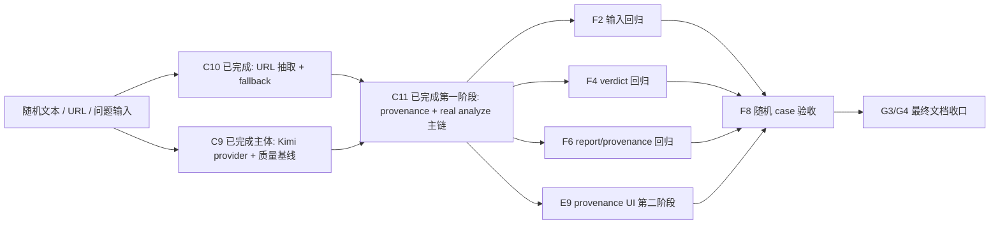
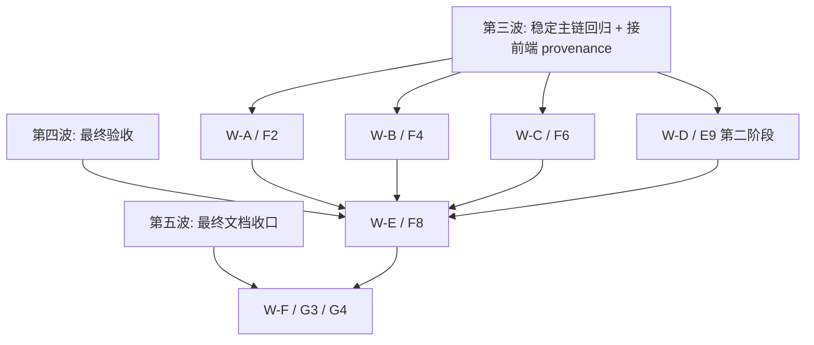

# 10 未完成任务优先级与并行分析

更新时间：2026-03-14 20:15（Asia/Shanghai）

## 1. 一句话判断

`C10` 已完成，`C11` 已完成第一阶段，因此当前“还需要执行的任务”已经进入 **验收 + 表达 + 最终收口** 阶段。现在最值得并行的，不再是 `C10 / C11` 本体，而是：

1. `F2` 输入标准化回归收口
2. `F4` verdict 回归收口
3. `F6` report mode / provenance 回归适配
4. `E9` 第二阶段 provenance UI 接线
5. `F8` 随机 case / 稳定 demo 最终验收
6. `G3 / G4` 最终运行口径与边界说明收口

## 2. 当前离“任意新闻都能较真”还差什么



结论：

- 现在最大的缺口不是“后端没有能力”，而是“后端能力还没有被 eval 和随机 case 证明稳定”。
- 对“任意新闻都能较真”这个目标，`F2 / F4 / F6 / F8` 比重新开 `C10 / C11` 更重要。

## 3. 当前未完成任务的重要性排序

| 优先级 | 任务 | 是否必须 | 为什么重要 | 如果缺失会怎样 |
| --- | --- | --- | --- | --- |
| P0 | `F8` | 是 | 决定我们能不能拿随机新闻和稳定 demo 真正证明当前主链有效 | 只能说“看起来能跑”，不能说“随机新闻也能较真” |
| P0 | `F4` | 是 | 决定支持/反驳/冲突的最终可信度 | 很容易把冲突 case 讲错成强支持或保守不足 |
| P0 | `F2` | 是 | 决定随机输入最前面的关键词、来源、mode_hint 是否可靠 | 输入一进来就歪，后面链路再强也会受限 |
| P0 | `F6` | 是 | 决定 eval 回归能不能跟上新的 `provenance` / report contract | 当前连测试口都没完全适配好，很难说已经冻结 |
| P1 | `E9` 第二阶段 | 强烈建议 | 决定用户是否能分清真实后端 / mock / replay / fallback | 演示时很容易把 demo 或 fallback 误讲成真实较真 |
| P1 | `G3 / G4` | 强烈建议 | 决定运行方式、边界说明和 README 是否说真话 | 功能存在，但协作者无法准确复现或讲清 |
| P2 | `C9` 残余质量验证 | 建议 | 当前主体已完成，只剩少量帮助性测试/文档尾项 | 不会阻断主链，但会拖慢“随机文本更有帮助”的证明 |

## 4. 当前最适合立刻并行的窗口

| 并行窗口 | 负责任务 | 主要文件范围 | 为什么适合并行 | 冲突风险 |
| --- | --- | --- | --- | --- |
| `W-A` | `F2` 输入回归收口 | `backend/eval_regression_tests/test_input_eval_regression.py`、`backend/app/services/input_normalizer.py` | 主要聚焦输入层，不碰 verdict / 前端 | 中 |
| `W-B` | `F4` verdict 回归收口 | `backend/eval_regression_tests/test_verdict_eval_regression.py`、`backend/app/services/verdict_engine.py` | 主要聚焦 verdict/confidence/冲突保留 | 中 |
| `W-C` | `F6` report mode / provenance 回归适配 | `backend/eval_regression_tests/test_report_mode_eval_regression.py`、`backend/app/services/report_builder.py` | 主要是测试口和 report mode 逻辑，不碰输入层 | 中 |
| `W-D` | `E9` 第二阶段 | `frontend/components/analyze-page.tsx`、`frontend/components/status-banner.tsx`、`frontend/types/report.ts` | 后端 provenance 已冻结，可以安全接前端 | 低 |
| `W-E` | `F8` 最终验收 | `SMOKE_CHECKLIST.md`、验收记录文档、稳定 demo / 随机 case 清单 | 主要消费现有能力，不必改核心实现 | 低 |
| `W-F` | `G3 / G4` 最终文档收口 | `README.md`、`overview/11_runtime-and-env-outline.md`、`overview/12_limits-and-degradation-outline.md` | 等 `F8` 给出结果后即可落最终口径 | 低 |

## 5. 哪些任务不建议直接并行

| 冲突组合 | 共同高风险文件 | 为什么容易冲突 | 建议做法 |
| --- | --- | --- | --- |
| `W-A / F2` 和 `W-B / F4` 如果都顺手改主链 | `backend/app/services/analyze_pipeline.py` | 一个想从输入修，一个想从 verdict 修，容易把主链编排也一起改乱 | 约束窗口只改各自入口与最小实现文件 |
| `W-C / F6` 和 `W-D / E9` 同时改 contract | `backend/app/models/schemas.py`、`frontend/types/report.ts` | 如果后端还在改 provenance contract，前端会反复跟 | 先以当前 frozen 字段为准，`W-C` 不再改 schema |
| `W-E / F8` 和任何实现窗口 | 验收记录文档、README | 验收窗口应该消费结果，不应该一边测一边改主实现 | `F8` 只在必要时回提问题，不自己做核心实现 |
| `W-F / G3/G4` 和 `W-E / F8` 前置未定时 | `README.md`、边界说明文档 | 没有随机 case 结果时，最终文档很容易提前写死旧口径 | `G3/G4` 最终版必须等 `F8` |

## 6. 哪些任务会去调用真实 Kimi API

| 任务 | 是否直接调用真实 Kimi API | 当前作用 |
| --- | --- | --- |
| `C9` 残余质量验证 | 是 | 负责 provider 级帮助性验证与残余测试适配 |
| `F8` | 间接是 | 在 `ANALYSIS_PROVIDER=kimi` 打开时，验证随机新闻是否真的更有帮助 |
| `F2 / F4 / F6` | 否 | 默认应使用固定 fixture，避免把随机波动带入回归 |
| `E9`、`G3/G4` | 否 | 只消费结果和口径，不负责调用 |

结论：

- 真实 Kimi API 的直接 owner 现在仍是 `C9`。
- 但要支撑“任意新闻都能较真”，当前真正关键的是 `F2 / F4 / F6 / F8` 把第二波产出的主链证明出来。

## 7. 剩余任务并行波次总图



### 7.1 第三波并行任务总表

| 波次 | 窗口 | 任务 | 前置条件 | 完成标准 |
| --- | --- | --- | --- | --- |
| 第三波 | `W-A` | `F2` 输入回归收口 | `C11` 第一阶段已完成 | `input_cases.json` 失败项显著下降，并形成新的通过率记录 |
| 第三波 | `W-B` | `F4` verdict 回归收口 | `C11` 第一阶段已完成 | `verdict_cases.json` 关键失败项收敛 |
| 第三波 | `W-C` | `F6` report/provenance 回归适配 | `ReportProvenance` 已冻结 | `report_mode_cases.json` 回归入口适配成功 |
| 第三波 | `W-D` | `E9` 第二阶段 | 后端 provenance 已冻结 | 前端能区分 live/mock/replay/demo/fallback |

### 7.2 第四波并行任务总表

| 波次 | 窗口 | 任务 | 前置条件 | 完成标准 |
| --- | --- | --- | --- | --- |
| 第四波 | `W-E` | `F8` 随机 case / 稳定 demo 最终验收 | 第三波主要回归已完成或至少口径已稳定 | 有正式验收记录、mode 分布、provenance 分布与典型失败样本 |

### 7.3 第五波并行任务总表

| 波次 | 窗口 | 任务 | 前置条件 | 完成标准 |
| --- | --- | --- | --- | --- |
| 第五波 | `W-F` | `G3 / G4` 最终运行说明与边界收口 | `F8` 已产出正式结论 | README / overview / runtime / limits 文档统一到最终口径 |

## 8. 每个波次的详细执行 Prompt

使用方式：

1. 先按本节分发波次。
2. 每个窗口拿到 prompt 后，先阅读指定上下文。
3. 正式改任何代码或文档前，必须先把 `本轮执行任务 / 执行步骤` 回写到对应 task 文件。
4. 完成后必须回写任务状态、完成记录、验证结果和交接建议。
5. 如果用户要求 `[log]`，同步更新 `prompt-history.md`。

### 8.1 第三波 / 窗口 A / `F2` 输入标准化回归收口

建议线程名：`T-input-regression-close`

```text
你现在负责窗口 `T-input-regression-close`，对应 `Cluster-F / Quality Gate` 的 `F2`。

你的目标是：把 `input_cases.json` 的失败项收敛到可解释、可回归的状态，优先解决关键词缺失、`mode_hint` 过宽和 `question_only` 来源伪造问题。

开始前必须先读：
- `tasks/cluster-f-quality-gate.md`，重点看 `F2`
- `backend/eval_regression_tests/test_input_eval_regression.py`
- `evals/minimal_v1/input_cases.json`
- `backend/app/services/input_normalizer.py`
- `backend/tests/test_api.py`
- `overview/10_unfinished-task-priority-and-parallel-analysis.md`

开始执行前，必须先在 `tasks/cluster-f-quality-gate.md` 的 `F2` 下补：
- `本轮执行任务`
- `执行步骤`

执行边界：
- 只聚焦输入标准化，不去顺手改 verdict 或前端。
- 若需要改实现，限定在 `InputNormalizer` 或与其直接相关的最小 helper。
- 不要顺手修改 `ReportBuilder`、`VerdictEngine` 或 README。

本轮至少完成：
1. 修复关键词缺失问题。
2. 明确 `question_only` 的 `source_name` 边界。
3. 收窄 `mode_hint`，避免把应为 `partial` 的 case 放宽成 `complete_or_partial`。
4. 复跑 `pytest backend/eval_regression_tests/test_input_eval_regression.py -q`。
5. 回写 `F2` 的最新通过率和剩余风险。

验收标准：
- `F2` 的失败项从当前基线明显下降。
- 新的失败原因可解释、可复现，不是随机波动。
- 没有引入 API 主链回归。
```

### 8.2 第三波 / 窗口 B / `F4` verdict 回归收口

建议线程名：`T-verdict-regression-close`

```text
你现在负责窗口 `T-verdict-regression-close`，对应 `Cluster-F / Quality Gate` 的 `F4`。

你的目标是：让 `verdict_cases.json` 的关键失败项收敛，重点处理 `supported/high`、`refuted/high` 与 `conflicting` 的保留逻辑。

开始前必须先读：
- `tasks/cluster-f-quality-gate.md`，重点看 `F4`
- `backend/eval_regression_tests/test_verdict_eval_regression.py`
- `evals/minimal_v1/verdict_cases.json`
- `backend/app/services/verdict_engine.py`
- `overview/10_unfinished-task-priority-and-parallel-analysis.md`

开始执行前，必须先在 `tasks/cluster-f-quality-gate.md` 的 `F4` 下补：
- `本轮执行任务`
- `执行步骤`

执行边界：
- 只处理 verdict/confidence/冲突保留，不去改输入 normalizer 或前端。
- 优先修规则，不要重写整条 analyze 主链。
- 不要顺手修改 `README` 或 `frontend/`。

本轮至少完成：
1. 修复 `V02 / V03 / V04 / V07` 对应的规则偏差。
2. 明确高可信来源命中时何时升到 `high`。
3. 保住冲突来源，不再把冲突压平成 `insufficient`。
4. 复跑 `pytest backend/eval_regression_tests/test_verdict_eval_regression.py -q`。
5. 回写 `F4` 的最新通过率。

验收标准：
- `F4` 失败项显著下降。
- 对 `supported / refuted / conflicting` 的解释与测试输出一致。
- 不引入新的 API / retrieval 回归。
```

### 8.3 第三波 / 窗口 C / `F6` report mode / provenance 回归适配

建议线程名：`T-report-mode-regression-close`

```text
你现在负责窗口 `T-report-mode-regression-close`，对应 `Cluster-F / Quality Gate` 的 `F6`。

你的目标是：让 `report_mode_cases.json` 的独立回归入口适配当前 `ReportBuilder.build(..., provenance=...)` 的真实 contract，并继续检查 `safe_mode` 的 next steps / boundary 表达。

开始前必须先读：
- `tasks/cluster-f-quality-gate.md`，重点看 `F6`
- `backend/eval_regression_tests/test_report_mode_eval_regression.py`
- `backend/app/services/report_builder.py`
- `backend/app/models/schemas.py`
- `evals/minimal_v1/report_mode_cases.json`
- `tasks/cluster-c-api-foundation.md` 中 `C11` 的 provenance 字段说明

开始执行前，必须先在 `tasks/cluster-f-quality-gate.md` 的 `F6` 下补：
- `本轮执行任务`
- `执行步骤`

执行边界：
- 先修测试入口与 fixture，不默认改 schema。
- 如果确实需要改 `ReportBuilder`，只做最小 contract 对齐。
- 不改前端 provenance 类型。

本轮至少完成：
1. 给回归测试补 `provenance` fixture。
2. 重新评估 `safe_mode` 是否需要结构化 `next_steps`。
3. 复跑 `pytest backend/eval_regression_tests/test_report_mode_eval_regression.py -q`。
4. 输出新的 `F6` 通过率和剩余口径分歧。

验收标准：
- `F6` 的独立回归测试不再因为缺 `provenance` 直接报错。
- `safe_mode` 的 contract 口径清晰。
- 不随手改 frozen schema。
```

### 8.4 第三波 / 窗口 D / `E9` provenance UI 第二阶段

建议线程名：`T-provenance-ui-live`

```text
你现在负责窗口 `T-provenance-ui-live`，对应 `Cluster-E / Experience Shell` 的 `E9` 第二阶段。

你的目标是：把后端已经冻结的 `report.provenance` 真实接到前端页面上，明确区分 `backend_live / backend_mock / backend_replay / demo_payload / frontend_fallback`。

开始前必须先读：
- `tasks/cluster-e-experience-shell.md`，重点看 `E9`
- `frontend/components/analyze-page.tsx`
- `frontend/components/status-banner.tsx`
- `frontend/types/report.ts`
- `tasks/cluster-c-api-foundation.md` 中 `C11` 的字段边界说明
- `overview/10_unfinished-task-priority-and-parallel-analysis.md`

开始执行前，必须先在 `tasks/cluster-e-experience-shell.md` 的 `E9` 下补：
- `本轮执行任务`
- `执行步骤`

执行边界：
- 不改后端 schema。
- 缺字段的旧 payload 仍要保守处理，不伪装成真实分析。
- 只在 `frontend/` 范围内改实现与测试。

本轮至少完成：
1. 正式消费后端 provenance 字段。
2. 区分 live / mock / replay / demo / fallback 五类来源。
3. 补最小前端测试和 README 说明。
4. 回写 `E9` 第二阶段的完成记录或剩余问题。

验收标准：
- 页面可见真实 provenance 标签。
- 旧 payload 或缺字段结果仍按保守路径展示。
- 不要求后端再改字段才能上线。
```

### 8.5 第四波 / 窗口 E / `F8` 随机 case / 稳定 demo 最终验收

建议线程名：`T-random-acceptance`

```text
你现在负责窗口 `T-random-acceptance`，对应 `Cluster-F / Quality Gate` 的 `F8`。

你的目标是：对当前主链做最终验收，既跑稳定 demo case，也跑随机输入样例，并按照 `provenance` 把样例归类，而不是只看有没有返回结果。

开始前必须先读：
- `tasks/cluster-f-quality-gate.md`，重点看 `F8`
- `tasks/cluster-c-api-foundation.md` 中 `C11` 的 provenance 验收口径
- `SMOKE_CHECKLIST.md`
- `DEMO_SCRIPT.md`
- 当前 API / retrieval / provider 测试结果
- `overview/09_stage-progress-and-task-audit.md`

开始执行前，必须先在 `tasks/cluster-f-quality-gate.md` 的 `F8` 下补：
- `本轮执行任务`
- `执行步骤`

执行边界：
- 优先生成验收记录，不主动重写实现。
- 把 `backend_live + retrieval_live` 视为真实路径，把 mock/replay/fallback 单独记录。
- 如发现问题，先记录再回提，不直接自己重写主实现。

本轮至少完成：
1. 跑稳定 demo case。
2. 跑一批随机文本 / URL / question 输入。
3. 记录 mode 分布、provenance 分布和典型失败样本。
4. 产出可给 `G3/G4` 复用的结论与风险表。

验收标准：
- 有正式落库的验收记录，不只是一段聊天总结。
- 样本结果按 live/mock/replay/fallback 分类清楚。
- 给出“能讲什么 / 不能讲什么”的明确边界。
```

### 8.6 第五波 / 窗口 F / `G3 / G4` 最终文档收口

建议线程名：`T-runtime-limits-final`

```text
你现在负责窗口 `T-runtime-limits-final`，对应 `Cluster-G / Demo Ops` 的 `G3 / G4` 最终收口。

你的目标是：基于 `F8` 的最新验收记录，把运行方式、环境变量、限制与降级边界写成最终可交付版本。

开始前必须先读：
- `tasks/cluster-g-demo-ops.md`，重点看 `G3 / G4`
- `overview/11_runtime-and-env-outline.md`
- `overview/12_limits-and-degradation-outline.md`
- `README.md`
- `SMOKE_CHECKLIST.md`
- `F8` 最新验收记录
- `overview/10_unfinished-task-priority-and-parallel-analysis.md`

开始执行前，必须先在 `tasks/cluster-g-demo-ops.md` 的 `G3 / G4` 下补：
- `本轮执行任务`
- `执行步骤`

执行边界：
- 没有 `F8` 结果前，不要提前写死最终口径。
- 文档必须明确区分 live / mock / replay / fallback。
- 不新增伪接口或伪运行说明。

本轮至少完成：
1. 更新最终运行路径和环境变量建议。
2. 更新限制与降级边界。
3. 把 README 和 overview 的入口统一到同一套最新口径。
4. 回写 `G3 / G4` 的最终完成记录。

验收标准：
- README、overview、运行说明、限制说明口径一致。
- 文档不再按旧波次或旧主链状态叙述。
- 任何协作者都能看出当前哪些是 live 能力，哪些是降级或 demo 路径。
```

## 9. 直接结论

### 9.1 接下来要怎么开并行波次

- 第三波：`F2 + F4 + F6 + E9`
- 第四波：`F8`
- 第五波：`G3 / G4`

### 9.2 第二波之后还要不要再开单窗口

不建议。

`C11` 第一阶段已经完成，现在再把剩余任务继续塞回一个窗口，只会把“实现、验收、前端表达、文档口径”混在一起，效率会比并行更差。

### 9.3 对“任意一个新闻都能较真”的当前判断

- 功能层面：主链已经具备基本能力。
- 可信度层面：还缺 `F2 / F4 / F6 / F8` 的系统性证明。
- 表达层面：还缺 `E9` 第二阶段和 `G3 / G4` 的最终收口。

所以，当前系统已经不是“做不到”，而是“还没有被充分证明和稳定表达”。
