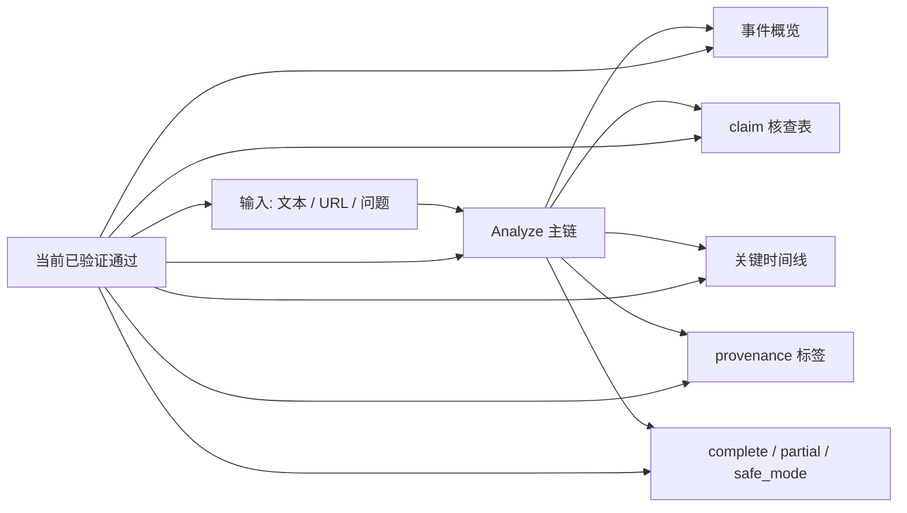
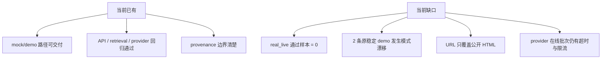
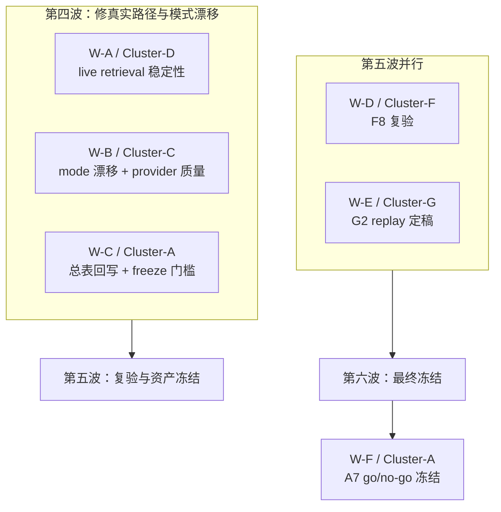

# 14 V1 当前效果评估与下一轮并行方案

更新时间：2026-03-14 22:27（Asia/Shanghai）

对应来源：

- `overview/03_v1_zero_key_blueprint.md`
- `tasks/origin-problem-goal-matrix.md`
- `overview/09_stage-progress-and-task-audit.md`
- `overview/10_unfinished-task-priority-and-parallel-analysis.md`
- `overview/13_f8-random-acceptance.md`
- `docs/status/current-verified-state.md`

## 1. 这份文档回答什么问题

这份文档只回答 3 个问题：

1. 按 V1 最小目标看，当前系统到底已经做到什么程度。
2. 现在能不能说“对任意新闻都能较真”。
3. 剩余未完成任务应该如何重新拆成互相隔离的并行窗口。

## 2. 先给结论

一句话判断：

> 当前系统已经具备“单条新闻可分析、可降级、可演示”的 V1 主闭环，但还不具备“对任意新闻稳定、真实、可验收地较真”的最终能力。

更细一点的判断：

- 可以说：当前已经是一个能跑通输入、分析、展示和降级的新闻观察员 Web Demo。
- 可以说：mock/demo 路径已可交付，且 provenance 边界已经清楚。
- 不可以说：当前已经能对任意新闻在真实 live retrieval 路径上稳定较真。

## 3. 对照 V1 最小目标，当前已经达到什么效果

### 3.1 V1 原始最小目标

`overview/03_v1_zero_key_blueprint.md` 对 V1 的最小定义是：

> 输入一条新闻文本或 URL，系统生成事件概览、关键来源时间线、3 到 5 条 claim 核查结果，并在证据不足时安全降级。

### 3.2 当前达成情况

| V1 最小目标 | 当前状态 | 依据 |
| --- | --- | --- |
| 文本输入可分析 | 已达到 | `docs/status/current-verified-state.md`、`backend/tests/test_api.py` |
| URL 输入可分析并在失败时降级 | 已达到第一阶段 | `C10` 已完成公开 HTML 抽取 + fallback |
| 事件概览可输出 | 已达到 | `Report` 主链已落地 |
| 关键来源时间线可输出 | 已达到最小可用版 | `D5 ~ D7` 最小可用版已完成 |
| 3 到 5 条 claim 结果可输出 | 已达到 | `F2 / F4 / F6` 已收口 |
| `complete / partial / safe_mode` 三档模式 | 已达到 | 前后端都已支持 |
| provenance 可区分 live/mock/replay/fallback | 已达到 | `E9` 已完成当前主展示 |
| 至少 3 条稳定 demo case | 未完全达到最终冻结标准 | `F8` 后只剩 `expired-yogurt` 可作为默认稳定 demo |

### 3.3 当前实际效果图

结论：

- 从“系统有没有最小闭环”这个角度看，答案是有。
- 从“这个闭环是否已经在真实开放场景稳定通过验收”这个角度看，答案是否。

## 4. 当前不能达到什么效果

当前最大的缺口不是“没有功能”，而是“真实路径没有被证明稳定”。

对应事实：

- `F8` 的 `real_live` 样本数为 `0`。
- 默认环境的样本主要落在 `backend_mock / retrieval_mock`。
- `chemical-odor` 从预期 `partial_mode` 漂移到 `safe_mode`。
- `morningstar-layoff` 从预期 `safe_mode` 漂移到 `complete_mode`。

## 5. 能否做到“对任意的新闻进行较真”

答案：**不能。**

但要明确“不能”的含义：

- 不是完全不能分析任意输入。
- 而是还不能把当前系统描述成“对任意新闻都能稳定、真实、可验收地较真”。

### 5.1 为什么不能这么讲

| 原因 | 当前证据 | 影响 |
| --- | --- | --- |
| 真实 live retrieval 没有正式通过样本 | `F8` 中 `real_live = 0` | 不能说真实路径已稳定 |
| 默认环境仍主要是 mock retrieval | `retrieval_provider=mock` | 默认演示不能代表真实较真 |
| demo 模式漂移仍存在 | `chemical-odor`、`morningstar-layoff` 漂移 | 演示边界仍可能失真 |
| URL 能力仍有限 | 仅支持公开 HTML | 不能覆盖任意新闻页面 |
| provider 在线稳定性仍不够 | `ReadTimeout`、限流、异常响应 | 开放输入帮助性不稳定 |

### 5.2 更准确的对外说法

当前最准确的说法是：

> 系统已经可以对任意输入尝试做结构化新闻分析，并能在证据不足时保守降级；但真实检索路径尚未通过最终验收，因此还不能说“任意新闻都能稳定较真”。

## 6. 当前最合理的能力分层

| 层级 | 当前判断 | 能怎么讲 |
| --- | --- | --- |
| `V1 闭环能力` | 已基本形成 | 可以讲“单条新闻可分析、可展示、可降级” |
| `mock/demo 交付能力` | 已形成 | 可以讲“稳定 mock demo + provenance 边界” |
| `真实 live 较真能力` | 未形成最终通过 | 不能讲“随机新闻真实较真已稳定通过” |
| `最终冻结状态` | 未到达 | `A7` 仍未完成 |

## 7. 剩余未完成任务应该怎么重排

基于 `tasks/origin-problem-goal-matrix.md`、`overview/09`、`overview/10`，当前真正值得继续推进的不是旧的基础任务，而是下面 5 类：

| 优先级 | 任务 | 为什么现在最重要 |
| --- | --- | --- |
| P0 | `Cluster-D` live retrieval 稳定性 | 没有真实通过样本，就不能升级 live 口径 |
| P0 | `Cluster-C` mode 漂移与 provider 质量收口 | 直接影响 demo 可信度和开放输入帮助性 |
| P1 | `Cluster-A` 总表回写与冻结门槛 | 需要把“什么时候算真正通过”制度化 |
| P1 | `Cluster-F` 新一轮 `F8` 复验 | 只有复验才能确认修复是否真的生效 |
| P2 | `Cluster-G / G2` replay 定稿 | 应该等主链和术语更稳定后再冻结 |

## 8. 下一轮并行方案

### 8.1 波次总图

### 8.2 为什么这样拆

- `W-A` 只碰 retrieval 侧，不和 provider / verdict 主逻辑混改。
- `W-B` 只碰 provider、verdict、report 和 demo 漂移问题，不碰 retrieval provider。
- `W-C` 只碰任务矩阵、审计文档和冻结门槛，不碰实现。
- `W-D` 只做复验，不主动改主实现。
- `W-E` 只做 replay 资产和说明冻结，不和真实链路修复抢同一批文件。
- `W-F` 最后统一做 go/no-go 冻结，避免多人同时改最终判断。

## 9. 每个并行窗口的隔离边界

| 波次 | 窗口 | 要做什么 | 主要文件范围 | 不要碰什么 | 启动条件 |
| --- | --- | --- | --- | --- | --- |
| 第四波 | `W-A / Cluster-D` | 修 live retrieval 的 `ConnectError / 429 / JSONDecodeError`，目标是形成至少一个 `backend_live + retrieval_live` 正式通过样本 | `backend/app/services/retrieval_*.py`、`timeline_builder.py`、`backend/tests/test_retrieval.py` | `kimi_provider.py`、`verdict_engine.py`、前端文档 | 现在即可启动 |
| 第四波 | `W-B / Cluster-C` | 修 `chemical-odor`、`morningstar-layoff` 的 mode 漂移，继续收口 provider timeout 和帮助性问题 | `kimi_provider.py`、`provider_enricher.py`、`verdict_engine.py`、`report_builder.py`、相关测试 | `retrieval_*.py`、前端、README | 现在即可启动 |
| 第四波 | `W-C / Cluster-A` | 准备最终冻结门槛，回写总表、阶段审计和 go/no-go 条件 | `tasks/origin-problem-goal-matrix.md`、`overview/09`、`overview/10`、`docs/status/current-verified-state.md` | 后端实现、前端实现 | 现在即可启动 |
| 第五波 | `W-D / Cluster-F` | 在 A/B 结果出来后复跑 `F8`，重新给出通过/未通过结论、风险表和可讲/不可讲口径 | `overview/13_f8-random-acceptance.md`、相关验收记录 | 不主动改核心实现 | 第四波至少完成一轮 |
| 第五波 | `W-E / Cluster-G` | 冻结 replay 的字段、读取方式和对外交付边界 | `data/demos/README.md`、replay 文件与说明文档 | `analyze` 主链、provider/retrieval 实现 | provenance 术语基本稳定 |
| 第六波 | `W-F / Cluster-A` | 结合新 `F8` 结果做 `A7` 最终 freeze：正式确认是 live 可升级，还是继续冻结为 mock/demo only | 总任务表、入口文档、最终判断文档 | 不再改实现 | 第五波完成 |

## 10. 最终建议

如果今天要给出一句最稳的项目状态判断，可以直接说：

> 当前系统已经完成了 V1 的主闭环和 mock/demo 可交付能力，但真实 live 路径仍未通过最终验收，因此还不能说“对任意新闻都能稳定较真”。

如果今天要决定下一轮怎么开窗口，可以直接按下面顺序：

1. 第四波：`Cluster-D` + `Cluster-C` + `Cluster-A`
2. 第五波：`Cluster-F` + `Cluster-G / G2`
3. 第六波：`Cluster-A / A7`

这样拆的好处是：

- 每波都只解决当前真正的主阻塞。
- 每个窗口大致都有清晰文件边界。
- 不会再把“实现、验收、文档、冻结判断”混在一个窗口里反复拉扯。
