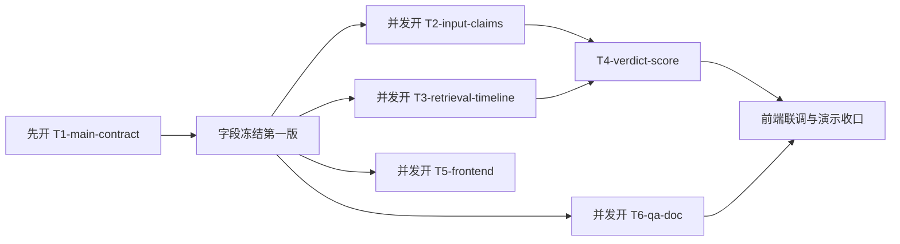

# Codex App 线程启动包

更新时间：2026-03-15（Asia/Shanghai）

配套文档：

- `proposal/codex-app-multithread-execution-plan-20260315.md`
- `proposal/news-credibility-multi-agent-task-plan-20260315.md`

这份文档只做一件事：

把“线程怎么开”从原则，压缩成可以直接执行的启动包。

## 1. 推荐你直接用 6 线程版

推荐启动顺序：

1. `T1-main-contract`
2. `T2-input-claims`
3. `T3-retrieval-timeline`
4. `T5-frontend`
5. `T6-qa-doc`
6. `T4-verdict-score`

注意：

- `T4-verdict-score` 不建议最早开。
- 必须等 `T1` 冻结完一版字段后再开 `T5`。
- `T4` 至少要等 `T2` 和 `T3` 都各自产出一版稳定结果。

## 2. 第一波线程启动图



## 3. 每个线程开工前的统一要求

所有线程都统一遵守：

1. 先阅读对应启动 prompt。
2. 先确认自己允许修改的文件域。
3. 先把“本轮执行任务 / 执行步骤 / 计划修改文件”写到自己的记录落点。
4. 真正编码前，先确认高冲突文件 owner 没变。
5. 完成后，必须回写“改了什么 / 验证了什么 / 交给谁继续”。

## 4. 高冲突文件 owner 最终表

| 文件 | owner 线程 |
| --- | --- |
| `contracts/report.schema.json` | `T1-main-contract` |
| `backend/app/models/schemas.py` | `T1-main-contract` |
| `backend/app/services/report_builder.py` | `T4-verdict-score` |
| `backend/app/services/verdict_engine.py` | `T4-verdict-score` |
| `backend/app/services/timeline_builder.py` | `T3-retrieval-timeline` |
| `frontend/components/analyze-page.tsx` | `T5-frontend` |
| `README.md` | `T6-qa-doc` |

## 5. 第一波可直接复制的启动提示

下面不是长篇任务书，而是“直接开线程时粘贴进去”的短 prompt。

### `T1-main-contract`

```text
你现在负责 Codex 线程 T1-main-contract。

你是本轮唯一的 contract owner。

先读：
- proposal/codex-app-multithread-execution-plan-20260315.md
- contracts/report.schema.json
- backend/app/models/schemas.py
- backend/app/services/report_builder.py

你只允许修改：
- contracts/*
- backend/app/models/schemas.py
- proposal/*
- tasks/*

本轮目标：
1. 冻结第一版 report / score contract。
2. 明确是否新增 overall_credibility_score、overall_credibility_label、score_breakdown。
3. 写出其他线程可依赖字段清单。

开始编码前，先写：
- 本轮执行任务
- 执行步骤
- 计划修改文件

完成后必须写：
- 最终字段清单
- 哪些字段冻结
- 哪些字段暂不允许其他线程扩展
```

### `T2-input-claims`

```text
你现在负责 Codex 线程 T2-input-claims。

先确认 T1-main-contract 已冻结第一版字段，再开始。

先读：
- proposal/codex-app-multithread-execution-plan-20260315.md
- backend/app/services/input_normalizer.py
- backend/app/services/claim_extractor.py
- backend/app/services/question_resolver.py

你只允许修改：
- backend/app/services/input_normalizer.py
- backend/app/services/claim_extractor.py
- backend/app/services/question_resolver.py
- 对应测试

本轮目标：
1. 让复杂新闻能拆成多个原子 claim。
2. 增强事实 / 观点 / 预测 / 不可核验分类。
3. 给 retrieval 线程提供更好用的 claim 级输入。

不要改：
- contracts/*
- retrieval_*.py
- report_builder.py
- frontend/*
```

### `T3-retrieval-timeline`

```text
你现在负责 Codex 线程 T3-retrieval-timeline。

先确认 T1-main-contract 已冻结第一版字段，再开始。

先读：
- proposal/codex-app-multithread-execution-plan-20260315.md
- backend/app/services/retrieval_service.py
- backend/app/services/retrieval_provider.py
- backend/app/services/retrieval_models.py
- backend/app/services/retrieval_cache.py
- backend/app/services/timeline_builder.py

你只允许修改：
- backend/app/services/retrieval_*.py
- backend/app/services/timeline_builder.py
- 检索与时间线测试

本轮目标：
1. retrieval 更稳定，失败原因更清楚。
2. 保留 cache、fallback、canonical results。
3. 时间线更像传播链，而不是普通时间排序。

不要改：
- contracts/*
- schemas.py
- report_builder.py
- frontend/*
```

### `T5-frontend`

```text
你现在负责 Codex 线程 T5-frontend。

先确认 T1-main-contract 已冻结第一版字段，再开始。

先读：
- proposal/codex-app-multithread-execution-plan-20260315.md
- frontend/components/analyze-page.tsx
- frontend/lib/api-client.ts
- frontend/lib/report-utils.ts

你只允许修改：
- frontend/*

本轮目标：
1. 首屏讲清输入什么、输出什么。
2. 结果页展示可信度、传播链、内容核查。
3. 明确 safe / partial / complete 的区别。

不要改：
- contracts/*
- backend/*
```

### `T6-qa-doc`

```text
你现在负责 Codex 线程 T6-qa-doc。

先读：
- proposal/codex-app-multithread-execution-plan-20260315.md
- README.md
- SMOKE_CHECKLIST.md
- DEMO_SCRIPT.md
- backend/tests/

你只允许修改：
- backend/tests/*
- README.md
- SMOKE_CHECKLIST.md
- DEMO_SCRIPT.md
- 文档说明文件

本轮目标：
1. 建立本轮 contract 对应的 regression / smoke。
2. 收口 README 和 demo 话术。
3. 明确哪些能力能讲，哪些不能讲。

不要改：
- backend/app/services/*
- frontend/components/*
```

### `T4-verdict-score`

```text
你现在负责 Codex 线程 T4-verdict-score。

只有在以下条件成立时再开工：
1. T1 已冻结字段。
2. T2 已给出稳定 claim 输出。
3. T3 已给出稳定 retrieval bundle / timeline 输出。

先读：
- proposal/codex-app-multithread-execution-plan-20260315.md
- backend/app/services/verdict_engine.py
- backend/app/services/report_builder.py
- contracts/report.schema.json
- backend/app/models/schemas.py

你只允许修改：
- backend/app/services/verdict_engine.py
- backend/app/services/report_builder.py
- verdict / score 相关测试

本轮目标：
1. 强化 claim verdict explainability。
2. 实现整条新闻的 overall credibility score。
3. 让 report 输出和前端消费字段对齐。

不要改：
- contracts/*
- retrieval_*.py
- frontend/*
```

## 6. 线程记录模板

建议每个线程在自己的工作记录里都写下面这段：

```text
本轮执行任务：
- 

执行步骤：
- 
- 
- 

计划修改文件：
- 

完成记录：
- 改动文件：
- 完成方式：
- 验证结果：
- 交接对象：
- 剩余问题：
```

## 7. 线程结束时必须交付的 handoff

### `T1-main-contract` 结束时

必须交付：

1. 最终字段表
2. 新增字段说明
3. 哪些字段冻结，其他线程不要再扩

### `T2-input-claims` 结束时

必须交付：

1. claim 输出示例
2. 新增或修改的分类规则
3. retrieval 线程如何消费这些 claim

### `T3-retrieval-timeline` 结束时

必须交付：

1. retrieval bundle 示例
2. fallback 规则
3. timeline 样例输出

### `T4-verdict-score` 结束时

必须交付：

1. score 计算逻辑
2. claim verdict 示例
3. final summary / score breakdown 示例

### `T5-frontend` 结束时

必须交付：

1. 页面截图或页面结构说明
2. 依赖的 report 字段清单
3. 当前 UI 还依赖哪些后端能力

### `T6-qa-doc` 结束时

必须交付：

1. smoke checklist
2. regression 入口
3. README / demo 口径变更摘要

## 8. 什么时候要暂停线程

出现下面情况时，线程应该暂停，而不是硬写：

1. 发现自己需要改另一个 owner 的高冲突文件
2. 发现 contract 还没冻结
3. 发现另一个线程已经改了同一文件域
4. 发现当前需求会直接改动对外口径

暂停后应该做的不是等，而是回写：

1. 当前阻塞点
2. 需要哪个线程先完成什么
3. 自己下一步的最小可继续动作

## 9. 最小开工建议

如果你现在就要开第一批线程，我建议：

1. 先把 `T1-main-contract` 开起来
2. 等它冻结字段后，同时开 `T2`、`T3`、`T5`、`T6`
3. 等 `T2 + T3` 都落一版结果后，再开 `T4`

这样做的好处是：

1. 冲突最少
2. 前端不用等全部后端完工
3. score 线程不会建立在漂移中的输入之上

一句话版本：

先定输出长什么样，再并行修输入、检索、页面，最后再决定整条新闻到底该打多少可信分。
