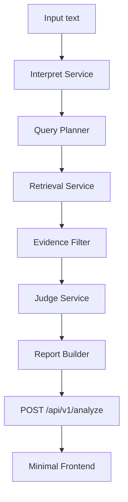
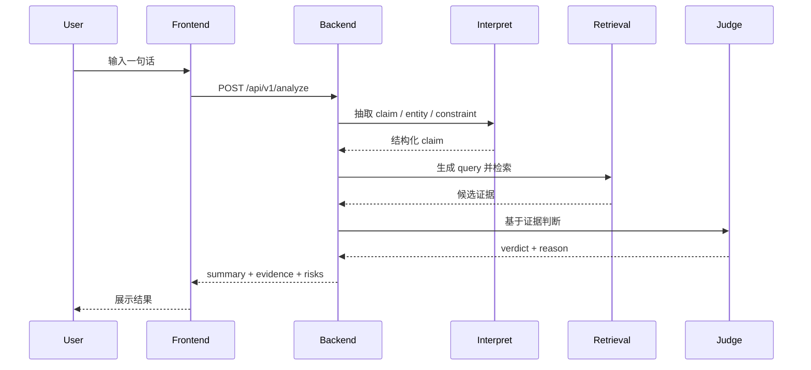
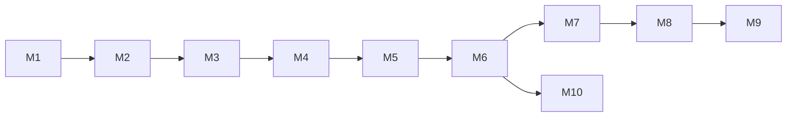

# 单句较真最小版实施计划

## 1. 计划目标

这份计划只服务一个非常收缩的目标：

**输入一句话，系统给出一个尽量可信、尽量保守的核查结果。**

这个版本不是完整产品，也不是多轮对话系统，而是一个最小可验证主链。

---

## 2. 为什么先做这个版本

当前仓库的复杂度主要来自“工作台能力”，而不是“单句较真主链”。

如果现在直接做多轮对话，会同时引入：

- 会话状态管理
- 记忆压缩与回放
- 多轮检索更新
- 上下文污染控制
- 前端聊天状态机

这些都属于第二阶段问题。

先做“单句较真最小版”的价值在于：

- 先验证单轮主链是否成立
- 先验证真实检索是否真的能帮助判断
- 先把 verdict 和 evidence 口径做稳
- 避免在多轮记忆层提前放大复杂度

---

## 3. 目标与非目标

### 3.1 范围表

| 类别 | 本阶段要做 | 本阶段不做 |
| --- | --- | --- |
| 输入 | 一句纯文本 | 多轮对话、URL、长文、图片、文件 |
| 输出 | `claim + verdict + evidence + risks + summary` | 时间线、复杂 provenance、demo/replay 口径 |
| 结论 | `supported / refuted / insufficient / conflicting` | 分数化 truth score、复杂模式系统 |
| 模型 | 可选 LLM，用于 claim 抽取和 judge | 记忆型对话、长上下文会话 |
| 检索 | 真实 web/news 检索 | replay、mock 主链依赖 |
| 前端 | 极简单页输入输出 | 聊天 UI、多 tab 状态机 |

### 3.2 成功定义

只要满足以下条件，就认为这个阶段成立：

1. 用户输入一句话后，后端能抽取至少 1 条核心 claim。
2. 系统能生成 2 到 4 个检索 query。
3. 系统能发起真实检索，并得到候选证据。
4. 系统能返回 4 类 verdict 之一。
5. 系统可以明确输出“证据不足”，而不是强行下结论。
6. 前端能稳定展示 claim、结论、证据和风险。

---

## 4. 最小版本长什么样

### 4.1 产品视角


### 4.2 技术视角



### 4.3 时序图



---

## 5. 难度评估

### 5.1 总体难度

| 维度 | 难度 | 原因 |
| --- | --- | --- |
| 前端改造 | 低 | 只需要一个精简输入输出页 |
| 后端主链打通 | 中高 | 要把 claim、query、judge 串起来 |
| 检索质量 | 高 | 检索结果噪声直接决定结果质量 |
| verdict 稳定性 | 高 | 要避免“模型猜答案” |
| 清理旧包袱 | 中 | demo/mock/replay/provenance 会干扰主链 |

### 5.2 最容易低估的部分

最容易被低估的不是界面，而是这两件事：

- 如何把一句话抽成正确 claim
- 如何在检索结果不干净时仍然输出保守结论

---

## 6. 最小 Contract 设计

### 6.1 请求

```json
{
  "text": "晨星生物上海分部裁员40%是真的吗？"
}
```

### 6.2 响应

```json
{
  "claim": "晨星生物上海分部裁员40%",
  "queries": [
    "晨星生物 上海分部 裁员 40%",
    "晨星生物 上海分部 回应 裁员 40%",
    "晨星生物 裁员 40% 通报"
  ],
  "verdict": "insufficient",
  "summary": "当前检索到的公开来源不足以确认该说法成立或被正式否认。",
  "evidence": [
    {
      "title": "...",
      "url": "...",
      "source_name": "...",
      "published_at": "...",
      "snippet": "...",
      "source_tier": "A",
      "stance": "related"
    }
  ],
  "risks": [
    "当前公开来源不足",
    "可能存在同名主体误召回"
  ]
}
```

### 6.3 字段冻结建议

| 字段 | 必须 | 说明 |
| --- | --- | --- |
| `claim` | 是 | 最终要核查的核心说法 |
| `queries` | 是 | 实际发起过的 query，便于调试 |
| `verdict` | 是 | 只能是 4 类之一 |
| `summary` | 是 | 简明结论 |
| `evidence` | 是 | 关键证据列表，最多 3 到 5 条 |
| `risks` | 是 | 保守性提示 |

---

## 7. 现有代码怎么拆

### 7.1 文件处理总览

| 分类 | 文件 | 动作 | 原因 |
| --- | --- | --- | --- |
| 直接复用 | [`backend/app/services/retrieval_provider.py`](/home/forwaryan/mianshi/rumor-checking/backend/app/services/retrieval_provider.py) | 保留 | 已有真实检索 provider |
| 直接复用 | [`backend/app/services/retrieval_deduper.py`](/home/forwaryan/mianshi/rumor-checking/backend/app/services/retrieval_deduper.py) | 保留 | 已有去重归并 |
| 直接复用 | [`backend/app/services/retrieval_models.py`](/home/forwaryan/mianshi/rumor-checking/backend/app/services/retrieval_models.py) | 保留 | 数据结构稳定 |
| 直接复用 | [`backend/app/api/v1/endpoints/analyze.py`](/home/forwaryan/mianshi/rumor-checking/backend/app/api/v1/endpoints/analyze.py) | 保留 | 入口足够小 |
| 重构复用 | [`backend/app/services/retrieval_service.py`](/home/forwaryan/mianshi/rumor-checking/backend/app/services/retrieval_service.py) | 重构 | 从 event 驱动改成 claim/query 驱动 |
| 重构复用 | [`backend/app/services/input_normalizer.py`](/home/forwaryan/mianshi/rumor-checking/backend/app/services/input_normalizer.py) | 重构 | 改为最小 interpret 层 |
| 重构复用 | [`backend/app/services/question_resolver.py`](/home/forwaryan/mianshi/rumor-checking/backend/app/services/question_resolver.py) | 合并 | 融入 query planner |
| 重构复用 | [`backend/app/services/provider_enricher.py`](/home/forwaryan/mianshi/rumor-checking/backend/app/services/provider_enricher.py) | 重写职责 | 从 enrichment 改为 claim/judge 支持 |
| 重构复用 | [`backend/app/services/verdict_engine.py`](/home/forwaryan/mianshi/rumor-checking/backend/app/services/verdict_engine.py) | 重写 | 当前太偏启发式 |
| 重构复用 | [`backend/app/services/report_builder.py`](/home/forwaryan/mianshi/rumor-checking/backend/app/services/report_builder.py) | 收缩 | 当前 report 过重 |
| 可选保留 | [`backend/app/services/url_content_extractor.py`](/home/forwaryan/mianshi/rumor-checking/backend/app/services/url_content_extractor.py) | 暂不动 | 本阶段先不用，但以后可接回来 |
| 迁出主链 | [`backend/app/services/mock_retriever.py`](/home/forwaryan/mianshi/rumor-checking/backend/app/services/mock_retriever.py) | 迁出 runtime | 只留测试 |
| 迁出主链 | [`frontend/lib/demo-cases.ts`](/home/forwaryan/mianshi/rumor-checking/frontend/lib/demo-cases.ts) | 迁出默认路径 | 避免 demo 污染主链 |
| 暂停使用 | [`frontend/components/timeline-panel.tsx`](/home/forwaryan/mianshi/rumor-checking/frontend/components/timeline-panel.tsx) | 下线 | 不是最小版核心 |
| 暂停使用 | [`frontend/components/status-banner.tsx`](/home/forwaryan/mianshi/rumor-checking/frontend/components/status-banner.tsx) | 简化或替换 | provenance 过重 |
| 删除候选 | [`backend/app/services/google_news_rss_provider.py`](/home/forwaryan/mianshi/rumor-checking/backend/app/services/google_news_rss_provider.py) | 可删 | 当前运行时未引用 |
| 删除候选 | [`backend/app/services/result_merger.py`](/home/forwaryan/mianshi/rumor-checking/backend/app/services/result_merger.py) | 可删 | 当前运行时未引用 |
| 删除候选 | [`backend/app/services/scenario_library.py`](/home/forwaryan/mianshi/rumor-checking/backend/app/services/scenario_library.py) | 可删 | 当前运行时未引用 |

### 7.2 推荐的后端模块划分

| 新模块 | 来源 | 职责 |
| --- | --- | --- |
| `interpret_service` | `input_normalizer + question_resolver + kimi_provider` | 抽 claim / entity / constraint |
| `query_planner` | 从 `retrieval_service` 中拆出 | 生成 2 到 4 个 query |
| `search_service` | `retrieval_service + retrieval_provider + retrieval_deduper` | 搜索、去重、筛选 |
| `judge_service` | `verdict_engine + provider_enricher` | 基于证据输出 verdict |
| `minimal_report_builder` | `report_builder` 收缩后 | 组织最小响应 |

---

## 8. 阶段计划

### 8.1 Phase 0：范围冻结

| 项目 | 内容 |
| --- | --- |
| 目标 | 冻结最小输入输出和 verdict 口径 |
| 产出 | `minimal contract` 文档、字段定义、验收标准 |
| 风险 | 范围继续膨胀回 URL、多轮、timeline |
| 完成标志 | 所有人接受“只做一句话”边界 |

### 8.2 Phase 1：后端主链打通

| Task | 动作 | 依赖 | 完成标志 |
| --- | --- | --- | --- |
| `P1-1` | 实现 `interpret_service` | 无 | 能稳定抽出核心 claim |
| `P1-2` | 实现 `query_planner` | `P1-1` | 每句能生成 2-4 个 query |
| `P1-3` | 改造 `retrieval_service` 支持多 query | `P1-2` | 能返回合并后的 evidence pool |
| `P1-4` | 收缩 `analyze_pipeline` | `P1-1~3` | 主链变成 interpret -> search -> judge |

### 8.3 Phase 2：Judge 与最小 Report

| Task | 动作 | 依赖 | 完成标志 |
| --- | --- | --- | --- |
| `P2-1` | 重写 `verdict_engine` | `P1` | 只能输出四类 verdict |
| `P2-2` | 收缩 `report_builder` | `P2-1` | 返回最小字段集合 |
| `P2-3` | 收缩 `schemas` / API model | `P2-2` | 前后端字段一致 |

### 8.4 Phase 3：前端最小化

| Task | 动作 | 依赖 | 完成标志 |
| --- | --- | --- | --- |
| `P3-1` | 精简页面，只保留输入/结论/证据/风险 | `P2` | 页面无复杂状态机 |
| `P3-2` | 简化 `api-client` 解析逻辑 | `P2` | 前端不再兼容大而全 report |
| `P3-3` | 移除默认 demo/replay 路径 | `P3-1` | 页面默认只跑真实 analyze |

### 8.5 Phase 4：清理与验收

| Task | 动作 | 依赖 | 完成标志 |
| --- | --- | --- | --- |
| `P4-1` | 删除闲置运行时代码 | `P1~3` | 目录明显变瘦 |
| `P4-2` | 建立新测试集 | `P2` | 核心主链有回归测试 |
| `P4-3` | 更新 README / 文档 | `P4-1~2` | 文档口径与代码一致 |

---

## 9. 详细任务拆解

### 9.1 任务总览

| ID | 任务 | 优先级 | 难度 | 是否阻塞后续 |
| --- | --- | --- | --- | --- |
| `M1` | 冻结最小 contract | P0 | 中 | 是 |
| `M2` | claim 抽取服务 | P0 | 高 | 是 |
| `M3` | query planner | P0 | 高 | 是 |
| `M4` | 检索多 query 合并 | P0 | 中高 | 是 |
| `M5` | verdict judge | P0 | 很高 | 是 |
| `M6` | 精简 response schema | P1 | 中高 | 是 |
| `M7` | 极简前端页 | P1 | 中 | 否 |
| `M8` | demo/mock/replay 迁出主链 | P1 | 中 | 否 |
| `M9` | 删除闲置代码 | P2 | 低 | 否 |
| `M10` | 新回归测试 | P1 | 中高 | 是 |

### 9.2 推荐执行顺序



---

## 10. 风险分析

### 10.1 风险矩阵

| 风险 | 概率 | 影响 | 说明 | 缓解方式 |
| --- | --- | --- | --- | --- |
| claim 抽错 | 高 | 高 | 一开始就理解错，会导致全链错 | LLM 抽取 + 规则兜底 |
| query 过窄 | 中高 | 高 | 找不到关键证据 | 每句至少 2 到 4 个 query |
| query 过宽 | 高 | 中高 | 召回噪声过大 | 引入 entity/constraint 加权 |
| 检索结果噪声 | 高 | 高 | 聚合站和旧闻会污染判断 | 去重、来源分级、时间筛选 |
| 模型幻觉 | 中高 | 高 | 没证据也给确定答案 | judge prompt 强约束，允许 insufficient |
| 前端继续背旧包袱 | 中 | 中 | demo/provenance/replay 逻辑继续蔓延 | 先收后端 contract，再收前端 |
| 测试口径失真 | 中 | 中高 | 旧测试服务旧结构 | 重建面向最小链路的回归集 |

### 10.2 最大的真实风险

这个任务最大的真实风险不是“做不出来页面”，而是：

**做出了一个看起来会判断、但其实仍然在猜的系统。**

所以整个计划的核心约束必须是：

- 允许系统输出 `insufficient`
- 允许系统输出 `conflicting`
- 不把“相关来源存在”误当成“结论成立”

---

## 11. 缓存策略

因为本阶段只做单句，不做会话记忆，所以缓存可以保持最小化。

### 11.1 本阶段建议缓存什么

| 缓存对象 | 建议 | 原因 |
| --- | --- | --- |
| 检索结果 | 可以缓存 | 对同句重复请求有价值 |
| claim 抽取结果 | 可选缓存 | 节省模型调用 |
| verdict 结果 | 不建议长期缓存 | 依赖检索时效性 |
| 会话状态 | 不做 | 本阶段不是多轮 |

### 11.2 缓存 Key 建议

缓存 key 不要只用原文，应使用：

- 归一化后的 claim
- query 列表 hash
- provider 名称
- 日期窗口（可选）

示意：

```text
cache_key = hash(normalized_claim + sorted(queries) + retrieval_provider)
```

---

## 12. 验收设计

### 12.1 功能验收

| 场景 | 预期 |
| --- | --- |
| 明确被官方否认的传闻 | `refuted` |
| 明确被权威来源支持的事实 | `supported` |
| 公开来源很少 | `insufficient` |
| 公开来源互相矛盾 | `conflicting` |

### 12.2 接口验收

| 项目 | 标准 |
| --- | --- |
| 输入 | 只接收单句文本 |
| 输出 | 字段稳定，不再返回大而全工作台结构 |
| 错误处理 | 输入为空、检索失败、模型失败都能保守返回 |
| 性能 | 单次请求可接受，不因旧上下文膨胀 |

### 12.3 前端验收

| 项目 | 标准 |
| --- | --- |
| 输入体验 | 一屏完成输入和提交 |
| 结论展示 | 一眼能看懂 verdict |
| 证据展示 | 能看到来源、时间、摘要 |
| 风险提示 | 能明确看到“不足/冲突/噪声” |

---

## 13. 建议的第一轮开发顺序

如果现在开始真正动手，我建议第一轮只做这 5 步：

1. 冻结最小 request/response schema
2. 把一句话抽成 1 条核心 claim
3. 为这条 claim 生成多个 query
4. 跑真实检索并合并结果
5. 返回最小 report，不改聊天、不做时间线

这 5 步完成后，再决定是否值得继续做：

- 更强的 judge
- URL 输入
- 多轮对话
- 会话记忆

---

## 14. 最终建议

### 14.1 这个任务值不值得先做

值得，而且比先做多轮更合理。

### 14.2 这个任务的正确切法

正确切法不是“先改前端界面”，而是：

- 先冻结最小 contract
- 先打通单句主链
- 先把 verdict 和 evidence 做稳
- 最后再决定是否升级到多轮

### 14.3 这个阶段最重要的边界

一定要坚持这三个边界：

- 只做一句话
- 只做单轮
- 允许证据不足

只要这三个边界守住，项目就不会重新膨胀回现在这种“工作台优先”的状态。
