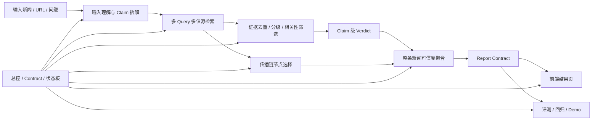
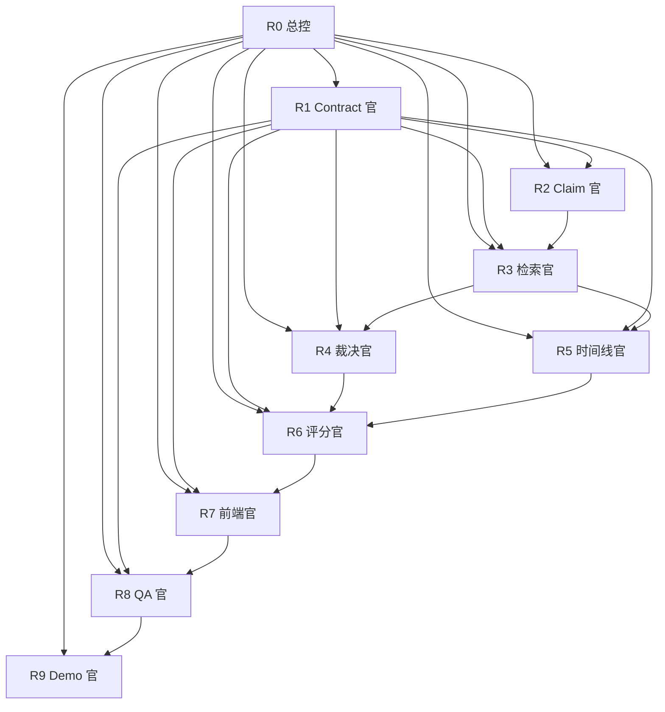

# 新闻可信度项目多线程执行总控方案

更新时间：2026-03-15（Asia/Shanghai）

适用目标：

1. 输入一条新闻文本或 URL
2. 输出整条新闻的可信程度
3. 给出传播链证据链，从发酵到高峰再到回应/澄清
4. 给出内容核查，说明哪些是真实事实、哪些是观点、哪些可能有误

本文档不是泛泛的“建议”，而是面向多 AI 模型、多 agent、多线程执行的派工方案。

## 1. 为什么要这样拆

这个题目本质上不是一个单点模型调用，而是三条互相耦合的链路：

1. 输入理解链
   把一句新闻拆成可验证的 claim。
2. 证据与传播链
   去网上找证据、去重、排序、挑选关键传播节点。
3. 总评分链
   把 claim 级判断、来源质量、交叉一致性、传播链完整度聚合成整条新闻可信度。

如果把这三条链放在一个线程里做，会同时出现三个问题：

1. 共享字段频繁变更，前后端和评测会互相阻塞。
2. 检索、时间线、裁决、前端会抢同一批文件。
3. 很容易做成“有一个大结果页”，但解释性和可演示性都不够。

所以要按“稳定接口”拆线程，而不是按“功能页面”拆线程。



上图对应的执行原则是：

1. 先冻结 contract，再让实现线程并行。
2. 让“检索”和“裁决”分开，避免一个线程既找证据又自己决定规则。
3. 让“传播链”单独成线程，因为它和 claim 判定复用数据，但目标不同。
4. 让“评测”和“文档演示”不要等全部实现结束才开始。

## 2. 人物列表

这里的“人物”不是虚构角色，而是每个执行窗口的职责人格。这样分，是为了让每个 agent 都只有单一成功标准。

| 角色 ID | 线程名 | 核心职责 | 主要产出 | 推荐模型 | 为什么必须单独存在 |
| --- | --- | --- | --- | --- | --- |
| R0 | `T-main-control` | 总控、优先级、依赖、收口 | 状态板、派工、冲突裁决 | 强推理模型 | 没有总控，多线程会改同一批字段并且口径漂移 |
| R1 | `T-contract-score` | 冻结 `Report`、`Score`、`Claim`、`Evidence` 合同 | schema、字段说明、评分公式 | 强推理模型 | 这是所有线程的公共边界，必须先稳住 |
| R2 | `T-input-claims` | 输入理解、claim 拆解、事实/观点/预测分类 | 结构化 claim 列表 | 中文理解强的模型 + coder | 这是内容核查的入口，不该和检索线程混在一起 |
| R3 | `T-retrieval-multi-source` | query 生成、多源检索、缓存、失败降级 | `RetrievalBundle` | coder + 检索型模型 | 检索链独立复杂，最容易和别的线程互相阻塞 |
| R4 | `T-evidence-judge` | 证据去重、来源分级、相关性筛选、claim verdict | `ClaimResult`、evidence scoring | 强推理模型 | 不能把“找到了什么”和“该信什么”混成一步 |
| R5 | `T-timeline-chain` | 发酵到高峰的传播链还原 | timeline nodes | coder + 推理模型 | 传播链是题目高权重主流程，必须单独做深 |
| R6 | `T-credibility-score` | 整体可信度分、分项解释、阈值策略 | overall score、score breakdown | 强推理模型 | 整条新闻打分不能直接等于某个 claim verdict |
| R7 | `T-frontend-results` | 输入页、结果页、传播链、内容核查、可信度展示 | 页面与交互 | coder 模型 | 前端应该消费稳定 contract，不该自己发明字段 |
| R8 | `T-qa-eval` | 回归、验收、基准样例、烟测 | tests、eval、checklist | coder 模型 | 没有独立验收线程，最后 Demo 会失真 |
| R9 | `T-doc-demo` | README、演示稿、答辩话术、限制说明 | 文档与口播脚本 | 强推理模型 | 面试题强依赖表达能力，不能最后临时拼 |

## 3. 人物关系图



解释：

1. `R1` 是全局公共接口层，所有线程都依赖它。
2. `R2 -> R3 -> R4` 是“内容核查主链”。
3. `R3 -> R5` 是“传播链主链”。
4. `R4 + R5 -> R6` 才能得到整条新闻可信度。
5. `R7` 不应早于 `R1 / R6` 自行定义结果页字段。
6. `R8` 和 `R9` 要尽早启动，但不应该篡改业务 contract。

## 4. 详细任务列表

状态说明：

- `[x]` 已在当前仓库里看到可用实现或基础
- `[ ]` 当前仓库仍未完成，或者只停留在弱启发式/最小版本

状态判断依据：

- `README.md`
- `overview/06_current_code_implementation.md`
- `backend/app/services/*.py`
- `contracts/*.schema.json`

### M0. 总控与范围冻结

- [x] 明确产品两条主线是“传播链还原 + 内容核查”
- [x] 已有 `tasks/`、`overview/`、`rules/`、`contracts/` 分层
- [x] 已有并行执行手册和窗口 prompt 机制
- [ ] 冻结“整条新闻可信度分”的正式口径
- [ ] 冻结 live / mock / replay / fallback 在对外表达里的边界
- [ ] 为本轮目标建立独立的状态板，而不是继续复用旧 demo 目标
- [ ] 规定 schema 变更审批顺序：先 contract，再后端，再前端，再 eval

### M1. Contract 与评分协议

- [x] 已有 `Event / TimelineNode / ClaimResult / Report` schema
- [x] 已有 `content_check` 字段
- [x] 已有 `investigation / pipeline_trace / provenance` 字段
- [ ] 增加 `overall_credibility_score`
- [ ] 增加 `overall_credibility_label`
- [ ] 增加 `score_breakdown`
- [ ] 增加 `claim_contributions`
- [ ] 增加 `timeline_confidence`
- [ ] 增加 `independent_source_count`
- [ ] 定义 score 的数值区间和展示文案
- [ ] 定义 score 不能比 claim 级结论更激进的硬边界

### M2. 输入理解与 Claim 拆解

- [x] 支持文本输入
- [x] 支持 URL 输入
- [x] 支持 question-only 输入
- [x] 已有 `claim_extractor.py`
- [x] claim 已区分 `fact / opinion / prediction / unverifiable`
- [ ] 把一条复杂新闻拆成更细粒度的原子 claim
- [ ] 识别引语、转述、观点、猜测、情绪化措辞
- [ ] 做人名、机构名、地点、时间的标准化
- [ ] 为每条 claim 生成检索 query，而不是整段共用一个 query
- [ ] 为每条 claim 打“核心 claim / 附加细节 / 观点性延伸”标签
- [ ] 对截图流言、聊天记录、爆料体文本补专门解析策略

### M3. 多 Query 多信源检索

- [x] 已有 `RetrievalBundle / SearchResult`
- [x] 已有 mock retrieval
- [x] 已有 GDELT 检索基础
- [x] 已有缓存基础对象
- [ ] 为每条 claim 生成 2 到 5 组检索 query
- [ ] 接入多路来源：官方通报源、主流媒体源、聚合新闻源
- [ ] 区分“原始发布源”和“二次转载源”
- [ ] 给 query 增加时间窗口策略
- [ ] 给结果增加来源独立性判断
- [ ] 记录检索失败原因：空结果、超时、限流、解析失败
- [ ] 支持 claim 级 evidence cache，而不只是 event 级 cache
- [ ] 在 `RetrievalBundle` 中保留原始命中与 canonical 命中映射

### M4. 证据去重、分级与 Claim 裁决

- [x] 已有 `S / A / B / C` 来源等级
- [x] 已有 `supported / refuted / insufficient / conflicting`
- [x] 已有 `evidence_grade`
- [x] 已有最小启发式 verdict engine
- [ ] 做近重复转载归并后的“独立来源计数”
- [ ] 做 claim 与 evidence 的细粒度相关性打分
- [ ] 支持 claim 命中的证据 span 或理由片段
- [ ] 区分“直接反驳”和“旁证反驳”
- [ ] 定义当 `S` 与 `A/B/C` 冲突时的优先级规则
- [ ] 对“半真半假”新闻输出 claim 贡献明细
- [ ] 把模型推断与 evidence 本身严格分开
- [ ] 给每条 claim 输出更可复核的 `why this verdict`

### M5. 传播链还原

- [x] 已有 `origin / amplification / peak / turn / clarification` 节点类型
- [x] 已有 `why_selected`
- [x] 已有时间线启发式构造器
- [ ] 在真实检索结果上做传播阶段聚类
- [ ] 更稳定地区分“最早源头”和“最早被广泛看见的节点”
- [ ] 为 `peak` 提供传播强度代理信号
- [ ] 把官方回应与媒体跟进分成不同角色节点
- [ ] 把“纠偏 / 辟谣 / 补充说明”并入同一传播链
- [ ] 给时间线输出“当前完整度”
- [ ] 给每个节点增加“与事件主叙事的关系”

### M6. 整条新闻可信度聚合

- [ ] 设计整条新闻可信度评分公式
- [ ] 把 claim verdict 聚合成 claim score
- [ ] 把来源质量聚合成 source quality score
- [ ] 把多源一致性聚合成 agreement score
- [ ] 把传播链完整度聚合成 timeline score
- [ ] 输出最终 label，例如 `高可信 / 中等可信 / 低可信 / 真假混杂 / 证据不足`
- [ ] 输出“不确定性理由”，防止分数看起来过度确定
- [ ] 让最终总评不能比 claim 级证据更激进
- [ ] 给前端提供可直接展示的分项说明

建议初版公式：

```text
overall_credibility =
0.50 * claim_score +
0.20 * source_quality +
0.20 * cross_source_agreement +
0.10 * timeline_completeness
```

### M7. 前端产品与结果表达

- [x] 已有输入页主壳
- [x] 已有状态条和 provenance 展示
- [x] 已有 timeline 面板
- [x] 已有 claim 结果区和 evidence 列表
- [x] 已有 fallback / safe mode 表达
- [ ] 首页第一屏用一句话讲清“输入什么、输出什么”
- [ ] 增加整体可信度卡片
- [ ] 增加 score breakdown 可视化
- [ ] 增加“真假混杂”场景的 claim 贡献解释
- [ ] 增加传播链热度/阶段感表达
- [ ] 增加“哪些是事实 / 观点 / 可能有误”一眼可扫的摘要区
- [ ] 增加手动补充原帖 / 官方链接的交互入口
- [ ] 增加“当前局限与风险提示”固定展示区

### M8. 评测、回归与验收

- [x] 已有部分 API 测试
- [x] 已有 retrieval / timeline / report mode 测试基础
- [x] 已有 smoke checklist 与 demo 脚本基础
- [ ] 建一套“复杂新闻拆 claim”评测集
- [ ] 建一套“真假混杂新闻”评测集
- [ ] 建一套“传播链完整度”评测集
- [ ] 建一套“score 标定”评测集
- [ ] 补 live retrieval 专项验收样本
- [ ] 补 regression：单条新闻拆成多个 claim 后不回归
- [ ] 补前端端到端 smoke，用固定 case 校验页面稳定性
- [ ] 输出 go / no-go 验收门槛

### M9. 文档、Demo 与答辩表达

- [x] 已有顶层 README
- [x] 已有前后端 README
- [x] 已有演示脚本和 smoke checklist
- [x] 已有 overview 和 proposal 文档体系
- [ ] 为“整条新闻可信度”补正式设计说明
- [ ] 产出一份 5 分钟产品演示脚本
- [ ] 产出一份 10 分钟关键实现讲解脚本
- [ ] 产出一份“为什么不是直接让 LLM 给真假概率”的答辩话术
- [ ] 产出一份“已完成能力 / 未完成能力 / 风险边界”统一口径
- [ ] 把多线程协作方式写成操作手册

### M10. 风险、合规与降级

- [x] 当前系统已有 fallback 边界表达
- [x] 当前系统已有 safe mode
- [ ] 明确哪些来源只可做线索，不可做强证据
- [ ] 明确哪些敏感领域必须上更保守规则
- [ ] 明确 robots、反爬、登录页、截图页的处理策略
- [ ] 明确引用与证据快照策略
- [ ] 明确检索失败时如何继续输出“边界化结果”
- [ ] 明确前端何时显示“不能当作确定结论”

## 5. 最大并行规划

最大并行不是“所有线程同时改代码”，而是“在不互相踩 contract 的前提下，把等待时间压到最低”。

### 阶段 0：冻结公共边界

并行数：2

| 线程 | 角色 | 负责任务 | 依赖 | 结束条件 |
| --- | --- | --- | --- | --- |
| `T-main-control` | R0 | M0、全局依赖图、派工顺序 | 无 | 明确阶段切换门槛 |
| `T-contract-score` | R1 | M1、M6 的 schema 与评分公式 | 无 | `Report` 字段冻结第一版 |

说明：

只有这两条先跑完，后面的线程才不会反复改 contract。

### 阶段 1：主功能并行推进

最大并行数：6

| 线程 | 角色 | 负责任务 | 主要输入 | 主要输出 |
| --- | --- | --- | --- | --- |
| `T-input-claims` | R2 | M2 | 冻结后的 claim contract | claim-first 输入理解 |
| `T-retrieval-multi-source` | R3 | M3 | claim query contract | claim 级检索 bundle |
| `T-evidence-judge` | R4 | M4 | retrieval bundle | claim verdict 与 evidence |
| `T-timeline-chain` | R5 | M5 | retrieval canonical results | explainable timeline |
| `T-frontend-results` | R7 | M7 | report contract、现有 mock/live payload | 新结果页和展示组件 |
| `T-qa-eval` | R8 | M8 | 冻结 contract、固定样例 | regression、smoke、验收基线 |

说明：

1. `T-evidence-judge` 可以在 `T-retrieval-multi-source` 产出 mock/live bundle 样例后立即推进。
2. `T-timeline-chain` 和 `T-evidence-judge` 共享 retrieval 输出，但互不改同一批核心逻辑。
3. `T-frontend-results` 不等全部功能做完，可以先消费 contract 和 demo payload。
4. `T-qa-eval` 要尽早开始，否则最后没有稳定验收标准。

### 阶段 2：总评分与联调收口

最大并行数：3

| 线程 | 角色 | 负责任务 | 依赖 | 结束条件 |
| --- | --- | --- | --- | --- |
| `T-credibility-score` | R6 | M6 | M4、M5 第一版稳定 | 输出 overall score 与 breakdown |
| `T-doc-demo` | R9 | M9 | M6、M7、M8 初版完成 | README、话术、Demo 稿收口 |
| `T-main-control` | R0 | 回归调度、冲突治理、No-Go 判断 | 所有线程 | 形成统一口径与最终验收结论 |

### 推荐线程数

最优线程数：9 个角色位，实际执行建议 7 个窗口。

合并方式：

1. `R0 + R1` 可以合并成一个“总控兼 contract”窗口。
2. `R6 + R9` 可以合并成一个“评分与答辩表达”窗口。
3. 如果窗口只有 5 个，优先保留 `R0/R1`、`R2`、`R3`、`R4/R5`、`R7/R8/R9`。

## 6. 每个线程负责什么

### 线程 A：`T-main-control`

负责：

1. M0 全量
2. M1/M6 字段冻结后的广播
3. 线程依赖和串并行切换
4. 风险登记、No-Go 判断

不要做：

1. 不要代替实现线程写大块业务逻辑
2. 不要私自改前端展示字段

### 线程 B：`T-contract-score`

负责：

1. M1 全量
2. M6 中评分公式和标签口径
3. `contracts/`、`backend/app/models/schemas.py` 的字段对齐建议

不要做：

1. 不要写具体检索 provider
2. 不要碰前端组件

### 线程 C：`T-input-claims`

负责：

1. M2 全量
2. 输入拆 claim
3. 观点/事实/预测的判别增强

不要做：

1. 不要定义新的 evidence 结构
2. 不要自己扩展 score 字段

### 线程 D：`T-retrieval-multi-source`

负责：

1. M3 全量
2. 多 query、多源、多时间窗检索
3. cache 和 fallback

不要做：

1. 不要自己下最终真假 verdict
2. 不要改前端 contract

### 线程 E：`T-evidence-judge`

负责：

1. M4 全量
2. evidence ranking
3. claim-level verdict explainability

不要做：

1. 不要负责 timeline
2. 不要自己选前端展示样式

### 线程 F：`T-timeline-chain`

负责：

1. M5 全量
2. 发酵到高峰再到回应的节点抽取
3. `why_selected` 规则增强

不要做：

1. 不要改 claim verdict 逻辑
2. 不要改总评分公式

### 线程 G：`T-credibility-score`

负责：

1. M6 全量
2. final label、breakdown、贡献解释

不要做：

1. 不要新增检索 provider
2. 不要改输入理解主链

### 线程 H：`T-frontend-results`

负责：

1. M7 全量
2. 首页和结果页表达
3. 传播链、内容核查、总可信度可视化

不要做：

1. 不要反向定义后端 schema
2. 不要在页面里藏业务逻辑

### 线程 I：`T-qa-eval`

负责：

1. M8 全量
2. regression、smoke、固定样例
3. go / no-go 验收

不要做：

1. 不要大规模补业务
2. 不要替其他线程决定字段口径

### 线程 J：`T-doc-demo`

负责：

1. M9 全量
2. README、演示稿、答辩话术
3. 限制说明和边界表达

不要做：

1. 不要隐瞒当前 live 能力边界
2. 不要为了文档好看改动主逻辑

## 7. 可直接投喂给每个线程的 Prompt

下面的 prompt 都是“可直接发给执行窗口”的版本。

### Prompt 1：`T-main-control`

```text
你现在负责线程 T-main-control。

目标：担任当前“新闻可信度 + 传播链 + 内容核查”项目的总控，不直接扩写大块业务代码，而是冻结边界、安排依赖、追踪风险、决定串并行切换。

开始前先读：
- proposal/news-credibility-multi-agent-task-plan-20260315.md
- rules/origin_problem_statement.md
- tasks/parallel-execution-playbook.md
- tasks/origin-problem-goal-matrix.md
- README.md

你只负责：
1. 把本轮目标拆成阶段 0 / 1 / 2，并明确进入下一阶段的门槛。
2. 维护当前各线程依赖关系和阻塞点。
3. 如果 contract 或口径冲突，先裁决再允许继续编码。
4. 输出统一的对外说法：当前哪些能力能讲，哪些不能讲。

不要做：
1. 不要代替检索、前端、裁决线程写主体实现。
2. 不要无依据宣布“live 已可用”。

完成标准：
1. 有一份可执行的阶段切换说明。
2. 有一份当前阻塞清单。
3. 有一份 go / no-go 判断条件。
```

### Prompt 2：`T-contract-score`

```text
你现在负责线程 T-contract-score。

目标：冻结“整条新闻可信度”相关 contract，让后续线程都基于同一套 Report 字段实现，不再各自发明字段。

开始前先读：
- proposal/news-credibility-multi-agent-task-plan-20260315.md
- contracts/report.schema.json
- contracts/claim_result.schema.json
- contracts/timeline_node.schema.json
- backend/app/models/schemas.py
- backend/app/services/report_builder.py
- rules/evidence_and_verdict_rules.md

你只负责：
1. 设计 overall_credibility_score、overall_credibility_label、score_breakdown、claim_contributions、timeline_confidence 等字段。
2. 明确每个字段的类型、边界、默认值和对外文案口径。
3. 给出第一版评分公式，并说明为什么这样设计。
4. 保证新字段不会让前端和后端 contract 再次漂移。

不要做：
1. 不要实现具体检索 provider。
2. 不要改前端页面样式。

完成标准：
1. schema 和 backend model 建议齐全。
2. 有一份字段解释和硬边界说明。
3. 评分公式能被 T-credibility-score 和 T-frontend-results 直接消费。
```

### Prompt 3：`T-input-claims`

```text
你现在负责线程 T-input-claims。

目标：把一条新闻输入拆成可检索、可核查、可展示的原子 claim，并提升事实/观点/预测的判别质量。

开始前先读：
- proposal/news-credibility-multi-agent-task-plan-20260315.md
- backend/app/services/input_normalizer.py
- backend/app/services/claim_extractor.py
- backend/app/services/question_resolver.py
- backend/app/services/content_check_builder.py
- backend/app/models/schemas.py

你只负责：
1. 增强复杂新闻文本的 claim 拆分。
2. 提升引语、转述、观点、猜测、情绪性句子的识别。
3. 增加人名、机构名、地点、时间等关键信息标准化。
4. 为后续检索线程提供 claim 级 query 输入结构。

不要做：
1. 不要自己写检索逻辑。
2. 不要新增与 contract 无关的展示字段。

完成标准：
1. 一条混合新闻能拆成多个原子 claim。
2. claim 类型误判明显减少。
3. 输出结构可直接被检索线程使用。
```

### Prompt 4：`T-retrieval-multi-source`

```text
你现在负责线程 T-retrieval-multi-source。

目标：把当前单 query、弱 live 的检索链，升级为 claim-first 的多 query、多信源、多时间窗检索，并保持缓存和 fallback 清晰。

开始前先读：
- proposal/news-credibility-multi-agent-task-plan-20260315.md
- backend/app/services/retrieval_service.py
- backend/app/services/retrieval_provider.py
- backend/app/services/retrieval_models.py
- backend/app/services/retrieval_cache.py
- backend/app/services/google_news_rss_provider.py
- backend/app/services/mock_retriever.py
- data/README.md

你只负责：
1. 设计 claim 级 query 生成与执行策略。
2. 扩充多信源 provider，但统一映射到 SearchResult / RetrievalBundle。
3. 增强 cache 和 failure detail。
4. 交付给裁决线程和时间线线程可复用的 canonical results。

不要做：
1. 不要直接给出 supported/refuted 结论。
2. 不要改前端组件。

完成标准：
1. claim 级 retrieval 可运行。
2. fallback 清楚，不会让 analyze 崩掉。
3. 结果可以区分原始源和转载源。
```

### Prompt 5：`T-evidence-judge`

```text
你现在负责线程 T-evidence-judge。

目标：把 evidence pool 从“有一些检索结果”推进为“可解释的 claim-level verdict”，重点做来源独立性、相关性排序和证据理由。

开始前先读：
- proposal/news-credibility-multi-agent-task-plan-20260315.md
- backend/app/services/verdict_engine.py
- backend/app/services/retrieval_models.py
- backend/app/services/retrieval_deduper.py
- backend/app/models/schemas.py
- rules/evidence_and_verdict_rules.md

你只负责：
1. 做 claim 与 evidence 的相关性评分。
2. 做独立来源判断，避免转载堆数量。
3. 强化 supported / refuted / conflicting / insufficient 的硬边界。
4. 给每条 claim 输出更可复核的 why this verdict。

不要做：
1. 不要接管 timeline 选择逻辑。
2. 不要定义总评分公式。

完成标准：
1. 半真半假新闻能被拆开判。
2. conflicting 和 insufficient 的边界清楚。
3. 每条 claim 都能看到“依据了哪些证据、为什么”。
```

### Prompt 6：`T-timeline-chain`

```text
你现在负责线程 T-timeline-chain。

目标：围绕“发酵到高峰”做 explainable timeline，不只是按时间排序，而是要说明为什么这些节点代表传播过程。

开始前先读：
- proposal/news-credibility-multi-agent-task-plan-20260315.md
- backend/app/services/timeline_builder.py
- backend/app/services/retrieval_models.py
- contracts/timeline_node.schema.json
- rules/propagation_chain_rules.md

你只负责：
1. 从 retrieval canonical results 中选择 origin / amplification / peak / turn / clarification。
2. 增强 why_selected 的规则，让节点可讲清。
3. 区分源头、扩散、高峰、回应、澄清的时间顺序和角色差异。
4. 产出 timeline completeness 或 confidence 的计算方法建议。

不要做：
1. 不要修改 claim verdict 逻辑。
2. 不要决定最终总评分。

完成标准：
1. 时间线在真实结果上可解释。
2. 节点之间能看出传播阶段，而不是普通列表。
3. peak 不是机械取最新结果。
```

### Prompt 7：`T-credibility-score`

```text
你现在负责线程 T-credibility-score。

目标：把 claim verdict、来源质量、多源一致性和传播链完整度聚合成整条新闻可信度，并输出可讲清的分项解释。

开始前先读：
- proposal/news-credibility-multi-agent-task-plan-20260315.md
- backend/app/services/report_builder.py
- backend/app/models/schemas.py
- contracts/report.schema.json
- rules/evidence_and_verdict_rules.md

你只负责：
1. 实现 overall_credibility_score 和 overall_credibility_label。
2. 输出 score_breakdown 和 claim_contributions。
3. 保证总评分不比 claim 级结论更激进。
4. 给前端和答辩文档提供可直接复用的解释文本。

不要做：
1. 不要扩写检索 provider。
2. 不要重做前端页面。

完成标准：
1. score 可复算。
2. score 有解释，不是黑盒概率。
3. 真假混杂场景不会被粗暴打成单一真假。
```

### Prompt 8：`T-frontend-results`

```text
你现在负责线程 T-frontend-results。

目标：把“可信度 + 传播链 + 内容核查”做成一眼能懂、适合面试演示的结果页，不擅自发明后端字段。

开始前先读：
- proposal/news-credibility-multi-agent-task-plan-20260315.md
- frontend/components/analyze-page.tsx
- frontend/components/status-banner.tsx
- frontend/lib/report-utils.ts
- frontend/lib/api-client.ts
- frontend/README.md

你只负责：
1. 首页第一屏价值说明。
2. 结果页的整体可信度卡片。
3. 传播链、内容核查、真假混杂解释的展示。
4. 风险提示、局限说明和 fallback 表达。

不要做：
1. 不要自己定义 score 字段。
2. 不要把业务判断写死在组件里。

完成标准：
1. 首屏 10 秒可理解。
2. 结果页能清楚回答“可信度多少、为什么、证据链是什么、哪些部分可信”。
3. safe / partial / complete 的差异明显。
```

### Prompt 9：`T-qa-eval`

```text
你现在负责线程 T-qa-eval。

目标：建立一套能证明“这个项目不是只会跑 demo”的回归和验收体系，覆盖 claim、传播链、总评分和前端 smoke。

开始前先读：
- proposal/news-credibility-multi-agent-task-plan-20260315.md
- backend/tests/
- frontend/README.md
- SMOKE_CHECKLIST.md
- DEMO_SCRIPT.md
- overview/13_f8-random-acceptance.md

你只负责：
1. 整理固定样例集与 regression 入口。
2. 设计真假混杂新闻、传播链完整度、score 标定样例。
3. 补 smoke checklist 和 go / no-go 门槛。
4. 明确哪些能力现在只能 demo，哪些已具备稳定验收。

不要做：
1. 不要替实现线程重构主逻辑。
2. 不要把 mock 结果写成 live 通过。

完成标准：
1. 有固定样例可重复跑。
2. 有明确验收门槛。
3. 最终结论能支撑演示和答辩。
```

### Prompt 10：`T-doc-demo`

```text
你现在负责线程 T-doc-demo。

目标：把这个项目整理成“能跑、能讲、能答辩”的形态，重点回答评委最可能追问的三个问题：为什么这么拆、为什么可信、当前边界是什么。

开始前先读：
- proposal/news-credibility-multi-agent-task-plan-20260315.md
- README.md
- backend/README.md
- frontend/README.md
- DEMO_SCRIPT.md
- SMOKE_CHECKLIST.md
- rules/origin_problem_statement.md

你只负责：
1. 整理 README 和演示入口。
2. 写产品演示稿和实现讲解稿。
3. 写“为什么不是直接让模型给真假概率”的解释。
4. 写“当前已完成 / 未完成 / 不能夸大”的统一口径。

不要做：
1. 不要改业务代码来掩盖边界。
2. 不要写成论文式长文而缺少演示指向。

完成标准：
1. 演示者可以直接照着讲。
2. README 能让第一次进仓库的人快速理解项目。
3. 文档对真实能力边界表达诚实。
```

## 8. 执行建议

如果你现在就要开工，推荐顺序是：

1. 先启动 `T-main-control` 和 `T-contract-score`
2. contract 冻结后，同时启动 `T-input-claims`、`T-retrieval-multi-source`、`T-timeline-chain`、`T-frontend-results`、`T-qa-eval`
3. `T-evidence-judge` 在 retrieval 有第一批样例 bundle 后立即接入
4. `T-credibility-score` 在 verdict 与 timeline 稳住后收口
5. `T-doc-demo` 从一开始就跟，但在阶段 2 集中收口

一句话总结：

先用 `R1` 稳住“输出长什么样”，再让 `R2/R3/R4/R5` 并行打通两条主流程，最后由 `R6/R7/R8/R9` 把结果做成可演示、可验证、可答辩的产品。
