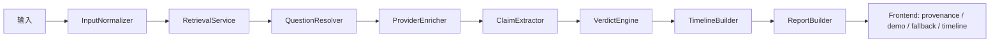
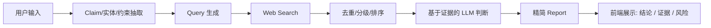
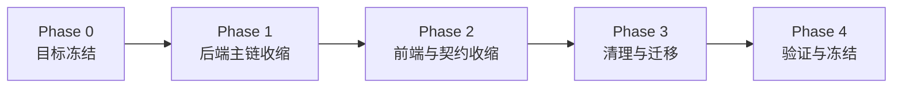

# Retrieval-First V1 代码分拣与总任务表

## 1. 目标

基于 [`proposal/retrieval-first-v1.md`](/home/forwaryan/mianshi/rumor-checking/proposal/retrieval-first-v1.md) 的方向，把当前项目拆成三类：

- 当前主链完全没用的代码
- 可以复用但需要降级或重构的代码
- 建议直接复用的核心代码

同时给出一份符合 `[[task_rules]]` 的总任务表，覆盖从“现有工作台”迁移到 “Retrieval-First V1” 的完整计划。

---

## 2. 当前项目与目标项目的结构差异

### 2.1 当前项目

当前项目的中心不是“证据驱动判断”，而是“一个可演示、可回退、可区分来源状态的工作台”。

### 2.2 Retrieval-First V1

目标项目的中心是：

- claim 是否被正确抽取
- 搜索结果是否足够相关
- 最终结论是否真正基于证据

---

## 3. 代码分拣总览

```mermaid
flowchart TD
    A["现有代码"] --> B["A. 运行时未使用"]
    A --> C["B. 仅保留为夹具/演示资产"]
    A --> D["C. 可复用但需重构"]
    A --> E["D. 建议直接复用"]

    B --> B1["google_news_rss_provider.py"]
    B --> B2["result_merger.py"]
    B --> B3["scenario_library.py"]

    C --> C1["mock_retriever.py"]
    C --> C2["frontend/lib/demo-cases.ts"]
    C --> C3["contracts/demo_payloads/*"]
    C --> C4["data/demos/replays/*"]

    D --> D1["input_normalizer.py"]
    D --> D2["question_resolver.py"]
    D --> D3["provider_enricher.py / kimi_provider.py"]
    D --> D4["verdict_engine.py / report_builder.py"]
    D --> D5["status-banner.tsx / report-utils.ts"]
    D --> D6["timeline_builder.py / timeline-panel.tsx"]

    E --> E1["retrieval_provider.py"]
    E --> E2["retrieval_service.py"]
    E --> E3["retrieval_deduper.py / retrieval_models.py"]
    E --> E4["url_content_extractor.py"]
    E --> E5["analyze endpoint / api-client / input panel / evidence UI"]
```

---

## 4. 哪些代码当前是“没用的”

这里的“没用”分成两个层次：

- **绝对没用**：当前运行时主链没有引用
- **对 Retrieval-First V1 没必要继续放在主路径里**

### 4.1 绝对没用的运行时代码

这些文件在 `backend/app` 范围内没有被其他运行时代码引用，当前可以视为真正的闲置代码：

| 文件 | 判断 | 证据 | 建议 |
| --- | --- | --- | --- |
| [`backend/app/services/google_news_rss_provider.py`](/home/forwaryan/mianshi/rumor-checking/backend/app/services/google_news_rss_provider.py) | 未接入主链 | `RetrievalService` 实际只构造 `GdeltNewsProvider`，[retrieval_service.py](/home/forwaryan/mianshi/rumor-checking/backend/app/services/retrieval_service.py):60 | 直接移除，或转为独立实验分支 |
| [`backend/app/services/result_merger.py`](/home/forwaryan/mianshi/rumor-checking/backend/app/services/result_merger.py) | 未接入主链 | 主链实际使用的是 `retrieval_deduper.merge_search_results`，[retrieval_service.py](/home/forwaryan/mianshi/rumor-checking/backend/app/services/retrieval_service.py):13 [retrieval_service.py](/home/forwaryan/mianshi/rumor-checking/backend/app/services/retrieval_service.py):151 | 删除，避免和当前 deduper 并存 |
| [`backend/app/services/scenario_library.py`](/home/forwaryan/mianshi/rumor-checking/backend/app/services/scenario_library.py) | 已脱离主链 | 当前 `AnalyzePipeline` 中没有它，[analyze_pipeline.py](/home/forwaryan/mianshi/rumor-checking/backend/app/services/analyze_pipeline.py):14 | 若无测试依赖，直接删除；否则迁到 test fixtures |

### 4.2 对新目标没必要继续放在主路径里的代码

这些代码不是“完全无用”，但不应该继续占据主运行链路：

| 文件/区域 | 当前作用 | Retrieval-First V1 下的判断 | 建议 |
| --- | --- | --- | --- |
| [`backend/app/services/mock_retriever.py`](/home/forwaryan/mianshi/rumor-checking/backend/app/services/mock_retriever.py) | 真实检索失败时回退到 mock 检索 | 不应继续污染主链判断 | 保留为测试夹具，不再进入默认 runtime |
| [`frontend/lib/demo-cases.ts`](/home/forwaryan/mianshi/rumor-checking/frontend/lib/demo-cases.ts) | 本地 demo payload 与 demo 列表 | V1 不应依赖本地 demo 才能“看起来可用” | 移到 `fixtures` 或开发模式入口 |
| `contracts/demo_payloads/*` | 稳定 demo 样例 | 只适合开发/演示，不适合产品主路径 | 保留，但从默认用户路径剥离 |
| `data/demos/replays/*` 与 `G2 replay` 相关文档 | replay 草案 | 当前 V1 不需要 replay 才能成立 | 降级到后续项，不进入当前主目标 |
| `backend_replay / demo_payload / frontend_fallback` 多分支展示 | 主要服务于演示口径 | 会放大前后端状态机复杂度 | 收缩成最小状态：`live / fixture / fallback`，甚至 V1 只保留 `live / fallback` |

---

## 5. 哪些代码可以复用

### 5.1 直接复用的核心代码

这些模块和 Retrieval-First V1 的方向一致，建议保留并在其上继续迭代：

| 文件 | 为什么能复用 | 后续动作 |
| --- | --- | --- |
| [`backend/app/services/retrieval_provider.py`](/home/forwaryan/mianshi/rumor-checking/backend/app/services/retrieval_provider.py) | 已有真实外部检索 provider 和来源分级基础 | 保留，后续允许替换 provider |
| [`backend/app/services/retrieval_service.py`](/home/forwaryan/mianshi/rumor-checking/backend/app/services/retrieval_service.py) | 已有 query 构建、缓存、fallback 和 bundle 组织逻辑 | 保留主干，改成 claim-first / multi-query |
| [`backend/app/services/retrieval_deduper.py`](/home/forwaryan/mianshi/rumor-checking/backend/app/services/retrieval_deduper.py) | 已承担结果去重归并 | 直接保留 |
| [`backend/app/services/retrieval_models.py`](/home/forwaryan/mianshi/rumor-checking/backend/app/services/retrieval_models.py) | 搜索结果与 bundle 结构清晰 | 直接保留 |
| [`backend/app/services/url_content_extractor.py`](/home/forwaryan/mianshi/rumor-checking/backend/app/services/url_content_extractor.py) | URL 输入仍然是有价值入口 | 保留 |
| [`backend/app/api/v1/endpoints/analyze.py`](/home/forwaryan/mianshi/rumor-checking/backend/app/api/v1/endpoints/analyze.py) | API 入口足够简单 | 直接保留 |
| [`frontend/components/input-panel.tsx`](/home/forwaryan/mianshi/rumor-checking/frontend/components/input-panel.tsx) | 输入区仍然是必须的 | 保留 |
| [`frontend/components/event-card.tsx`](/home/forwaryan/mianshi/rumor-checking/frontend/components/event-card.tsx) | 事件摘要卡仍然适用 | 保留 |
| [`frontend/components/claim-table.tsx`](/home/forwaryan/mianshi/rumor-checking/frontend/components/claim-table.tsx) | claim 级结论展示符合新方向 | 保留，字段可简化 |
| [`frontend/components/evidence-list.tsx`](/home/forwaryan/mianshi/rumor-checking/frontend/components/evidence-list.tsx) | 证据列表是核心输出 | 保留 |
| [`frontend/lib/api-client.ts`](/home/forwaryan/mianshi/rumor-checking/frontend/lib/api-client.ts) | 已有 `health/analyze` 调用路径 | 保留，但简化解析逻辑 |

### 5.2 可复用，但必须重构的代码

| 文件 | 当前问题 | Retrieval-First V1 下的重构方向 |
| --- | --- | --- |
| [`backend/app/services/input_normalizer.py`](/home/forwaryan/mianshi/rumor-checking/backend/app/services/input_normalizer.py) | 更偏“规则归一化 + mode hint”，不够 claim-first | 改成 `interpret_service` 的一部分 |
| [`backend/app/services/question_resolver.py`](/home/forwaryan/mianshi/rumor-checking/backend/app/services/question_resolver.py) | 只对 `question_only` 做结果择优 | 合并到统一 query/planning 层 |
| [`backend/app/services/provider_enricher.py`](/home/forwaryan/mianshi/rumor-checking/backend/app/services/provider_enricher.py) | 目前是“事件增强”，不是“基于证据判断” | 保留 provider 接口，职责改成 claim extraction 或 judge |
| [`backend/app/services/kimi_provider.py`](/home/forwaryan/mianshi/rumor-checking/backend/app/services/kimi_provider.py) | 可用，但当前放在 enrichment 位置 | 改成 interpretation/judging 两个受控调用点 |
| [`backend/app/services/claim_extractor.py`](/home/forwaryan/mianshi/rumor-checking/backend/app/services/claim_extractor.py) | 规则抽取基础可用，但还不够 claim-first | 重写成明确的 claim list 输出 |
| [`backend/app/services/verdict_engine.py`](/home/forwaryan/mianshi/rumor-checking/backend/app/services/verdict_engine.py) | 当前主要是启发式重合判断 | 改成 evidence-grounded judge，保留 verdict 枚举 |
| [`backend/app/services/report_builder.py`](/home/forwaryan/mianshi/rumor-checking/backend/app/services/report_builder.py) | 当前夹带 mode、timeline、provenance、风险拼装 | 收缩成精简 report assembler |
| [`frontend/lib/report-utils.ts`](/home/forwaryan/mianshi/rumor-checking/frontend/lib/report-utils.ts) | 过多逻辑都在服务 provenance/demo/replay/fallback 状态机 | 保留 `formatConfidence / collectEvidence / validateInput`，删减 provenance 大段逻辑 |
| [`frontend/components/status-banner.tsx`](/home/forwaryan/mianshi/rumor-checking/frontend/components/status-banner.tsx) | 主要价值在 provenance 和 fallback 标签 | 保留外壳，改成简单状态提示 |
| [`frontend/components/timeline-panel.tsx`](/home/forwaryan/mianshi/rumor-checking/frontend/components/timeline-panel.tsx) | 时间线是加分项，不是 V1 核心 | 降为可选能力或暂时下线 |

---

## 6. 当前最值得优先清理的结构问题

### 6.1 协议漂移

当前运行时 `Report` 已经有 `provenance` 和 `retrieval_hits`，[schemas.py](/home/forwaryan/mianshi/rumor-checking/backend/app/models/schemas.py):128，但共享 schema [`contracts/report.schema.json`](/home/forwaryan/mianshi/rumor-checking/contracts/report.schema.json):7 没有同步这部分。

这说明：

- 现有 contract 层已经不是稳定真相源
- 如果继续扩字段，前后端会越来越难维护

### 6.2 前端状态机过重

[`frontend/components/analyze-page.tsx`](/home/forwaryan/mianshi/rumor-checking/frontend/components/analyze-page.tsx):88 之后的大段逻辑都在处理：

- backend 是否在线
- demo payload 回退
- analyze 失败回退
- provenance 状态补齐

这对当前工作台有意义，但对 Retrieval-First V1 来说过重。

### 6.3 演示资产进入主链

[`frontend/lib/demo-cases.ts`](/home/forwaryan/mianshi/rumor-checking/frontend/lib/demo-cases.ts):6 和 [`mock_retriever.py`](/home/forwaryan/mianshi/rumor-checking/backend/app/services/mock_retriever.py):30 都说明当前系统把“演示稳定性”放进了运行路径，而不是只留在测试和 demo 模式里。

---

## 7. 建议的代码处理策略

### 7.1 直接删除

- [`backend/app/services/google_news_rss_provider.py`](/home/forwaryan/mianshi/rumor-checking/backend/app/services/google_news_rss_provider.py)
- [`backend/app/services/result_merger.py`](/home/forwaryan/mianshi/rumor-checking/backend/app/services/result_merger.py)
- [`backend/app/services/scenario_library.py`](/home/forwaryan/mianshi/rumor-checking/backend/app/services/scenario_library.py)

### 7.2 迁出主路径，只保留给测试或开发

- [`backend/app/services/mock_retriever.py`](/home/forwaryan/mianshi/rumor-checking/backend/app/services/mock_retriever.py)
- [`frontend/lib/demo-cases.ts`](/home/forwaryan/mianshi/rumor-checking/frontend/lib/demo-cases.ts)
- `contracts/demo_payloads/*`
- `data/demos/replays/*`

### 7.3 继续保留并重构

- `input_normalizer / question_resolver / claim_extractor / provider_enricher / kimi_provider`
- `verdict_engine / report_builder`
- `status-banner / report-utils / analyze-page`

### 7.4 原样保留为核心资产

- `retrieval_provider / retrieval_service / retrieval_deduper / retrieval_models`
- `url_content_extractor`
- `analyze endpoint`
- `input-panel / event-card / claim-table / evidence-list`

---

## 8. Retrieval-First V1 总任务列表

下面这份列表按 `[[task_rules]]` 的思路组织，主 task 必须能被子 task 解释。

### 8.1 总体阶段图

### 8.2 主 task 联动表

| 主 task | 完成该 task 需要的子 task | 子 task 当前进度 | 主 task 汇总状态 | 备注 |
| --- | --- | --- | --- | --- |
| `RV1` | `R1 / R2 / R3 / R4 / R5 / R6 / R7 / R8 / R9 / R10 / R11 / R12` | `R1-R12` 全部未开始；其中 `R2 / R3 / R4 / R6 / R7` 已有现成代码基础 | 未开始（0%） | Retrieval-First V1 的总目标 |
| `RV1-BE` | `R2 / R3 / R4 / R5 / R6` | `R2 / R3 / R4 / R6` 有基础待重构；`R5` 未开始 | 未开始（0%） | 后端主链收缩与能力重建 |
| `RV1-FE` | `R7 / R8` | `R7` 有现成页面骨架；`R8` 未开始 | 未开始（0%） | 前端从工作台缩到核查器 |
| `RV1-MIG` | `R9 / R10` | `R9 / R10` 未开始 | 未开始（0%） | 删除废代码、迁移 demo/mock/replay |
| `RV1-QA` | `R11 / R12` | `R11` 有旧测试基础；`R12` 未开始 | 未开始（0%） | 新验收与最终冻结 |

### 8.3 子任务清单

| Task | 目标 | 当前基础 | 当前进度 | 产出 | 难度 | 主要缺口 |
| --- | --- | --- | --- | --- | --- | --- |
| `R1` | 冻结 Retrieval-First V1 的最小 contract | 已有 proposal 文档 | 已完成（方案层） | 冻结后的输入/输出结构 | 中 | 还没写入正式 contract |
| `R2` | 重构输入理解层为 `claim-first` | `input_normalizer / question_resolver / kimi_provider` 已存在 | 未开始 | `interpret_service` | 高 | 当前仍偏关键词和 mode hint |
| `R3` | 重构 query 生成与多 query 搜索 | `retrieval_service / retrieval_provider` 已存在 | 未开始 | claim 到 queries 的检索主链 | 高 | 当前还是单 query 为主 |
| `R4` | 固化去重、来源分级、相关性筛选 | `retrieval_deduper / retrieval_models` 已存在 | 未开始 | 可解释 evidence set | 中高 | 仍缺 claim 级排序与筛选规则 |
| `R5` | 把 verdict 改成 evidence-grounded judge | `verdict_engine` 有骨架 | 未开始 | `supported/refuted/insufficient/conflicting` 的稳定判断 | 很高 | 当前仍以启发式重合为主 |
| `R6` | 收缩 Report 和 API contract | `report_builder / analyze endpoint / api-client` 已存在 | 未开始 | 精简 report schema | 中高 | 当前 contract 已漂移，字段过多 |
| `R7` | 前端从工作台缩成核查器 | `analyze-page / input-panel / claim-table / evidence-list` 已存在 | 未开始 | 极简核查 UI | 中 | 目前 demo/provenance/timeline 状态过重 |
| `R8` | 把 demo/mock/replay 迁到 fixtures/dev-only | demo payload、mock retriever、replay 草案已存在 | 未开始 | 清晰的 fixture/dev 边界 | 中 | 当前它们仍进入主叙事 |
| `R9` | 删除运行时未使用代码 | 已确认 3 个运行时闲置文件 | 未开始 | 清理后的目录 | 低 | 需要确认无隐藏依赖 |
| `R10` | 下线或降级 replay/provenance/timeline 重负载逻辑 | 现有实现齐全 | 未开始 | 轻量状态模型 | 中 | 需要控制改动面 |
| `R11` | 建新测试与 eval 集 | `backend/tests`、`frontend/lib/__tests__`、`evals/` 已存在 | 未开始 | claim/query/evidence/verdict 新回归集 | 中高 | 当前测试口径仍服务旧工作台 |
| `R12` | 最终验收与文档冻结 | `README / tasks / overview / proposal` 已存在 | 未开始 | 最终 go/no-go 结论 | 中 | 必须基于新路径重新验收 |

### 8.4 推荐执行顺序

1. `R1` 冻结最小 contract
2. `R2 -> R3 -> R4 -> R5 -> R6` 先收后端主链
3. `R7 -> R8` 收前端与 demo/mock 边界
4. `R9 -> R10` 做清理和降级
5. `R11 -> R12` 重建测试并做最终冻结

---

## 9. 对接现有代码的落地建议

### 9.1 第一刀先砍哪里

优先级建议：

1. 停止把 `mock/demo/replay` 当作主运行路径
2. 先固定新的精简 report contract
3. 再重构 `interpret -> search -> judge -> report`
4. 最后清理 UI 的 provenance / timeline 重逻辑

### 9.2 为什么不是先改前端

因为前端现在的大部分复杂度都来自“消费一个复杂 report”。

如果后端 contract 不先收缩：

- 前端会继续维护大量兼容分支
- demo/fallback/replay 逻辑会继续蔓延
- 文档和测试也会继续漂移

---

## 10. 最终判断

### 10.1 真正应该立刻删掉的

- 闲置 provider / merger / scenario library

### 10.2 真正应该立刻迁出主链的

- mock retriever
- frontend demo cases
- demo payload
- replay 草案路径

### 10.3 最值得保住的

- retrieval provider/service/deduper/models
- URL extractor
- analyze endpoint
- 输入、claim、evidence 相关 UI

### 10.4 最应该重写的

- interpretation 层
- verdict judge 层
- report contract
- provenance-heavy frontend state

这意味着当前项目并不是“完全推倒重来”，而是：

- 保留检索与基础输入能力
- 下线工作台配套重逻辑
- 围绕 claim -> evidence -> verdict 重新组织主链
