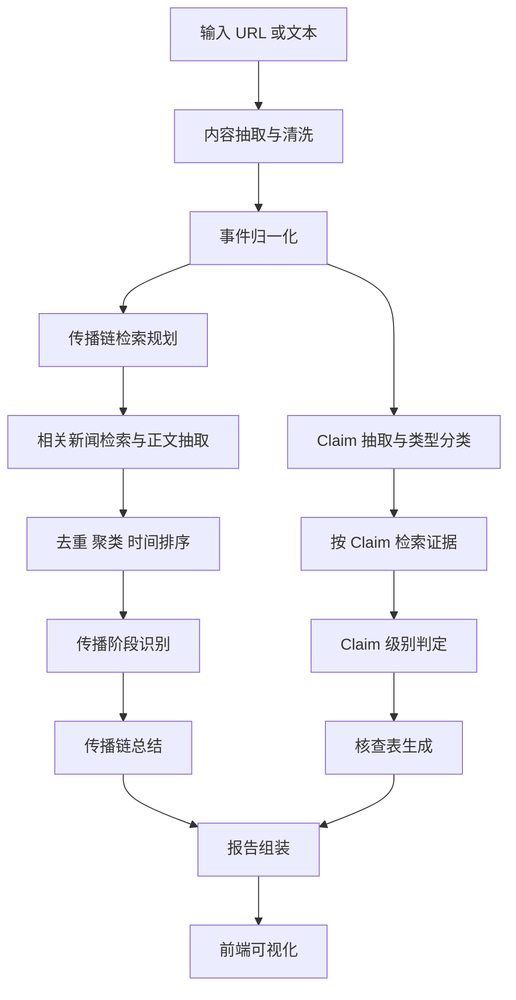

# “较真”的新闻观察员：需求分析与 V1 设计

## 1. 题目本质

题目不是让我们做一个泛泛的“新闻总结器”，而是做一个对单条新闻事件进行结构化分析的 AI 产品。核心有两件事：

1. 传播链还原：回答“这件事是怎么从出现、发酵，到达到高峰的”
2. 内容核查：回答“新闻里哪些是事实、哪些是观点、哪些可能有误或证据不足”

这意味着产品必须同时具备：

- 时间序列理解能力：能把来源、时间、引用关系整理成来龙去脉
- 证据驱动的核查能力：不能只给结论，必须给证据和依据
- 清晰可演示的产品表达：输出必须适合 15 分钟现场演示

## 2. 从评分标准反推做什么

### 2.1 评分重点不是“模型最强”，而是“方案是否完整且可信”

按权重看，最重要的是：

- 核心功能完整性 30%
- 产品思维与体验 20%
- 代码与工程质量 20%

这说明高分路径不是盲目追求最复杂的模型，而是：

- 主流程必须稳定跑通
- 演示时输入一条新闻，几十秒内就能出清晰结果
- 输出结果要让面试官一眼看出“传播链”和“核查结果”
- 系统拆分合理，能解释为何这样设计

### 2.2 AI 原生思维是加分点，但不能只停留在“接个大模型”

Prompt 与 AI 原生思维 15%，说明需要体现：

- 把复杂任务拆成适合 LLM 的多个子任务
- 控制幻觉，强调“先证据、后判断”
- 对长文本、冲突证据、证据不足有明确处理策略
- 输出结构化，方便前端渲染和后续调试

### 2.3 “实现方法”强调会借力，而不是重复造轮子

实现方法 15%，意味着需要明确说明：

- 哪些地方直接复用成熟库
- 哪些地方借鉴开源 fact-checking / RAG pipeline
- 为什么选择某个架构，而不是为了炫技做重型系统

## 3. 产品目标与边界

## 3.1 产品目标

V1 产品目标是：给定一条新闻标题、新闻正文或新闻链接，生成一份“较真分析报告”。

报告至少包含四块：

1. 事件概览：这是什么事，涉及谁，发生在什么时候
2. 传播链时间线：最早来源、关键扩散节点、发酵高峰、后续反转/澄清
3. 内容核查表：逐条列出事实、观点、存疑点及证据
4. 综合结论：这条新闻整体可信度、争议点和仍待确认的信息

## 3.2 V1 必做范围

- 输入支持两种：
  - 新闻 URL
  - 直接粘贴文本
- 输出支持三类核心结果：
  - 传播时间线
  - 关键节点列表
  - 原子 claim 核查结果表
- 每条结论都尽量带来源链接和时间
- 如果证据不足，明确输出“证据不足”，而不是强行判断

## 3.3 V1 不做或弱化

为了拿高分，必须主动控 scope。以下内容不建议在第一版强上：

- 全平台社交媒体传播图谱
- 大规模实时爬虫系统
- 复杂多模态核查（图像、视频、音频）
- 训练自有大模型
- 完整知识图谱平台

这些会显著增加工程复杂度，但未必直接提升复试得分。

## 4. 第一版产品思路

## 4.1 产品定位

推荐做成一个 Web App，而不是 CLI。

原因很直接：

- 评分里明确提到 Web GUI 与交互体验
- 传播链天然适合可视化时间线
- 核查结果天然适合表格和证据折叠卡片
- 演示时比 CLI 更直观

## 4.2 用户主流程

用户流程建议压缩为单页闭环：

1. 输入新闻链接或文本
2. 系统抽取事件信息并展示“正在分析”
3. 生成传播链时间线
4. 生成 claim 核查表
5. 输出综合判断与置信度
6. 支持点击查看证据原文与来源

## 4.3 页面信息架构

单页即可，结构建议如下：

- 顶部输入区
- 左侧/上方：事件概览卡片
- 中间：传播链时间线
- 下方：claim 核查表
- 右侧/底部：综合结论、风险提示、证据来源列表

这样做的好处是面试演示时逻辑非常顺：

- 先讲“是什么”
- 再讲“怎么传播”
- 最后讲“哪里真、哪里假、哪里不确定”

## 5. 核心需求拆解

## 5.1 输入理解层

目标：把用户输入统一成一个“待核查事件”对象。

需要完成：

- URL 解析，抽取标题、正文、发布时间、来源媒体
- 文本清洗，去掉广告、版权尾巴、导航残留
- 实体抽取：人物、机构、地点、时间
- 事件归一化：生成简洁事件摘要

输出建议：

```json
{
  "event_id": "uuid",
  "title": "...",
  "summary": "...",
  "source_url": "...",
  "source_name": "...",
  "published_at": "...",
  "entities": ["..."],
  "keywords": ["..."]
}
```

## 5.2 传播链还原层

这个模块是题目最容易做虚、也最容易拉开差距的地方。

传播链不一定要做成严格的社交图数据库。V1 更现实的定义是：

“基于新闻搜索结果、文章发布时间、文章间引用关系、相似内容聚类，重建事件的扩散路径和阶段变化。”

建议拆成 5 步：

1. 查询扩展
   - 基于标题、实体、事件摘要生成 3 到 5 条检索 query
   - 补充同义表达、英文名、简称
2. 证据检索
   - 拉取相关新闻页面或搜索结果
   - 保留时间、标题、摘要、域名、URL
3. 内容抽取与去重
   - 提取正文
   - 对转载、水稿、模板稿聚类去重
4. 时间线重建
   - 按发布时间排序
   - 标记最早来源、首次放大节点、传播高峰节点、后续澄清节点
5. 链路归因
   - 尝试识别“引用自”“据某媒体报道”“源于声明/通告”等线索
   - 给出弱因果链，而不是伪造强因果

### 传播链 V1 输出建议

- 起源节点：最早可找到的首发或原始声明
- 扩散节点：哪些媒体或平台开始跟进
- 高峰节点：何时讨论量明显上升
- 转折节点：是否出现辟谣、补充说明、官方回应

### 为什么这样设计

因为题目要的是“还原传播过程”，不是让你证明完整社交网络图绝对正确。V1 重点是：

- 有阶段感
- 有时间顺序
- 有来源支撑
- 能解释为何判断这是关键节点

## 5.3 内容核查层

这是第二个核心模块，建议按“原子 claim”处理，而不是对整篇文章一把梭。

### claim 处理流程

1. 句子切分
2. claim 抽取
3. 类型分类
4. 证据检索
5. 判定与解释

### claim 类型建议

- `fact`：可被外部证据验证的陈述
- `opinion`：态度、评论、价值判断
- `prediction`：预测、猜测、推测
- `unverifiable`：当前外部证据难以核查

### 核查标签建议

- `supported`：有较强证据支持
- `refuted`：有较强证据反驳
- `mixed`：有冲突证据，无法单向判断
- `insufficient`：证据不足
- `opinion`：属于观点，不做真伪判断

### 关键原则

- 先抽 claim，再找证据，再判定
- 不对观点类内容硬做真假判断
- 遇到日期、数字、头衔等细节，优先精查
- 至少给出 1 到 3 条证据，不够就老实说不确定

## 6. 第一版技术方案

## 6.1 推荐总体策略

推荐采用“规则 + 检索 + LLM 判断”的混合架构，而不是纯 LLM 一步生成。

原因：

- 纯 LLM 容易幻觉，传播链尤其容易编故事
- 规则和检索能保证结果有来源
- LLM 更适合做抽取、归纳、解释，而不是凭空知道事实

## 6.2 核心流水线



## 6.3 模块拆分

### 1. Ingestion

负责：

- 输入解析
- 网页正文提取
- 元信息标准化

### 2. Event Understanding

负责：

- 提取事件摘要
- 识别主体、客体、时间地点
- 生成搜索 queries

### 3. Retrieval

负责：

- 搜索相关新闻与证据页面
- 拉取网页正文
- 统一文档格式

### 4. Propagation Analyzer

负责：

- 相似文档去重
- 时间线排序
- 关键节点检测
- 传播阶段总结

### 5. Claim Verifier

负责：

- 原子 claim 抽取
- claim 类型分类
- 证据匹配
- verdict 输出

### 6. Report Composer

负责：

- 统一 JSON 输出
- 置信度与风险提示
- 结构化为前端可渲染的报告

## 6.4 结构化输出协议

建议所有中间层都尽量输出 JSON，而不是自由文本。这样有三个好处：

- 更容易调试
- 更容易缓存
- 更容易前后端联动

报告顶层结构建议：

```json
{
  "event_overview": {},
  "propagation_chain": {
    "stages": [],
    "key_nodes": [],
    "peak_window": {}
  },
  "claim_checks": [
    {
      "claim": "...",
      "claim_type": "fact",
      "verdict": "supported",
      "confidence": 0.82,
      "evidence": []
    }
  ],
  "final_assessment": {},
  "sources": []
}
```

## 7. 如何拿高分

## 7.1 产品思维与体验 20%

高分关键不是页面多，而是信息结构清楚。

建议：

- 单输入、单结果页，避免复杂导航
- 结果默认先展示结论，再支持展开细节
- 时间线做成“起源 -> 发酵 -> 高峰 -> 转折”四段式
- claim 表中使用颜色标签区分 supported / refuted / insufficient / opinion
- 每条 evidence 可点击查看来源链接和原文摘要

如果演示时面试官能在 30 秒内理解页面结构，这一项就容易拿高分。

## 7.2 核心功能完整性 30%

这是最高权重，必须确保：

- 至少准备 2 到 3 个可稳定复现的 demo case
- 每个 case 都能完整出传播链和核查表
- 做好缓存，防止现场网络或接口抖动
- 对失败场景有降级方案

降级策略建议：

- 搜索失败时，至少基于输入文章做 claim 核查
- 外部证据不足时，明确提示“无法完成传播链全量还原”
- 网页抽取失败时，允许用户直接粘贴正文

## 7.3 代码与工程质量 20%

这一项不靠嘴说，得靠结构和文档。

建议做到：

- 模块分层清晰：检索、分析、生成分开
- Prompt 模板单独管理
- 使用类型定义和 schema 校验
- 统一日志与错误码
- README 清楚写明运行方式、架构图、限制项

面试时能快速打开目录说明“每层做什么”，会很加分。

## 7.4 AI 原生思维与 Prompt 15%

这一项建议重点讲下面几个点：

- 不是一次 prompt 解决全部问题，而是多阶段 prompt pipeline
- 所有 prompt 都要求结构化输出
- 让模型区分 claim 类型，避免对观点做真假判断
- 要求模型先引用 evidence 再输出 verdict
- 增加 self-check 或 cross-check，减少幻觉

一个很好的讲法是：

“LLM 负责理解和归纳，检索负责提供事实地基，规则负责兜底。”

## 7.5 实现方法 15%

这一项要体现工程判断力：

- 传播链和核查都尽量借助成熟检索库、正文抽取库、RAG 思路
- 重点做任务编排与产品表达，不重复造底层轮子
- 明确哪些能力来自开源项目启发，哪些是自己组合出来的

## 8. 关键实现方式建议

## 8.1 传播链的实现方式

推荐使用“检索结果时间线 + 内容引用特征 + 聚类”的轻量方案。

具体可以这么做：

1. 用事件摘要生成多个 query
2. 搜到一批新闻页面
3. 抽取标题、时间、正文、来源
4. 按相似度去掉重复转载
5. 按时间排序
6. 检测阶段变化：
   - 首次出现
   - 多家媒体集中报道
   - 官方回应或辟谣
   - 传播热度下降
7. 由 LLM 根据结构化材料生成“传播链叙述”

这样实现难度可控，而且更容易解释。

## 8.2 内容核查的实现方式

推荐使用“claim decomposition + evidence retrieval + verdict”的经典 fact-checking 流程。

具体做法：

1. 从原文抽出若干原子 claim
2. 对每个 claim 生成检索 query
3. 为每个 claim 抓 3 到 5 条证据
4. 通过规则筛掉低质量证据
5. 用 LLM 输出 verdict、理由、引用片段、置信度

这比对整篇文章直接判真假靠谱得多。

## 8.3 幻觉与异常处理

这是复试时非常值得主动讲的点。

建议明确加入以下约束：

- 没有证据就不能输出确定结论
- evidence 不足时统一落到 `insufficient`
- 时间冲突时优先保留原始发布时间与官方来源
- 对模型输出做 schema 校验，失败就重试
- 对超长上下文做分块与摘要，避免上下文爆炸

## 9. 推荐工程架构

## 9.1 技术选型建议

如果目标是两天内拿出稳定可演示版本，推荐：

- 前端：Next.js 或 React
- 后端：FastAPI
- 任务编排：Python service pipeline
- 数据存储：SQLite 或本地 JSON cache
- 模型接入：统一 LLM Provider Adapter

原因：

- Python 更适合做检索、抽取、LLM 编排
- Web 前端更适合演示产品感
- SQLite / 文件缓存足够支撑复试 demo

## 9.2 目录规划建议

```text
rumor-checking/
  frontend/
  backend/
    app/
      api/
      core/
      schemas/
      services/
        ingestion/
        event_understanding/
        retrieval/
        propagation/
        verification/
        report/
      prompts/
      adapters/
    tests/
  requirements/
  README.md
```

## 9.3 后端职责规划

- `api/`：对外接口
- `schemas/`：Pydantic 输入输出模型
- `services/ingestion/`：URL 抽取、正文清洗
- `services/retrieval/`：搜索与网页抓取
- `services/propagation/`：传播链构建
- `services/verification/`：claim 核查
- `services/report/`：统一结果拼装
- `prompts/`：各步骤 prompt 模板
- `adapters/`：对接搜索、LLM、缓存等外部依赖

## 10. 里程碑规划

## 10.1 第一阶段：把主链路打通

目标：

- 支持输入 URL / 文本
- 能产出事件概览
- 能产出基本传播时间线
- 能产出 claim 核查表

只要这一阶段稳，已经具备复试可演示性。

## 10.2 第二阶段：提升观感与可信度

目标：

- 做时间线 UI
- 给 evidence 加引用与摘要
- 加缓存与错误提示
- 优化最终结论表述

## 10.3 第三阶段：补强亮点

目标：

- 增加传播阶段自动命名
- 增加 source reliability 提示
- 增加 prompt self-check
- 增加 demo case 与 README

## 11. 演示时怎么讲最稳

建议演示逻辑固定成 3 段：

1. 先讲题目理解
   - 这是一个“传播链还原 + 内容核查”的双任务系统
2. 再讲产品结果
   - 输入一条新闻，输出时间线、claim 核查、综合结论
3. 最后讲实现方法
   - 检索提供证据，LLM 负责归纳和判断，规则负责降低幻觉

如果现场只记住一句话，最好是这句：

“我们没有把它做成一个会编故事的总结器，而是做成了一个证据驱动的新闻核查工作流。”

## 12. 结论

这个题目的高分关键，不在于把所有技术都堆上去，而在于：

- 准确理解题目是“双核心任务”
- 设计一个适合演示的产品形态
- 用证据驱动的 pipeline 替代纯大模型自由生成
- 控好第一版范围，优先保证主流程稳定、可信、好讲

第一版最优策略可以概括为一句话：

“做一个证据可回溯、时间线可视化、claim 级核查的新闻观察员 Web App。”
