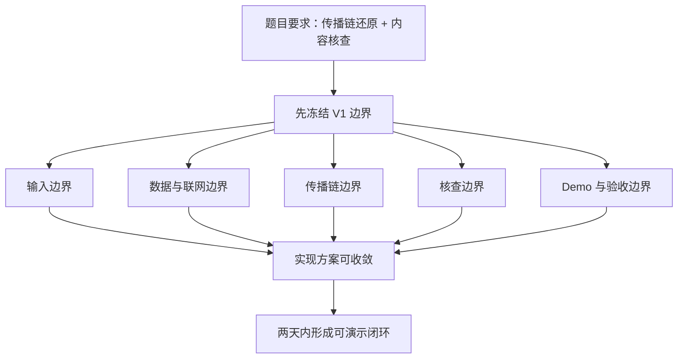
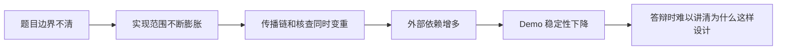
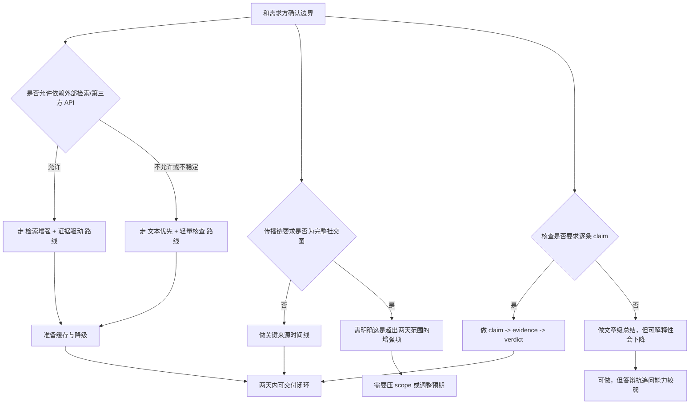

# 实现难点汇总与需求边界确认清单

## 1. 这份文档解决什么问题

这份文档不是重新写一遍方案，而是把现有几份分析里的关键信息压缩成一份更适合沟通的材料，目标有两个：

1. 帮你快速看清当前项目真正的实现难点到底是什么
2. 帮你和提需求的人尽快确认边界，避免两天项目因为目标过宽而失控

适用场景：

- 你准备和提需求的人对齐题目边界
- 你要决定两天内到底做什么、不做什么
- 你想把“为什么这样收口”讲得更清楚

## 2. 一页结论

当前项目最大的难点，不是前端页面，也不是会不会接大模型，而是下面 3 件事：

1. 题目边界天然模糊，尤其是“传播链还原”到底要做到什么粒度
2. 结果高度依赖外部证据，而证据质量、检索稳定性、冲突处理都不受我们完全控制
3. 题目要求其实包含两条不同能力链路：传播链还原和内容核查，如果不主动收口，很容易两边都做不稳

所以当前最重要的，不是继续加功能，而是先把下面 5 类边界问清楚：

- 输入边界
- 数据与联网边界
- 传播链边界
- 核查边界
- Demo 与验收边界

## 3. 先看总图

这张图的核心意思很简单：

- 不是先写系统，再补边界
- 而是先把边界冻结，再决定系统怎么实现

## 4. 实现难点汇总

| 难点 | 本质是什么 | 为什么危险 | 建议收口方式 |
| --- | --- | --- | --- |
| 题目定义模糊 | “传播链”“核查”都没有严格验收定义 | 做到一半容易被追问“为什么这就算完成” | 先把 V1 明确定义成“关键来源时间线 + claim 级核查表” |
| 证据比判断更难 | 难点不在生成结论，而在找到可信证据 | 容易退化成“检索摘要器”而不是核查系统 | 强制支持 `supported / refuted / insufficient / conflicting` |
| 中文新闻输入不稳定 | URL 抽取、发布时间、转载关系都可能不稳定 | 输入一脏，后面时间线和 claim 都会漂 | 把“文本输入”设为稳态能力，URL 抽取作为增强 |
| 两个核心任务不是一套能力 | 传播链偏检索与时间线，核查偏 claim 与证据 | 容易两条链路都做一半 | 主线只保留“关键来源时间线”与“claim 核查表” |
| 外部依赖不可控 | 搜索、抽取、API、网络都可能波动 | Demo 现场最容易翻车 | 提前缓存 case，设计失败降级 |
| 验收口径缺失 | 还没有明确 DoD | 容易越做越散，不断加功能 | 先冻结最小可交付标准 |

## 5. 难点之间的因果关系

这张图想表达的是：

- 真正的源头问题通常不是“技术不行”
- 而是“边界没定死”

## 6. 必须和提需求的人确认的边界

下面这张表建议你优先按 `P0 -> P1 -> P2` 去问。

| 优先级 | 需要确认的问题 | 为什么必须问 | 如果对方一时答不上来，建议默认口径 |
| --- | --- | --- | --- |
| P0 | 传播链到底要求“关键来源时间线”还是“完整平台传播图” | 这直接决定系统复杂度是 Demo 级还是平台级 | 默认按“关键来源时间线”实现，不承诺完整社交图谱 |
| P0 | 内容核查是要“整篇文章真假结论”，还是“claim 级核查” | 这决定输出结构、证据组织和可解释性 | 默认按“claim 级核查 + 总结结论”实现 |
| P0 | 演示时是否允许联网和调用第三方 API / 搜索接口 | 这决定系统能不能依赖外部检索和事实核查服务 | 默认允许联网，但必须准备缓存和降级方案 |
| P0 | 输入范围是否强制同时支持 URL 和纯文本 | 这决定输入链路复杂度和稳定性要求 | 默认“文本输入必支持，URL 输入尽力支持” |
| P0 | 评审更看重“结果覆盖面”还是“稳定可解释” | 这决定取舍方向 | 默认优先稳定、可解释、可演示 |
| P1 | 传播链结果最少需要多少节点才算合格 | 这决定验收标准和页面设计 | 默认 5 到 10 个关键节点 |
| P1 | claim 核查最少需要覆盖几条才算合格 | 这决定模型输出协议和 UI 信息密度 | 默认 3 到 5 条核心 claim |
| P1 | 是否允许输出“证据不足”“冲突证据”这种不确定结果 | 这决定系统能否诚实地处理不确定性 | 默认允许，而且把它视为可信表现而不是失败 |
| P1 | 是否允许提前准备并缓存固定 Demo case | 这决定答辩翻车风险 | 默认允许，并建议准备 3 条稳定 case |
| P1 | 允许借助哪些外部数据源或现成 fact-check 结果 | 这决定检索层和证据层的可实现性 | 默认允许复用公开搜索、GDELT、已有 fact-check 结果 |
| P2 | 是否必须覆盖社交平台传播、知识图谱、多模态核查 | 这会显著增加工程复杂度 | 默认不纳入 V1 |
| P2 | 最终交付到底是“能演示的 Web Demo”还是“接近生产可部署系统” | 这决定工程投入深度 | 默认按“可运行、可讲解、可演示的 Web Demo”交付 |

## 7. 最值得你当面问的 8 个问题

如果你和对方沟通时间很短，优先问这 8 个：

1. 传播链在这道题里，最低做到什么粒度就算合格？
2. 你们更希望看到“完整传播图”，还是“关键节点时间线”？
3. 内容核查是更偏向整篇文章结论，还是逐条 claim 的证据化判断？
4. 演示时是否允许联网、调用搜索接口和第三方事实核查结果？
5. 如果系统输出“证据不足”或“证据冲突”，这算合理结果吗？
6. 输入是否必须同时支持 URL 和纯文本？如果只能保证一个，优先哪个？
7. 评审更在意功能覆盖面，还是更在意稳定性、可解释性和讲解清晰度？
8. 最终期待的是一个稳定 Demo，还是接近生产化的平台雏形？

## 8. 建议的默认边界

如果对方没有时间给出非常精确的定义，建议你主动采用下面这套默认边界，并在答辩时明确讲出来。

### 8.1 V1 做什么

- 面向单条新闻事件
- 支持文本输入，URL 输入作为增强
- 输出关键来源时间线
- 输出 3 到 5 条核心 claim 的核查结果
- 每条结论尽量带证据来源、发布时间和链接
- 允许 `insufficient` 与 `conflicting`

### 8.2 V1 不做什么

- 不承诺完整社交平台传播图
- 不做大规模实时爬虫
- 不做多模态核查
- 不做训练自有模型
- 不做知识图谱平台

### 8.3 V1 验收口径

- 能输入 1 条新闻并稳定得到结果
- 时间线能展示关键阶段
- claim 表能展示证据和结论
- 页面能支持 15 分钟内讲清楚主流程
- 遇到失败场景时有明确降级提示

## 9. 需求确认后的实现分流图

## 10. 推荐沟通顺序

为了减少沟通来回，建议按下面的顺序问：

1. 先问“最低完成标准是什么”
2. 再问“是否允许联网和使用外部能力”
3. 再问“传播链到底做到什么粒度”
4. 再问“核查结果是文章级还是 claim 级”
5. 最后问“Demo 和工程交付的期待有多高”

这个顺序的好处是：

- 前两问决定项目是否可做
- 中间两问决定产品结构
- 最后一问决定工程投入深度

## 11. 最终建议

如果你只能带一页认知去和提需求的人沟通，请坚持这句话：

当前项目最大的风险不是“做不出来某个高级功能”，而是“在没有冻结边界的情况下被迫同时做传播链、核查、搜索、抽取、可视化和 Demo 稳定性”，这会让项目复杂度指数上升。

因此，最正确的动作不是继续扩功能，而是先确认边界，再按边界做一个可解释、可演示、可交付的最小闭环。
