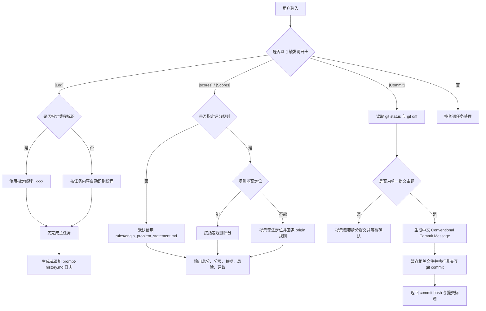

# 方括号触发指令总览与逻辑图

## 1. 结论先行

当前仓库里真正用于“通过 `[]` 触发”的一级指令一共有 3 类：

1. `[Log]`
2. `[scores]` / `[Scores]`
3. `[Commit]`

其中有 2 类支持第二个方括号作为参数位：

- `[Log][T-xxx]`：第二个方括号用于指定线程标识
- `[scores][规则标识]`：第二个方括号用于指定评分规则

当前规则中**没有**定义 `[Commit][xxx]` 这样的二级参数形式。

## 2. 识别边界

并不是仓库里所有出现的 `[]` 都是命令。需要区分下面两类：

- **命令型方括号**：出现在用户指令开头，用于触发特定工作流，例如 `[Log]`、`[scores]`、`[Commit]`
- **非命令型方括号**：只是普通文本、Markdown、JSON 或占位符的一部分，例如 `[待填写]`、`["..."]`

因此，真正应该被视为“触发指令”的，是那些在规则文件中被明确声明为触发词的格式，而不是所有带 `[]` 的文本。

## 3. 统一总表

| 一级触发词 | 可选第二参数 | 主要作用 | 默认行为 | 主要产出 | 来源文件 |
| --- | --- | --- | --- | --- | --- |
| `[Log]` | `[T-xxx]` | 记录本次 Prompt / 线程上下文 | 若未指定线程，则自动识别 `T-main`、`T-research`、`T-impl`、`T-doc`、`T-test` | `prompt-history.md` 的日志追加建议或更新 | `workflows/prompt_logging_rules.md` |
| `[scores]` / `[Scores]` | `[规则别名 / 规则路径 / 自定义规则名]` | 按指定评分规则给方案或仓库打分 | 若未指定规则，则默认使用 `rules/origin_problem_statement.md` | 中文评分结果，包括总分、分项、依据、风险、建议 | `rules/score_alignment_rules.md` |
| `[Commit]` | 无 | 触发真实 Git 提交流程 | 先读取 `git status` 和 `git diff`，确认主题后再提交 | 一次真实的非交互式 Git commit 结果 | `rules/commit_rules.md` |

## 4. 指令逐条解释

## 4.1 `[Log]`

### 作用

`[Log]` 用来触发 Prompt 日志记录机制，适合在多线程、多窗口协作时留下任务背景、线程职责、上下文来源和交接建议。

### 触发方式

- `[Log]`
- `[Log][T-main]`
- `[Log][T-impl]`
- `[Log][T-impl-ui]`

### 第二个方括号的含义

当存在第二个方括号时，它表示**线程标识**，用于强制指定当前任务属于哪个线程。

常见线程标识包括：

- `T-main`：主控 / 汇总 / 决策
- `T-research`：调研 / 竞品 / 信息收集
- `T-impl`：实现 / 编码 / 修复
- `T-doc`：文档 / 汇报 / 说明
- `T-test`：测试 / 验证 / 验收

### 默认逻辑

如果只写 `[Log]` 而没有指定线程，则按任务内容自动识别：

- 汇总、决策、规划类任务优先归入 `T-main`
- 搜索资料、竞品分析类任务优先归入 `T-research`
- 写代码、改文件类任务优先归入 `T-impl`
- 文档整理类任务优先归入 `T-doc`
- 测试和验收类任务优先归入 `T-test`

### 执行顺序

1. 先完成主任务
2. 再生成或追加日志内容
3. 将结果落到 `prompt-history.md`

### 适合什么时候用

- 需要保留 Prompt 决策痕迹时
- 多个 Codex 窗口并行工作时
- 需要明确交接关系时

## 4.2 `[scores]`

### 作用

`[scores]` 用来触发评分工作流，按照给定评分标准，对当前方案、仓库、README 或 Demo 进行结构化评估。

### 触发方式

- `[scores] 请给当前方案打分`
- `[scores][origin] 请按原始评分标准给这个 Demo 打分`
- `[scores][rules/origin_problem_statement.md] 请根据这个规则给仓库评分`
- `[scores][较真评分标准] 请按这个规则评估当前实现`
- `[Scores][origin]` 与 `[scores][origin]` 等价

### 第二个方括号的含义

当存在第二个方括号时，它表示**评分规则标识**，可以是：

- 规则别名，例如 `origin`
- 规则文件路径，例如 `rules/origin_problem_statement.md`
- 自定义规则名称，例如 `较真评分标准`

### 默认逻辑

- 如果只写 `[scores]`，默认使用 `rules/origin_problem_statement.md`
- 如果手动指定了规则，则优先按指定规则评分
- 如果指定的规则无法定位，则明确提示后回退到 `rules/origin_problem_statement.md`

### 输出要求

评分结果默认按 100 分制输出，至少应包含：

- 总分
- 分项得分
- 每项评分依据
- 主要风险或短板
- 最优先改进建议

如果信息不足，还要明确说明“评分基于当前已知信息”。

### 适合什么时候用

- 想快速知道当前方案离高分还有多远
- 想按固定规则评估某次迭代结果
- 想把产出映射回评分维度时

## 4.3 `[Commit]`

### 作用

`[Commit]` 用来触发真实的 Git 提交流程，而不是只生成一段提交信息。

### 触发方式

- `[Commit]`

此外，规则中还支持自然语言等价表达，例如“提交本次改动”“按规范提交”“帮我 commit”，但这些不属于 `[]` 形式的触发词。

### 默认逻辑

触发后需要按固定顺序执行：

1. 读取 `git status` 和相关 `git diff`
2. 判断当前改动是否适合合并为一个 commit
3. 生成符合 Conventional Commits 的中文 Commit Message
4. 暂存本次相关文件
5. 执行一次非交互式 `git commit`
6. 返回提交结果

### 重要约束

- 不能跳过 diff 直接猜提交主题
- 如果改动明显包含多个无关主题，不能强行提交为一个 commit
- 如果没有可提交改动，要明确说明，而不是生成虚假结果
- 提交成功后，返回内容至少要包含 commit hash 和 Commit Message 首行

### 适合什么时候用

- 当前任务已经完成，且改动主题清晰单一
- 希望直接按规范完成一次真实提交

## 5. 一级指令与二级参数的关系

为了避免把参数位误认为独立命令，可以把当前规则理解成下面这种结构：

- 一级命令 1：`[Log]`
  - 二级参数：`[T-main]`、`[T-research]`、`[T-impl]`、`[T-doc]`、`[T-test]`、更细分的 `T-xxx`
- 一级命令 2：`[scores]`
  - 二级参数：`[origin]`、`[rules/origin_problem_statement.md]`、`[自定义规则名]`
- 一级命令 3：`[Commit]`
  - 当前无二级参数位

所以如果按“主入口”来算，是 3 个命令；如果按“带参数的使用形式”来算，会比 3 个更多，但它们本质上仍然属于同一套一级命令。

## 6. 逻辑图

## 7. 推荐使用顺序

如果把这些指令放到一次完整研发流程里，可以这样理解：

1. 用 `[Log]` 记录任务目标、线程和交接关系
2. 用 `[scores]` 评估当前方案或产出是否对齐评分标准
3. 完成改动后，用 `[Commit]` 生成并执行规范提交

这三条指令分别对应：

- **过程留痕**
- **结果评估**
- **版本沉淀**

## 8. 来源文件

本文件整理自以下规则文件：

- `workflows/prompt_logging_rules.md`
- `rules/score_alignment_rules.md`
- `rules/commit_rules.md`
