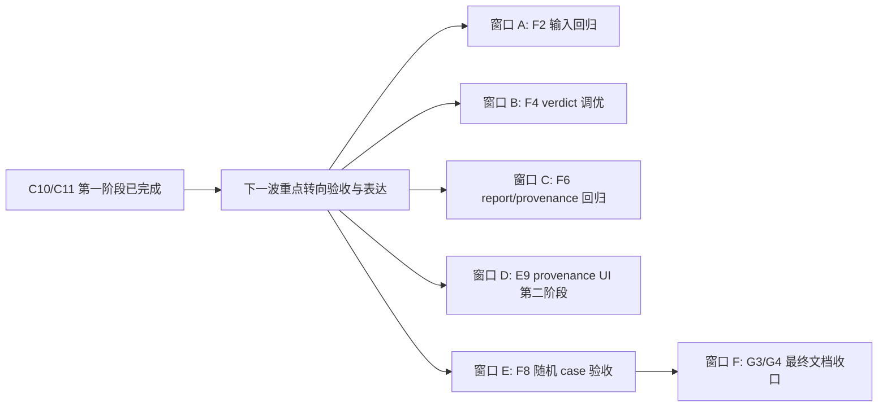

# Tasks Index

本目录用于存放可独立并行推进的任务文件。

每个任务文件都对应一个可以单独分配给窗口或集群的工作包，而不是单个零散动作。

## 使用方式

1. 先看本目录，决定当前要开几个窗口。
2. 给每个窗口分配一个独立的任务文件。
3. 开始执行前，先在目标 `cluster-*.md` 的对应子任务下写明“本轮执行任务”和“执行步骤”。
4. 每个窗口只以自己负责的任务文件为主，不主动跨界修改其他工作包的核心文件。
5. 某个子任务完成后，必须把该任务文件中的状态、完成方式、验证结果和剩余问题一起回写，而不是只改一个状态词。

## 当前任务文件

- `cluster-a-control-tower.md`
- `cluster-b-contract-forge.md`
- `cluster-c-api-foundation.md`
- `cluster-d-retrieval-lab.md`
- `cluster-e-experience-shell.md`
- `cluster-f-quality-gate.md`
- `cluster-g-demo-ops.md`

## 当前最高优先级

截至 `2026-03-14` 晚间复查，第一波与第二波的主实现已经基本到位：

- `C10` 已完成。
- `C11` 已完成第一阶段“主链去占位 + provenance 冻结”。
- 当前真正还没收口的，不再是“有没有主链”，而是“主链能不能稳定撑住随机新闻 + 能不能被前端和文档正确表达”。

按当前目标“继续逼近任意新闻都能较真”，建议优先级如下：

1. `Cluster-F / Quality Gate`
   - 核心是 `F2 / F4 / F6 / F8`。
   - 现在最缺的是输入、verdict、report mode 和随机 case 的最终验收闭环。
2. `Cluster-E / Experience Shell`
   - 核心是 `E9` 第二阶段。
   - 后端 provenance 字段已经冻结，前端可以正式把 `backend_live / backend_mock / backend_replay / demo_payload / frontend_fallback` 分清楚。
3. `Cluster-G / Demo Ops`
   - 核心是 `G3 / G4` 最终收口，`G2` 视 replay 需要补最终定稿。
   - 这条线要等 `F8` 给出真实验收记录后再写最终口径。
4. `Cluster-C / API Foundation`
   - `C10 / C11` 第一阶段已完成，当前只建议处理 `F2 / F4 / F6` 反馈回来的最小修正，以及 `C9` 相关的残余质量测试适配。
5. `Cluster-D / Retrieval Lab`
   - 当前不是新的主阻塞项，更适合作为 `F8` 随机 live case 验收时的检索质量支撑。

## 当前建议窗口



| 窗口 | 建议任务 | 主要文件范围 | 为什么现在适合并行 |
| --- | --- | --- | --- |
| `W-A` | `F2` 输入标准化回归收口 | `backend/eval_regression_tests/test_input_eval_regression.py`、`backend/app/services/input_normalizer.py` | 主要是输入字段/关键词/mode_hint 收敛，和 verdict/UI 冲突小。 |
| `W-B` | `F4` verdict 回归收口 | `backend/eval_regression_tests/test_verdict_eval_regression.py`、`backend/app/services/verdict_engine.py` | 主要是 verdict/confidence/冲突保留逻辑，和前端文档窗口隔离。 |
| `W-C` | `F6` report mode + provenance 回归收口 | `backend/eval_regression_tests/test_report_mode_eval_regression.py`、`backend/app/services/report_builder.py` | 当前最大的直接阻塞是 provenance 参数已冻结，但 F6 测试入口还没跟上。 |
| `W-D` | `E9` 第二阶段 | `frontend/components/analyze-page.tsx`、`frontend/components/status-banner.tsx`、`frontend/types/report.ts` | 后端 provenance 已冻结，可以正式接真实标签。 |
| `W-E` | `F8` 随机 case / 稳定 demo 最终验收 | `SMOKE_CHECKLIST.md`、`overview/07_quality-and-demo-baseline.md`、验收记录文档 | 主要消费已有能力，尽量不再改主实现。 |
| `W-F` | `G3/G4` 最终文档收口 | `README.md`、`overview/11_runtime-and-env-outline.md`、`overview/12_limits-and-degradation-outline.md` | 必须等 `F8` 给出口径后再写最终版，避免再次漂移。 |

## 如果窗口不够怎么合并

### 3 个窗口

- `窗口 1`
  - 拿 `cluster-a-control-tower.md` + `cluster-b-contract-forge.md`
- `窗口 2`
  - 拿 `cluster-c-api-foundation.md` + `cluster-f-quality-gate.md`
- `窗口 3`
  - 拿 `cluster-e-experience-shell.md` + `cluster-g-demo-ops.md`

### 4 个窗口

- `窗口 1`
  - 拿 `cluster-a-control-tower.md` + `cluster-b-contract-forge.md`
- `窗口 2`
  - 拿 `cluster-c-api-foundation.md`
- `窗口 3`
  - 拿 `cluster-f-quality-gate.md`
- `窗口 4`
  - 拿 `cluster-e-experience-shell.md` + `cluster-g-demo-ops.md`

### 6 到 7 个窗口

- 每个窗口各拿一个 cluster 文件，最稳。
- 如果要继续细拆，优先在 `Cluster-F` 内部分 `F2 / F4 / F6 / F8`，不要再把 `C10 / C11` 当成当前默认主窗口。

## 执行记录要求

从现在开始，所有实际执行的任务都必须先写进对应 task 文件，再开始改代码或文档。

最低要求如下：

- 开始前：
  - 在对应子任务下写明本轮要做什么。
  - 把本轮工作拆成 `3` 到 `7` 个可执行步骤。
  - 标明本轮主要会改哪些目录或文件范围。
- 完成后：
  - 更新子任务状态。
  - 补充“怎么完成的”，至少说明改了哪些文件、核心做法是什么。
  - 补充验证结果，说明跑了什么测试、接口或联调。
  - 补充剩余问题和下一步交接建议。
- 如果中途阻塞：
  - 把状态改为 `阻塞` 或保留 `进行中` 并写清阻塞原因。
  - 写明当前停在第几步、需要哪个 cluster 或哪个前置条件继续推进。

推荐在子任务下使用以下固定格式：

```text
本轮执行任务：
- ...

执行步骤：
- ...
- ...

完成记录：
- 改动文件：...
- 完成方式：...
- 验证结果：...
- 剩余问题：...
```

## 配套执行手册

当前最应优先看的执行手册是：

- `overview/10_unfinished-task-priority-and-parallel-analysis.md`
  - 已包含历史波次分析，以及本轮应继续执行的窗口 prompt。
- `overview/09_stage-progress-and-task-audit.md`
  - 用于看当前真实进度、测试面和剩余阻塞。

推荐顺序：

1. 先读 `tasks/cluster-c-api-foundation.md` 确认 `C10 / C11` 已完成到哪一层。
2. 再读 `tasks/cluster-f-quality-gate.md` 看 `F2 / F4 / F6 / F8` 还差什么。
3. 然后按 `overview/10_unfinished-task-priority-and-parallel-analysis.md` 的最新窗口 prompt 分发下一波。
