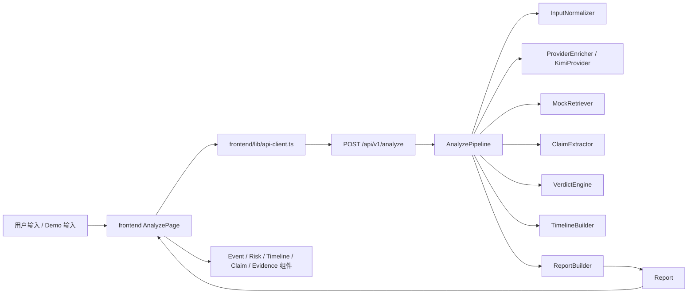

# 已完成子任务文档索引

这份索引不是新的任务看板，而是给后续 AI / 接手者用的“文档导航页”。

目标只有两个：

1. 让人从 `tasks/` 出发，能快速定位每个已完成子任务对应的实现说明。
2. 避免后续继续靠翻全仓库代码来判断“这个功能到底是怎么做的”。

## 当前结论

当前仓库已经完成的内容，主要集中在 5 个方向：

- 目录边界和并行工作包拆分已经稳定。
- `contracts/` 已经形成前后端共享协议与 demo payload 基线。
- 后端最小 `analyze` 闭环已经跑通，并接入了第一阶段 Kimi enrichment。
- 前端单页工作台已经跑通真实 analyze 优先、本地 demo 回退和三档模式展示。
- 最小测试集入口、基础 API 回归和稳定 demo case 已经建立。

还没有真正完成的部分主要是：

- URL 正文抽取
- 真实检索与真实时间线增强
- 按 eval 文件分层的系统性回归
- replay 资产、演示脚本和最终 README 收口

## 已完成子任务 -> 对应文档

| Cluster | 已完成子任务 | 推荐先读文档 | 关键代码入口 | 说明 |
| --- | --- | --- | --- | --- |
| Cluster-A | `A2` 冻结目录结构与命名边界 | `overview/06_current_code_implementation.md`、`overview/02_folder_rationale.md` | 仓库根目录、`README.md` | 当前目录边界已经进入“按实际代码说话”的阶段。 |
| Cluster-B | `B1 ~ B5` schema 与 demo payload | `contracts/contract-forge-implementation-record.md` | `contracts/*.schema.json`、`contracts/demo_payloads/*.json`、`backend/app/models/schemas.py`、`frontend/types/report.ts` | 这是前后端共享协议的事实基线。 |
| Cluster-C | `C1 ~ C8`、`C9` 第一阶段 | `backend/docs/api-foundation-implementation-record.md` | `backend/app/main.py`、`backend/app/services/analyze_pipeline.py` | 后端主链路、provider 接线和回退逻辑都在这里解释。 |
| Cluster-E | `E1 ~ E8` | `frontend/IMPLEMENTATION_SUMMARY.md` | `frontend/components/analyze-page.tsx`、`frontend/lib/api-client.ts` | 前端页面状态流、真实接口优先和 demo fallback 都已落地。 |
| Cluster-F | `F1` 最小测试集接入 | `overview/07_quality-and-demo-baseline.md` | `backend/tests/conftest.py`、`evals/minimal_v1/*` | 当前已经有统一 eval 读取入口，但系统性分层回归还没收口。 |
| Cluster-G | `G1` 稳定 demo case | `overview/07_quality-and-demo-baseline.md` | `frontend/lib/demo-cases.ts`、`contracts/demo_payloads/*.json` | 当前 3 条稳定 demo 已经和前后端场景对齐。 |

## 推荐阅读顺序

如果是第一次接手当前仓库，建议按这个顺序读：

1. `overview/06_current_code_implementation.md`
2. `contracts/contract-forge-implementation-record.md`
3. `backend/docs/api-foundation-implementation-record.md`
4. `frontend/IMPLEMENTATION_SUMMARY.md`
5. `overview/07_quality-and-demo-baseline.md`
6. `overview/08_origin_problem_gap_and_demo_strategy.md`

如果只需要快速改一个点，按下面的路径读：

- 改响应字段、字段命名、模式枚举：
  先读 `contracts/contract-forge-implementation-record.md`
- 改后端 analyze 主链路、provider、输入标准化：
  先读 `backend/docs/api-foundation-implementation-record.md`
- 改前端交互、fallback、页面状态：
  先读 `frontend/IMPLEMENTATION_SUMMARY.md`
- 改测试基线、demo case、回归入口：
  先读 `overview/07_quality-and-demo-baseline.md`

## 现在的实际主链路

这条链路已经真实存在于代码里，但其中只有前半段的一部分接入了真实 provider。

当前仍然是：

- 输入标准化：规则优先
- provider enrichment：第一阶段已接入
- 检索：mock / eval 数据驱动
- verdict：规则驱动
- timeline：规则 + retrieval foundation
- demo：本地 payload 回退

## 后续维护建议

- 每新增一个“已完成”子任务，优先补对应实现记录，而不是只改任务状态。
- 如果某个 cluster 已经有实现总结，优先更新原文档，不再在别处复制一份平行说明。
- 如果字段、接口或模式有变化，先更新 `contracts/` 说明，再改前后端实现。

