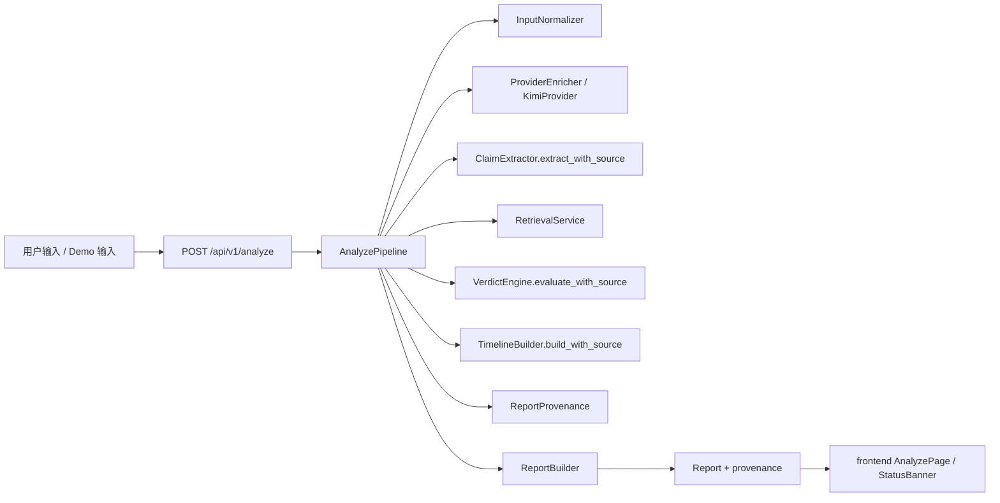

# 已完成子任务文档索引

这份索引不是新的任务看板，而是给后续 AI / 接手者用的“文档导航页”。

目标只有两个：

1. 让人从 `tasks/` 出发，能快速定位每个已完成子任务对应的实现说明。
2. 避免后续继续靠翻全仓库代码来判断“这个功能到底是怎么做的”。

## 当前结论

当前仓库已经完成的内容，主要集中在 7 个方向：

- 目录边界和并行工作包拆分已经稳定。
- `contracts/` 已经形成前后端共享协议与 demo payload 基线。
- 后端 `C10` 已完成 URL 抽取与 fallback。
- 后端 `C11` 已完成第一阶段“主链去占位 + provenance 冻结”。
- 后端最小真实检索、缓存和真实 bundle 时间线已经落地。
- 前端单页工作台已经跑通真实 analyze 优先、本地 demo 回退和三档模式展示。
- API / retrieval / Kimi provider 质量基线已可跑，当前主要缺口转向 eval 分层回归与最终随机 case 验收。

还没有真正完成的部分主要是：

- `F2 / F4 / F6` 的系统性回归收口
- `F8` 随机 case 与稳定 demo 的最终验收记录
- `E9` 第二阶段 provenance 展示接线
- `G3 / G4` 的最终运行口径与边界说明收口

## 已完成子任务 -> 对应文档

| Cluster | 已完成子任务 | 推荐先读文档 | 关键代码入口 | 说明 |
| --- | --- | --- | --- | --- |
| Cluster-A | `A2` 冻结目录结构与命名边界 | `overview/06_current_code_implementation.md`、`overview/02_folder_rationale.md` | 仓库根目录、`README.md` | 当前目录边界已经进入“按实际代码说话”的阶段。 |
| Cluster-B | `B1 ~ B5` schema 与 demo payload | `contracts/contract-forge-implementation-record.md` | `contracts/*.schema.json`、`contracts/demo_payloads/*.json`、`backend/app/models/schemas.py`、`frontend/types/report.ts` | 这是前后端共享协议的事实基线。 |
| Cluster-C | `C1 ~ C8`、`C10`、`C11` 第一阶段 | `tasks/cluster-c-api-foundation.md`、`backend/docs/api-foundation-implementation-record.md` | `backend/app/services/analyze_pipeline.py`、`backend/app/services/report_builder.py`、`backend/app/models/schemas.py` | 当前主链已经不再依赖模板 evidence / mock timeline 才能输出报告，并已冻结后端 provenance 字段。 |
| Cluster-D | `D1 ~ D7` 最小真实检索与时间线 | `tasks/cluster-d-retrieval-lab.md`、`backend/README.md`、`data/README.md` | `backend/app/services/retrieval_service.py`、`backend/app/services/retrieval_provider.py`、`backend/app/services/retrieval_cache.py`、`backend/tests/test_retrieval.py` | 当前已经有 GDELT provider、缓存、query rewrite、真实 bundle timeline 和 mock fallback。 |
| Cluster-E | `E1 ~ E8`、`E9` 第一阶段 | `frontend/IMPLEMENTATION_SUMMARY.md`、`tasks/cluster-e-experience-shell.md` | `frontend/components/analyze-page.tsx`、`frontend/components/status-banner.tsx` | 前端已经有 provenance UI 壳，待第二阶段接后端 frozen 字段。 |
| Cluster-F | `F1`、`F3`、`F5`、`F7` | `tasks/cluster-f-quality-gate.md`、`overview/07_quality-and-demo-baseline.md`、`SMOKE_CHECKLIST.md` | `backend/eval_regression_tests/test_claim_eval_regression.py`、`backend/tests/test_retrieval.py` | claim 分类回归、retrieval 回归和 smoke checklist 都已落地。 |
| Cluster-G | `G1`、`G5`、`G6` | `README.md`、`DEMO_SCRIPT.md`、`overview/07_quality-and-demo-baseline.md` | `frontend/lib/demo-cases.ts`、`contracts/demo_payloads/*.json` | 当前 3 条稳定 demo、演示脚本和顶层 README 已对齐。 |

## 推荐阅读顺序

如果是第一次接手当前仓库，建议按这个顺序读：

1. `overview/09_stage-progress-and-task-audit.md`
2. `tasks/cluster-c-api-foundation.md`
3. `tasks/cluster-f-quality-gate.md`
4. `backend/docs/api-foundation-implementation-record.md`
5. `tasks/cluster-d-retrieval-lab.md`
6. `README.md`

如果只需要快速改一个点，按下面的路径读：

- 改响应字段、来源枚举、provenance：
  先读 `tasks/cluster-c-api-foundation.md`、`backend/app/models/schemas.py`
- 改 analyze 主链、输入、claim、verdict、timeline：
  先读 `backend/docs/api-foundation-implementation-record.md`
- 改检索、缓存、时间线：
  先读 `tasks/cluster-d-retrieval-lab.md`
- 改前端 provenance / fallback 表达：
  先读 `tasks/cluster-e-experience-shell.md`
- 改回归和验收：
  先读 `tasks/cluster-f-quality-gate.md`

## 现在的实际主链路

这条链路已经真实存在于代码里，而且当前可以明确区分：

- `backend_live`
- `backend_mock`
- `backend_replay`
- `event_source / claim_source / evidence_source / timeline_source`
- `provider_used / fallback_used / fallback_reasons`

## 当前维护建议

- 如果某个任务已经在 `tasks/cluster-*.md` 标成已完成，优先以 task 文件为事实来源，再向 overview 和 README 同步。
- 如果字段、接口或模式有变化，先更新 `contracts/` 或 `schemas.py`，再改前后端实现。
- 如果某个“已完成”任务后续因回归重新打开，不要硬删历史记录，而是在对应 task 下补一段新的复查记录。
- 当前最需要继续补的不是“有没有主链”，而是“主链在 eval / live case 上是不是稳定”。
