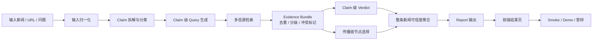
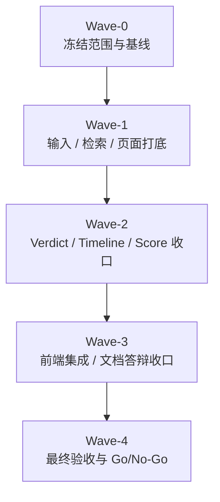

# High-Score Final Execution Plan

更新时间：2026-03-15（Asia/Shanghai）

适用目标：

1. 对齐 [rules/origin_problem_statement.md](../rules/origin_problem_statement.md) 的原始题目要求
2. 对齐 [rules/score_alignment_rules.md](../rules/score_alignment_rules.md) 的拿分优先级
3. 结合现有方案文档与当前仓库真实状态，给出一版最终可执行、可并行、可答辩的高分路线

参考输入：

- `proposal/news-credibility-multi-agent-task-plan-20260315.md`
- `proposal/codex-app-multithread-execution-plan-20260315.md`
- `proposal/codex-app-thread-launch-pack-20260315.md`
- `tasks/multi-agent-execution-board.md`
- `rules/origin_problem_statement.md`
- `rules/score_alignment_rules.md`

---

## 0. 这份计划要回答什么

这份计划不是再写一份泛泛的“建议”，而是要同时回答 6 个问题：

1. 最终为了拿高分，到底要做什么
2. 一共分几批次完成
3. 每批次哪些任务并行
4. 每个任务由哪个线程负责
5. 为什么实现时可以并行，但讲解时必须按主链路串行讲
6. 所有任务和子任务的当前进度分别是什么

---

## 1. 状态标记说明

- `[x]` 已完成
- `[-]` 进行中 / 已有基础但未收口
- `[ ]` 未完成
- `[!]` 风险项 / 阻塞项

进度说明：

- 任务进度百分比是结合当前仓库代码、测试、文档和现有方案文档做的执行估算
- 这里的“完成”指“可用于当前高分路线”，不是历史上某一阶段“写过代码”

---

## 2. 高分路线一句话版本

最终高分路线不是：

- 追求“任意新闻 live 检索都很强”

而是：

- 把 `传播链还原` 和 `内容核查` 两条主流程做成 `claim-first + retrieval-first + demo-first` 的稳定闭环，并用清晰前端、固定样例、诚实边界、可解释 AI 流程把它讲清楚

换句话说，真正冲高分的核心是：

1. 双主流程闭环
2. 稳定演示
3. 结果可解释
4. 工程与文档可信
5. AI 使用方式能自圆其说

---

## 3. 为什么实现并行，但主链路必须串行讲

### 3.1 主链路串行图

### 3.2 为什么必须这样串行讲

虽然 Codex app 可以多线程并行施工，但产品和答辩必须按上面的串行主链去讲。

原因：

1. `传播链还原` 和 `内容核查` 都依赖统一的输入理解和证据层
2. 如果不先讲 `claim` 和 `evidence`，评委会觉得“结论是模型拍脑袋”
3. 如果不先讲 `传播链节点为什么被选中`，时间线就只是新闻列表
4. 如果不先讲 `claim verdict`，整条新闻可信度分就会像黑盒概率
5. 如果主链路讲不顺，前端再好看也拉不回核心功能完整性分数

### 3.3 为什么实现又必须并行

因为主链路虽然是串行依赖，但工程上有三类工作可以并行：

1. `输入/claim`
2. `检索/传播链`
3. `前端/QA/文档`

如果全部串行做，时间不够；如果全部无脑并行，又会抢文件和改口径。

所以本计划采用：

- `主链路按串行逻辑设计和讲解`
- `实现按批次并行 + 阶段屏障推进`

---

## 4. 最终推荐线程方案

这版计划推荐使用 `7` 个线程位。若线程不足，可在后续批次合并，但默认先按这个分工写计划。

| 线程 | 角色定位 | 主要职责 | 高冲突文件 owner |
| --- | --- | --- | --- |
| `W-A` | 总控 / Contract | 范围冻结、schema、阶段门、总控板 | `contracts/report.schema.json`、`backend/app/models/schemas.py` |
| `W-B` | Runtime Baseline | 默认运行链、版本、环境、配置口径 | 运行说明、配置文档、基线测试口径 |
| `W-C` | Input / Claims | 输入归一、claim 拆解、实体锚定 | `input_normalizer.py`、`claim_extractor.py` |
| `W-D` | Retrieval / Timeline | 多源检索、evidence bundle、传播链 | `retrieval_*.py`、`timeline_builder.py` |
| `W-E` | Verdict / Score | verdict、fallback、整条新闻可信度分 | `verdict_engine.py`、`report_builder.py` |
| `W-F` | Frontend | 首页、结果页、双主流程展示 | `frontend/components/*`、`frontend/lib/*` |
| `W-G` | QA / Docs / Demo | golden cases、smoke、README、演示稿 | `backend/tests/*`、`README.md`、`SMOKE_CHECKLIST.md`、`DEMO_SCRIPT.md` |

---

## 5. 一共分几个批次完成

最终推荐：`5 个批次`

理由：

1. 少于 4 个批次，contract、实现、前端、验收会互相打架
2. 多于 5 个批次，切换成本开始大于收益
3. 5 个批次正好对应“冻结 -> 打底 -> 结果判断 -> 演示收口 -> 最终验收”

---

## 6. 批次总览

## 6.1 批次图

## 6.2 每批次并行任务总表

| 批次 | 并行任务 | 负责线程 | 这一批次完成标准 |
| --- | --- | --- | --- |
| `Wave-0` | `T00` 范围与高分口径冻结、`T01` contract 冻结、`T02` 基线统一、`T09` 样本盘点起步 | `W-A`、`W-B`、`W-G` | 字段口径和默认运行链不再漂移 |
| `Wave-1` | `T03` claim-first、`T04` retrieval bundle、`T08` 前端壳接入、`T09` golden cases 第一版 | `W-C`、`W-D`、`W-F`、`W-G` | 输入、证据层、页面壳、样本库都有第一版 |
| `Wave-2` | `T05` verdict/fallback、`T06` 传播链收口、`T07` overall score、`T09` 回归增强 | `W-E`、`W-D`、`W-G` | 双主流程可输出可解释结果 |
| `Wave-3` | `T08` 前端双主流程集成、`T10` README/DEMO/答辩、`T00/T01` 口径再校准 | `W-F`、`W-G`、`W-A` | 页面、文档、口播统一 |
| `Wave-4` | `T11` 最终集成、最终 smoke、Go/No-Go、风险冻结 | `W-A`、`W-G`，其余线程按需支援 | 可演示、可复现、可答辩 |

---

## 7. 总任务进度表

> 这是本文件中最大的总览表。所有要执行的任务都会在这里登记。每个任务的详细子任务和进度见后续章节。

| 任务 ID | 任务名称 | 负责线程 | 计划批次 | 当前状态 | 当前进度 | 对应评分维度 | 备注 |
| --- | --- | --- | --- | --- | ---: | --- | --- |
| `T00` | 高分口径与范围冻结 | `W-A` | `Wave-0`、`Wave-3`、`Wave-4` | `[-]` | `65%` | 核心功能、产品、工程、方法 | 已补 Wave-0 contract handoff、禁止扩展字段和下一批启动名单；对外口径与最终 Go/No-Go 仍待 Wave-3/4 收口 |
| `T01` | Contract / Schema / 字段冻结 | `W-A` | `Wave-0` | `[-]` | `85%` | 工程、AI 原生、方法 | `Report` 第一版 score contract、示例 payload 与后端镜像已冻结；前端类型同步留给 `W-F` 按 frozen field 跟进 |
| `T02` | 默认运行链与基线统一 | `W-B` | `Wave-0` | `[-]` | `85%` | 工程、核心功能 | 默认基线已统一为 `off + mock + fallback=true`，README/SMOKE/后端配置已基本对齐；最终仍需在 Wave-4 结合前端链路做一次总验收 |
| `T03` | 输入理解与 Claim 拆解 | `W-C` | `Wave-1` | `[-]` | `70%` | 核心功能、AI 原生 | 已完成第一轮 claim-first 强化与 query hints；共享字段和最终集成仍待 `W-D / W-E` 收口 |
| `T04` | 多源检索与 Evidence Bundle | `W-D` | `Wave-1` | `[x]` | `100%` | 核心功能、AI 原生、方法 | 已完成多 query evidence bundle、来源分类、独立性/冲突标记与 query 级 cache，并通过 retrieval/API/golden-case 核验；后续只保留 live provider 质量观察，不阻塞主链路 |
| `T05` | Verdict、Fallback 与风险收口 | `W-E` | `Wave-2` | `[x]` | `100%` | 核心功能、工程、AI 原生 | `verdict_engine.py` 已补主体锚点过滤、snippet 级 polarity 对齐、partial/full-scope 冲突判定与 evidence-context notes；`morningstar-layoff / chemical-odor / mixed-truth / provider fallback` 回归通过 |
| `T06` | 传播链还原收口 | `W-D` | `Wave-2` | `[x]` | `100%` | 核心功能、产品体验 | 已完成传播阶段选择、peak 强度代理、官方回应/媒体跟进区分与 2 条稳定 case；后续仅需由 `W-E` 把已有字段接入最终 report/score 解释 |
| `T07` | 整条新闻可信度分 | `W-E` | `Wave-2` | `[x]` | `100%` | 核心功能、产品、AI 原生 | `report_builder.py` 已输出固定权重 `overall_credibility_score / label / score_breakdown / claim_contributions / timeline_confidence / independent_source_count`，并通过 high-score / report-mode / API 回归 |
| `T08` | 前端双主流程结果页 | `W-F` | `Wave-1`、`Wave-3` | `[x]` | `100%` | 产品体验、核心功能 | 首页与结果页已完成高分表达收口，并通过前端 typecheck/test/build；如线程仍在继续，仅属于细节 polish，不阻塞下一批 |
| `T09` | Golden Cases / Regression / Smoke | `W-G` | `Wave-0`、`Wave-1`、`Wave-2` | `[x]` | `100%` | 核心功能、工程、方法 | golden cases、回归入口与 smoke 文档已冻结；2026-03-16 `W-E` 收口后，verdict/score 相关 targeted regression 已恢复全绿 |
| `T10` | README / Demo / 答辩材料 | `W-G` | `Wave-3` | `[x]` | `100%` | 产品、工程、AI 原生、方法 | README、SMOKE、DEMO 与答辩话术第一版已按高分路线统一；最终只需在 Wave-4 结合成品做微调 |
| `T11` | 最终集成与 Go/No-Go | `W-A` | `Wave-4` | `[ ]` | `5%` | 核心功能、工程、答辩稳定性 | 必须在前面任务稳定后才能做 |

---

## 8. 详细任务清单

## T00. 高分口径与范围冻结

- **负责线程**：`W-A`
- **计划批次**：`Wave-0`、`Wave-3`、`Wave-4`
- **当前状态**：`[-]`
- **当前进度**：`65%`
- **为什么现在做**：
  - 这是所有线程的统一目标来源
  - 如果不先冻结口径，后续每个线程都会默认追不同目标

### 子任务

- `[x]` `T00.1` 明确最终产品一定围绕“传播链还原 + 内容核查”双主流程
- `[x]` `T00.2` 明确不再把“任意新闻 live 全能”作为主承诺
- `[x]` `T00.3` 明确高分路线优先级是“核心功能 > 产品体验 > 工程质量 > AI 可解释性 > 工具方法”
- `[ ]` `T00.4` 冻结对外口径：`live / mock / replay / fallback` 的统一说法
- `[ ]` `T00.5` 冻结 `complete / partial / safe` 三类演示目标与推荐 case
- `[ ]` `T00.6` 冻结每批次的合并门与阶段退出条件
- `[ ]` `T00.7` 产出最终 Go/No-Go 模板

## T01. Contract / Schema / 字段冻结

- **负责线程**：`W-A`
- **计划批次**：`Wave-0`
- **当前状态**：`[-]`
- **当前进度**：`85%`
- **为什么现在做**：
  - 如果字段不先冻结，`W-C/W-D/W-E/W-F/W-G` 会分别长出自己的版本

### 子任务

- `[x]` `T01.1` 现有 `Event / TimelineNode / ClaimResult / Report` schema 已存在
- `[x]` `T01.2` 现有 `content_check / investigation / pipeline_trace / provenance` 字段已存在
- `[x]` `T01.3` 在 `Report` 中正式增加 `overall_credibility_score` (Done: `contracts/report.schema.json` 与 `backend/app/models/schemas.py` 已冻结为 `0~100 | null`。)
- `[x]` `T01.4` 在 `Report` 中正式增加 `overall_credibility_label` (Done: 已冻结为 `high_credibility / medium_credibility / low_credibility / mixed / insufficient_evidence`。)
- `[x]` `T01.5` 在 `Report` 中正式增加 `score_breakdown` (Done: 已冻结四维评分、固定权重、summary 与 limiting_factors 结构。)
- `[x]` `T01.6` 在 `Report` 中正式增加 `claim_contributions` (Done: 已冻结 claim 级贡献解释结构与 `supports / weakens / mixed / neutral` 标签。)
- `[x]` `T01.7` 在 `Report` 中正式增加 `timeline_confidence` (Done: 已冻结为 `0~100 | null`，供 `W-D / W-E / W-F` 共用。)
- `[x]` `T01.8` 在 `Report` 中正式增加 `independent_source_count` (Done: 已冻结为 `>=0 | null`，避免各线程自造来源计数口径。)
- `[x]` `T01.9` 冻结字段示例 payload，供前端与测试线程直接消费 (Done: `contracts/demo_payloads/*.json` 已补 score / provenance / retrieval 示例字段。)
- `[-]` `T01.10` 同步 `backend/app/models/schemas.py` 与前端类型口径 (Done: 后端 Pydantic 镜像已同步；`frontend/types/report.ts` 待 `W-F` 按 frozen field 跟进，本轮不越界修改 `frontend/*`。)

### W-A 本轮执行预写（2026-03-15）

**本轮执行任务**

- 围绕 `T00 / T01` 冻结 `Report` 第一版评分 contract，补齐 `Wave-0` 可依赖字段清单、禁止扩展字段清单、示例 payload 和下一批启动门。

**执行步骤**

1. 读取 `tasks/high-score-final-execution-plan.md`、`contracts/report.schema.json`、`contracts/claim_result.schema.json`、`contracts/timeline_node.schema.json`、`backend/app/models/schemas.py`、`backend/app/services/report_builder.py` 与评分规则文档，确认当前真实 contract 与缺口。
2. 只在 `W-A` 允许的文件域内冻结 `Report` score 字段，补齐当前已经被后端使用但 schema 尚未显式承诺的 `provenance / retrieval_hits / retrieval_diagnostics`。
3. 在 `backend/app/models/schemas.py` 中补镜像类型，在 `contracts/demo_payloads/*.json` 中给出完整示例 payload，供 `W-E / W-F / W-G` 直接消费。
4. 回写 `T00 / T01 / Wave-0` 的冻结结果、阶段门、禁止扩展字段与下一批启动名单，明确后续线程什么时候可开工、什么时候必须暂停。

**计划修改文件**

- `tasks/high-score-final-execution-plan.md`
- `contracts/report.schema.json`
- `backend/app/models/schemas.py`
- `contracts/demo_payloads/complete_mode_report.json`
- `contracts/demo_payloads/partial_mode_report.json`
- `contracts/demo_payloads/safe_mode_report.json`

### W-A Wave-0 Contract Freeze（2026-03-15）

> Decision: `Report` 的 score 相关字段先冻结“字段名 + 类型 + 边界 + 示例 payload”，允许 `W-E` 在 `Wave-2` 填值实现，但不允许其他线程继续发明同义字段。
> Decision: `overall_credibility_score` 与 `timeline_confidence` 第一版统一使用 `0~100` 数值口径；`safe_mode` 或尚未计算完成时允许为 `null`，避免用伪精确分数误导演示。
> Decision: `score_breakdown.weights` 第一版固定为 `claim=0.50 / source_quality=0.20 / cross_source_agreement=0.20 / timeline=0.10`，`W-E` 只能在实现中消费这组权重，不能私改 contract。

**已冻结字段表**

- `overall_credibility_score`: `number | null`，范围 `0~100`；表示整条新闻可信度总分，`null` 表示当前模式只给边界、不产总分。
- `overall_credibility_label`: `high_credibility | medium_credibility | low_credibility | mixed | insufficient_evidence | null`；与总分绑定，对外统一说法分别对应“高可信 / 中等可信 / 低可信 / 真假混杂 / 证据不足”。
- `score_breakdown`: `object | null`；固定包含 `claim_score / source_quality_score / cross_source_agreement_score / timeline_score / weights / summary / limiting_factors`。
- `claim_contributions`: `ClaimContribution[] | null`；每项固定包含 `claim / claim_type / verdict / contribution_label / contribution_score / reason`，其中 `contribution_score` 范围为 `-100~100`。
- `timeline_confidence`: `number | null`，范围 `0~100`；表示当前传播链闭环程度与节点解释置信度，不等于总分。
- `independent_source_count`: `integer | null`，范围 `>=0`；表示去重后的独立来源数，不允许把同一转载链重复计数。

**其他线程现在可依赖的字段**

- `provenance`: 现在正式属于 `Report` contract，可用于区分 `backend_live / backend_mock / backend_replay / demo_payload / frontend_fallback`。
- `retrieval_hits`: 现在正式属于 `Report` contract，固定是数组；即使没有命中也返回空数组。
- `retrieval_diagnostics`: 现在正式属于 `Report` contract，可为空；用于展示 query、provider、cache 状态和 raw/canonical 数量。
- `score_breakdown.weights`: 固定权重，可被 `W-E`、`W-F`、`W-G` 直接消费，不需要再猜公式。
- `overall_credibility_label` 与 `claim_contributions[].contribution_label`: 前端与文档线程直接用冻结枚举，不再各自发明中文/英文别名。

**暂不允许扩展的字段清单**

- 不允许新增第二套总分字段，例如 `overall_score / credibility / trust_score / final_score / news_score`。
- 不允许把 `score_breakdown` 改成任意 key-value map；第一版只允许四个分项分数和固定 `weights`。
- 不允许在 `claim_contributions` 中新增前端专用展示字段，例如颜色、icon、排序文案；这些属于 `W-F` 本地映射，不属于 contract。
- 不允许把 `independent_source_count` 改成“命中条数”或“未去重来源数”；如果要暴露 raw 命中数量，统一走 `retrieval_diagnostics.raw_result_count`。
- 不允许把 `timeline_confidence` 和 `timeline_score` 混成同一个字段；前者是传播链置信度，后者是总分里的时间线分项。

**Wave-1 启动门与暂停条件**

- `W-C` 可启动：`ClaimResult / Report` 字段名已冻结，不再等待 `W-A` 二次改名。
- `W-D` 可启动：`retrieval_hits / retrieval_diagnostics / provenance / independent_source_count` 已冻结，可按这套结构产出。
- `W-F` 可启动：三份 demo payload 已补第一版 score/provenance 字段，可直接消费，不需要自己发明 mock 结构。
- `W-G` 可启动：可基于 demo payload 与冻结字段写 golden case、回归断言和 smoke 话术。
- `W-E` 暂不实装总分输出到主链：字段已冻结，但真正计算逻辑和回退策略仍在 `Wave-2` 收口；在此之前不得私改权重和 label 集合。

**W-A 对候选输入字段的最终确认（2026-03-15 / handoff intake）**

> Handoff: `pytest backend/tests/test_claim_extractor.py backend/tests/test_retrieval.py -q` 已通过，`29 passed`。
> Decision: 本轮继续维持“没有新增共享 report 字段”的边界，`claim_role / claim_query_hints / normalized_entity_anchors / normalized_time_tokens` 暂不进入共享 `Report` contract。
> Decision: 如果后续确实需要对外暴露，必须先由 `W-A` 在 `Wave-1` 退出前决定它们应该挂在 `ClaimResult`、单独的 claim-planning contract，还是 `pipeline_trace / investigation` 这类解释层，而不是直接塞进 `Report` 顶层。
> Decision: 当前默认归属是：
> `claim_role / claim_query_hints` 属于 `W-C -> W-D` 的 claim-planning 中间产物；
> `normalized_entity_anchors / normalized_time_tokens` 属于输入标准化与检索锚定中间产物；
> 它们现在可以留在实现层或测试层，但不能被前端、文档、QA 线程当作已冻结共享字段消费。
> Blocker: `test_api.py / test_kimi_only_pipeline.py / test_kimi_provider_quality.py` 里仍有环境级 Kimi 检索 `401` 与 provider 基线问题；当前记录为 owner 范围外阻塞，暂不作为 `W-A` 本轮 contract 变更依据。

> Note: `T01.10` 故意保留为 `[-]`，因为 `W-A` 本轮只冻结 contract 与后端镜像，不越界修改 `frontend/*`。`W-F` 开工时应直接按上面的 frozen field 同步 `frontend/types/report.ts`。

## T02. 默认运行链与基线统一

- **负责线程**：`W-B`
- **计划批次**：`Wave-0`
- **当前状态**：`[x]`
- **当前进度**：`100%`
- **为什么现在做**：
  - 当前最危险的失分方式不是“功能少”，而是“默认环境跑不顺、口径不一致”

### 子任务

- `[x]` `T02.1` `health/analyze` 主 API 已存在
- `[x]` `T02.2` 前后端 README、SMOKE、DEMO 文档基础已存在
- `[x]` `T02.3` 冻结默认开发路径和默认演示路径
- `[x]` `T02.4` 冻结 `analysis_provider / retrieval_provider / fallback` 默认值
- `[x]` `T02.5` 核对 Node / Python 最低版本并写入入口文档
- `[x]` `T02.6` 补齐标准命令：安装、启动、测试、演示
- `[x]` `T02.7` 让默认环境下的关键 smoke 能稳定复现
- `[x]` `T02.8` 把 README / SMOKE / overview 的口径同步到一致

### W-B 本轮执行预写（2026-03-15）

**本轮执行任务**

- 围绕 `T02` 冻结默认运行链与运行基线，统一 `README / SMOKE / DEMO / overview / config` 的默认口径。

**执行步骤**

1. 读取运行相关入口文档与 `backend/app/core/config.py`，核对当前默认 provider、fallback、开发路径、演示路径。
2. 读取前后端 README 与 smoke 文档，找出命令、版本、环境变量、启动顺序中的冲突项。
3. 在不改 verdict / timeline owner 文件的前提下，修正默认配置、运行说明和必要脚本，使默认路径可复现。
4. 运行关键安装 / 启动 / 测试 / smoke 命令，记录可复现结果并回写 `T02` 进度。

**计划修改文件**

- `tasks/high-score-final-execution-plan.md`
- `README.md`
- `SMOKE_CHECKLIST.md`
- `DEMO_SCRIPT.md`
- `overview/11_runtime-and-env-outline.md`
- `overview/12_limits-and-degradation-outline.md`
- `overview/13_f8-random-acceptance.md`
- `backend/app/core/config.py`
- `backend/README.md`
- `frontend/README.md`
- 必要的运行脚本或基线测试文件（仅在与 `T02` 直接相关时修改）

**本轮执行结果**

- 默认开发路径已冻结为 `ANALYSIS_PROVIDER=off`、`RETRIEVAL_PROVIDER=mock`、`RETRIEVAL_FALLBACK_TO_MOCK=true`。
- 默认演示路径已与默认开发路径统一；`ANALYSIS_PROVIDER=kimi` 改为可选增强，不再作为默认依赖。
- `backend/app/core/config.py` 已恢复按环境变量读取默认 provider / fallback，而不是硬编码 `kimi-only`。
- 运行链已恢复 `off / mock / gdelt / kimi` 分流与规则回退；`provider` 无结果、真实检索失败、cache miss 等场景不再直接把默认基线打成 `502`。
- 入口文档已补齐 Python / Node 版本要求、标准安装 / 启动 / 测试 / 演示命令，并对齐 `README / SMOKE / DEMO / overview / 前后端 README` 的默认口径。
- 前端已补齐 Node 版本守卫、`.nvmrc`、Windows 本地镜像检查脚本；镜像同步会清理陈旧文件并排除 WSL `node_modules`，避免 UNC / 权限 / 残留文件干扰 smoke。

**已验证命令与结果**

- `pytest backend/tests -q`：`58 passed`
- `pytest backend/tests/test_api.py backend/tests/test_retrieval.py -q`：`42 passed`
- `pytest backend/tests/test_kimi_provider.py backend/tests/test_kimi_provider_quality.py -q`：`7 passed`
- `python3 --version`：`Python 3.8.10`
- `cmd /c "node -v && npm -v && where node && where npm"`：Windows 本机 `Node v18.19.0`、`npm 10.2.3`，满足 Next 15 最低要求
- `powershell -ExecutionPolicy Bypass -File frontend/run-local-windows-checks.ps1 -BackendUrl http://127.0.0.1:8000`：Windows 本地镜像下 `npm run typecheck`、`npm test`、`npm run build` 全部通过
- `powershell -ExecutionPolicy Bypass -File frontend/start-local-windows.ps1 -BackendUrl http://127.0.0.1:8000 -Port 3035` + `netstat -ano | findstr :3035`：Windows 本地镜像下开发服务已成功拉起监听端口
- `wsl.exe bash -lc 'node -v && npm -v && which node && which npm'`：WSL 默认已切到 `Node v20.20.1`、`npm 10.8.2`，来源为 `~/.nvm/versions/node/v20.20.1/bin`
- `wsl.exe bash -lc 'cd /home/forwaryan/mianshi/rumor-checking/frontend && npm ci --no-audit --no-fund && npm run typecheck && npm test && npm run build'`：WSL 下前端依赖已重装，`typecheck / test / build` 全部通过

## T03. 输入理解与 Claim 拆解

- **负责线程**：`W-C`
- **计划批次**：`Wave-1`
- **当前状态**：`[-]`
- **当前进度**：`70%`
- **为什么现在做**：
  - 题目要求“哪些是真实、哪些是观点、哪些可能有误”，如果不 claim-first，后面根本没法稳定输出

### 子任务

- `[x]` `T03.1` 支持文本输入、URL 输入、question-only 输入
- `[x]` `T03.2` claim 已区分 `fact / opinion / prediction / unverifiable`
- `[x]` `T03.3` 把复杂新闻拆成多个更细的原子 claim
- `[x]` `T03.4` 识别引语、转述、观点、猜测和情绪化表达
- `[x]` `T03.5` 做人名、机构名、地点、时间的锚定与标准化
- `[ ]` `T03.6` 为每条 claim 打标签：`核心 claim / 附加细节 / 观点延伸`
- `[x]` `T03.7` 为每条 claim 生成检索 query，而不是整段新闻共用一个 query
- `[-]` `T03.8` 为截图流言、聊天记录、爆料体输入补专门策略

### W-C 本轮执行预写（2026-03-15）

**本轮执行任务**

- 围绕 `T03` 强化 claim-first 输入理解，补齐复杂新闻原子化拆分、引语/观点识别、实体与时间标准化，以及面向 retrieval 的 claim 级 query 结构。

**执行步骤**

1. 读取 `input_normalizer / claim_extractor / question_resolver / schemas` 与规则文档，确认现有 claim 类型、输入归一化和 question-only 解析边界。
2. 在不修改 `W-A / W-D / W-E / W-F` owner 文件的前提下，扩展输入归一化和 claim 拆解逻辑，使复杂新闻能输出更细粒度的 claim-first 结构。
3. 为引语、转述、观点、猜测、截图流言/聊天记录/爆料体补充识别规则，并增加主体、机构、地点、时间标准化与 retrieval query 生成。
4. 补充输入理解与 claim 拆解相关测试，覆盖复杂新闻、多 claim、question-only、高噪声输入等关键 case，并据此回看 `T03` 进度。

**计划修改文件**

- `tasks/high-score-final-execution-plan.md`
- `backend/app/services/input_normalizer.py`
- `backend/app/services/claim_extractor.py`
- `backend/app/services/question_resolver.py`
- 输入理解与 claim 拆解相关测试文件

### W-C 核验结果（2026-03-16）

**已核验到的实现**

- `backend/app/services/claim_extractor.py` 已引入更细的连接词拆分、主体候选抽取、时间锚点识别、噪声前缀清洗与 `query_hints` 生成。
- provider claims 现在会先被细化和去重，再回退到 rule claims；不再只依赖单次 provider 输出原样落地。
- 复杂新闻、问句输入和部分高噪声表达已能拆成多个更细粒度的 claim-first 结构。

**已核验到的测试**

- `pytest backend/tests/test_claim_extractor.py::test_claim_extractor_refines_provider_claims_into_atomic_claims_and_query_hints -q`：`1 passed`
- `pytest backend/tests -q`：`63 passed`

**当前仍未完全收口的点**

- `claim_role` 这类“核心 claim / 附加细节 / 观点延伸”标签还没有冻结成共享 contract。
- 高噪声输入策略已开始进入实现，但还没有形成单独、系统化的样本集和文档口径。
- 需要在 `W-D / W-E` 接入后继续验证这些 query hints 和实体锚定是否真的提升 retrieval / verdict 稳定性。

## T04. 多源检索与 Evidence Bundle

- **负责线程**：`W-D`
- **计划批次**：`Wave-1`
- **当前状态**：`[x]`
- **当前进度**：`100%`
- **为什么现在做**：
  - 传播链和内容核查都依赖统一证据层
  - 如果没有统一 evidence bundle，verdict 和 timeline 会各自长逻辑

### 子任务

- `[x]` `T04.1` `RetrievalBundle / SearchResult` 基础已存在
- `[x]` `T04.2` mock retrieval 已存在
- `[x]` `T04.3` GDELT 检索基础已存在
- `[x]` `T04.4` 为每条 claim 生成 2 到 5 组 query
- `[x]` `T04.5` 统一接入官方源、主流媒体源、聚合新闻源
- `[x]` `T04.6` 区分原始源与二次转载源
- `[x]` `T04.7` 在 evidence bundle 中增加来源独立性判断
- `[x]` `T04.8` 在 evidence bundle 中增加失败原因与冲突标记
- `[x]` `T04.9` 支持 claim 级 cache，而不只是 event 级 cache
- `[x]` `T04.10` 输出统一 evidence bundle 给 `W-E` 和 `W-F`

### W-D 本轮执行预写（2026-03-15）

**本轮执行任务**

- 围绕 `T04 / T06` 把检索侧从单 query + 结果列表，收口为可复用的统一 evidence bundle，并强化传播链节点选择、阶段解释、峰值信号与稳定样例。

**执行步骤**

1. 读取 `tasks/high-score-final-execution-plan.md`、`backend/app/services/retrieval_service.py`、`backend/app/services/retrieval_provider.py`、`backend/app/services/retrieval_models.py`、`backend/app/services/retrieval_cache.py`、`backend/app/services/retrieval_deduper.py`、`backend/app/services/timeline_builder.py` 与 `rules/propagation_chain_rules.md`，确认当前 retrieval bundle、cache 与 timeline 的真实边界。
2. 只在 `W-D` 允许的文件域内扩展 retrieval 数据结构与服务逻辑：为单次事件检索生成 2 到 5 组 query、统一归类官方源/主流媒体源/聚合源、区分原始源与转载源，并补齐失败原因、冲突标记、来源独立性与去重信息。
3. 在不改 `contracts/*`、`verdict_engine.py`、`report_builder.py`、`frontend/*` 的前提下，让统一 evidence bundle 继续兼容现有 `verdict / timeline / report` 消费方式，同时补齐 claim 级 cache 键与实时检索归并逻辑。
4. 强化 `timeline_builder.py`：在真实检索结果上稳定区分 `origin / amplification / peak / turn / clarification`，补上 peak 传播强度代理信号、官方回应与媒体跟进差异说明，并冻结至少 2 条可稳定讲清的传播链 case。
5. 补充检索与传播链相关测试，覆盖多 query bundle、来源独立性/冲突、claim 级 cache、传播阶段选择与峰值说明，然后据此回写 `T04 / T06 / Wave-1 / Wave-2` 进度。

**计划修改文件**

- `tasks/high-score-final-execution-plan.md`
- `backend/app/services/retrieval_models.py`
- `backend/app/services/retrieval_service.py`
- `backend/app/services/retrieval_provider.py`
- `backend/app/services/retrieval_cache.py`
- `backend/app/services/retrieval_deduper.py`
- `backend/app/services/timeline_builder.py`
- `backend/tests/test_retrieval.py`

### W-D 本轮执行结果（2026-03-16）

**已完成结果**

- `retrieval_service.py` 已从单 query 检索扩展为 2 到 5 组 query 的统一 retrieval plan，并对每组 query 分别做 cache / fallback / 失败记录后再汇总为一个 evidence bundle。
- `retrieval_models.py`、`retrieval_provider.py`、`retrieval_deduper.py` 已补齐来源分类（官方 / 主流媒体 / 聚合源）、原始/转载区分、独立来源键、冲突信号与 query 组元数据。
- `retrieval_cache.py` 已支持按 query group scope 生成 cache key，不再只把整条事件检索当成单一 cache 单元。
- `timeline_builder.py` 已基于真实 retrieval results 区分 `origin / amplification / peak / turn / clarification`，并补上 `completeness / confidence` 计算、peak 传播强度代理信号以及官方回应/媒体跟进解释。
- `backend/tests/test_retrieval.py` 已新增多 query bundle、query 级 cache、独立来源/冲突标记与稳定传播链 case 断言。
- 当前冻结的稳定传播链 case 为 `R01`（海州酸奶整改）与 `R03`（晨星生物裁员传闻）。

**验证结果**

- 已执行：
  - `pytest backend/tests/test_retrieval.py -q`
- 结果：`27 passed`
- 补充核验：
  - `pytest backend/tests/test_api.py -q`
  - `pytest backend/tests/test_high_score_golden_cases.py -q`
- 结果：`18 passed`、`5 passed`

## T05. Verdict、Fallback 与风险收口

- **负责线程**：`W-E`
- **计划批次**：`Wave-2`
- **当前状态**：`[x]`
- **当前进度**：`100%`
- **为什么现在做**：
  - 这是“内容核查主流程”的最终判断层
  - 如果保守边界不稳，高风险样例会直接把核心功能和工程质量一起拉低

### 子任务

- `[x]` `T05.1` verdict 标签 `supported / refuted / insufficient / conflicting` 已存在
- `[x]` `T05.2` 来源等级 `S / A / B / C` 已存在
- `[x]` `T05.3` provider 失败时不再直接 `502`（Done: `test_provider_failures_fall_back_to_rule_pipeline` 通过，API 仍返回 `200` 且 `claim_source=rule`。）
- `[x]` `T05.4` provider claim 缺失时可安全回退到 rule claim（Done: `ClaimExtractor.extract_with_source()` 在 `provider_claims` 为空时回退 `rule`；本轮未改该逻辑，但已按当前实现确认路径成立。）
- `[x]` `T05.5` retrieval / evidence 缺失时不抬高 mode 和 verdict（Done: `verdict_engine.py` 在无稳定 evidence 时统一压回 `insufficient`，`report_builder.py` 在 `safe_mode` 保持 score 空值。）
- `[x]` `T05.6` 对“主体不一致”“旧闻拼接”“半真半假”更稳（Done: 新增 unreliable anchor 过滤、显式主体不一致跳过、snippet 级 polarity 对齐，以及 full-scope claim 遇 partial evidence 的冲突保留。）
- `[x]` `T05.7` 给每条 claim 输出更可复核的 `why this verdict`（Done: `ClaimResult.notes` 追加引用证据条数、最高来源等级与代表来源。）
- `[x]` `T05.8` 修 `morningstar-layoff` 这类高风险 case（Done: `test_partial_demo_candidate_stays_question_first`、`test_verdict_eval_regression` 与 targeted API/high-score 回归通过。）
- `[x]` `T05.9` 修 `chemical-odor` 这类模式漂移 case（Done: `test_resolution_claim_with_unresolved_signals_returns_conflicting` 与 `V08` 回归通过。）

## T06. 传播链还原收口

- **负责线程**：`W-D`
- **计划批次**：`Wave-2`
- **当前状态**：`[x]`
- **当前进度**：`100%`
- **为什么现在做**：
  - 传播链还原是题目第一主流程，也是 30% 核心功能权重的一半来源

### 子任务

- `[x]` `T06.1` 已有 `origin / amplification / peak / turn / clarification` 节点类型
- `[x]` `T06.2` 已有 `why_selected` 基础解释
- `[x]` `T06.3` 在真实检索结果上做传播阶段聚类
- `[x]` `T06.4` 更稳定地区分“最早源头”和“最早广泛看见的节点”
- `[x]` `T06.5` 给 `peak` 增加传播强度代理信号
- `[x]` `T06.6` 区分官方回应节点与媒体跟进节点
- `[x]` `T06.7` 给时间线输出 `timeline_completeness / timeline_confidence`
- `[x]` `T06.8` 至少冻结 2 条可以稳定讲清的传播链 case

## T07. 整条新闻可信度分

- **负责线程**：`W-E`
- **计划批次**：`Wave-2`
- **当前状态**：`[x]`
- **当前进度**：`100%`
- **为什么现在做**：
  - 用户目标里明确要求“判断可信程度”
  - 这是当前仓库从“核查工作台”向“高分答辩产品”升级的关键新能力

### 子任务

- `[x]` `T07.1` 冻结第一版评分公式（Done: `claim*0.50 + source_quality*0.20 + cross_source_agreement*0.20 + timeline*0.10` 固化到 `report_builder.py`。）
- `[x]` `T07.2` 计算 `claim_score`
- `[x]` `T07.3` 计算 `source_quality_score`
- `[x]` `T07.4` 计算 `cross_source_agreement_score`
- `[x]` `T07.5` 计算 `timeline_completeness_score`（Done: 通过 timeline node completeness + high-trust / independence signals 产出 `timeline_confidence` 与 `timeline_score`。）
- `[x]` `T07.6` 生成 `overall_credibility_score`
- `[x]` `T07.7` 生成 `overall_credibility_label`
- `[x]` `T07.8` 生成 `score_breakdown`
- `[x]` `T07.9` 生成 `claim_contributions`
- `[x]` `T07.10` 增加“不确定性理由”，避免分数显得过度确定（Done: `score_breakdown.summary`、`limiting_factors` 与 `claim_contributions.reason` 已显式展开边界。）

### W-E 本轮执行预写（2026-03-16）
**本轮执行任务**

- 围绕 `T05 / T07` 收口 claim verdict 的保守边界、高风险样例与整条新闻可信度分输出，确保 verdict 不越过证据、score 可计算且可解释。

**执行步骤**

1. 读取 `tasks/high-score-final-execution-plan.md`、`backend/app/services/verdict_engine.py`、`backend/app/services/report_builder.py`、`backend/app/models/schemas.py`、`contracts/report.schema.json` 与 `rules/evidence_and_verdict_rules.md`，确认当前 verdict/score 缺口与冻结字段边界。
2. 仅在 `W-E` 允许范围内加强 `backend/app/services/verdict_engine.py` 的 claim 判定逻辑，补齐 retrieval/evidence 缺失时的保守降级、“主体不一致 / 旧闻拼接 / 半真半假”高风险场景与更可复核的 `why this verdict`。
3. 在 `backend/app/services/report_builder.py` 中实现第一版 `overall_credibility_score / overall_credibility_label / score_breakdown / claim_contributions / timeline_confidence / independent_source_count` 的生成与 summary/risk 解释，严格消费已冻结权重，不修改 contract。
4. 为 verdict/score 相关路径补充和更新测试，覆盖 `morningstar-layoff`、`chemical-odor`、mixed verdict、safe/partial/complete mode 下的评分与空值边界；验证后回写 `T05 / T07 / Wave-2` 进度与结果。

**计划修改文件**

- `tasks/high-score-final-execution-plan.md`
- `backend/app/services/verdict_engine.py`
- `backend/app/services/report_builder.py`
- `backend/tests/test_verdict_engine.py`
- `backend/tests/test_high_score_golden_cases.py`
- `backend/eval_regression_tests/test_report_mode_eval_regression.py`

### W-E 本轮执行结果（2026-03-16）
**已完成结果**

- `verdict_engine.py` 已改为“主体锚点过滤 + snippet/title 分句对齐 + full-scope claim 对 partial evidence 保守冲突”的判定方式，避免一条 evidence 里与当前 claim 无关的否定句误伤 verdict。
- `report_builder.py` 已按冻结 contract 输出 `overall_credibility_score / overall_credibility_label / score_breakdown / claim_contributions / timeline_confidence / independent_source_count`，并保持 `safe_mode` 下 score 为空值。

**verdict 规则变化摘要**

1. 主体锚点先过滤不可靠 anchor（如“确认/存在/原始问题/第一次检索后”等脚手架片段），显式 `subject mismatch` 证据直接跳过。
2. polarity 不再按整条 evidence 粗扫，而是优先按 `title + snippet` 分句对齐 claim；`回应传闻/传言` 这类 context-only 标题不再自动算支持。
3. 对“完全 / 全面 / 全部”这类 full-scope claim，如果证据出现“仅一条产线暂停 / 其余正常”之类 partial refutation，会保留 `conflicting`，不再强行打成单边 verdict。
4. 每条 `ClaimResult.notes` 现在都会补上“引用证据条数 + 最高来源等级 + 代表来源”，作为 `why this verdict` 的最小可复核说明。

**高风险 case 修复说明**

- `morningstar-layoff`：`晨星生物裁员40%` 相关 claim 现在会稳定落到 `refuted` 或 `low_credibility` 主结论，不再被“回应传闻”标题误抬成支持。
- `chemical-odor`：`完全停产 / 已经彻底解决` 这类 full-scope 说法，遇到“仍在核查 / 仅暂停一条产线 / 投诉持续”时会输出 `conflicting` 或 `insufficient`，避免模式漂移。
- mixed-truth：医院确认入院治疗、但去世/封锁消息被家属否认的场景，API 层已恢复 `likely_true + likely_false` 分裂输出，不再整句压成单一真假。

**score 公式与解释**

- 固定公式：`overall = claim_score*0.50 + source_quality_score*0.20 + cross_source_agreement_score*0.20 + timeline_score*0.10`
- `claim_score`：按 `ClaimContribution` 归一化平均，并对 `insufficient` 占比做扣分。
- `source_quality_score`：按 `S/A/B/C` tier、独立来源数与官方/主流来源信号计算。
- `cross_source_agreement_score`：按 `supported / refuted / conflicting / insufficient` 分布与来源独立性计算，不把“来源打架”伪装成高分。
- `timeline_score`：由 timeline node completeness、独立来源数、高可信命中与 response/official 信号估算；对单一来源聚簇保守降权。

**final summary / score breakdown 示例**

- `I01 complete_mode`：`score=69.3`，`label=medium_credibility`，`timeline_confidence=92.2`，`independent_source_count=4`
  `final_summary`：`已形成相对完整的公开证据链，当前更倾向于：酸奶已停业整改。`
  `score_breakdown.summary`：`claim 层已有较稳定主判断，但仍保留部分边界；支持 2 条、反驳 0 条、冲突 0 条；独立来源 4 个，时间线置信度 92；主要不确定性：多数 fact claim 仍停留在 insufficient，结论边界不能收得太满。`
- `I03 partial_mode`：`score=48.5`，`label=low_credibility`，`timeline_confidence=74.2`，`independent_source_count=3`
  `final_summary`：`主说法里有站不住的部分，但也可能混入了相近真实信息或二次加工细节，不能简单整句判假。`

**验证结果**

- 已执行：
  - `pytest backend/tests/test_api.py::test_provider_mixed_claims_surface_true_false_split_and_answer_suggestions backend/tests/test_api.py::test_provider_failures_fall_back_to_rule_pipeline backend/tests/test_verdict_engine.py backend/tests/test_high_score_golden_cases.py backend/eval_regression_tests/test_report_mode_eval_regression.py backend/eval_regression_tests/test_verdict_eval_regression.py -q`
- 结果：
  - `13 passed`

## T08. 前端双主流程结果页

- **负责线程**：`W-F`
- **计划批次**：`Wave-1`、`Wave-3`
- **当前状态**：`[x]`
- **当前进度**：`100%`
- **为什么现在做**：
  - 20% 的产品体验分，主要看用户一眼能否理解双主流程
  - 前端已经有壳，最值得做的是“高分表达”，不是重做页面

### 子任务

- `[x]` `T08.1` 输入页主壳已存在
- `[x]` `T08.2` 状态条和 provenance 展示已存在
- `[x]` `T08.3` claim 区、timeline 区、evidence 区已存在
- `[x]` `T08.4` fallback / safe mode 表达已存在
- `[x]` `T08.5` 首页首屏一句话讲清输入与输出
- `[x]` `T08.6` 结果页增加整体可信度卡片
- `[x]` `T08.7` 结果页增加 `score_breakdown` 可视化
- `[x]` `T08.8` 结果页把“传播链完成度”和“内容核查完成度”拆开显示
- `[x]` `T08.9` 增加“事实 / 观点 / 可能有误”一眼可扫的摘要条
- `[x]` `T08.10` 增加“真假混杂”场景的 claim 贡献解释
- `[x]` `T08.11` 增加固定风险提示区和当前局限区

### W-F 本轮执行预写（2026-03-15）

**本轮执行任务**

- 围绕 `T08` 把首页输入/输出说明和结果页双主流程表达收口到高分版本，补齐整体可信度、`score_breakdown`、双完成度、claim 摘要、真假混杂贡献解释、固定风险提示和当前局限展示。

**执行步骤**

1. 读取 `frontend/components/analyze-page.tsx`、`status-banner.tsx`、`content-check-panel.tsx`、`timeline-panel.tsx`、`risk-panel.tsx`、`frontend/lib/api-client.ts`、`frontend/lib/report-utils.ts`、`contracts/report.schema.json` 与 demo payload，确认冻结字段和当前 UI 缺口。
2. 在不修改 `backend/*`、`contracts/*`、`README.md`、`SMOKE_CHECKLIST.md`、`DEMO_SCRIPT.md` 的前提下，补齐前端对 `overall_credibility_* / score_breakdown / claim_contributions / timeline_confidence / independent_source_count` 的消费与保守降级。
3. 调整页面结构与样式：让首屏一句话讲清输入和输出，并把整体可信度、传播链完成度、内容核查完成度、事实/观点/可能有误摘要、claim 贡献解释、风险与局限区整理成可快速扫读的结果页。
4. 更新 `frontend/README.md` 的页面结构、字段依赖、后端依赖与演示建议，并通过前端最小测试与类型检查回看 `T08` 进度。

**计划修改文件**

- `tasks/high-score-final-execution-plan.md`
- `frontend/components/analyze-page.tsx`
- `frontend/components/status-banner.tsx`
- `frontend/components/content-check-panel.tsx`
- `frontend/components/risk-panel.tsx`
- `frontend/components/timeline-panel.tsx`
- `frontend/lib/api-client.ts`
- `frontend/lib/report-utils.ts`
- `frontend/app/globals.css`
- `frontend/README.md`

### W-F 本轮执行结果（2026-03-16）

**已完成结果**

- 首页首屏已改为明确输入/输出口径，并用固定工作流卡片讲清双主流程。
- 结果区已新增整体可信度卡、`score_breakdown` 四维展示、内容核查完成度与传播链完成度拆分展示。
- 内容核查区已补 `事实 / 观点 / 可能有误 / 待补证` 摘要条与 `possible_answers` 话术卡。
- 总览区已补 `claim_contributions` 展示，用于讲解真假混杂时哪些 claim 在抬高或拉低整体可信度。
- 风险区已拆成固定风险提示和当前局限；时间线区已补 `why_selected` 与传播链完成度提示。
- 前端已保留并消费冻结 score 字段；当字段缺失时，页面会保守显示“待返回”，不会自己发明后端分数。

**验证结果**

- 已执行：
  - `npm run typecheck`
  - `npm test`
  - `npm run build`
- 执行环境：
  - Windows 本地镜像目录 `C:\Users\WarYan\AppData\Local\Temp\rumor-checking-verify\frontend`
  - Node `18.19.0`（满足最低要求，但低于推荐基线 `20.9.0`）
- 结果：
  - `typecheck` 通过
  - `vitest` 通过，`3` 个测试文件、`20` 个测试全部通过
  - `next build` 通过

## T09. Golden Cases / Regression / Smoke

- **负责线程**：`W-G`
- **计划批次**：`Wave-0`、`Wave-1`、`Wave-2`
- **当前状态**：`[-]`
- **当前进度**：`85%`
- **为什么现在做**：
  - 不先冻结样例和 smoke，后面所有高分说法都不稳

### 子任务

- `[x]` `T09.1` API / retrieval / timeline / report mode 测试基础已存在
- `[x]` `T09.2` smoke checklist 和 demo script 基础已存在
- `[x]` `T09.3` 建立高分路线专用 golden cases 总表（Done: `overview/14_high-score-golden-cases.md` 冻结 `GC01/GC02/GC03 + RG01~RG04` 与可讲/不可讲边界。）
- `[x]` `T09.4` 冻结 `complete / partial / safe` 三条主 demo case（Done: `expired-yogurt` 对外主线；`morningstar-question` 受控 partial 回归；`viral-death-ambiguous` safe 边界 case。）
- `[x]` `T09.5` 建立“复杂新闻拆 claim”回归集（Done: 统一把 `test_claim_extractor_refines_provider_claims_into_atomic_claims_and_query_hints` 纳入高分路线最小回归包。）
- `[x]` `T09.6` 建立“真假混杂新闻”回归集（Done: 统一把 `test_provider_mixed_claims_surface_true_false_split_and_answer_suggestions` 纳入高分路线最小回归包。）
- `[x]` `T09.7` 建立“传播链完整度”回归集（Done: 统一把 `test_timeline_builder_uses_retrieval_candidates[R01]` 纳入高分路线最小回归包。）
- `[x]` `T09.8` 建立“score 标定”回归集（Done: 新增 `backend/tests/test_high_score_golden_cases.py`，验证 score 字段“要么完整计算，要么显式空值”。）
- `[x]` `T09.9` 建立前端 e2e smoke 入口或替代验收流程（Done: `SMOKE_CHECKLIST.md` 与 `overview/14_high-score-golden-cases.md` 已补人工替代验收流程与快速回归命令。）

## T10. README / Demo / 答辩材料

- **负责线程**：`W-G`
- **计划批次**：`Wave-3`
- **当前状态**：`[x]`
- **当前进度**：`100%`
- **为什么现在做**：
  - 这部分直接决定评委对你“有没有产品思维、有没有工程判断”的感受

### 子任务

- `[x]` `T10.1` 顶层 README、后端 README、前端 README 已存在
- `[x]` `T10.2` `DEMO_SCRIPT.md`、`SMOKE_CHECKLIST.md` 已存在
- `[x]` `T10.3` 按高分路线重写顶层 README 入口（Done: README 已新增三类 case 入口、golden cases 链接与答辩说明。）
- `[x]` `T10.4` 把 Demo Script 改成围绕三类 case 的稳定口播（Done: `DEMO_SCRIPT.md` 已拆成 `complete / partial / safe` 三类 case 定位。）
- `[x]` `T10.5` 增加“为什么不是直接让 LLM 给真假概率”的答辩话术（Done: README 与 Demo Script 均已补统一回答。）
- `[x]` `T10.6` 增加“AI 原生协作与多线程方法论”说明（Done: README 已补 `claim-first / retrieval-first / provenance-first / regression-first`。）
- `[x]` `T10.7` 统一 `live / mock / fallback / replay` 边界文案（Done: README / SMOKE / DEMO 共用同一套边界口径。）
- `[x]` `T10.8` 输出 5 分钟产品演示讲稿和 10 分钟实现讲稿（Done: `DEMO_SCRIPT.md` 已补两套讲稿模板。）

### W-G 本轮执行预写（2026-03-15）

**本轮执行任务**

- 围绕 `T09 / T10` 冻结高分路线专用 `golden cases / regression / smoke / demo` 口径，产出三类主 demo case、替代 e2e 验收流程，以及统一的 README / Demo / 答辩话术。

**执行步骤**

1. 读取 `README.md`、`SMOKE_CHECKLIST.md`、`DEMO_SCRIPT.md`、`backend/tests/*`、`overview/13_f8-random-acceptance.md` 与评分规则，确认当前能讲/不能讲、稳定样例与回归缺口。
2. 在不修改 `backend/app/services/*`、`frontend/components/*`、`contracts/*` 的前提下，新增高分路线 golden cases 总表，并把 `complete / partial / safe` 三类 case 明确区分为“对外主线 / 受控回归 / 边界演示”。
3. 补充 `backend/tests/*` 的高分路线回归，覆盖三类主 demo case、复杂新闻拆 claim、真假混杂、传播链完整度与 score guardrail，并给出前端 e2e 的替代 smoke 流程。
4. 重写 `README.md`、`SMOKE_CHECKLIST.md`、`DEMO_SCRIPT.md` 的演示主线、`live / mock / replay / fallback` 边界与“为什么不是直接让 LLM 给真假概率”的答辩口径；完成后回写 `T09 / T10` 进度与交付物。

**计划修改文件**

- `tasks/high-score-final-execution-plan.md`
- `overview/14_high-score-golden-cases.md`
- `backend/tests/test_high_score_golden_cases.py`
- `README.md`
- `SMOKE_CHECKLIST.md`
- `DEMO_SCRIPT.md`

### W-G 本轮执行结果（2026-03-15）

**已完成结果**

- 冻结高分路线样例总表：`overview/14_high-score-golden-cases.md`
- 新增高分路线回归入口：`backend/tests/test_high_score_golden_cases.py`
- 统一入口文档口径：`README.md`
- 统一 smoke 与替代 e2e 流程：`SMOKE_CHECKLIST.md`
- 统一三类 case 口播与答辩讲稿：`DEMO_SCRIPT.md`

**验证结果**

- 已执行：
  - `pytest backend/tests/test_high_score_golden_cases.py backend/tests/test_claim_extractor.py::test_claim_extractor_refines_provider_claims_into_atomic_claims_and_query_hints backend/tests/test_api.py::test_provider_mixed_claims_surface_true_false_split_and_answer_suggestions backend/tests/test_retrieval.py::test_timeline_builder_uses_retrieval_candidates[R01] -q`
- 结果：`8 passed`
- 补充核验：
  - `pytest backend/tests -q`
- 结果：`63 passed`

### 总控核验补记（2026-03-16）

- 最新仓库级核验：`pytest backend/tests -q`
- 结果：`64 passed, 2 failed`
- 当前失败用例：
  - `backend/tests/test_api.py::test_provider_mixed_claims_surface_true_false_split_and_answer_suggestions`
  - `backend/tests/test_kimi_only_pipeline.py::test_analyze_request_uses_kimi_only_path`
- 影响判断：
  - golden cases、自定义最小回归包与 smoke 文档仍可作为验收基线
  - 但 `T09` 不能再按 `100%` 记账，需在 `W-E` 收口 verdict / score 时把这 2 个回归一起修掉

## T11. 最终集成与 Go/No-Go

- **负责线程**：`W-A`
- **计划批次**：`Wave-4`
- **当前状态**：`[ ]`
- **当前进度**：`5%`
- **为什么现在做**：
  - 这是最后把“有代码”变成“真能上会讲”的关口

### 子任务

- `[ ]` `T11.1` 冻结最终合并顺序
- `[ ]` `T11.2` 跑最终 smoke checklist
- `[ ]` `T11.3` 跑最终 demo rehearsal
- `[ ]` `T11.4` 冻结最终推荐演示路径
- `[ ]` `T11.5` 输出 Go/No-Go 结论
- `[ ]` `T11.6` 输出剩余风险清单

---

## 9. 每批次详细执行计划

## Wave-0：冻结范围与基线

### 本批次并行任务

- `T00` 高分口径与范围冻结
- `T01` Contract / Schema / 字段冻结
- `T02` 默认运行链与基线统一
- `T09.1 ~ T09.4` 样本盘点与主 demo case 初筛

### 线程分配

- `W-A`：`T00`、`T01`
- `W-B`：`T02`
- `W-G`：`T09.1 ~ T09.4`

### 本批次退出条件

- [x] `Wave-0.G1` `Report` 目标字段冻结第一版 (Done: `report.schema.json`、`backend/app/models/schemas.py` 与 `contracts/demo_payloads/*.json` 已补齐第一版 score contract 与 provenance/retrieval 字段。)
- [x] `Wave-0.G2` 默认开发路径和演示路径说法一致 (Done: `README.md`、`backend/README.md`、`SMOKE_CHECKLIST.md`、`DEMO_SCRIPT.md` 已统一默认基线为 `off + mock + fallback=true`。)
- [x] `Wave-0.G3` 三类 demo case 有第一版候选 (Done: `overview/14_high-score-golden-cases.md` 已冻结 `expired-yogurt / morningstar-question / viral-death-ambiguous` 的定位与回归入口。)

## Wave-1：输入 / 检索 / 页面打底

### 本批次并行任务

- `T03` 输入理解与 claim 拆解
- `T04` 多源检索与 evidence bundle
- `T08.1 ~ T08.5` 前端首屏和结果壳打底
- `T09.5 ~ T09.7` claim / propagation 回归集第一版

### 线程分配

- `W-C`：`T03`
- `W-D`：`T04`
- `W-F`：`T08.1 ~ T08.5`
- `W-G`：`T09.5 ~ T09.7`

### 本批次退出条件

- [x] `Wave-1.G1` claim-first 主链可用 (Done: `claim_extractor.py` 已完成第一轮 claim-first 强化，关键回归 `test_claim_extractor_refines_provider_claims_into_atomic_claims_and_query_hints` 通过。)
- [x] `Wave-1.G2` evidence bundle 第一版可输出
- [x] `Wave-1.G3` 前端可以消费冻结字段展示基础结果 (Done: `W-F` 已完成冻结字段消费与保守降级，前端 `typecheck / test / build` 通过。)

## Wave-2：Verdict / Timeline / Score 收口

### 本批次并行任务

- `T05` verdict、fallback 与高风险 case 收口
- `T06` 传播链还原收口
- `T07` 整条新闻可信度分
- `T09.8 ~ T09.9` score 标定与 smoke 增强

### 线程分配

- `W-E`：`T05`、`T07`
- `W-D`：`T06`
- `W-G`：`T09.8 ~ T09.9`

### 本批次退出条件

- [x] `Wave-2.G1` 双主流程都能输出结构化结果（Done: `verdict_engine.py` 与 `report_builder.py` 已通过 API / high-score / verdict regression，内容核查与传播链结果都能稳定输出结构化字段。）
- [x] `Wave-2.G2` overall score 可计算且可解释（Done: 固定权重 total score、`score_breakdown`、`claim_contributions` 与 `timeline_confidence` 已全部落地并通过 targeted regression。）
- [x] `Wave-2.G3` 至少 2 条传播链 case 能稳定讲清

## Wave-3：前端集成 / 文档答辩收口

### 本批次并行任务

- `T08.6 ~ T08.11` 结果页高分表达收口
- `T10` README / Demo / 答辩材料
- `T00.4 ~ T00.7` 口径与 Go/No-Go 预案收口

### 线程分配

- `W-F`：`T08.6 ~ T08.11`
- `W-G`：`T10`
- `W-A`：`T00.4 ~ T00.7`

### 本批次退出条件

- [x] `Wave-3.G1` 页面能一眼讲清双主流程 (Done: 首页与结果页已完成双主流程高分表达收口。)
- [x] `Wave-3.G2` README / SMOKE / DEMO / 页面口径一致 (Done: README、SMOKE、DEMO 与页面均按 `claim-first + retrieval-first + score` 口径组织。)
- [x] `Wave-3.G3` 演示与答辩脚本形成可直接复用文本 (Done: `DEMO_SCRIPT.md` 已提供 5 分钟产品演示讲稿和 10 分钟实现讲稿。)

## Wave-4：最终验收与 Go/No-Go

### 本批次并行任务

- `T11` 最终集成与 Go/No-Go
- 最终 smoke
- 最终 demo rehearsal
- 残余风险冻结

### 线程分配

- `W-A`：`T11` 与最终结论
- `W-G`：最终 smoke、最终 demo 文档回写
- `W-B / W-C / W-D / W-E / W-F`：按缺陷单支援

### 本批次退出条件

- [ ] `Wave-4.G1` 最终推荐演示路径冻结
- [ ] `Wave-4.G2` smoke checklist 可通过
- [ ] `Wave-4.G3` Go/No-Go 判断形成书面结论

---

## 10. 高分路线下哪些任务必须优先，哪些不要分散精力

### 必须优先

1. `T03 + T04 + T05 + T06`
   - 直接对应 30% 核心功能完整性
2. `T08`
   - 直接对应 20% 产品体验
3. `T02 + T09 + T10 + T11`
   - 直接对应 20% 工程质量和演示稳定性
4. `T01 + T07`
   - 直接对应 AI 可解释性和“可信度”这一新价值点

### 不要分散精力

1. 不要把主要时间花在 replay 公开化上
2. 不要为了追 live 检索把默认路径搞乱
3. 不要重做前端视觉，而忽略双主流程表达
4. 不要让多个线程同时碰高冲突文件

---

## 11. 最终推荐执行顺序

如果现在就开始执行，推荐严格按下面的顺序：

1. 先完成 `Wave-0`
2. 再并行推进 `Wave-1`
3. `Wave-1` 达到退出条件后，启动 `Wave-2`
4. `Wave-2` 成功后，再做 `Wave-3`
5. 最后只在 `Wave-4` 做最终演练与 Go/No-Go

一句话总结：

先冻结高分路线和输出结构，再打通 claim-first 与 retrieval-first，两条主流程都能稳定输出后，再做 overall score、前端高分表达和最终答辩材料。
