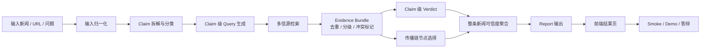
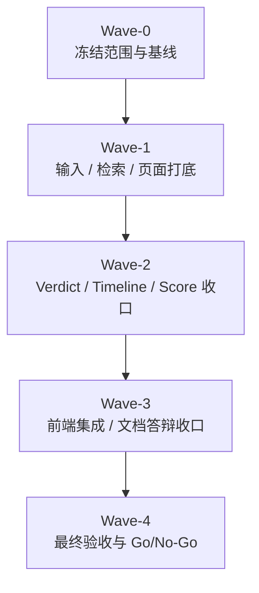

# High-Score Final Execution Plan

更新时间：2026-03-15（Asia/Shanghai）

适用目标：

1. 对齐 [rules/origin_problem_statement.md](../rules/origin_problem_statement.md) 的原始题目要求
2. 对齐 [rules/score_alignment_rules.md](../rules/score_alignment_rules.md) 的拿分优先级
3. 结合现有方案文档与当前仓库真实状态，给出一版最终可执行、可并行、可答辩的高分路线

参考输入：

- `proposal/news-credibility-multi-agent-task-plan-20260315.md`
- `proposal/codex-app-multithread-execution-plan-20260315.md`
- `proposal/codex-app-thread-launch-pack-20260315.md`
- `tasks/multi-agent-execution-board.md`
- `rules/origin_problem_statement.md`
- `rules/score_alignment_rules.md`

---

## 0. 这份计划要回答什么

这份计划不是再写一份泛泛的“建议”，而是要同时回答 6 个问题：

1. 最终为了拿高分，到底要做什么
2. 一共分几批次完成
3. 每批次哪些任务并行
4. 每个任务由哪个线程负责
5. 为什么实现时可以并行，但讲解时必须按主链路串行讲
6. 所有任务和子任务的当前进度分别是什么

---

## 1. 状态标记说明

- `[x]` 已完成
- `[-]` 进行中 / 已有基础但未收口
- `[ ]` 未完成
- `[!]` 风险项 / 阻塞项

进度说明：

- 任务进度百分比是结合当前仓库代码、测试、文档和现有方案文档做的执行估算
- 这里的“完成”指“可用于当前高分路线”，不是历史上某一阶段“写过代码”

---

## 2. 高分路线一句话版本

最终高分路线不是：

- 追求“任意新闻 live 检索都很强”

而是：

- 把 `传播链还原` 和 `内容核查` 两条主流程做成 `claim-first + retrieval-first + demo-first` 的稳定闭环，并用清晰前端、固定样例、诚实边界、可解释 AI 流程把它讲清楚

换句话说，真正冲高分的核心是：

1. 双主流程闭环
2. 稳定演示
3. 结果可解释
4. 工程与文档可信
5. AI 使用方式能自圆其说

---

## 3. 为什么实现并行，但主链路必须串行讲

### 3.1 主链路串行图

### 3.2 为什么必须这样串行讲

虽然 Codex app 可以多线程并行施工，但产品和答辩必须按上面的串行主链去讲。

原因：

1. `传播链还原` 和 `内容核查` 都依赖统一的输入理解和证据层
2. 如果不先讲 `claim` 和 `evidence`，评委会觉得“结论是模型拍脑袋”
3. 如果不先讲 `传播链节点为什么被选中`，时间线就只是新闻列表
4. 如果不先讲 `claim verdict`，整条新闻可信度分就会像黑盒概率
5. 如果主链路讲不顺，前端再好看也拉不回核心功能完整性分数

### 3.3 为什么实现又必须并行

因为主链路虽然是串行依赖，但工程上有三类工作可以并行：

1. `输入/claim`
2. `检索/传播链`
3. `前端/QA/文档`

如果全部串行做，时间不够；如果全部无脑并行，又会抢文件和改口径。

所以本计划采用：

- `主链路按串行逻辑设计和讲解`
- `实现按批次并行 + 阶段屏障推进`

---

## 4. 最终推荐线程方案

这版计划推荐使用 `7` 个线程位。若线程不足，可在后续批次合并，但默认先按这个分工写计划。

| 线程 | 角色定位 | 主要职责 | 高冲突文件 owner |
| --- | --- | --- | --- |
| `W-A` | 总控 / Contract | 范围冻结、schema、阶段门、总控板 | `contracts/report.schema.json`、`backend/app/models/schemas.py` |
| `W-B` | Runtime Baseline | 默认运行链、版本、环境、配置口径 | 运行说明、配置文档、基线测试口径 |
| `W-C` | Input / Claims | 输入归一、claim 拆解、实体锚定 | `input_normalizer.py`、`claim_extractor.py` |
| `W-D` | Retrieval / Timeline | 多源检索、evidence bundle、传播链 | `retrieval_*.py`、`timeline_builder.py` |
| `W-E` | Verdict / Score | verdict、fallback、整条新闻可信度分 | `verdict_engine.py`、`report_builder.py` |
| `W-F` | Frontend | 首页、结果页、双主流程展示 | `frontend/components/*`、`frontend/lib/*` |
| `W-G` | QA / Docs / Demo | golden cases、smoke、README、演示稿 | `backend/tests/*`、`README.md`、`SMOKE_CHECKLIST.md`、`DEMO_SCRIPT.md` |

---

## 5. 一共分几个批次完成

最终推荐：`5 个批次`

理由：

1. 少于 4 个批次，contract、实现、前端、验收会互相打架
2. 多于 5 个批次，切换成本开始大于收益
3. 5 个批次正好对应“冻结 -> 打底 -> 结果判断 -> 演示收口 -> 最终验收”

---

## 6. 批次总览

## 6.1 批次图

## 6.2 每批次并行任务总表

| 批次 | 并行任务 | 负责线程 | 这一批次完成标准 |
| --- | --- | --- | --- |
| `Wave-0` | `T00` 范围与高分口径冻结、`T01` contract 冻结、`T02` 基线统一、`T09` 样本盘点起步 | `W-A`、`W-B`、`W-G` | 字段口径和默认运行链不再漂移 |
| `Wave-1` | `T03` claim-first、`T04` retrieval bundle、`T08` 前端壳接入、`T09` golden cases 第一版 | `W-C`、`W-D`、`W-F`、`W-G` | 输入、证据层、页面壳、样本库都有第一版 |
| `Wave-2` | `T05` verdict/fallback、`T06` 传播链收口、`T07` overall score、`T09` 回归增强 | `W-E`、`W-D`、`W-G` | 双主流程可输出可解释结果 |
| `Wave-3` | `T08` 前端双主流程集成、`T10` README/DEMO/答辩、`T00/T01` 口径再校准 | `W-F`、`W-G`、`W-A` | 页面、文档、口播统一 |
| `Wave-4` | `T11` 最终集成、最终 smoke、Go/No-Go、风险冻结 | `W-A`、`W-G`，其余线程按需支援 | 可演示、可复现、可答辩 |

---

## 7. 总任务进度表

> 这是本文件中最大的总览表。所有要执行的任务都会在这里登记。每个任务的详细子任务和进度见后续章节。

| 任务 ID | 任务名称 | 负责线程 | 计划批次 | 当前状态 | 当前进度 | 对应评分维度 | 备注 |
| --- | --- | --- | --- | --- | ---: | --- | --- |
| `T00` | 高分口径与范围冻结 | `W-A` | `Wave-0`、`Wave-3`、`Wave-4` | `[-]` | `55%` | 核心功能、产品、工程、方法 | 双主流程和大方向已明确，但最终冻结口径未完成 |
| `T01` | Contract / Schema / 字段冻结 | `W-A` | `Wave-0` | `[-]` | `45%` | 工程、AI 原生、方法 | 现有 schema 在，但高分路线需要的 score 字段未冻结 |
| `T02` | 默认运行链与基线统一 | `W-B` | `Wave-0` | `[-]` | `40%` | 工程、核心功能 | 基础存在，但默认路径和文档口径仍有漂移 |
| `T03` | 输入理解与 Claim 拆解 | `W-C` | `Wave-1` | `[-]` | `50%` | 核心功能、AI 原生 | 已有基础，但 claim-first 仍不够深 |
| `T04` | 多源检索与 Evidence Bundle | `W-D` | `Wave-1` | `[-]` | `45%` | 核心功能、AI 原生、方法 | retrieval 基础在，但统一证据层未完成 |
| `T05` | Verdict、Fallback 与风险收口 | `W-E` | `Wave-2` | `[-]` | `50%` | 核心功能、工程、AI 原生 | verdict 基础在，但保守边界和高风险 case 不稳 |
| `T06` | 传播链还原收口 | `W-D` | `Wave-2` | `[-]` | `45%` | 核心功能、产品体验 | 时间线框架有，但传播链解释力不足 |
| `T07` | 整条新闻可信度分 | `W-E` | `Wave-2` | `[ ]` | `10%` | 核心功能、产品、AI 原生 | 这是当前高分路线新增重点 |
| `T08` | 前端双主流程结果页 | `W-F` | `Wave-1`、`Wave-3` | `[-]` | `65%` | 产品体验、核心功能 | 页面壳已有，但高分表达未收口 |
| `T09` | Golden Cases / Regression / Smoke | `W-G` | `Wave-0`、`Wave-1`、`Wave-2` | `[-]` | `50%` | 核心功能、工程、方法 | 测试基础有，但高分路线专用样本库未冻结 |
| `T10` | README / Demo / 答辩材料 | `W-G` | `Wave-3` | `[-]` | `60%` | 产品、工程、AI 原生、方法 | 文档基础有，但未完全按高分路线统一 |
| `T11` | 最终集成与 Go/No-Go | `W-A` | `Wave-4` | `[ ]` | `5%` | 核心功能、工程、答辩稳定性 | 必须在前面任务稳定后才能做 |

---

## 8. 详细任务清单

## T00. 高分口径与范围冻结

- **负责线程**：`W-A`
- **计划批次**：`Wave-0`、`Wave-3`、`Wave-4`
- **当前状态**：`[-]`
- **当前进度**：`55%`
- **为什么现在做**：
  - 这是所有线程的统一目标来源
  - 如果不先冻结口径，后续每个线程都会默认追不同目标

### 子任务

- `[x]` `T00.1` 明确最终产品一定围绕“传播链还原 + 内容核查”双主流程
- `[x]` `T00.2` 明确不再把“任意新闻 live 全能”作为主承诺
- `[x]` `T00.3` 明确高分路线优先级是“核心功能 > 产品体验 > 工程质量 > AI 可解释性 > 工具方法”
- `[ ]` `T00.4` 冻结对外口径：`live / mock / replay / fallback` 的统一说法
- `[ ]` `T00.5` 冻结 `complete / partial / safe` 三类演示目标与推荐 case
- `[ ]` `T00.6` 冻结每批次的合并门与阶段退出条件
- `[ ]` `T00.7` 产出最终 Go/No-Go 模板

## T01. Contract / Schema / 字段冻结

- **负责线程**：`W-A`
- **计划批次**：`Wave-0`
- **当前状态**：`[-]`
- **当前进度**：`45%`
- **为什么现在做**：
  - 如果字段不先冻结，`W-C/W-D/W-E/W-F/W-G` 会分别长出自己的版本

### 子任务

- `[x]` `T01.1` 现有 `Event / TimelineNode / ClaimResult / Report` schema 已存在
- `[x]` `T01.2` 现有 `content_check / investigation / pipeline_trace / provenance` 字段已存在
- `[ ]` `T01.3` 在 `Report` 中正式增加 `overall_credibility_score`
- `[ ]` `T01.4` 在 `Report` 中正式增加 `overall_credibility_label`
- `[ ]` `T01.5` 在 `Report` 中正式增加 `score_breakdown`
- `[ ]` `T01.6` 在 `Report` 中正式增加 `claim_contributions`
- `[ ]` `T01.7` 在 `Report` 中正式增加 `timeline_confidence`
- `[ ]` `T01.8` 在 `Report` 中正式增加 `independent_source_count`
- `[ ]` `T01.9` 冻结字段示例 payload，供前端与测试线程直接消费
- `[ ]` `T01.10` 同步 `backend/app/models/schemas.py` 与前端类型口径

## T02. 默认运行链与基线统一

- **负责线程**：`W-B`
- **计划批次**：`Wave-0`
- **当前状态**：`[-]`
- **当前进度**：`40%`
- **为什么现在做**：
  - 当前最危险的失分方式不是“功能少”，而是“默认环境跑不顺、口径不一致”

### 子任务

- `[x]` `T02.1` `health/analyze` 主 API 已存在
- `[x]` `T02.2` 前后端 README、SMOKE、DEMO 文档基础已存在
- `[ ]` `T02.3` 冻结默认开发路径和默认演示路径
- `[ ]` `T02.4` 冻结 `analysis_provider / retrieval_provider / fallback` 默认值
- `[ ]` `T02.5` 核对 Node / Python 最低版本并写入入口文档
- `[ ]` `T02.6` 补齐标准命令：安装、启动、测试、演示
- `[ ]` `T02.7` 让默认环境下的关键 smoke 能稳定复现
- `[ ]` `T02.8` 把 README / SMOKE / overview 的口径同步到一致

## T03. 输入理解与 Claim 拆解

- **负责线程**：`W-C`
- **计划批次**：`Wave-1`
- **当前状态**：`[-]`
- **当前进度**：`50%`
- **为什么现在做**：
  - 题目要求“哪些是真实、哪些是观点、哪些可能有误”，如果不 claim-first，后面根本没法稳定输出

### 子任务

- `[x]` `T03.1` 支持文本输入、URL 输入、question-only 输入
- `[x]` `T03.2` claim 已区分 `fact / opinion / prediction / unverifiable`
- `[ ]` `T03.3` 把复杂新闻拆成多个更细的原子 claim
- `[ ]` `T03.4` 识别引语、转述、观点、猜测和情绪化表达
- `[ ]` `T03.5` 做人名、机构名、地点、时间的锚定与标准化
- `[ ]` `T03.6` 为每条 claim 打标签：`核心 claim / 附加细节 / 观点延伸`
- `[ ]` `T03.7` 为每条 claim 生成检索 query，而不是整段新闻共用一个 query
- `[ ]` `T03.8` 为截图流言、聊天记录、爆料体输入补专门策略

## T04. 多源检索与 Evidence Bundle

- **负责线程**：`W-D`
- **计划批次**：`Wave-1`
- **当前状态**：`[-]`
- **当前进度**：`45%`
- **为什么现在做**：
  - 传播链和内容核查都依赖统一证据层
  - 如果没有统一 evidence bundle，verdict 和 timeline 会各自长逻辑

### 子任务

- `[x]` `T04.1` `RetrievalBundle / SearchResult` 基础已存在
- `[x]` `T04.2` mock retrieval 已存在
- `[x]` `T04.3` GDELT 检索基础已存在
- `[ ]` `T04.4` 为每条 claim 生成 2 到 5 组 query
- `[ ]` `T04.5` 统一接入官方源、主流媒体源、聚合新闻源
- `[ ]` `T04.6` 区分原始源与二次转载源
- `[ ]` `T04.7` 在 evidence bundle 中增加来源独立性判断
- `[ ]` `T04.8` 在 evidence bundle 中增加失败原因与冲突标记
- `[ ]` `T04.9` 支持 claim 级 cache，而不只是 event 级 cache
- `[ ]` `T04.10` 输出统一 evidence bundle 给 `W-E` 和 `W-F`

## T05. Verdict、Fallback 与风险收口

- **负责线程**：`W-E`
- **计划批次**：`Wave-2`
- **当前状态**：`[-]`
- **当前进度**：`50%`
- **为什么现在做**：
  - 这是“内容核查主流程”的最终判断层
  - 如果保守边界不稳，高风险样例会直接把核心功能和工程质量一起拉低

### 子任务

- `[x]` `T05.1` verdict 标签 `supported / refuted / insufficient / conflicting` 已存在
- `[x]` `T05.2` 来源等级 `S / A / B / C` 已存在
- `[ ]` `T05.3` provider 失败时不再直接 `502`
- `[ ]` `T05.4` provider claim 缺失时可安全回退到 rule claim
- `[ ]` `T05.5` retrieval / evidence 缺失时不抬高 mode 和 verdict
- `[ ]` `T05.6` 对“主体不一致”“旧闻拼接”“半真半假”更稳
- `[ ]` `T05.7` 给每条 claim 输出更可复核的 `why this verdict`
- `[ ]` `T05.8` 修 `morningstar-layoff` 这类高风险 case
- `[ ]` `T05.9` 修 `chemical-odor` 这类模式漂移 case

## T06. 传播链还原收口

- **负责线程**：`W-D`
- **计划批次**：`Wave-2`
- **当前状态**：`[-]`
- **当前进度**：`45%`
- **为什么现在做**：
  - 传播链还原是题目第一主流程，也是 30% 核心功能权重的一半来源

### 子任务

- `[x]` `T06.1` 已有 `origin / amplification / peak / turn / clarification` 节点类型
- `[x]` `T06.2` 已有 `why_selected` 基础解释
- `[ ]` `T06.3` 在真实检索结果上做传播阶段聚类
- `[ ]` `T06.4` 更稳定地区分“最早源头”和“最早广泛看见的节点”
- `[ ]` `T06.5` 给 `peak` 增加传播强度代理信号
- `[ ]` `T06.6` 区分官方回应节点与媒体跟进节点
- `[ ]` `T06.7` 给时间线输出 `timeline_completeness / timeline_confidence`
- `[ ]` `T06.8` 至少冻结 2 条可以稳定讲清的传播链 case

## T07. 整条新闻可信度分

- **负责线程**：`W-E`
- **计划批次**：`Wave-2`
- **当前状态**：`[ ]`
- **当前进度**：`10%`
- **为什么现在做**：
  - 用户目标里明确要求“判断可信程度”
  - 这是当前仓库从“核查工作台”向“高分答辩产品”升级的关键新能力

### 子任务

- `[ ]` `T07.1` 冻结第一版评分公式
- `[ ]` `T07.2` 计算 `claim_score`
- `[ ]` `T07.3` 计算 `source_quality_score`
- `[ ]` `T07.4` 计算 `cross_source_agreement_score`
- `[ ]` `T07.5` 计算 `timeline_completeness_score`
- `[ ]` `T07.6` 生成 `overall_credibility_score`
- `[ ]` `T07.7` 生成 `overall_credibility_label`
- `[ ]` `T07.8` 生成 `score_breakdown`
- `[ ]` `T07.9` 生成 `claim_contributions`
- `[ ]` `T07.10` 增加“不确定性理由”，避免分数显得过度确定

## T08. 前端双主流程结果页

- **负责线程**：`W-F`
- **计划批次**：`Wave-1`、`Wave-3`
- **当前状态**：`[-]`
- **当前进度**：`65%`
- **为什么现在做**：
  - 20% 的产品体验分，主要看用户一眼能否理解双主流程
  - 前端已经有壳，最值得做的是“高分表达”，不是重做页面

### 子任务

- `[x]` `T08.1` 输入页主壳已存在
- `[x]` `T08.2` 状态条和 provenance 展示已存在
- `[x]` `T08.3` claim 区、timeline 区、evidence 区已存在
- `[x]` `T08.4` fallback / safe mode 表达已存在
- `[ ]` `T08.5` 首页首屏一句话讲清输入与输出
- `[ ]` `T08.6` 结果页增加整体可信度卡片
- `[ ]` `T08.7` 结果页增加 `score_breakdown` 可视化
- `[ ]` `T08.8` 结果页把“传播链完成度”和“内容核查完成度”拆开显示
- `[ ]` `T08.9` 增加“事实 / 观点 / 可能有误”一眼可扫的摘要条
- `[ ]` `T08.10` 增加“真假混杂”场景的 claim 贡献解释
- `[ ]` `T08.11` 增加固定风险提示区和当前局限区

## T09. Golden Cases / Regression / Smoke

- **负责线程**：`W-G`
- **计划批次**：`Wave-0`、`Wave-1`、`Wave-2`
- **当前状态**：`[-]`
- **当前进度**：`50%`
- **为什么现在做**：
  - 不先冻结样例和 smoke，后面所有高分说法都不稳

### 子任务

- `[x]` `T09.1` API / retrieval / timeline / report mode 测试基础已存在
- `[x]` `T09.2` smoke checklist 和 demo script 基础已存在
- `[ ]` `T09.3` 建立高分路线专用 golden cases 总表
- `[ ]` `T09.4` 冻结 `complete / partial / safe` 三条主 demo case
- `[ ]` `T09.5` 建立“复杂新闻拆 claim”回归集
- `[ ]` `T09.6` 建立“真假混杂新闻”回归集
- `[ ]` `T09.7` 建立“传播链完整度”回归集
- `[ ]` `T09.8` 建立“score 标定”回归集
- `[ ]` `T09.9` 建立前端 e2e smoke 入口或替代验收流程

## T10. README / Demo / 答辩材料

- **负责线程**：`W-G`
- **计划批次**：`Wave-3`
- **当前状态**：`[-]`
- **当前进度**：`60%`
- **为什么现在做**：
  - 这部分直接决定评委对你“有没有产品思维、有没有工程判断”的感受

### 子任务

- `[x]` `T10.1` 顶层 README、后端 README、前端 README 已存在
- `[x]` `T10.2` `DEMO_SCRIPT.md`、`SMOKE_CHECKLIST.md` 已存在
- `[ ]` `T10.3` 按高分路线重写顶层 README 入口
- `[ ]` `T10.4` 把 Demo Script 改成围绕三类 case 的稳定口播
- `[ ]` `T10.5` 增加“为什么不是直接让 LLM 给真假概率”的答辩话术
- `[ ]` `T10.6` 增加“AI 原生协作与多线程方法论”说明
- `[ ]` `T10.7` 统一 `live / mock / fallback / replay` 边界文案
- `[ ]` `T10.8` 输出 5 分钟产品演示讲稿和 10 分钟实现讲稿

## T11. 最终集成与 Go/No-Go

- **负责线程**：`W-A`
- **计划批次**：`Wave-4`
- **当前状态**：`[ ]`
- **当前进度**：`5%`
- **为什么现在做**：
  - 这是最后把“有代码”变成“真能上会讲”的关口

### 子任务

- `[ ]` `T11.1` 冻结最终合并顺序
- `[ ]` `T11.2` 跑最终 smoke checklist
- `[ ]` `T11.3` 跑最终 demo rehearsal
- `[ ]` `T11.4` 冻结最终推荐演示路径
- `[ ]` `T11.5` 输出 Go/No-Go 结论
- `[ ]` `T11.6` 输出剩余风险清单

---

## 9. 每批次详细执行计划

## Wave-0：冻结范围与基线

### 本批次并行任务

- `T00` 高分口径与范围冻结
- `T01` Contract / Schema / 字段冻结
- `T02` 默认运行链与基线统一
- `T09.1 ~ T09.4` 样本盘点与主 demo case 初筛

### 线程分配

- `W-A`：`T00`、`T01`
- `W-B`：`T02`
- `W-G`：`T09.1 ~ T09.4`

### 本批次退出条件

- [ ] `Wave-0.G1` `Report` 目标字段冻结第一版
- [ ] `Wave-0.G2` 默认开发路径和演示路径说法一致
- [ ] `Wave-0.G3` 三类 demo case 有第一版候选

## Wave-1：输入 / 检索 / 页面打底

### 本批次并行任务

- `T03` 输入理解与 claim 拆解
- `T04` 多源检索与 evidence bundle
- `T08.1 ~ T08.5` 前端首屏和结果壳打底
- `T09.5 ~ T09.7` claim / propagation 回归集第一版

### 线程分配

- `W-C`：`T03`
- `W-D`：`T04`
- `W-F`：`T08.1 ~ T08.5`
- `W-G`：`T09.5 ~ T09.7`

### 本批次退出条件

- [ ] `Wave-1.G1` claim-first 主链可用
- [ ] `Wave-1.G2` evidence bundle 第一版可输出
- [ ] `Wave-1.G3` 前端可以消费冻结字段展示基础结果

## Wave-2：Verdict / Timeline / Score 收口

### 本批次并行任务

- `T05` verdict、fallback 与高风险 case 收口
- `T06` 传播链还原收口
- `T07` 整条新闻可信度分
- `T09.8 ~ T09.9` score 标定与 smoke 增强

### 线程分配

- `W-E`：`T05`、`T07`
- `W-D`：`T06`
- `W-G`：`T09.8 ~ T09.9`

### 本批次退出条件

- [ ] `Wave-2.G1` 双主流程都能输出结构化结果
- [ ] `Wave-2.G2` overall score 可计算且可解释
- [ ] `Wave-2.G3` 至少 2 条传播链 case 能稳定讲清

## Wave-3：前端集成 / 文档答辩收口

### 本批次并行任务

- `T08.6 ~ T08.11` 结果页高分表达收口
- `T10` README / Demo / 答辩材料
- `T00.4 ~ T00.7` 口径与 Go/No-Go 预案收口

### 线程分配

- `W-F`：`T08.6 ~ T08.11`
- `W-G`：`T10`
- `W-A`：`T00.4 ~ T00.7`

### 本批次退出条件

- [ ] `Wave-3.G1` 页面能一眼讲清双主流程
- [ ] `Wave-3.G2` README / SMOKE / DEMO / 页面口径一致
- [ ] `Wave-3.G3` 演示与答辩脚本形成可直接复用文本

## Wave-4：最终验收与 Go/No-Go

### 本批次并行任务

- `T11` 最终集成与 Go/No-Go
- 最终 smoke
- 最终 demo rehearsal
- 残余风险冻结

### 线程分配

- `W-A`：`T11` 与最终结论
- `W-G`：最终 smoke、最终 demo 文档回写
- `W-B / W-C / W-D / W-E / W-F`：按缺陷单支援

### 本批次退出条件

- [ ] `Wave-4.G1` 最终推荐演示路径冻结
- [ ] `Wave-4.G2` smoke checklist 可通过
- [ ] `Wave-4.G3` Go/No-Go 判断形成书面结论

---

## 10. 高分路线下哪些任务必须优先，哪些不要分散精力

### 必须优先

1. `T03 + T04 + T05 + T06`
   - 直接对应 30% 核心功能完整性
2. `T08`
   - 直接对应 20% 产品体验
3. `T02 + T09 + T10 + T11`
   - 直接对应 20% 工程质量和演示稳定性
4. `T01 + T07`
   - 直接对应 AI 可解释性和“可信度”这一新价值点

### 不要分散精力

1. 不要把主要时间花在 replay 公开化上
2. 不要为了追 live 检索把默认路径搞乱
3. 不要重做前端视觉，而忽略双主流程表达
4. 不要让多个线程同时碰高冲突文件

---

## 11. 最终推荐执行顺序

如果现在就开始执行，推荐严格按下面的顺序：

1. 先完成 `Wave-0`
2. 再并行推进 `Wave-1`
3. `Wave-1` 达到退出条件后，启动 `Wave-2`
4. `Wave-2` 成功后，再做 `Wave-3`
5. 最后只在 `Wave-4` 做最终演练与 Go/No-Go

一句话总结：

先冻结高分路线和输出结构，再打通 claim-first 与 retrieval-first，两条主流程都能稳定输出后，再做 overall score、前端高分表达和最终答辩材料。
