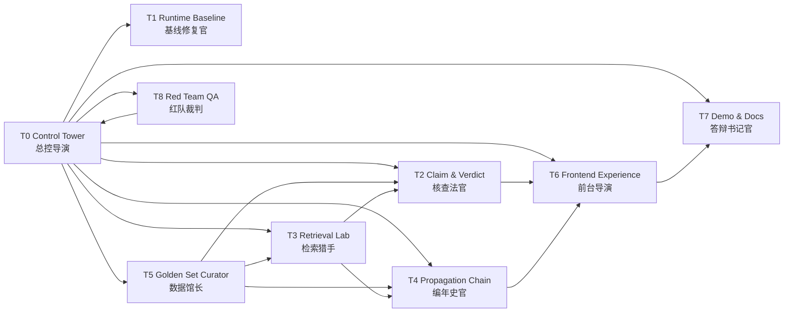
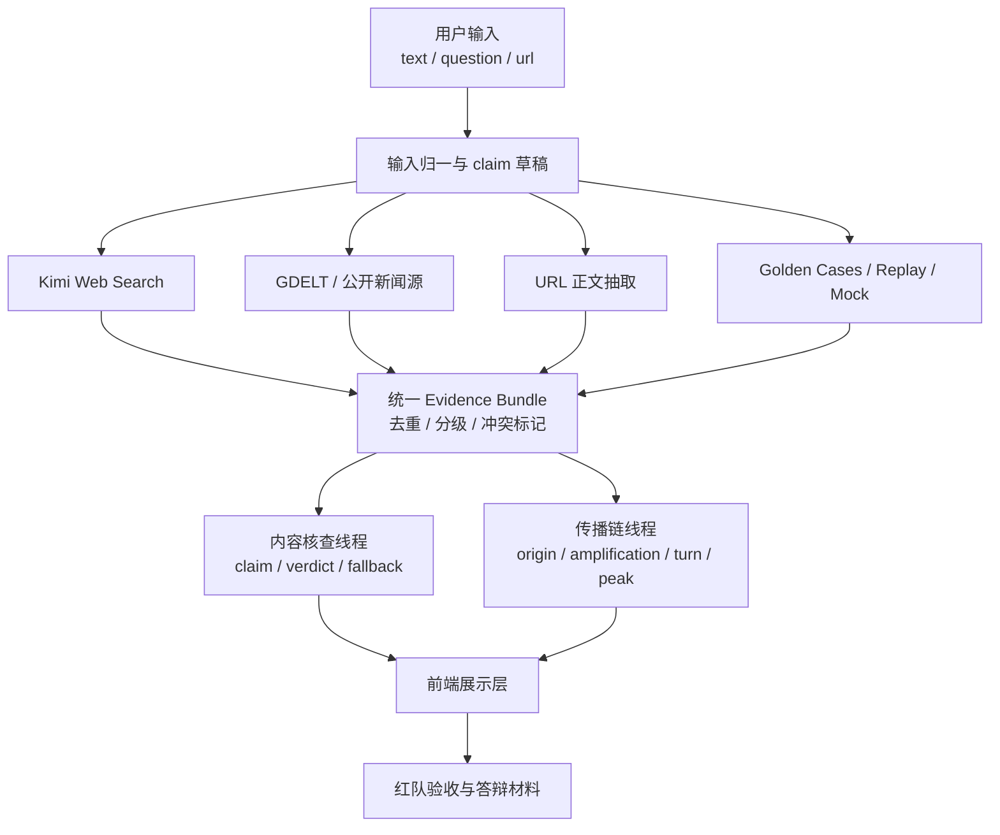

# Multi-Agent Execution Board

更新时间：2026-03-15（Asia/Shanghai）

这份文档用于回答一个具体问题：

在当前 `rumor-checking` 仓库真实现状下，如何用多 agent、多模型、多数据源交叉验证的方式，把项目从“可讲 mock/demo”推进到“更接近题目要求、并有机会稳定拿到 70+”。

## 1. 目标与评分导向

本执行板默认服务下面四个目标：

1. 把默认运行链修回“可复现、可回归、可答辩”。
2. 把“内容核查”主流程从强依赖单次 Kimi 成功，改成带保守回退的稳定闭环。
3. 把“传播链还原”从启发式展示，推进到至少 1 到 2 条可稳定讲清的传播链案例。
4. 把 README、Smoke、Demo Script、前端口播和真实实现重新统一，避免“代码一套、文档一套、现场一套”。

评分导向默认按照 `rules/origin_problem_statement.md`：

- 核心功能完整性：最高优先级
- 产品思维与体验：第二优先级
- 代码与工程质量：必须并行补
- AI 原生思维与 Prompt：通过多 agent、多数据源、交叉验证和 guardrail 体现
- 实现方法：通过合理分工、模型路由、样本库和回归链体现

## 2. 状态标记

- `[x]` 已完成
- `[-]` 进行中
- `[ ]` 未完成

## 3. 为什么采用多 Agent

当前项目的真实问题不是“少一个功能点”，而是同时存在四类问题：

| 问题类型 | 当前表现 | 为什么不能只靠一个线程顺序解决 |
| --- | --- | --- |
| 运行基线失真 | 默认配置、README、测试结果已经不完全一致 | 需要独立线程先把基线修稳，否则所有后续判断都会漂 |
| 内容核查主链不稳 | provider/retrieval 失败时容易直接炸接口或抬高结论 | 需要专门线程盯 `claim -> verdict -> fallback` |
| 传播链可信度不足 | 时间线可展示，但还不够像“传播过程还原” | 需要单独线程做检索结果到传播链的映射 |
| 口径与答辩材料漂移 | README、SMOKE、DEMO_SCRIPT、当前代码口径不完全一致 | 需要独立文档线程持续收口 |

如果只用一个 agent 顺序推进，会出现三个典型问题：

1. 改着改着把运行环境和文档越改越乱。
2. 为了追 live retrieval，把内容核查和演示稳定性一起拖垮。
3. 线程之间缺少统一样本和验收门，最后无法判断到底是否真的涨分。

因此要拆成多个角色，并通过总控、样本库和红队来收口。

## 4. 总体协作图



## 5. 多模型与多数据源交叉验证设计

### 5.1 模型分工

| 角色 | 推荐模型 | 用法 | 为什么这样分 |
| --- | --- | --- | --- |
| 编码和补测试 | GPT-5 / Codex | 改 Python、TS、测试、文档 | 适合做结构化改动和回归 |
| 中文联网搜证 | Kimi | 查公开来源、候选事件、补证据线索 | 中文检索和网页总结更强 |
| 红队复盘 | GPT-5 / Claude 类模型 | 审查过度结论、文档与实现冲突 | 更适合做批判性 review |
| 多轮深思考 | Kimi 多轮、GPT-5 多轮 | 对单个疑难 case 做多轮拆解 | 适合高风险样本，不适合全量主链 |

### 5.2 数据源交叉验证图



### 5.3 数据源优先级

| 优先级 | 数据源 | 用途 | 风险 |
| --- | --- | --- | --- |
| `P0` | 官方通报、机构官网、权威媒体原文 | 作为高可信证据锚点 | 覆盖率有限 |
| `P1` | Kimi web search 结果 | 快速中文搜证、候选事件发现 | 需要强约束，不可直接当最终 verdict |
| `P1` | GDELT / 公开新闻源 | 扩充时序和传播面 | 可能限流、格式噪声高 |
| `P2` | URL 抽取正文 | 对用户给的单条链接做结构化 | 只适合公开 HTML |
| `P3` | Golden cases / replay / mock | 稳定演示、回归测试、保底验收 | 不能假装成 live |

## 6. 人物列表

| 线程 | 人设 | 职责关键词 | 主要交付物 | 主要文件边界 | 为什么必须存在 |
| --- | --- | --- | --- | --- | --- |
| `T0` | 总控导演 | 任务板、依赖、合并门、go/no-go | 总控板、优先级、验收门 | `tasks/`、`overview/`、总控文档 | 没有它就会出现各线程各说各话 |
| `T1` | 基线修复官 | 默认配置、测试、运行链、版本约束 | 可复现默认环境 | `backend/app/core/`、运行文档 | 当前第一 blocker 是默认不可稳定复现 |
| `T2` | 核查法官 | claim、verdict、fallback、模式收口 | 稳定内容核查主链 | `analyze_pipeline.py`、`claim_extractor.py`、`verdict_engine.py` | 这是题目第二主流程，也是最大的涨分点 |
| `T3` | 检索猎手 | retrieval、多源搜证、evidence bundle | 统一证据层 | `retrieval_service.py`、`retrieval_provider.py` | 没有统一证据层，T2/T4 都会各自乱判 |
| `T4` | 编年史官 | 传播链、时间线、节点选择 | 可讲清的传播链案例 | `timeline_builder.py` | 这是题目第一主流程，不能混在 verdict 里顺手做 |
| `T5` | 数据馆长 | golden set、replay、回归样本、验收表 | 稳定样本资产 | `evals/`、`data/demos/`、`contracts/demo_payloads/` | 没有统一样本库，线程间无法对齐 |
| `T6` | 前台导演 | 页面主流程、边界表达、交互展示 | 高分演示界面 | `frontend/components/`、`frontend/lib/` | 当前前端是优势项，必须继续拉高体验分 |
| `T7` | 答辩书记官 | README、SMOKE、DEMO_SCRIPT、评分口径 | 可直接答辩的文档包 | `README.md`、`SMOKE_CHECKLIST.md`、`DEMO_SCRIPT.md` | 决定评委到底如何理解项目 |
| `T8` | 红队裁判 | 反例、过度结论、假绿测试、模式漂移 | Findings 与回提单 | 默认只读，必要时补最小失败测试 | 防止“看起来更强、实际上更危险” |

## 7. 最大并行规划

### 7.1 建议线程数

推荐最大并行度：`7 个写线程 + 1 个只读/少写红队线程`

理由：

- 再多就会开始抢 `backend/tests/`、`README.md`、`overview/` 和 schema 边界。
- 少于 5 个线程则会把 `检索 / 内容核查 / 传播链 / 前端 / 文档` 混在一起，收益下降。

### 7.2 最佳启动顺序

| 阶段 | 可立即启动 | 条件启动 | 说明 |
| --- | --- | --- | --- |
| `Wave-0` | `T0`、`T1`、`T5`、`T8` | 无 | 先建立基线、样本库、红队门 |
| `Wave-1` | `T2`、`T3`、`T6` | 依赖 `T5` 提供第一版样本集，但不阻塞 | 内容核查、检索和前端同时开工 |
| `Wave-2` | `T4` | 最好消费 `T3/T5` 的 bundle 与 case | 传播链线程正式收口 |
| `Wave-3` | `T7` | 等 `T1/T2/T4/T6` 至少完成第一轮 | 文档与答辩口径统一 |
| `Wave-4` | `T8` 深度复验 | 所有线程第一轮输出后 | 做总体验收和回提 |

### 7.3 线程边界与冲突控制

| 线程 | 默认不要碰 | 可以读取 | 可以输出给谁 |
| --- | --- | --- | --- |
| `T1` | verdict/timeline 规则 | 全仓库 | `T0`、`T7` |
| `T2` | 前端 UI、大段 README | `T3/T5` 的 evidence/case | `T6`、`T7` |
| `T3` | 前端 UI、最终 verdict 文案 | `T5` case、现有检索实现 | `T2`、`T4` |
| `T4` | provider/fallback 主逻辑 | `T3/T5` 输出 | `T6`、`T7` |
| `T5` | 核心业务逻辑 | 全仓库 | 全部线程 |
| `T6` | retrieval/provider 深逻辑 | `T2/T4` 字段、`T7` 文案建议 | `T7` |
| `T7` | 核心业务逻辑 | 全部线程的阶段产出 | 面向答辩与主控 |
| `T8` | 默认不直接改大块业务 | 全部线程产出 | `T0`、对应责任线程 |

### 7.4 在 Codex App 并行线程模型下是否可行

结论：`可行，但必须按“多线程协作”来执行，不能按真正的 agent team 幻想来执行。`

这里有一个关键区别：

- 我上面写的 `T0-T8` 更像“职责角色”或“线程模板”。
- 在 Codex app 里，多个线程之间确实可以并行，但它们不会天然共享记忆、不会自动协调、也不会像 agent team 那样自动做任务编排。

因此，真正可落地的方式不是：

- “开 9 个智能体，让它们自己协作”

而是：

- “开若干个 Codex 并行线程，每个线程严格领取一个角色范围，并且所有线程都以同一份任务板、同一份样本表、同一份验收门为准”

这两种方式的工程差异很大。

### 7.5 这版方案需要如何改写成 Codex App 线程方案

| 原设计里的概念 | 在 Codex app 里应该怎么理解 |
| --- | --- |
| `T0-T8` agent | 改成 `W0-Wn` 线程职责模板 |
| agent 自动协作 | 改成“人工派工 + 文件回写 + 明确交接” |
| agent 共享上下文 | 改成“共享仓库文件，不共享隐式上下文” |
| agent 内部协调 | 改成“由一个总控线程维护任务板和合并门” |
| agent 之间传递消息 | 改成“把中间结果写到 md / tests / evals / docs，再由其他线程读取” |

所以这版方案不是不能用，而是必须换一个执行口径：

- `T0-T8` 保留为职责定义
- 实际执行时改成 `W-A / W-B / W-C / ...` 这些 Codex 线程
- 每个线程只负责若干个角色范围，不追求“一个角色一个线程”

### 7.6 在 Codex App 里推荐的真实并行度

虽然上面给了 `7 个写线程 + 1 个红队线程` 的理论最大并行度，但在 Codex app 里我不建议一开始就这么开。

更现实的推荐是：

| 档位 | 线程数 | 适用情况 | 推荐映射 |
| --- | --- | --- | --- |
| `保守` | `3` | 你要先把冲突和返工降到最低 | `W-A=T0+T1`，`W-B=T2+T5`，`W-C=T3+T4+T6` |
| `均衡` | `4` | 当前最推荐 | `W-A=T0+T7`，`W-B=T1`，`W-C=T2+T5`，`W-D=T3+T4+T6` |
| `激进` | `5-6` | 你已经能稳定做手工合并与回写 | `W-A=T0+T7`，`W-B=T1`，`W-C=T2`，`W-D=T3+T4`，`W-E=T5+T6`，可选 `W-F=T8` |

我当前最推荐的是 `4 线程方案`，因为它最符合 Codex app 的真实协作成本。

原因：

1. 线程太多时，冲突点会迅速集中到 `backend/tests/`、`README.md`、`overview/`、前后端共享字段。
2. Codex app 线程之间不会自动知道别人刚改了什么，所以线程过多会让重复劳动和冲突回滚变多。
3. 当前仓库真正需要先收口的是“基线 + 核查主链 + 检索/传播链 + 口径文档”，4 线程已经够用。

### 7.7 Codex App 线程下的强制执行规则

如果用 Codex app 多线程并行，这几条必须严格执行，否则这套方案会失效：

1. 所有线程启动前，都先读本文件和 `tasks/README.md`。
2. 每个线程开始前，必须先把“本轮执行任务 / 执行步骤”回写到对应任务文档。
3. 每个线程默认不要同时改：
   - `README.md`
   - `overview/`
   - `backend/tests/` 的同一批文件
   - `frontend/types/` 与 `backend/app/models/` 的共享字段
4. 只有总控线程能最终改口径文档；其他线程最多提交建议或阶段结果。
5. 所有中间结果优先写回仓库文件，不要只存在聊天记录里。
6. 每轮并行结束后，先由总控线程收口，再开下一轮。

### 7.8 线程模式下的推荐落地映射

#### 方案 A：4 线程，当前最推荐

| 线程 | 负责范围 | 主要文件 |
| --- | --- | --- |
| `W-A` | `T0 + T7` 总控与口径文档 | `tasks/`、`README.md`、`SMOKE_CHECKLIST.md`、`DEMO_SCRIPT.md` |
| `W-B` | `T1` 基线修复 | `backend/app/core/`、运行文档、前端运行链 |
| `W-C` | `T2 + T5` 内容核查与样本库 | `analyze_pipeline.py`、`claim_extractor.py`、`verdict_engine.py`、`evals/` |
| `W-D` | `T3 + T4 + T6` 检索、传播链、前端消费层 | `retrieval_*`、`timeline_builder.py`、`frontend/components/`、`frontend/lib/` |

这个方案的优点：

- 总控和文档不和核心实现抢文件
- 基线修复单独做，不拖慢主链
- 核查线程可以直接消费样本库
- 检索、传播链和前端消费层是一条自然链路

#### 方案 B：5 线程，适合你已经很熟练时

| 线程 | 负责范围 |
| --- | --- |
| `W-A` | `T0 + T7` |
| `W-B` | `T1` |
| `W-C` | `T2` |
| `W-D` | `T3 + T4` |
| `W-E` | `T5 + T6` |

只有当你已经能稳定做线程间 handoff、知道什么时候暂停一个线程等另一个线程合并之后，再用这个方案。

### 7.9 最终判断

所以，对你这个问题的直接回答是：

- 这版并行方案 `在 Codex app 里是可行的`
- 但前提是把它理解成“职责分工板”，不是“自动协作的 agent team”
- 真正执行时应优先用 `4 线程方案`
- 如果你按 “9 个独立 agent 自动协作” 去理解，那这版方案就 `不可行`

## 8. 全量任务清单

下面的任务是本轮为了冲 `70+` 需要一起纳入的全量范围。

### 8.1 基线与工程质量

- `[x]` `R1` 前后端主工程骨架存在
- `[x]` `R2` `health/analyze` API 已存在
- `[x]` `R3` provenance 基础字段已打通
- `[ ]` `R4` 默认配置与 README/SMOKE/overview 完全一致
- `[ ]` `R5` 后端关键回归重新全绿
- `[ ]` `R6` 前端 `test/typecheck/build` 在标准环境稳定可跑
- `[ ]` `R7` Node/Python 最低版本和运行要求写清并核验
- `[ ]` `R8` 演示默认路径、测试默认路径、开发默认路径不再互相打架

### 8.2 内容核查主流程

- `[ ]` `C1` provider 失败不再直接 `502`
- `[ ]` `C2` retrieval 失败时能安全降级并返回可解释结果
- `[ ]` `C3` 无 provider claims 时仍可走 rule claims
- `[x]` `C4` content check 结构化展示已存在
- `[ ]` `C5` verdict 规则对“主体不一致”“旧闻拼接”“半真半假”更稳
- `[ ]` `C6` `chemical-odor` 模式漂移收口
- `[ ]` `C7` `morningstar-layoff` 危险抬升收口
- `[ ]` `C8` broad trend question 与具体事件 question 分流更稳

### 8.3 多源检索与证据链

- `[x]` `S1` retrieval provider 抽象已存在
- `[ ]` `S2` 多数据源 evidence bundle 正式落地
- `[ ]` `S3` Kimi web search、GDELT、URL 抽取结果可统一归一
- `[ ]` `S4` evidence 去重、来源分级、冲突标记更稳
- `[ ]` `S5` 至少拿到 1 到 2 条真实 `live` 通过样本，或者明确冻结“不做 live 交付”

### 8.4 传播链还原

- `[x]` `P1` 时间线框架已存在
- `[ ]` `P2` 至少 2 条 case 可稳定讲清 `origin/amplification/turn/clarification/peak`
- `[ ]` `P3` 节点选择理由更像传播链，而不是仅仅挑几条新闻
- `[x]` `P4` 无外部证据时不伪装成传播链还原成功
- `[ ]` `P5` 把传播链完成度与内容核查完成度拆开评价

### 8.5 前端体验与答辩

- `[x]` `U1` 主页面流程清晰
- `[ ]` `U2` 顶部状态区把“核查完成度”“传播链完成度”“来源类型”拆开
- `[ ]` `U3` safe/mock/demo/fallback 边界文案更强
- `[ ]` `U4` 默认 demo 主线稳定到可直接口播
- `[ ]` `U5` README、SMOKE、DEMO_SCRIPT、当前代码口径统一

### 8.6 AI 原生思维与方法论

- `[x]` `A1` 结构化 prompt 和 schema 已存在
- `[ ]` `A2` 多 agent 协作机制文档化并可执行
- `[ ]` `A3` 多数据源交叉验证机制进入实现或验收链
- `[ ]` `A4` golden cases / replay / smoke 成为统一验收资产

## 9. 详细线程任务与 Prompt

---

### T0 / 总控导演

**线程目标**

- 维护总任务板、依赖关系、合并顺序和 go/no-go 条件
- 保证所有线程围绕同一评分目标推进
- 阻止“为了追 live 而破坏默认可运行链”的错误优先级

**主要输入**

- 所有线程的阶段性结果
- 红队发现
- README / overview / task 状态冲突

**主要输出**

- 阶段任务板
- 每日优先级
- 合并顺序
- 统一验收门

**任务清单**

- `[ ]` `T0.1` 冻结本轮最高目标：默认可运行 + 双主流程可信 + 口径一致
- `[ ]` `T0.2` 给各线程分配唯一文件边界
- `[ ]` `T0.3` 定义第一轮合并门：`T1/T2/T5` 优先
- `[ ]` `T0.4` 定义第二轮合并门：`T3/T4/T6`
- `[ ]` `T0.5` 定义最终验收门：`T7/T8`

**子任务**

- `[ ]` `T0.1.a` 新建或更新总控板
- `[ ]` `T0.1.b` 把 70+ 所需条件写成验收列表
- `[ ]` `T0.2.a` 明确各线程禁止越界的文件范围
- `[ ]` `T0.3.a` 列出必须先过的命令和 smoke 项
- `[ ]` `T0.4.a` 列出二轮集成前置条件
- `[ ]` `T0.5.a` 输出最终 go/no-go 模板

**建议 Prompt**

```text
你现在负责 T0 / 总控导演。
你的目标不是直接改大块业务代码，而是维护当前多 agent 执行的唯一真实任务板。
请先阅读 tasks/multi-agent-execution-board.md、tasks/README.md、README.md、overview/13_f8-random-acceptance.md 和 docs/status/current-verified-state.md。
你要做四件事：
1. 把当前线程拆分、依赖和优先级写清。
2. 对每个线程给出文件边界、合并顺序和验收门。
3. 当线程结果冲突时，给出唯一口径。
4. 在每轮结束后输出 go / no-go 判断。
默认优先级：默认可运行 > 内容核查稳定 > 传播链可信 > live 检索 > 页面 polish。
除非总控文件本身需要更新，否则不要改前后端核心实现。
```

---

### T1 / 基线修复官

**线程目标**

- 把默认运行链和文档口径修回一致
- 修测试执行链、Node/Python 版本约束、基础环境说明
- 让后续线程有可信基线可依赖

**主要文件边界**

- `backend/app/core/config.py`
- 启动与运行文档
- 测试执行文档
- 必要时补运行时版本约束文件

**任务清单**

- `[ ]` `T1.1` 统一默认配置与 README 口径
- `[ ]` `T1.2` 确认 `analysis_provider / retrieval_provider / fallback` 默认值
- `[ ]` `T1.3` 修后端关键测试回归
- `[ ]` `T1.4` 修前端测试/类型检查执行链
- `[ ]` `T1.5` 写清 Node/Python 最低版本与推荐运行方式

**子任务**

- `[ ]` `T1.1.a` 对比 `config.py` 与 README/SMOKE/overview
- `[ ]` `T1.1.b` 冻结当前默认开发路径
- `[ ]` `T1.2.a` 决定默认是 `mock` 还是 `kimi`，不能两套口径并存
- `[ ]` `T1.3.a` 跑 `pytest backend/tests/test_api.py -q`
- `[ ]` `T1.3.b` 跑 `pytest backend/tests/test_retrieval.py -q`
- `[ ]` `T1.3.c` 跑 `pytest backend/tests/test_kimi_provider.py backend/tests/test_kimi_provider_quality.py -q`
- `[ ]` `T1.4.a` 核对 Node 版本
- `[ ]` `T1.4.b` 让 `npm test` 与 `npm run typecheck` 在标准环境可执行
- `[ ]` `T1.5.a` 更新前端和根 README 的版本说明

**建议 Prompt**

```text
你现在负责 T1 / 基线修复官。
目标是让仓库默认状态可复现、可解释、可回归。
优先检查 backend/app/core/config.py、README.md、frontend/README.md、SMOKE_CHECKLIST.md、overview/13_f8-random-acceptance.md。
必须完成：
1. 修默认配置与文档口径不一致。
2. 明确默认开发/演示路径。
3. 修复后端关键回归命令。
4. 修前端 test/typecheck 执行链和版本约束。
输出要求：
- 先补失败复现，再做实现修复。
- 每完成一项都写出命令和结果。
- 不要顺手改 verdict/timeline 逻辑，除非它直接阻塞基线通过。
```

---

### T2 / 核查法官

**线程目标**

- 修复内容核查主链
- 重点收口 `claim -> verdict -> fallback -> mode`
- 防止 provider/retrieval 失败时直接报错或危险抬升

**主要文件边界**

- `backend/app/services/analyze_pipeline.py`
- `backend/app/services/claim_extractor.py`
- `backend/app/services/provider_enricher.py`
- `backend/app/services/verdict_engine.py`
- 相关测试

**任务清单**

- `[ ]` `T2.1` provider 失败时不再直接 `502`
- `[ ]` `T2.2` claim extractor 支持 provider claims 缺失时走规则回退
- `[ ]` `T2.3` retrieval 失败时保持 safe/partial，不抬高 complete
- `[ ]` `T2.4` 修 `morningstar-layoff`
- `[ ]` `T2.5` 修 `chemical-odor`
- `[ ]` `T2.6` broad trend question 与具体人/公司 question 分流更稳

**子任务**

- `[ ]` `T2.1.a` 新增 provider failure regression
- `[ ]` `T2.1.b` 改 AnalyzePipeline fallback 路径
- `[ ]` `T2.2.a` 恢复或接入 `_extract_rule_claims`
- `[ ]` `T2.2.b` claim source 正确标记为 `rule` 或 `provider_plus_rule`
- `[ ]` `T2.3.a` 给无证据场景加更强保守门槛
- `[ ]` `T2.4.a` 加入实体锚定和旧闻约束
- `[ ]` `T2.5.a` 给 partial demo 需要的冲突证据留出口
- `[ ]` `T2.6.a` broad trend 不强行压成单一事件

**建议 Prompt**

```text
你现在负责 T2 / 核查法官。
目标是修复内容核查主链，而不是扩大 UI 或追 live 检索。
重点文件：backend/app/services/analyze_pipeline.py、claim_extractor.py、provider_enricher.py、verdict_engine.py 及相关测试。
必须解决：
1. provider 失败不再直接 502。
2. 没有 provider claims 时仍可走规则 claim。
3. retrieval/evidence 缺失时不抬高 verdict 和 mode。
4. morningstar-layoff 这类高风险样例回到保守口径。
方法要求：
- 先写或补失败测试。
- 再做最小修复。
- 每个判断都优先保守，不要为了“像更聪明”而扩大结论。
```

---

### T3 / 检索猎手

**线程目标**

- 建立多数据源 evidence bundle
- 给 T2 和 T4 提供统一证据输入
- 尽量拿到至少 1 到 2 条真实 live 样本，或者明确放弃 live 交付

**主要文件边界**

- `backend/app/services/retrieval_service.py`
- `backend/app/services/retrieval_provider.py`
- `backend/app/services/retrieval_models.py`
- `backend/app/services/retrieval_deduper.py`
- 相关 retrieval tests

**任务清单**

- `[ ]` `T3.1` 统一 Kimi web search、GDELT、URL 抽取结果结构
- `[ ]` `T3.2` evidence bundle 增加来源等级、去重、冲突标记
- `[ ]` `T3.3` retrieval fallback 策略与 cache 策略重新明确
- `[ ]` `T3.4` 跑 live probe 并输出真实通过率
- `[ ]` `T3.5` 若 live 不稳，则冻结 mock/demo 与 live probe 的正式边界

**子任务**

- `[ ]` `T3.1.a` 统一 `SearchResult` 字段约束
- `[ ]` `T3.1.b` 统一 provider name 与 source tier 规则
- `[ ]` `T3.2.a` 去重归并后保留 merged explain
- `[ ]` `T3.2.b` 标记 rumor/rebuttal/official 信号
- `[ ]` `T3.3.a` 修 cache-only / bypass-cache 路径
- `[ ]` `T3.4.a` 跑固定 probe case
- `[ ]` `T3.4.b` 输出成功数、失败数、失败原因
- `[ ]` `T3.5.a` 给 `T7` 输出可讲/不可讲边界

**建议 Prompt**

```text
你现在负责 T3 / 检索猎手。
目标是建立统一 evidence bundle，让 retrieval 成为 T2/T4 的输入层，而不是各自单独消费原始搜索结果。
重点文件：backend/app/services/retrieval_service.py、retrieval_provider.py、retrieval_models.py、retrieval_deduper.py。
优先事项：
1. 统一 Kimi、GDELT、URL 抽取得到的结果结构。
2. 给结果补来源等级、去重、冲突和 rebuttal 信号。
3. 明确 fallback、cache-only、bypass-cache 的行为。
4. 跑固定 live probe，给出真实通过率。
注意：
- 不要直接改前端和最终 verdict 文案。
- 如果 live 仍然不稳，要明确写出冻结边界，而不是模糊带过。
```

---

### T4 / 编年史官

**线程目标**

- 把时间线从“看起来有几个节点”推进到“可讲传播过程”
- 做至少 2 条可答辩的传播链案例
- 明确“传播链完成度”与“内容核查完成度”是两件事

**主要文件边界**

- `backend/app/services/timeline_builder.py`
- 相关 timeline / retrieval tests
- 可配合 `T5` 样本说明文档

**任务清单**

- `[ ]` `T4.1` 完善 `origin/amplification/turn/clarification/peak` 选择规则
- `[ ]` `T4.2` 增强选择理由，让它更像传播链解释
- `[ ]` `T4.3` 形成至少 2 条稳定传播链案例
- `[ ]` `T4.4` 无外部证据时清晰返回 `input_seed` 或 `none`

**子任务**

- `[ ]` `T4.1.a` 按来源等级和时间顺序重审 origin
- `[ ]` `T4.1.b` 区分发酵节点与权威回应节点
- `[ ]` `T4.1.c` 峰值节点不只看数量，也看传播信号
- `[ ]` `T4.2.a` why_selected 要说明“为什么是它而不是别的”
- `[ ]` `T4.3.a` 选 `expired-yogurt` 作为第一条稳定链
- `[ ]` `T4.3.b` 再补 1 条非 demo 的开放案例
- `[ ]` `T4.4.a` 不得在 question_only 无证据时伪造传播链

**建议 Prompt**

```text
你现在负责 T4 / 编年史官。
目标是提升传播链可信度，而不是只多返回几个 timeline 节点。
重点文件：backend/app/services/timeline_builder.py 及相关测试。
必须完成：
1. origin / amplification / turn / clarification / peak 的规则更稳。
2. why_selected 解释更像传播链因果说明，而不是机械标签。
3. 至少做出 2 条可讲清的传播链案例。
4. 没有外部检索证据时必须明确返回 input_seed 或 none。
默认优先消费 T3 的 canonical results 和 T5 的 golden cases。
```

---

### T5 / 数据馆长

**线程目标**

- 建立所有线程共享的样本资产
- 把稳定 demo、危险 case、live probe case、回归 case 收成统一表
- 防止不同线程拿着不同 case 各自优化

**主要文件边界**

- `evals/`
- `data/demos/`
- `contracts/demo_payloads/`
- 样本说明文档

**任务清单**

- `[ ]` `T5.1` 整理 stable demo cases
- `[ ]` `T5.2` 整理 risky drift cases
- `[ ]` `T5.3` 整理 live probe cases
- `[ ]` `T5.4` 给每个 case 标注期望 mode、provenance、传播链节点、关键 verdict
- `[ ]` `T5.5` 给 T7 产出演示主线与禁用样本列表

**子任务**

- `[ ]` `T5.1.a` 冻结 `expired-yogurt` 样本
- `[ ]` `T5.2.a` 标注 `chemical-odor`
- `[ ]` `T5.2.b` 标注 `morningstar-layoff`
- `[ ]` `T5.3.a` 维护 4 条固定 live probe
- `[ ]` `T5.4.a` 每个 case 记录期望与实测
- `[ ]` `T5.5.a` 生成“可讲/不可讲/待复核”列表

**建议 Prompt**

```text
你现在负责 T5 / 数据馆长。
目标不是改业务逻辑，而是产出全线程共享的稳定样本资产。
请围绕 evals/、data/demos/、contracts/demo_payloads/ 整理三类 case：
1. 稳定 demo case
2. 危险漂移 case
3. live probe case
每个 case 必须至少记录：
- 输入
- 期望 mode
- 期望 provenance
- 关键 claim verdict
- 传播链节点数预期
- 当前实测结果
最后产出一份可讲 / 不可讲 / 待复核名单。
```

---

### T6 / 前台导演

**线程目标**

- 在不伪装能力的前提下，把前端体验和答辩表现拉高
- 把结果页更明确地表达成“双主流程”
- 强化 provenance 和风险边界

**主要文件边界**

- `frontend/components/`
- `frontend/lib/report-utils.ts`
- `frontend/types/`

**任务清单**

- `[ ]` `T6.1` 顶部状态区拆分“核查完成度”“传播链完成度”“来源类型”
- `[ ]` `T6.2` safe/mock/demo/fallback 文案更强
- `[ ]` `T6.3` 把最关键 claim 与传播链状态做成首页级摘要
- `[ ]` `T6.4` 保留当前好用的页面顺序，但让边界更明显

**子任务**

- `[ ]` `T6.1.a` 新增传播链完成度 meta
- `[ ]` `T6.1.b` 核查完成度不再单独代表整体完成度
- `[ ]` `T6.2.a` demo/mock/fallback pill 颜色与文案更明确
- `[ ]` `T6.3.a` 顶层突出 decisive claim
- `[ ]` `T6.3.b` 顶层突出 timeline state
- `[ ]` `T6.4.a` 不隐藏失败和降级

**建议 Prompt**

```text
你现在负责 T6 / 前台导演。
目标是把已有页面优势吃满，但不能伪装 live 或隐藏风险。
重点文件：frontend/components/、frontend/lib/report-utils.ts。
必须完成：
1. 把核查完成度和传播链完成度拆开表达。
2. 对 safe/mock/demo/fallback 给出更明确文案。
3. 顶层更清楚地展示 decisive claim、证据数量、传播链状态。
4. 页面顺序继续保持“先结论、再边界、再拆解、再传播、再证据”。
不要假装当前没有限制；限制必须被更好地展示出来。
```

---

### T7 / 答辩书记官

**线程目标**

- 用当前真实实现重写答辩口径
- 让 README、SMOKE、DEMO_SCRIPT、当前任务板完全一致
- 直接服务“复试时怎么讲”

**主要文件边界**

- `README.md`
- `SMOKE_CHECKLIST.md`
- `DEMO_SCRIPT.md`
- 必要的 `overview/` 收口文档

**任务清单**

- `[ ]` `T7.1` 统一默认路径与当前可讲边界
- `[ ]` `T7.2` 重写演示主线
- `[ ]` `T7.3` 输出评分导向说明：哪些点是现在的加分项，哪些仍是短板
- `[ ]` `T7.4` 把“不能怎么讲”写得更明确

**子任务**

- `[ ]` `T7.1.a` README 与 config/default path 对齐
- `[ ]` `T7.2.a` 演示主线固定为 1 到 2 条样本
- `[ ]` `T7.2.b` fallback 演示作为保底，不混成主线
- `[ ]` `T7.3.a` 直接给出当前分数区间和短板
- `[ ]` `T7.4.a` 明确 live 何时能讲、何时不能讲

**建议 Prompt**

```text
你现在负责 T7 / 答辩书记官。
目标是把仓库当前真实状态收口成可以直接答辩的口径。
重点文件：README.md、SMOKE_CHECKLIST.md、DEMO_SCRIPT.md、必要的 overview 文档。
你必须做到：
1. 所有入口文档对默认路径、当前边界、live/mock/fallback 口径完全一致。
2. 演示主线清楚、短、稳，不再混用危险样本。
3. 明确写出“能讲什么 / 不能讲什么 / 如果被追问怎么答”。
不要发明不存在的能力，所有表述都要能落回当前代码或验收记录。
```

---

### T8 / 红队裁判

**线程目标**

- 专门抓高风险错判、模式漂移、假绿测试、文档与实现冲突
- 不抢实现线程的核心代码
- 给总控和各责任线程提供明确回提

**主要文件边界**

- 默认只读全仓库
- 如需写入，优先写验收报告或最小失败测试

**任务清单**

- `[ ]` `T8.1` 找所有“会被误讲成真实核查成功”的结果
- `[ ]` `T8.2` 找所有 mode 漂移 case
- `[ ]` `T8.3` 找所有文档和代码冲突
- `[ ]` `T8.4` 找所有测试假绿或环境依赖假象
- `[ ]` `T8.5` 输出严重级排序的 findings

**子任务**

- `[ ]` `T8.1.a` 检查 provenance 文案是否会误导
- `[ ]` `T8.2.a` 检查 stable demo 和开放输入
- `[ ]` `T8.3.a` 对比 config、README、overview、tests
- `[ ]` `T8.4.a` 检查 test pass 是否依赖特定环境或旧实例
- `[ ]` `T8.5.a` 回提到对应线程，不自己吞并修复

**建议 Prompt**

```text
你现在负责 T8 / 红队裁判。
默认不要直接改大块业务代码，先做阅读、复现和打靶。
请重点寻找五类问题：
1. 会被误讲成真实核查成功的结果。
2. mode 漂移。
3. 高风险过度结论。
4. 文档与实现冲突。
5. 测试假绿、环境依赖假象。
输出要求：
- 按严重级排序。
- 每条给出复现输入、影响、建议回提线程。
- 只有在明确需要时，才补最小失败测试。
```

## 10. 合并与验收门

### 第一轮合并门

- `T1` 至少完成 `R4/R5/R6` 的第一版收口
- `T5` 产出统一 golden set
- `T2` 至少完成 `C1/C2/C3` 中的高优先回退修复

### 第二轮合并门

- `T3` 产出统一 evidence bundle
- `T4` 产出至少 1 条可信传播链
- `T6` 消费新字段并更新 UI 表达

### 最终答辩门

- `T7` 文档口径统一
- `T8` 红队 findings 至少处理完 P0/P1 级问题
- 项目可以明确回答：
  - 默认怎么跑
  - 默认在讲什么
  - 哪些结论不能讲过头
  - 为什么这个系统比普通“调一次模型”更像一个新闻核查工作台

## 11. 建议的最终交付口径

如果 `live` 仍不稳，则最终答辩口径建议冻结为：

- “我们已经做出一套可演示的新闻核查工作台。”
- “内容核查和传播链是双主流程，页面与后端已经围绕这两条主线组织。”
- “当前默认稳定交付的是带 provenance 的 mock/demo 路径。”
- “真实检索路径仍在收口，但系统已经不会把 mock 或 fallback 伪装成真实核查成功。”

如果 `live` 能拿到 1 到 2 条稳定通过样本，再升级口径为：

- “当前已有少量真实 live 样本通过，系统能够在部分公开新闻上完成真实 evidence-grounded 较真；默认演示仍保留保守边界，不夸大覆盖面。”

## 12. 当前建议

现在最值得立刻启动的线程顺序是：

1. `T0` 总控导演
2. `T1` 基线修复官
3. `T5` 数据馆长
4. `T2` 核查法官
5. `T3` 检索猎手
6. `T6` 前台导演
7. `T4` 编年史官
8. `T7` 答辩书记官
9. `T8` 红队裁判

原因很简单：

- 先没有可信基线，就谈不上并行。
- 没有统一样本，线程之间就无法对齐。
- 内容核查与检索层先稳住，传播链和前端才不会返工。
- 文档和红队一定放在后半程，但必须独立存在。
