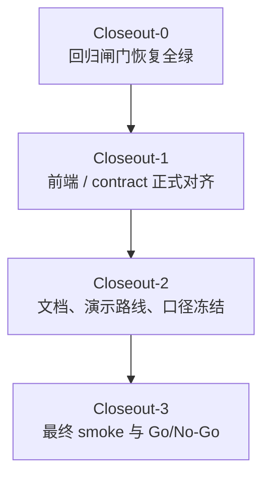

# Post High-Score Closeout Plan

更新时间：2026-03-16（Asia/Shanghai）

适用条件：

1. 已经按 [tasks/high-score-final-execution-plan.md](./high-score-final-execution-plan.md) 完成主体建设。
2. 现在要判断“高分主线是否真的收口”，而不是继续扩功能。
3. 需要一份能直接分批执行的 closeout 计划和线程 prompt。

参考输入：

- `tasks/high-score-final-execution-plan.md`
- `tasks/high-score-thread-prompts/README.md`
- `README.md`
- `SMOKE_CHECKLIST.md`
- `DEMO_SCRIPT.md`
- `frontend/README.md`
- 当前仓库实测结果：
  - `pytest backend/tests -q` -> `67 passed, 2 failed`
  - `pytest backend/tests/test_verdict_engine.py backend/tests/test_high_score_golden_cases.py -q` -> `9 passed`
  - `frontend: npm run typecheck && npm test && npm run build` -> 全部通过

---

## 0. 这份计划要回答什么

这份计划专门回答 6 个问题：

1. `high-score-final-execution-plan.md` 里的任务是不是已经都完成了
2. 如果没有，真正还差什么
3. 上一版 `tasks/post-we-closeout-plan.md` 哪些判断已经过时
4. 剩余工作应该分几批次做完
5. 每一批该起哪些线程，改哪些文件
6. 全部做完后，你还需要亲自做什么

---

## 1. 先给结论

不是“完全没做完”，也不是“已经全完了”。

当前真实状态更准确的说法是：

> 高分主线主体已经成型，约有 `85%~90%` 完成度；但 closeout 还没有完成，当前仍然卡在“后端全量回归未全绿 + 前端 formal type sync 未正式收口 + 最终 smoke / Go-NoGo 未执行”。

所以：

- 可以进入收口阶段
- 不能宣称 `high-score-final-execution-plan.md` 已全部完成
- 也不能直接跳过 closeout 去讲“已经彻底验收”

---

## 2. 对主计划的逐项核验结论

状态标记：

- `[x]` 已收口
- `[-]` 主体已完成，但 closeout 未收口
- `[ ]` 未完成

| 主任务 | 主计划自报 | 当前核验结论 | 说明 |
| --- | --- | --- | --- |
| `T00` 高分口径与范围冻结 | `[-] 65%` | `[-]` | 文档口径大体统一，但最终 `Go / Conditional Go / No-Go` 模板和上会路径冻结还没做完。 |
| `T01` Contract / Schema / 字段冻结 | `[-] 85%` | `[-]` | 后端 schema 与 demo payload 已冻结，但 `frontend/types/report.ts` 仍未把 score 字段正式镜像进主 `Report` 类型。 |
| `T02` 默认运行链与基线统一 | `[-] 85%` | `[-]` | 默认基线已经统一成 `off + mock + fallback=true`，但还没有经过最终 smoke 的演示机验收。 |
| `T03` 输入理解与 Claim 拆解 | `[-] 70%` | `[-]` | claim-first 主体可用，当前没有单独阻塞，但它仍依赖最终回归全绿来收口。 |
| `T04` 多源检索与 Evidence Bundle | `[x] 100%` | `[-]` | 主体能力已落地，但 `test_analyze_request_uses_kimi_only_path` 暴露出 `canonical_result_count` 回归，说明 retrieval closeout 还没彻底结束。 |
| `T05` Verdict、Fallback 与风险收口 | `[x] 100%` | `[-]` | targeted verdict / golden tests 已通过，但 `safe_mode` 相关全量回归未全绿，仍不能算最终收口。 |
| `T06` 传播链还原收口 | `[x] 100%` | `[-]` | timeline 主体可讲，但仍要等 retrieval 相关回归恢复全绿。 |
| `T07` 整条新闻可信度分 | `[x] 100%` | `[-]` | score 字段已产出，targeted tests 通过；但 mode / retrieval 相关回归未全绿时，不应把整体分解释当成最终验收完成。 |
| `T08` 前端双主流程结果页 | `[x] 100%` | `[-]` | 前端功能、测试、build 都通过；但 score 字段目前主要通过 adapter 消费，formal type sync 仍需补齐。 |
| `T09` Golden Cases / Regression / Smoke | `[x] 100%` | `[-]` | 这是当前最明显的主计划偏差：`pytest backend/tests -q` 仍有 `2` 个失败，所以不能记成 `100%`。 |
| `T10` README / Demo / 答辩材料 | `[x] 100%` | `[-]` | 口径文档基础已经很好，但文档里的测试数字和最终上会路线仍需要按当前真实状态回写。 |
| `T11` 最终集成与 Go/No-Go | `[ ] 5%` | `[ ]` | 这部分确实还没开始。 |

一句话概括：

- `T04 ~ T08` 更接近“功能完成、验收未完成”
- `T09 ~ T11` 仍然是当前真正的 closeout 主战场

---

## 3. 上一版 post plan 哪些地方不再准确

上一版 `tasks/post-we-closeout-plan.md` 的总体方向是对的：

1. `W-E` 之后应该进入收口阶段
2. 不应继续扩大型功能
3. 应该转向回归、集成、演示和 Go-NoGo

但它有 3 个关键点已经过时：

1. 它把已知失败项写成了
   - `test_provider_mixed_claims_surface_true_false_split_and_answer_suggestions`
   - `test_analyze_request_uses_kimi_only_path`
   其中前者现在已经恢复，新的失败项变成了 `test_safe_mode_keeps_raw_retrieval_hits_visible`。
2. 它默认从“`W-E` 刚完成前一刻”出发；而现在仓库已经进入“`W-E` targeted 回归过了，但全量回归还没过”的状态。
3. 它没有把前端 formal type sync 单独提出来，而当前 `frontend/types/report.ts` 与冻结 contract 之间确实还留着收口缺口。

所以：

> 上一版 post plan 的阶段判断是对的，但任务板和优先级需要按今天的真实仓库状态重写。

---

## 4. 当前真正的阻塞项

### 4.1 后端全量回归没有全绿

当前 `pytest backend/tests -q` 失败的 2 条用例是：

1. `backend/tests/test_kimi_only_pipeline.py::test_analyze_request_uses_kimi_only_path`
   - 现象：`retrieval_diagnostics.canonical_result_count` 期望 `2`，实际为 `1`
   - 影响：说明 retrieval combine / canonicalization 的口径还会漂移
2. `backend/tests/test_retrieval.py::test_safe_mode_keeps_raw_retrieval_hits_visible`
   - 现象：预期 `safe_mode`，实际变成 `partial_mode`
   - 影响：说明“证据不足时保守收束”这个高分主线边界还没有完全锁死

### 4.2 前端 formal type sync 还没正式收口

当前前端的功能验证是好的：

- `npm run typecheck` 通过
- `npm test` 通过
- `npm run build` 通过

但 `frontend/types/report.ts` 里的主 `Report` 类型仍没有正式声明：

- `overall_credibility_score`
- `overall_credibility_label`
- `score_breakdown`
- `claim_contributions`
- `timeline_confidence`
- `independent_source_count`

页面现在是通过 `api-client` 和 `report-high-score.ts` 的扩展适配来消费这些字段。

这不影响演示，但它说明：

> `T01.10 / T08` 的“前端与 contract 正式对齐”还没有完全做完。

### 4.3 最终 smoke / Go-NoGo 还没执行

文档和 demo 口径已经接近可用，但以下事情还没有形成书面结论：

1. 默认上会到底走 `mock demo` 还是 `fallback`
2. 演示机上是否已经跑过最终 smoke
3. 今天的结论到底是 `Go`、`Conditional Go` 还是 `No-Go`

---

## 5. 接下来不要做什么

从现在开始，不建议再开下面这些方向：

1. 新增大型功能模块
2. 再接新 provider / 新数据源
3. 重做页面结构
4. 重新设计 score contract
5. 把 `live probe` 包装成“已通过最终验收的 live 能力”

允许继续改代码，但只限三类：

1. 修回归
2. 修集成
3. 修演示阻塞

---

## 6. Closeout 分几批做完

推荐分成 `4` 个 closeout 批次：

### 6.1 批次总表

| 批次 | 并行任务 | 主责线程 | 退出条件 |
| --- | --- | --- | --- |
| `Closeout-0` | `C00` 状态回写、`C01` kimi canonical count、`C02` safe mode 保守收束、`C03` 后端全量回归 | `W-A`、`W-D`、`W-E`、`W-G` | `pytest backend/tests -q` 全绿 |
| `Closeout-1` | `C04` 前端 formal type sync、`C05` 真实输出 UI 核对 | `W-F`、`W-A` | `npm run typecheck && npm test && npm run build` 全绿，且 score 字段正式对齐 |
| `Closeout-2` | `C06` README/SMOKE/DEMO 回写、`C07` 演示路径冻结 | `W-G`、`W-A` | 文档、页面、口播说的是同一套东西 |
| `Closeout-3` | `C08` 最终 smoke、`C09` Go/No-Go 结论 | `W-G`、`W-B`、`W-A` | 形成可上会的书面结论 |

---

## 7. 详细任务清单

## C00. 回写真实状态板

- **主责线程**：`W-A`
- **批次**：`Closeout-0`
- **当前状态**：`[ ]`
- **目标**：
  - 把主计划“文档自报状态”和“当前真实状态”分开
  - 明确哪些任务是功能完成、哪些任务是 closeout 未完成

### 子任务

- `[ ]` `C00.1` 在 closeout 计划中回写 `T00 ~ T11` 的核验状态
- `[ ]` `C00.2` 标记当前真实阻塞项是 `2` 条后端失败用例和前端 formal type sync
- `[ ]` `C00.3` 冻结 closeout 启动顺序，禁止再开新功能线程

## C01. 修 kimi-only canonical count 回归

- **主责线程**：`W-D`
- **批次**：`Closeout-0`
- **当前状态**：`[ ]`
- **目标**：
  - 恢复 `test_analyze_request_uses_kimi_only_path`
  - 保证 retrieval diagnostics 的 `canonical_result_count` 与实际 combine 口径一致

### 子任务

- `[ ]` `C01.1` 排查 `retrieval_service.py / analyze_pipeline.py / retrieval_models.py` 的 combine 与 follow-up 逻辑
- `[ ]` `C01.2` 明确 `canonical_result_count` 是“最终 canonical bundle 数量”还是“原始命中可见数量”
- `[ ]` `C01.3` 修复后跑 `pytest backend/tests/test_kimi_only_pipeline.py -q`

## C02. 修 safe mode 保守收束回归

- **主责线程**：`W-E`
- **支援线程**：`W-D`
- **批次**：`Closeout-0`
- **当前状态**：`[ ]`
- **目标**：
  - 恢复 `test_safe_mode_keeps_raw_retrieval_hits_visible`
  - 保证 raw retrieval hits 足够弱时系统停在 `safe_mode`，而不是误升到 `partial_mode`

### 子任务

- `[ ]` `C02.1` 判断问题根因是在 retrieval relevance、verdict 对齐，还是 mode 选择
- `[ ]` `C02.2` 保证“无稳定证据时不抬高 mode”这个边界重新成立
- `[ ]` `C02.3` 跑 `pytest backend/tests/test_retrieval.py::test_safe_mode_keeps_raw_retrieval_hits_visible -q`

## C03. 后端全量回归闸门

- **主责线程**：`W-G`
- **支援线程**：`W-D`、`W-E`
- **批次**：`Closeout-0`
- **当前状态**：`[ ]`
- **目标**：
  - 重新跑 `pytest backend/tests -q`
  - 只有这里全绿，才能进入 Closeout-1

### 子任务

- `[ ]` `C03.1` targeted regression 全绿
- `[ ]` `C03.2` `pytest backend/tests -q` 全绿
- `[ ]` `C03.3` 把回归结果同步给 `W-A / W-G`

## C04. 前端 formal type sync

- **主责线程**：`W-F`
- **批次**：`Closeout-1`
- **当前状态**：`[ ]`
- **目标**：
  - 让 `frontend/types/report.ts` 正式对齐冻结 contract
  - 不再把 score 字段留在 `Record<string, unknown>` 或扩展 adapter 的灰区里

### 子任务

- `[ ]` `C04.1` 正式声明 6 个 score 相关字段及其结构
- `[ ]` `C04.2` 如果保留扩展 adapter，明确它只是 runtime guard，不是主 contract 缺口的替代品
- `[ ]` `C04.3` 保持空值场景下的保守降级

## C05. 前端真实输出 UI 核对

- **主责线程**：`W-F`
- **批次**：`Closeout-1`
- **当前状态**：`[ ]`
- **目标**：
  - 用 `complete / partial / safe` 三类 case 再核对一次页面消费真实输出

### 子任务

- `[ ]` `C05.1` 验证整体可信度卡消费真实 score 字段
- `[ ]` `C05.2` 验证 `score_breakdown / claim_contributions / timeline_confidence`
- `[ ]` `C05.3` 验证缺字段时 UI 仍按保守路径显示
- `[ ]` `C05.4` 跑 `npm run typecheck && npm test && npm run build`

## C06. 文档与任务板回写

- **主责线程**：`W-G`
- **支援线程**：`W-A`
- **批次**：`Closeout-2`
- **当前状态**：`[ ]`
- **目标**：
  - 把 README、SMOKE、DEMO 和任务板中的数字、状态、路径统一到真实仓库状态

### 子任务

- `[ ]` `C06.1` 更新 README 中过时的测试数字和 closeout 结论
- `[ ]` `C06.2` 更新 `SMOKE_CHECKLIST.md` 的当前默认路线和 fallback 口径
- `[ ]` `C06.3` 更新 `DEMO_SCRIPT.md` 的主线 / 备线 / 禁讲清单

## C07. 冻结最终演示路径

- **主责线程**：`W-A`
- **支援线程**：`W-G`
- **批次**：`Closeout-2`
- **当前状态**：`[ ]`
- **目标**：
  - 最终冻结今天真正可讲的路径

### 推荐冻结结果

1. 主线：`expired-yogurt`
2. 补充：`morningstar-question`
3. 边界：`viral-death-ambiguous`
4. 默认对外路线：`mock demo`
5. 保底路线：`frontend fallback / demo_payload`
6. 内部诊断：`live probe`，不对外宣称通过

### 子任务

- `[ ]` `C07.1` 明确今天默认走 `mock demo` 还是 `fallback`
- `[ ]` `C07.2` 明确什么情况下允许切到保底路线
- `[ ]` `C07.3` 输出今天“不讲什么”的清单

## C08. 最终 smoke

- **主责线程**：`W-G`
- **支援线程**：`W-B`
- **批次**：`Closeout-3`
- **当前状态**：`[ ]`
- **目标**：
  - 在真实演示机或真实演示环境里过一遍最终 smoke

### 子任务

- `[ ]` `C08.1` 跑后端启动检查
- `[ ]` `C08.2` 跑前端启动检查
- `[ ]` `C08.3` 跑主线 case
- `[ ]` `C08.4` 跑保底 fallback
- `[ ]` `C08.5` 记录 smoke 结果和失败点

## C09. Go / Conditional Go / No-Go

- **主责线程**：`W-A`
- **批次**：`Closeout-3`
- **当前状态**：`[ ]`
- **目标**：
  - 不靠现场判断，形成书面结论

### 判定模板

- `Go`
  - 后端全量回归全绿
  - 前端 typecheck/test/build 全绿
  - 主线 case 稳定
  - 文档与页面口径一致
- `Conditional Go`
  - 主线和 fallback 稳定
  - 非主线 case 或 live probe 仍有已知问题
  - 必须严格按冻结口径演示
- `No-Go`
  - 主线不稳
  - 或 smoke 失败
  - 或文档 / 页面 /真实行为仍互相冲突

---

## 8. 推荐线程分工

| 线程 | Closeout 角色 | 当前优先级 | owner 文件 |
| --- | --- | --- | --- |
| `W-A` | Gate / 状态板 / Go-NoGo | 很高 | `tasks/post-we-closeout-plan.md`、closeout prompts |
| `W-B` | 演示机与运行环境 support | 中 | 启动脚本、环境说明、smoke 相关说明 |
| `W-D` | retrieval regression owner | 很高 | `backend/app/services/retrieval_service.py`、`analyze_pipeline.py`、retrieval 相关测试 |
| `W-E` | mode / verdict / score regression owner | 很高 | `backend/app/services/verdict_engine.py`、`report_builder.py` |
| `W-F` | 前端 formal sync / UI 核对 owner | 高 | `frontend/types/*`、`frontend/lib/*`、`frontend/components/*` |
| `W-G` | regression runner / smoke / docs owner | 很高 | `backend/tests/*`、`README.md`、`SMOKE_CHECKLIST.md`、`DEMO_SCRIPT.md` |

---

## 9. 时间预估

基于当前仓库状态，推荐这样估时：

| 批次 | 预估耗时 | 风险 |
| --- | ---: | --- |
| `Closeout-0` | `2 ~ 4` 小时 | 如果 2 个失败用例牵出更深的 retrieval / mode 口径问题，可能拉长到半天 |
| `Closeout-1` | `1 ~ 2` 小时 | 主要是 formal type sync 和 UI 核对，风险较低 |
| `Closeout-2` | `1 ~ 2` 小时 | 主要是文档回写和演示路线冻结 |
| `Closeout-3` | `1 ~ 1.5` 小时 | 取决于演示机环境是否稳定 |

总计：

- 理想情况：`5 ~ 7.5` 小时
- 保守情况：`6 ~ 9.5` 小时

如果 Closeout-0 修回归不顺，整体要按 `0.5 ~ 1` 个工作日看待，而不是按“今晚必收口”看待。

---

## 10. 如果这些批次都做完了，你还需要做什么

当 `C00 ~ C09` 全部完成后，你还需要亲自做 5 件事：

1. 在你真正演示的机器上再跑一遍主线和 fallback
2. 按 `DEMO_SCRIPT.md` 至少完整排练一次 `5` 分钟版和一次 `10` 分钟版
3. 把今天最终采用的环境变量、启动命令和演示路径写成一页速查卡
4. 提前决定如果评委追问 `live`，你只展示边界，不临场切 probe 赌结果
5. 保留一个保底方案
   - 页面截图
   - demo payload
   - fallback 话术

---

## 11. 一句话结论

`high-score-final-execution-plan.md` 代表的主体建设已经基本完成，但它还没有进入“最终可上会”状态。

真正的下一步不是继续扩功能，而是：

> 先把 `2` 条后端失败回归和前端 formal type sync 收口，再冻结演示路径、跑最终 smoke，最后产出 `Go / Conditional Go / No-Go` 书面结论。
